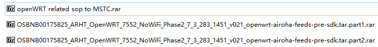
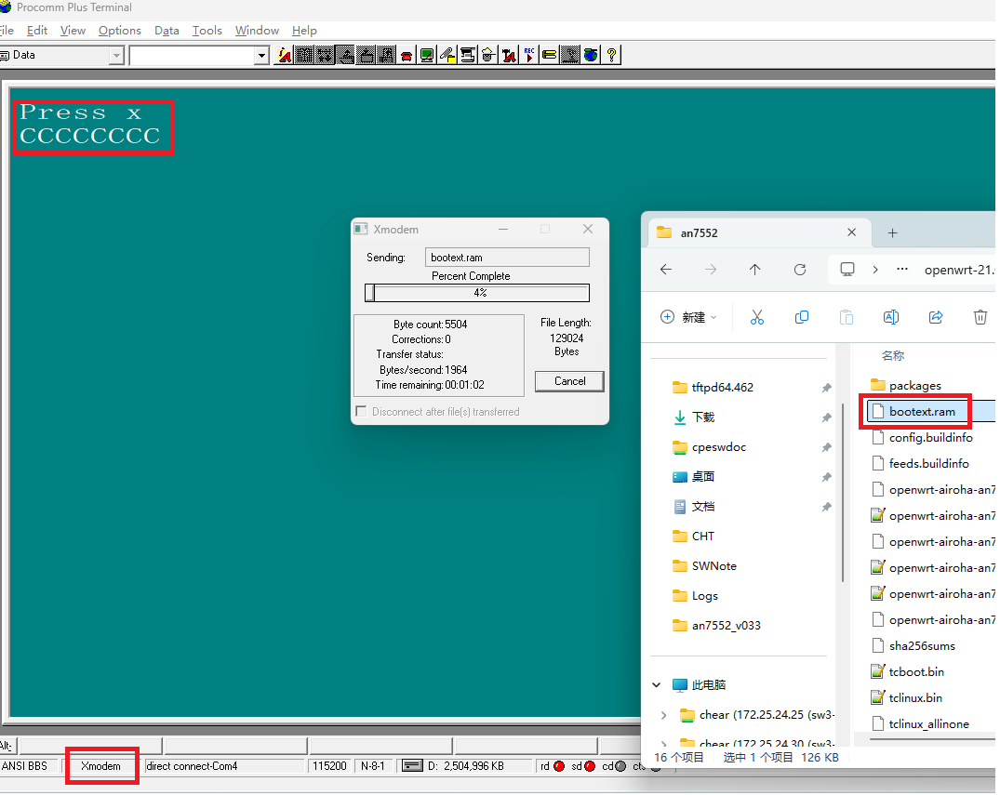
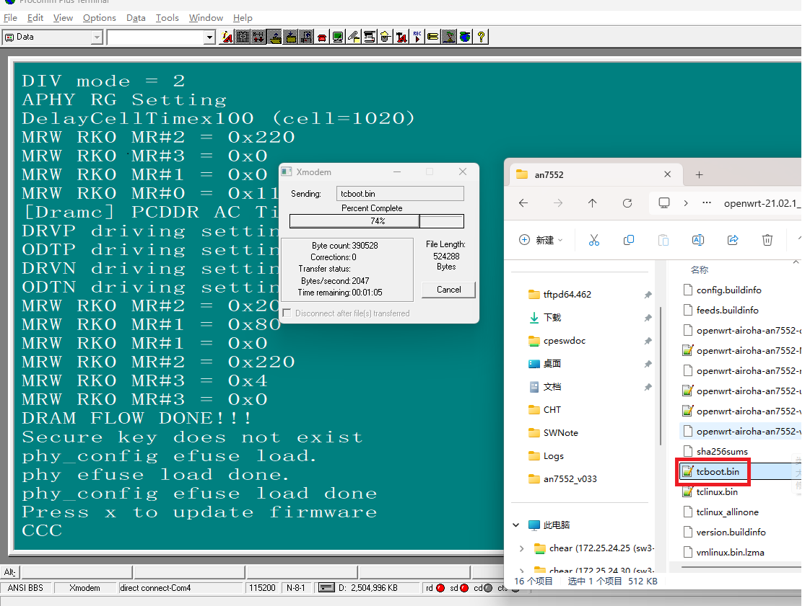
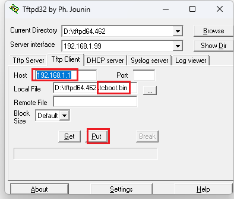

[TOC]

# 1. Airoha Arch Introduction

(Note: 4506 root/!@ZyxelTest)

# 2. Airoha SDK for  AN7552 Building

SDK file tree



unzip sdk

```shell
# unrar x OSBNB00175825_ARHT_OpenWRT_7552_NoWiFi_Phase2_7_3_283_1451_v021_openwrt-airoha-feeds-pre-sdk.tar.part1 
# cat OSBNB00175825_ARHT_OpenWRT_7552_NoWiFi_Phase2_7_3_283_1451_v021_openwrt-airoha-feeds-pre-sdk.tar/OSBNB00175825_ARHT_OpenWRT_7552_NoWiFi_Phase2_7_3_283_1451_v021_openwrt-airoha-feeds-pre-sdk.tar.gz | tar -zxf -
# rm -rfd OSBNB00175825_ARHT_OpenWRT_7552_NoWiFi_Phase2_7_3_283_1451_v021_openwrt-airoha-feeds-pre-sdk.tar
```

building  sdk:

```shell
# ./airoha_script/airoha-compile.sh -c 7552 -t " " -m Kite_logan -f
# cd openwrt-21.02/openwrt-21.02.1_dev/
# > ./feeds.conf.default
# make MSDK=1 VERBOSE=1 
```

building u-boot by

```shell
# make MSDK=1 packages/feed/airoha/bootloader/{clean,compile} VERBOSE=1
```

## 2.1 Airoha SDK v072 Building

unzip by ``tar -xf 2024Q3_Airoha_LTS_SDK_BBU230170AIR-598_7_3_283_1454_v072.tar.gz  --strip-components=1 -C airoha_sdk_v072``

```shell
# ./airoha_script/airoha-compile.sh -c 7552 -t /work/cpe-opal/sdk/airoha_sdk_v072/tclinux_phoenix -f -m  MT7916_Jedi
# cd openwrt-21.02/openwrt-21.02.1_dev
# make -j 16 MSDK=1
```


*tcboot.bin or zld.bin* constracture structure

```text
 	          0x80000 -------------------|
                    | 	mi.conf          |  
              0x7c000 -------------------|
                    | 			         |  
              0x26000 -------------------|
                    |	zloader          |	zloader.bin.lzma.uimage, size 128k
 	          0x60000 -------------------|
                  	|   uboot.bin        |                   
 	          0x00000 -------------------|
```

*ras.bin* constracture structure.

```text
                    |--------------------|
                    |   rsa.sign         | sign file(256 byte) with 1024 padding 
 -----^------       |--------------------|
      |             |   | zydefault.bin  |
      |             |   └----------------|
      |             |   rootfs           |
  rsa.sign range    |--------------------|
      |             |   vmlinux          |
      |             |--------------------|
      |            	|   ecnt.dtb         | pmg4006_t20d.dts
 -----v-------  0x2174 ------------------|
                    |   trx_header       | sizeof(struct trx_header) = 372 byte
                0x2000-------------------|
                    |   padding          | fip padding offset
                    |--------------------|
```

*ras.sign* are only covery  linux & rootfs , generate and verify command by:

```shell
### to generate ras.sign
$ openssl dgst -sign ./rsa_private.key -sha256 -out ./ras.sign ./ras.bin

### to verify
$ openssl dgst -verify ./rsa_public.pem -sha256 -signature ./ras.sign ./ras.bin

### to encrypt ras_signatured.bin
$ openssl enc -aes-256-cbc -pbkdf2 -pass pass:`zyabzq_host -p` -in ./rsa_signatured.bin -out  ./ras_signatured_enc.bin

### to dencrypt ras_signatured_enc.bin
$ openssl enc -aes-256-cbc -pbkdf2 -pass pass:`zyabzq_host -p` -d -in  ./ras_signatured_enc.bin -out ras_dec.bin
```


## 2.2  Arioha Emergency upgarde by x-modem

1. push 'reset' button and switch power on

2. set x-modem and key press 'x' to upgrade bootext.ram from sdk

   

3.  upgrade tcboot.bin from serial mode

   

4. startup to uboot and login by 'telecomadmin/nE7jA%5m' upgrade bootloader by tftp client




read tclinux context from mtd partition


# 3 AN7583 SDK v041 Building

SDK Download & Building 

```shell
## docker: ropd20_an7583
# git clone git@172.25.25.12:git_turnkey_trunk/airoha_platform/airoha_sdk_7_3_283_1455_v041.git
# git checkout -b AN7567GT_Kite_Q4SDK_2025_01_14 origin/AN7567GT_Kite_Q4SDK_2025_01_14
# ./airoha_script/airoha-compile.sh -c 7583 -t "`pwd`/tclinux_phoenix" -f -m Kite_logan_EMMC_OPTEE -w EagleKite_logan
# cd openwrt-21.02/openwrt-21.02.1_dev/
# make -j32 V=s MSDK=1
```

OPAL20 Download & Building

```shell
# zyrepo init -m opal21_an7583_1455_v041_kite_logan.xml
# zyrepo sync
# zyrepo branch -b an7567_kite_logan_1455_v041_develop
# make P=DE3301-00_Generic -j16
```

