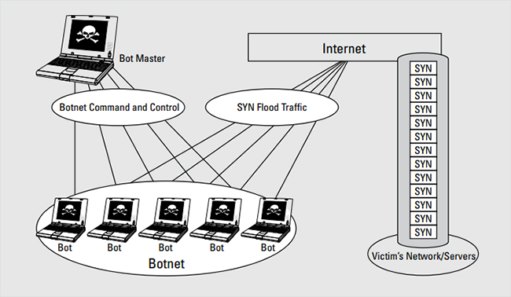

# Introduction & Principle

**Distributed denial of service (DDoS)** attacks are a subclass of denial of service (DoS) attacks. A DDoS attack involves multiple connected online devices, collectively known as a [botnet](https://www.imperva.com/learn/application-security/botnet-ddos/), which are used to overwhelm a target website with fake traffic.

**Note: **

**TCP Header**

## Syn flood

A [**SYN** flood (half-open attack)](<http://www.java2depth.com/2019/03/tcp-syn-flood-attack-ip-and-packets.html>) is a type of denial-of-service (**DDoS**) attack which aims to make a server unavailable to legitimate traffic by consuming all available server resources(e.g., RAM and CPU).

By repeatedly sending initial connection request (**SYN**) packets, the attacker is able to overwhelm all available ports on a targeted server machine, causing the targeted device to respond to legitimate traffic sluggishly or not at all.

	

The normally capture tcp handshark

after syn flood attacks 

## Land

## Smurf

## Teardrop