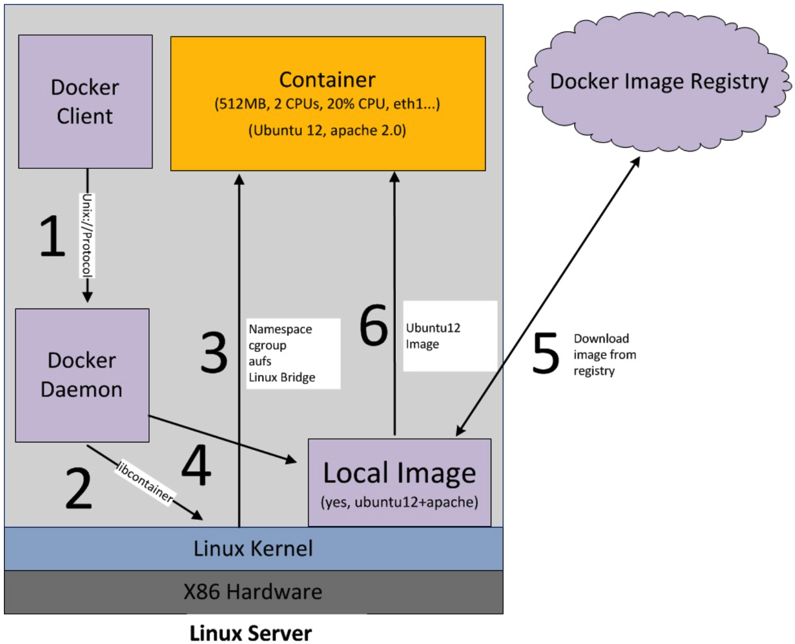

# 1. Introduction

Docker image startup process:




Arch


```shell
1). If you do not have the ubuntu image locally, Docker pulls it from your configured registry, as though you had run docker pull ubuntu manually.
2). Docker creates a new container, as though you had run a docker container create command manually.
3). Docker allocates a read-write filesystem to the container, as its final layer. This allows a running container to create or modify files and directories in its local filesystem.
4). Docker creates a network interface to connect the container to the default network, since you did not specify any networking options. This includes assigning an IP address to the container. By default, containers can connect to external networks using the host machine’s network connection.
5). Docker starts the container and executes /bin/bash. Because the container is running interactively and attached to your terminal (due to the -i and -t flags), you can provide input using your keyboard while the output is logged to your terminal
6). When you type exit to terminate the /bin/bash command, the container stops but is not removed. You can start it again or remove it.
# docker run -i -t ubuntu /bin/bash
```


## 1.1 [Container &  Images](<https://docs.docker.com/get-started/overview/>)

- Container

  A container is a runnable instance of an image. A container is defined by its image as well as any configuration options you provide to it when you create or start it , when a container is removed, any changes to its state that are not stored in persistent storage disappear.

- Images

  An *image* is a read-only template with instructions for creating a Docker container. Often, an image is *based on* another image, with some additional customization.


## 1.2 [Differ Container & Images](<https://zhuanlan.zhihu.com/p/348837988>)

- 镜像由一层层只读层堆在一起，容器为镜像只读层+读写层，运行态容器为由一个可读写的文件系统「静态容器」+ 隔离的进程空间和其中的进程构成。 

  Container（容器，一层读写层+多层只读层）, Running Container（运行态容器，一层读写层+多层只读层+隔离的进程空间和包含其中的进程）

- ``docker save`` 保存的是镜像（image），``docker export`` 保存的是容器（container）；

```shell
$ docker save #ID or #Name
$ docker export #ID or #Name
```

- ``docker load`` 用来载入镜像包，docker import用来载入容器包，但两者都会恢复为镜像；

- ``docker load`` 不能对载入的镜像重命名，而docker import可以为镜像指定新名称。

```shell
# to display the images info
$ docker image ls
# to display containers info
$ docker ps -a
```


# 2. New image

to make new environment  integrate vim and config git user name for  MTK bootloader. [Rref](https://zhuanlan.zhihu.com/p/366271256)

```shell
# to building image
$ cd Dock67
$ docker build --build-arg UID=1016 --build-arg GID=1016 --build-arg USER=chear -t ubuntu_18_04_env:bootloader .

# to commit image
$ docker commit -m "add vim ,git config" -a "chear" [contain_id] [new_images_id]:[tag]

# to running new container
$ docker run --rm -it --name opal2_mtk_boot_docker_chear --hostname Build_Opal_Docker6604 -v ./:/work/cpe-opal -w /work/cpe-opal -v /opt:/opt -v /home/chear/.ssh:/home/chear/.ssh --dns 172.25.5.210 ubuntu_18_04_env:bootloader bash
```


