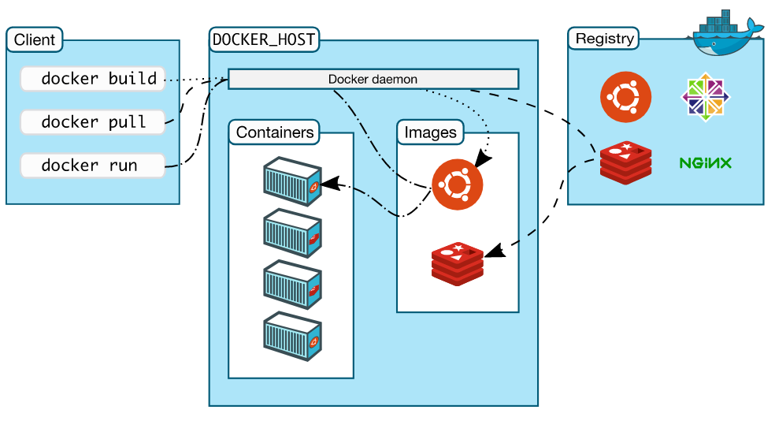

# 1. Introduction

Arch



## 1.1 [Container &  Images](<https://docs.docker.com/get-started/overview/>)

- Container

  A container is a runnable instance of an image. A container is defined by its image as well as any configuration options you provide to it when you create or start it , when a container is removed, any changes to its state that are not stored in persistent storage disappear.

- Images

  An *image* is a read-only template with instructions for creating a Docker container. Often, an image is *based on* another image, with some additional customization.


## 1.2 [Differ Container & Images](<https://zhuanlan.zhihu.com/p/348837988>)

- 镜像由一层层只读层堆在一起，容器为镜像只读层+读写层，运行态容器为由一个可读写的文件系统「静态容器」+ 隔离的进程空间和其中的进程构成。 

  Container（容器，一层读写层+多层只读层）, Running Container（运行态容器，一层读写层+多层只读层+隔离的进程空间和包含其中的进程）

- docker save保存的是镜像（image），docker export保存的是容器（container）；

  ```shell
  docker save #ID or #Name
  docker export #ID or #Name
  ```

- docker load用来载入镜像包，docker import用来载入容器包，但两者都会恢复为镜像；

- docker load不能对载入的镜像重命名，而docker import可以为镜像指定新名称。


# 2. Usage

