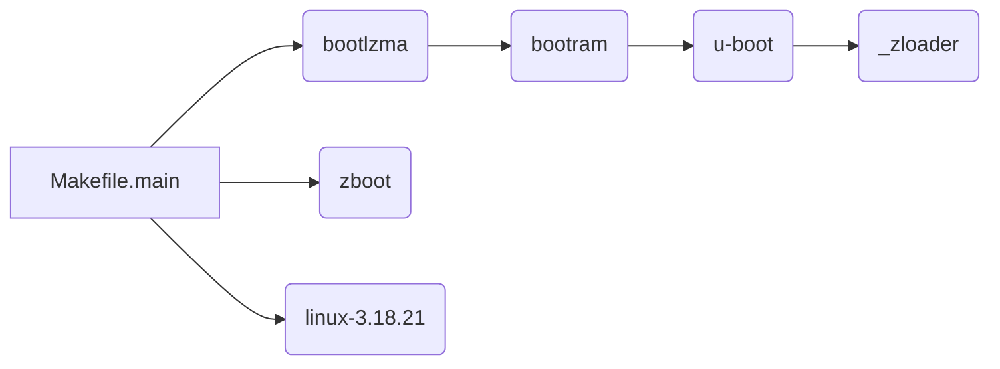

## Files Structure

**Bootloader Structure**

```shell
.
└── dev   
    ├── makecode
    │   ├── build-utils
    │   ├── defaultcfg 		(configration file for province)
    │   ├── sysapps			(applications folder)
    │   ├── platform-profile
    │   ├── product-depconfig
    │   │   (building configuration files include bootlaoder,kernel,Zboot,etc.)
    │   └── mitrastar_drivers
	│   │	(source of GPIO controller for Econet)
    ├── platform
    │   ├── bootloader
    │   │   ├── uboot
    │   │   │   ├── bootram
    │   │   │   ├── ddr_cal_en7512
    │   │   │   ├── en7512_boot
    │   │   │   ├── en7516_boot
    │   │   │   ├── hosttools
    │   │   │   ├── include
    │   │   │   ├── lzma
    │   │   │   ├── profile
    │   │   │   ├── ram_init
    │   │   │   ├── spram_ext
    │   │   │   ├── u-boot
    │   │   │   └── unopen_img
    │   │   └── ZyCLiP3.0_ZLB
    │   │       ├── zboot
    │   │       └── zloader
    │   ├── bsp
    │   │   ├── bootrom
    │   │	│	(do not used.)
    │   │   ├── global_inc
    │   │	│	(source header.)
    │   │   ├── kernel_ext
    │   │	│	(source driver for bootloader and kernel)
    │   │   ├── linux-3.18.21
    │   │   ├── modules
    │   │   ├── tools
    │   │   └── version
    │   └── rootfs
    └── trunk-utils
```


## Building 
making process



. bootlzma
. bootram
. u-boot
. zboot
. kernel

To generate the bootloader and release NAND.bin

​```shell
$make PROFILE=CCC3
$make boot
$make production
```

