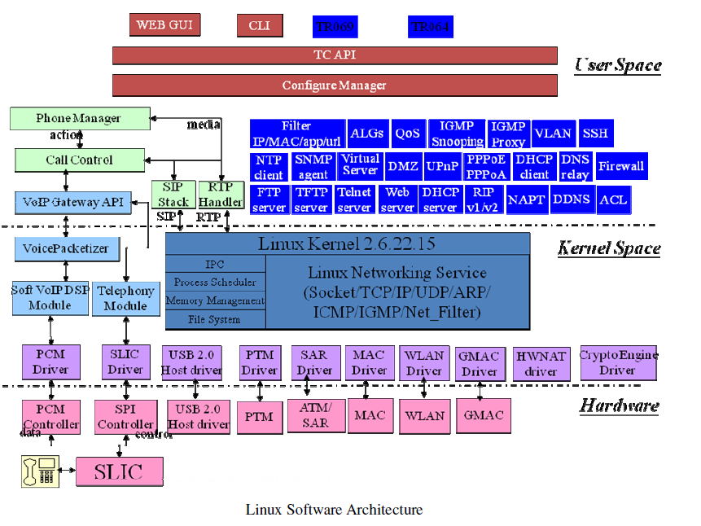

# 1.  Arch Introduction




# 2. Download & Building Source

Source File Tree, files structure based on Econet en_7580 sdk.

```shell
root@michael-HP-Pro-3330-MT:/home/michael/Code/michael/7528/org# tree ./ -d -L 1
./
├── app_bsp
├── apps
├── bootrom
│	(bootloader source file)
├── doc
│	( DO NOT CARE.s)
├── filesystem
│	( the generate fs at 'filesystem/usr/')
├── global_inc
├── kernel_ext
├── lib_install
├── linux-3.18.21
│	( linux kernel source .)
├── linux-ecnt
│	( Econet kernel source files ,should be copy and replace with-in 'linux-3.18.21' 
│	 by same folder.)
├── modules
├── Project
│	( platform configuration files.)
├── tools
├── version
└── windows_rndis_driver
```


## 2.1 Make Building

decompress SDK and building the source

```shell
root@:# mkdir -p releasebsp
root@:# cp releasebsp_profilename_relasedate.tgz ./releasebsp
root@:# tar -xzvf releasebsp_profilename_relasedate.tgz
root@:# fakeroot make PROFILE=NP_EN7561D_LE_7592_7613_NORD_64M_demo CUSTOM=CT clean 
root@:# fakeroot make PROFILE=NP_EN7561D_LE_7592_7613_NORD_64M_demo CUSTOM=CT All
root@:# fakeroot make PROFILE=NP_EN7561D_LE_7592_7613_NORD_64M_demo CUSTOM=CT kernel_clean kernel
root@:# fakeroot make PROFILE=NP_EN7561D_LE_7592_7613_NORD_64M_demo CUSTOM=CT bootbase_clean bootbase
root@:# fakeroot make PROFILE=NP_EN7561D_LE_7592_7613_NORD_64M_demo CUSTOM=CT buildimage
```

generate image at  ''*releasebsp/Project/images/tcboot.bin* " , "*releasebsp/Project/images/tclinux.bin*"

to build misc image by following:

```shell
root@:# ./addoob tclinux_allinone_nand tclinux_allinone_nand_ecc 2048 64
root@:# ./addhdr tclinux_allinone_nand_ecc ap_mstc.bin
```


# 3. BootLoader

Source file tree (based  on en7528). 

```shell
bootrom/
├── start.S_7510_final 
│	(Boot1 assembly code to init CPU,clock,  calibration DDR, )
├── strat.S
│	(copy from "start.S_7510_final".)
├── bootram/
│	(main bootbase driver such as network ,flash and bootbase command.)
├── ddr_cal_en7512/
│	( )	
├── spram_ext/
├── lzma/
├── unopen_img/
├── verify/
├── bootload.c
├── header.c
├── byteswap.c
├── lzmaload.c
├── mic.c
│	( copy 'mi.cfg' and make to global var on tcboot.bin)
├── make_bootbase
└── Makefile
```

(Note: the Econet's boot-loader same as u-boot, driver's source files at  *bootrom/bootram* )


## 4. Make flash misc image


misc image laoyout

```shell
           0x10000000 -------------------|
                    |     linux  B       |	tclinux.bin,zize=0xE00000
                    |     rootfs B       |
             0xB00000 -------------------|
                    |     linux  A       |
                    |     rootfs A       |  tclinux.bin size=0x50000
             0x600000 -------------------|
                    |     romfile        |  romfile.gz, size=0x40000
              0x40000 -------------------|
                    |     boot           |	tcboot.bin, size=0x40000
              0x00000 -------------------|
```


## 5. CFG command

```shell
# tcapi show Account_TelnetEntry
OID [183:1][TelnetEntry]:
	[Active = Yes]
	[telnet_username = e8telnet]
	[telnet_passwd = e8telnet]
	[telnet_port = 23]

# tcapi set Account_MfgMode Active "Yes"
(Note: update romfiles)
# tcapi save

# prolinecmd restore default

# sys led on
```


## 6. Mfg Mode


