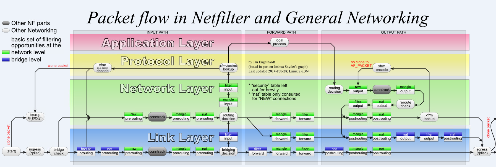
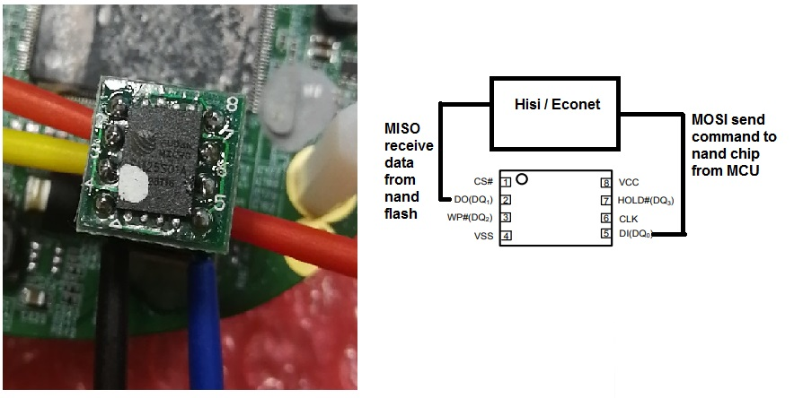
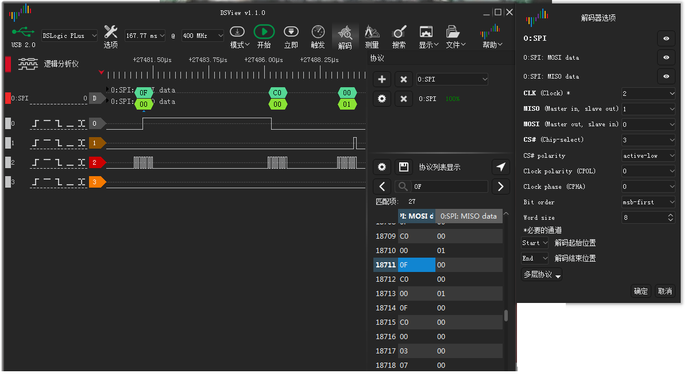

## 1. What about WAN , and is it WAN can inside bridge or not ( display bridge info access *brctl* )?

WAN(Wide Area Network) , difference between LAN (Local Area Network) used to connect with Internet. Whatever WAN device and LAN device can work within Network or Link layer. 

(Note : WAN interface 可以在 bridge 内，也可以不在 bridge 内， 在 bridge 内则是属于桥接模式，对应于网络的二层交换；  如果不在 bridge 内则属于路由模式对应于网络模型的三层路由交换。可以通过以下方式查看。)

```shell
$brctl show 
```


## 2. switch bewteen with ePon and gPon within MLD

| Type  | Working Mode | OLT Server          |
| ----- | ------------ | ------------------- |
| ePon  | 0 or 4       | interface epon 0/12 |
| gPon  | 1            | interface gpon 0/2  |
| xgPon | 6            | interface epon 0/10 |

### display registed info with-in OLT server

telnet login root@172.25.17.250 , root/admin

```shell
>enable
#config
#interface epon 0/12  			(Note: interface gpon 0/2)
#display ont info 0 all 		(Note: 查看所有的ONT状态)
#display ont info 0 1
```

### **ePon Register:**

```shell
# atbp show
Number of MAC Addresses (1-32)    :  19  
Base MAC Address                  :  00:19:cb:0a:05:47  
Serial Number                     :  0019cb000001  
Password for Useradmin            :  0019cb000001  
SSID for first wireless (10-31)   :  Huatian  
Password for first wireless (8-31):  0019cb000001  
WAN working mode [0|1|2|3|4|5|6|7]:  4  
GPON Serial Number                :  MSTC12345678  
GPON Password                     :  1234567890  
Semi-manufactured SN              :  0Y0000000000  
```

more loid for register:

| LOID            | atbp Mac          | Real Mac       |
| --------------- | ----------------- | -------------- |
| mstcwxsw3loid26 | 00:19:CB:0A:05:57 | 0019-CB0A-0560 |
| mstcwxsw3loid29 | 00:19:CB:0A:05:87 | 0019-CB0A-0590 |
| mstcwxsw3loid27 | 00:19:CB:0A:05:67 | 0019-CB0A-0570 |

### **xgPon Register**

``` shell
# atbp show
Number of MAC Addresses (1-32)    :  19  
Base MAC Address                  :  00:19:cb:0a:05:47  
Serial Number                     :  0019cb000001  
Password for Useradmin            :  0019cb000001  
SSID for first wireless (10-31)   :  Huatian  
Password for first wireless (8-31):  0019cb000001  
WAN working mode [0|1|2|3|4|5|6|7]:  6  
GPON Serial Number                :  MSTC0B000047  
GPON Password                     :  1234567890  
Semi-manufactured SN              :  0Y0000000000 
```

(Note: should be upper case for gPon SN.)


## 3. maven problem when first clone and building MT7526G_CMCC 

When first building project for "sysapps/public/gpl/felix_framework_cuc_cmcc" with maven while should downloads many manve dependence. 

when download failed, could verify and copy the  '/home/{user_name}/.m2' to the current user home path such like :

```shell
$cp -R /home/don/.m2 /home/chear/
```
or update maven setting.xml while add Aliyun to maven repo  , in this by  '/usr/share/apache-maven-3.2.5/conf/setting.xml'
```xml
<mirrors>
 <!-- mirror
  | Specifies a repository mirror site to use instead of a given repository. The repository that
  | this mirror serves has an ID that matches the mirrorOf element of this mirror. IDs are used
  | for inheritance and direct lookup purposes, and must be unique across the set of mirrors.
  |
 <mirror>
   <id>mirrorId</id>
   <mirrorOf>repositoryId</mirrorOf>
   <name>Human Readable Name for this Mirror.</name>
   <url>http://my.repository.com/repo/path</url>
 </mirror>
  -->
  <mirror>
    <id>nexus-aliyun</id>
    <mirrorOf>*</mirrorOf>
    <name>Nexus aliyun</name>
    <url>http://maven.aliyun.com/nexus/content/groups/public</url>
  </mirror>
</mirrors>
```


## 3. different bewteen "aclocal" and "autoconf"
1. autoscan (autoconf): 扫描源代码以搜寻普通的可移植性问题，比如检查编译器，库，头文件等，生成文件configure.scan,它是configure.ac的一个雏形。
2. aclocal (automake):根据已经安装的宏，用户定义宏和acinclude.m4文件中的宏将configure.ac文件所需要的宏集中定义到文件 aclocal.m4中。aclocal是一个perl 脚本程序，它的定义是：“aclocal - create aclocal.m4 by scanning configure.ac”

```
user input files   optional input     process          output files
================   ==============     =======          ============

                    acinclude.m4 - - - - -.
                                          V
                                      .-------,
configure.ac ------------------------>|aclocal|
                 {user macro files} ->|       |------> aclocal.m4
                                      `-------'
```

3. autoheader(autoconf): 根据configure.ac中的某些宏，比如cpp宏定义，运行m4，声称config.h.in

```
user input files    optional input     process          output files
================    ==============     =======          ============

                    aclocal.m4 - - - - - - - .
                                             |
                                             V
                                     .----------,
configure.ac ----------------------->|autoheader|----> autoconfig.h.in
                                     `----------'
```

4. automake: automake将Makefile.am中定义的结构建立Makefile.in，然后configure脚本将生成的Makefile.in文件转换为Makefile。如果在configure.ac中定义了一些特殊的宏，比如AC_PROG_LIBTOOL，它会调用libtoolize，否则它会自己产生config.guess和config.sub

```
user input files   optional input   processes          output files
================   ==============   =========          ============

                                     .--------,
                                     |        | - - -> COPYING
                                     |        | - - -> INSTALL
                                     |        |------> install-sh
                                     |        |------> missing
                                     |automake|------> mkinstalldirs
configure.ac ----------------------->|        |
Makefile.am  ----------------------->|        |------> Makefile.in
                                     |        |------> stamp-h.in
                                 .---+        | - - -> config.guess
                                 |   |        | - - -> config.sub
                                 |   `------+-'
                                 |          | - - - -> config.guess
                                 |libtoolize| - - - -> config.sub
                                 |          |--------> ltmain.sh
                                 |          |--------> ltconfig
                                 `----------'
```

5. autoconf:将configure.ac中的宏展开，生成configure脚本。这个过程可能要用到aclocal.m4中定义的宏。

```
user input files   optional input   processes          output files
================   ==============   =========          ============

                   aclocal.m4 - - - - - -.
                                         V
                                     .--------,
configure.ac ----------------------->|autoconf|------> configure ----->autoconfig.h,Makefile
```


## 4. Print sal debug info for Hisilicon platfrom

``` shell
root@OpenWrt:~# cli /home/cli/log_cmd/log/cfg_set -v module 0xF0001000 dbg 0xff print 0xff sys 0

root@OpenWrt:~# cli /home/cli/log_cmd/log/cfg_set -v module 0xF6003000 dbg 0xff print 0xff sys 0
(to debug wan.)

root@OpenWrt:~# cli /home/cli/log_cmd/log/cfg_set -v module 0xF0004000 dbg 0xff print 0xff sys 1
(to debug sal emu service , such like hi_emu_speed.)

root@OpenWrt:~# cli /home/cli/log_cmd/log/cfg_set -v module 0xF7003000 dbg 0xff print 0xff sys 1
(to debug hal )

root@OpenWrt:~# cli /home/cli/log_cmd/log/cfg_set -v module 0xF600c000 dbg 0xff print 0xff sys 1
(to debug wlan )

root@OpenWrt:~# cli /home/cli/log_cmd/log/cfg_set -v module 0xF600d000 dbg 0xff print 0xff sys 1
(to debug traffic )
```

(Note: all debug macro defined at ``drivers/include/common/hi_sysdef.h``)


## 5. Transfer data with in Hisilicon platform

``` shell
cli /home/cli/hal/port/port_mirror_set -v igr 0x200 egr 0x200 dport 0
```


## 6. Linux Tools diagrams

**Linux Static Performance Tools**


**Linux bcc /Berkeley Packet Filter Trancing Tools**


**Linux Tuning Tools**


**Linux Benchmark Tools**


**Linux Observability Tools**


## 7. Switch the province

```shell
root@OpenWrt:~# hi_cfm set sysinfo.province jt
root@OpenWrt:~# rm -f /usr/local/factory/factory.txt
root@OpenWrt:~# hi_cfm config
root@OpenWrt:~# sync
root@OpenWrt:~# reboot
root@OpenWrt:~# hi_cfm test restore
```


## 8. ebtables & iptables

### ebtables

[ebtables](<http://ebtables.netfilter.org/misc/ebtables-man.html>) is an application program used to set up and maintain the tables of rules (inside the Linux kernel) that inspect Ethernet frames. It is analogous to the **iptables** application, but less complicated, due to the fact that the Ethernet protocol is much simpler than the IP protocol.  more detail in [ebtables/iptables interaction on a Linux-based bridge](<http://ebtables.netfilter.org/br_fw_ia/br_fw_ia.html>)



- prerouting：数据进来还未查询路由表之前的规则。
- input：由外部发往用户空间内部的规则。*(说直白点就是负责过滤目标地址是本机的数据包)*
- forward：不进入用户空间，进行路由转发的规则。*(负责转发流经主机但不进入本机的数据包)*
- postrouting：查询完路由表后，将要转发的规则。
- output：由用户空间内部发往外部的规则。*(负责处理本机发出的数据包)*

**(Note: ebtables每个阶段的的过滤时机都比iptables要早。（这个不是绝对的从本机上层下来的报文经过postrouting是先 iptables 再 ebtables）**

表
表是内置且固定的，共有三种: filter, nat, broute，用-t选项指定。最常用的就是filter了，所以不设-t时默认就是这个表。
filter过滤本机流入流出的数据包是默认使用的表，nat用于地址转换-mac地址，broute用于以太网桥-产生一个桥路器。
链（chains）
链有内置和自定义两种 。不同的表内置的链不同，这个从数据包的流程图中就可以看出来。所谓自定义的链也是挂接在对应的内置链内的，使用-j让其跳转到新的链中。如果以太网帧没有匹配到当前的规则，就会去检查下一个规则。(实例见使用场景介绍)
规则也叫目标（targets）
每个链中有一系列规则，每个规则定义了一些过滤选项。每个数据包都会匹配这些项，一但匹配成功就会执行对应的动作。
所谓动作，就是过滤的行为了。有四种，ACCEPT，DROP，RETURN和CONTINUE。
详解一下：
当帧匹配一个规则(rule)时，下一个动作(action)由target指定。

Usage:
- chains:
  There  are  three  ebtables  tables  with built-in chains in the Linux kernel. These tables are used to divide functionality into different sets of rules. Each set of rules is called a chain.  Each  chain  is  an  ordered list of rules that can match Ethernet frames. If a rule matches an Ethernet frame, then a processing specification tells what to do with that matching frame. The processing specification is called a 'target'.  However,if  the frame does not match the current rule in the chain, then the next rule in the chain is examined and so forth.  The user can create new (user-defined) chains that can be used as the 'target' of a rule. User-defined chains are very useful to get better performance over the linear traversal of the rules and are also essential for structuring the filtering rules into well-organized and maintainable sets of rules.
- target:
    A firewall rule specifies criteria for an Ethernet frame and a frame processing specification called a target.   When  a  frame  matches  a rule, then the next action performed by the kernel is specified by the target.  The  target can be one of these values: ACCEPT, DROP, CONTINUE, RETURN, an 'extension' (see below) or a jump  to  a  user-defined chain.
    - ACCEPT means to let the frame through.  DROP means the frame has to be dropped. In the BROUTING chain however,
    - the ACCEPT and DROP target have different meanings (see the info provided for the -t option).
    - CONTINUE  means   the  next rule has to be checked. This can be handy, f.e., to know how many frames pass a certain point in the  chain, to log those frames or to apply multiple targets on a frame.  RETURN means stop traversing  this  chain  and  resume  at  the next rule in the previous (calling) chain.  For the extension targets please refer to the  TARGET EXTENSIONS section of this man page.
- tables:
       As stated earlier, there are three ebtables tables in the Linux kernel.  The table names are filter,  nat  and broute.   Of  these  three tables, the filter table is the default table that the command operates on.  If you  are working with the filter table, then you can drop the '-t filter' argument to the ebtables  command.   However,  you  will  need to provide the -t argument for the other two tables.  Moreover, the -t argument must be  the first argument on the ebtables command line, if used.

 

## 9. Linux File System

1. **Romfs** 

   *romfs* is a space-efficient, small, read-only filesystem originally for [Linux](http://www.linux.org/) and used by some Linux based projects. It is a block-based filesystem, that means it makes use of block (or sector) accessible storage driver (like disks, CDs, ROM drives). It is part of stock Linux kernels since about version 2.1.21 (about January, 1997). All current (2.4--2.6) kernel sources contain support for *romfs*, but depending on the distributor, it might not have been compiled in.

    *romfs* makes two shortcuts: first, it's read-only, you can't simply use your disk if it's a *romfs* disk, you must build its image beforehand. Second, it stores only the absolute minimum required from a filing system. No modification dates, no unix permissions. These all might sound as large drawbacks, but they are usually not.

2. **squashfs**

   It is a read-only file system that lets you compress whole file systems or single directories, write them to other devices/partitions or to ordinary files, and then mount them directly (if a device) or using a loopback device (if it is a file). It compressed file systems used for tiny-sized and embedded Linux systems.

   The **mksquashfs** tool, which creates squashed file systems (in a file or on a block device) and the **unsquashfs** tool, which extracts multiple files from an existing squashed file system.

3. **jffs2**

   The ***Journaling Flash File System version 2 (JFFS2)*** was created by Red Hat from JFFS started  . JFFS2 provides a filesystem directly on the flash, rather than emulating a block device, is a log-structured writable file system.

   JFFS2 has a log based structure which works like a Journal. Log based structures perform sequential writes from beginning to end to a log file, or a buffer. Once the space is filled, it performs similar to circular logging. If a file is updated, the old file remains and a new one is placed at the end of the log. When needed, the older file can be overwritten.

4. **ubifs**

   UBIFS is a new flash file system developed by Nokia engineers.In a way, UBIFS may be considered as the next generation of the JFFS2 file-system.

   JFFS2 file system works on top of MTD devices, but UBIFS works on top of UBI volumes and cannot operate on top of MTD devices. In other words, there are 3 subsystems involved:

   (Note: One thing people have to understand when dealing with UBIFS is that UBIFS is very different to any traditional file system - it **does not** work on top of block devices (like `hard drives`, `MMC/SD cards`, `USB flash drives`, `SSDs`, etc). UBIFS was designed to work on top of **raw** flash, which has nothing to do with block devices. This is why UBIFS does not work on `MMC cards` and the like - they look like block devices to the outside world because they implement `FTL` (Flash Translation Layer) support in hardware, which simply speaking emulates a block device on top of the built-in raw flash. Please, make sure you understand the differences between raw flash and, say, MMC flash before dealing with UBIFS.)

   - **MTD** subsystem, which provides uniform interface to access flash chips. MTD provides an notion of MTD devices (e.g., `/dev/mtd0`) which basically represents raw flash;

   - **UBI** subsystem, which is a wear-leveling and volume management system for flash devices; UBI works on top of MTD devices and provides a notion of UBI volumes , UBI volumes are higher level entities than MTD devices and they are devoid of many unpleasant issues MTD devices have (e.g., wearing and bad blocks); see [here](http://www.linux-mtd.infradead.org/doc/ubi.html) for more information;

   - **UBIFS** file system, which works on top of UBI volumes

5. **[cfamfs](http://en.wikipedia.org/wiki/Cramfs)**

    A compressed read-only file system for Linux. The maximum size of CRAMFS is 256MB.


## 10. LA to measurement SPI nand flash .

MOSI (Master in , Slave out) , MISO (Master out , Slave in)  the master means for MCU , slave means for SPI nand flash diagram as below.

(Note: when encounter data missing for in MISO , check the its that noise ,connect VSS for the connected wired should be avoid noise.)



SPI Setting for LA  as below, with in this test , the  *'0x0F 0xC0 0x00'* its get feature command send to nand chip , and then nand response *0x00 0x00 0x01* this means the nand its busy ,can not operate programing  or eraseing.



  


## 11. svn revert & svn upload -r [VERSION]

both ```svn revert``` and ```svn upload -r``` are reload version 

( Note: when uploading files to svn trunk with Linux was better than Windows. ``svn add --no-ignore``  )


## 12. reset board environment for Hisilicon platform

After Recover default environment within hi_boot ,board environment value ``console`` will change to ``off`` , this value can cause console stop output message stream, then should change this value to ``on``

```shell
hi # setenv console on
hi # saveenv
```


## 13 'eabi' and 'oabi' for the gun

eabi (embedded application binary interface )  oabi (old application binary interface)