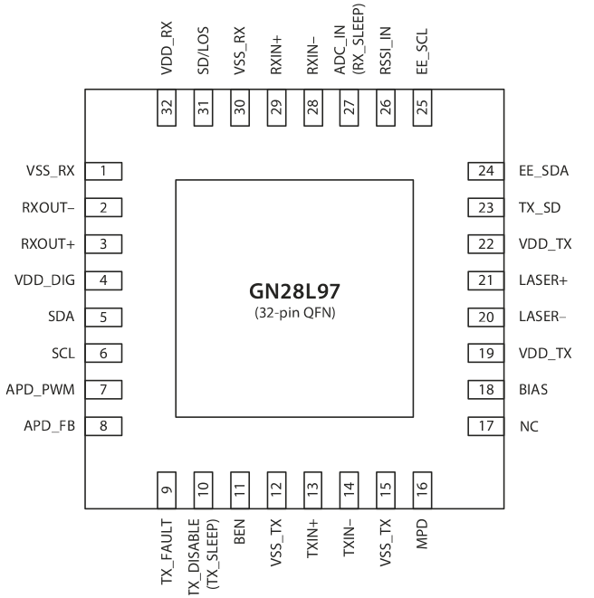
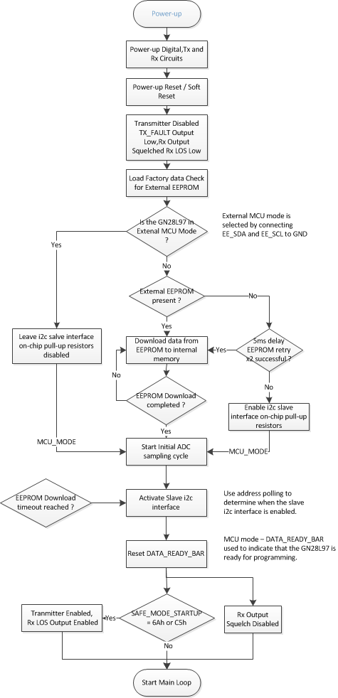

# Glossary

- APD (Avalanche Photodiode)       雪崩光电二极管
- BER (Bit Error Ratio)                       比特误码率
- ROSA                                                接收器光学子配件 
- LUT（Look-Up-Table)                     指显示查找表
- SFF-8472		光学器件监控协议，SFF-8472协议的主要目的是定义光模块的数字诊断监控功能（DDM）
- DDM (Digtial Diagnostic Monitoring)  数字诊断监控 (接受功率，工作温度，工作电压，偏执电流，发射功率)
- DDMI (Digtial Diagnostic Monitoring Interface)
- FET (Field Effect Transistor)           场效应晶体管
- Tri-Stated (T/S)                                [三态信号](<https://www.cnblogs.com/cute/archive/2011/05/25/2056400.html>)
- ADC (Analog-to-Digital Converter) 数模转换器
- Trans-Impedance Amplifier          阻抗放大器
- RSSI (Receiver Signal Strength Indicator)
- SMPS (Switched Mode Power Supply)

# SemTech GN28L97

The GN28L97 is a combined burst mode laser driver and limiting post amplifier designed for 10Gb/s PON fiber optic Transceiver moduels, and features an improved low-cost intergrated APD controller , on-chip DDM and digital set-up.  A fully compliant SFF-8472 DDMI  solution can be realised  by connecting  an external  8k or 16k EEPROM.

## Start-up Sequence

