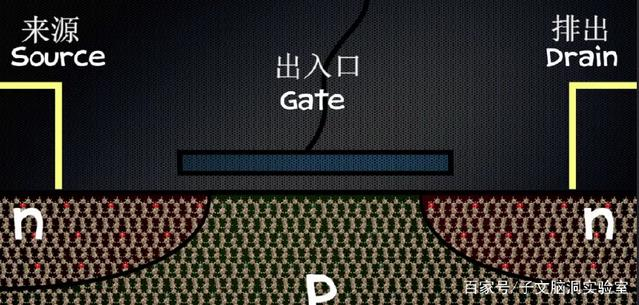
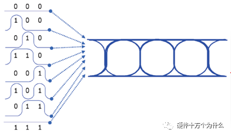
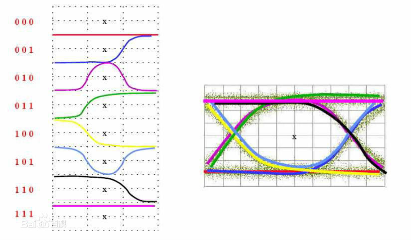
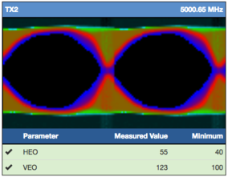
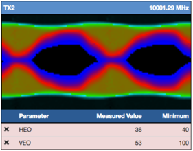

# Basic Kownladge

## 1. Transistor Operating Principle

晶体管，它就像开关一样 能够控制电流，断开的时候称之为“状态0”，闭合的时候称之为“状态1”，最重要的是晶体管的体积非常微小，这要感谢半导体科学原理的奇迹。比如纯硅，将其内部能移动的电荷分为 n和p两种，在n种里带负电荷的电子在移动，而在p种里则是带正电荷的电子在移动，这并不是说一个正极一个负极 ，相反二者都是中性的。而晶体管则是将n种放在两边，p种则是在两个n种之间，n种两边都有导线接入。S极和D极之间是沟道(Channel),而开关则是称之为栅极的点被一个氧化层与半导体绝缘.

- 当没有对栅极(G)施加电压的时候，晶体管形成电子从n种流向p种，导致了耗尽层的形成，既沟道中不会聚集有效的电荷，源极(S)和漏极(S)之间不会有有效电流产生，晶体管处于关闭状态，这就是的p种半导体排斥从n种来的电子，相当于0状态
- 如果想要打开晶体管， 就需要向栅极施加一个小的正电压来吸引电子，沟道中会聚集有效的电荷，形成一条从源极(S)到漏极(D)导通的通道，晶体管处于开启状态，可以把这种状态解释为 1 状态。 

这样二进制的两个状态就由晶体管的开启和关闭状态表示出来了。

[how transistor works](<https://www.build-electronic-circuits.com/how-transistors-work/>)

(Tips: 所谓 [RAM-Random Access Memory](<https://baike.baidu.com/item/%E9%9A%8F%E6%9C%BA%E5%AD%98%E5%8F%96%E5%AD%98%E5%82%A8%E5%99%A8/4099402?fr=aladdin#2>) 随机读存储器，是和 Sequential Access 相对应，既存储器中的数据被读取或写入时，所需要的时间与这段信息所在的位置或所写入的位置无关。相对的，读取或写入顺序访问（Sequential Access）存储设备中的信息时，其所需要的时间与位置就会有关系。)

## 2. Eye Diagram 眼图

[眼图 (Eye Diagram )](<https://baike.baidu.com/item/%E7%9C%BC%E5%9B%BE?fr=aladdin#1>) 可以显示出数字信号的传输质量，经常用于需要对电子设备、芯片中串行数字信号或者高速数字信号进行测试及验证的场合，归根结底是对数字信号质量的一种快速而又非常直观的观测手段。

消费电子中，芯片内部、芯片与芯片之间经常用到高速的信号传输，如果对应的信号质量不佳，将导致设备的不稳定、功能执行错误，甚至故障。眼图反映的是数字信号受物理器件、信道的影响，工程师可以通过眼图，迅速得到待测产品中信号的实测参数，并且可以预判在现场可能发生的问题.

眼图中包含了丰富的信息，从眼图上可以观察出码间串扰和噪声的影响，体现了数字信号整体的特征，从而可以估计系统优劣程度，因而眼图分析是高速互连系统信号完整性分析的核心。另外也可以用此图形对接收滤波器的特性加以调整，以减小码间串扰，改善系统的传输性能。

### 2.1 眼图的形成

对于数字信号，其高电平与低电平的变化可以有多种序列组合。以3个bit为例，可以有000-111共8中组合，在时域上将足够多的上述序列按某一个基准点对齐，然后将其波形叠加起来，就形成了眼图。如图1。对于测试仪器而言，首先从待测信号中恢复出信号的时钟信号，然后按照时钟基准来叠加出眼图，最终予以显示

### 2.2 码间串扰

眼图 的 “眼睛” 张开的大小反映着码间串扰的强弱。 “眼睛”张的 越大，且眼图越端正，表示码间串扰越小；反之表示码间串扰越大。

当存在噪声时，噪声将叠加在信号上，观察到的眼图的线迹会变得模糊不清。若同时存在码间串扰 ， “眼睛”将 张开得更小。与无码间串扰时的眼图相比，原来清晰端正的细线迹，变成了比较模糊的带状线，而且不很端正。噪声越大，线迹越宽，越模糊；码间串扰越大，眼图越不端正.

例如眼图效果显示传输效率上图要明显优于下图

## 3. Flash Memory

- Non-Volatile	(RAM)Memory		

  非易失性存储器  (Nand Flash , Nor Flash , Hard Disk ,与此相对的易失性存储器， DRAM,SDRAM , DDR SDRAM)

- SDRAM		

  Synchronous Dynamic Random Access Memory (同步动态随机存储器) ， 											同步是指 Memory 工作需要同步时钟， 第一代为 SDR SDRAM , 第二代为 DDR SDRAM, 第三代 DDR2 SDRAM ，四代， DDR3 SDRAM等.

- OTP

  一次性可编程存储器，于此相对于的是可以被多次写入数据的存储器，如 NAND Flash , Hard Disk

- Ware Leveling

-  SLC (Single Level Cell)

- MLC (Multi Level Cell)

  
