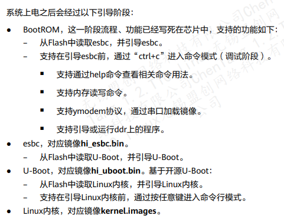

[TOC]

# Introduction

hisi startup process:




## Based on hi5630


​	hi -boot 是基于 u-boot 裁剪 、修改而来，编译生成目标文件非常小。hi -boot 已经适配了验证 所需的外围芯 ，若产品板外围芯片型号与单板上外围芯片型号不同时，需要适当修改相关硬件驱动代码,由于 Hi 5630 内部封装了 DDR 和一个 GEPHY，主要外围芯片为 FLASH 和外置以太 PHY.  ( [HW datasheet](pdf_resource/Hi5630HV110_G.Hn_PLC_datasheet_01.pdf))

**Note:  DDR 地址空间 0x80000000 ~ 0xFFFFFFFF , Flash 的地址空间 0x00000000 ~ 0x03FFFFFF**

hi-boot 主要文件结构如下:

```shell
.
├── applets
│   (应用程序,包括启动内核,hiboot 命令选择界面以及 tftp等)
├── arch
│   (芯片,架构的相关代码， 包括启动代码、CRG等)
├── board
│   (板级适配代码，包括 Flash 兼容,GPIO复用配置等)
├── command
│   (所有命令的实现)
├── drivers
│   (驱动)
├── include
│  	(header)
├── init
│   (启动代码以及环境变量配置)
├── lib
│   (基本 lib 实现以及解压实现)
├── mm
│   (内存管理)
├── multiupg
│   (组播升级)
├── net
│   (协议栈)
├── startcode
│   (第一阶段启动代码)
└── tools
    (压缩工具以及 ddr 初始化实现)
```

to make *hi_boot* :

```shell
# make package/gateway/sdk/hi_boot/{propare,compile,install} V=99
```


## Hi-Boot Startup

Hi-Boot  secction 1 startup located at *hisilicon/sdk/boot/hi-boot-ram/startcode/hi_startcode.c*, for secction 2 located at  *hisilicon/sdk/boot/hi-boot-ram/arch/arm/cortexa9/hi_start_hi5630.S* , the whole process as following: (more detail about bootloader by  [ubootframework](pdf_resource/ubootframework.pdf) )


## Communicate bewteen Hi-Boot & Linux


开机时执行 hi-boot, hi-boot引导完后，控制权就移交给 linux 系统了，但是linux需要一些基本信息，如内存大小，启动方式等，这就涉及到 hi-boot和 linux 通信。而通信格式由linux规定，如*Documentation/arm/Setup*


hi-boot会按照上述格式，在内存中划分一块atag参数区域，对该区域进行赋值。当赋值完成后，将cpu初始化成 MMU = off, D-cache = off, I-cache = dont care, r0 = 0, r1 = machine nr, r2 = atags or dtb pointer，跳转到linux代码起始处。[具体如](http://www.cnblogs.com/embedded-tzp/p/4449143.html)


## hi5671y  porting zloader

get start:

```shell
$ ropd20_hi5671y
$ zyrepo init –m opal22_hi5671y_chentang_12t10_develop.xml
$ zyrepo sync
$ cd opal
$ python3 ./cbuild.py -c luofu -p wrt_ax3000 -t release

## /*building boot */
$ python3 ./cbuild.py -c luofu -p wrt_ax3000 -t release -m prebuild_uboot,prebuild_uboot_config,build_uboot

## /*build zloader*/
$ python3 ./cbuild.py -c luofu -p wrt_ax3000 -t release -m wrt:package/private/zyxel/zloader/clean,wrt:package/private/zyxel/zloader/compile

## /*build hi_boot*
python3 ./cbuild.py -c luofu -p wrt_ax3000 -t release -m src_hisi_lib

## /*building kernel*/
$ python3 ./cbuild.py -c luofu -p wrt_ax3000 -t release -m wrt:package/linux/compile
```

bootrom upgrade by Ymodem

```shell
## upgarde hi_ddr_init.bin
bootrom > loady
bootrom > run 0x11345a00

## upgrade hi_boot_origin.bin
bootrom > loady 0x80040000
bootrom > go 0x80040000

## upgrade zld.bin
luofu # tftp 0x88000000 zld.bin
luofu # mtd erase uboota
luofu # mtd write uboota 0x88000000 0x0 0x100000
luofu # mtd erase ubootb
luofu # mtd write ubootb 0x88000000 0x0 0x100000
```

hisilicon sdk mtd partition 

```shell
mtdparts=hi_nfc:262144(esbc),1048576(uboota),1048576(ubootb),262144(enva),262144(envb),2097152(fac),2097152(cfga),2097152(cfgb),4456448(log),262144(pstore),10485760(kernela),10485760(kernelb),37748736(rootfsa),37748736(rootfsb),23855104(rootfs_data)

List of MTD devices(128M):
* nand0
  - type: NAND flash
  - block size: 0x20000 bytes
  - min I/O: 0x800 bytes
  - OOB size: 64 bytes
  - OOB available: 30 bytes
  - 0x000000000000-0x000008000000 : "nand0"
	  - 0x000000000000-0x000000040000 : "esbc" (closed source)
	  - 0x000000040000-0x000000140000 : "uboota"	1M
	  - 0x000000140000-0x000000240000 : "ubootb"
	  - 0x000000240000-0x000000280000 : "enva"		256k
	  - 0x000000280000-0x0000002c0000 : "envb"
	  - 0x0000002c0000-0x0000004c0000 : "fac"		2M
	  - 0x0000004c0000-0x0000006c0000 : "cfga"		2M
	  - 0x0000006c0000-0x0000008c0000 : "cfgb"
	  - 0x0000008c0000-0x000000d00000 : "log"		4M
	  - 0x000000d00000-0x000000d40000 : "pstore"	256k
	  - 0x000000d40000-0x000001740000 : "kernela"	10M
	  - 0x000001740000-0x000002140000 : "kernelb"
	  - 0x000002140000-0x000004540000 : "rootfsa"	36M
	  - 0x000004540000-0x000006940000 : "rootfsb"
	  - 0x000006940000-0x000008000000 : "rootfs_data"22.75M
```

opal partition layout for hisilicon sdk:

```shell
  - 0x000000000000-0x000008000000 : "nand0"
	  - 0x000000000000-0x000000040000 : "esbc"
	  - 0x000000040000-0x000000140000 : "uboota"
	  - 0x000000140000-0x000000240000 : "ubootb"
	  - 0x000000240000-0x000000280000 : "env"		256k
	  - 0x000000280000-0x000000480000 : "fac"		2M
	  - 0x000000480000-0x000000500000 : "romfile"	512k
	  - 0x000000500000-0x000000600000 : "rom-d"		1M
	  - 0x000000600000-0x000000800000 : "wwan"		2M
	  - 0x000000800000-0x000001000000 : "data"		8M
	  - 0x000001000000-0x000001200000 : "zyMFG"		2M
	  - 0x000001200000-0x000001A00000 : "misc" 		8M
	  - 0x000001A00000-0x000001A40000 : "pstore"	256k
	  - 0x000001A40000-0x000002440000 : "kernela"	10M
	  - 0x000002440000-0x000002E40000 : "kernelb"
	  - 0x000002E40000-0x000005640000 : "rootfsa"	40M
	  - 0x000005640000-0x000007E40000 : "rootfsb"
	  - 0x000007E40000-0x000008000000 : "rootfs_data"1.75M 
```

``hi_uboot.bin``  structure layout

```shell
                                  |-------------------|
                                  |   rsa sign        |
                             -----|-------------------| 0x100
                                  |   u-boot.bin      |
                             hi_u |-------------------|
                             boot |  (lib_src_hisi.a) | multiboot,bbt .etc
                             _ori |-------------------|
                             g.bin|	 {CHIP_NAME}.dtb  |  
                             -----|-------------------|
                              	     hi_uboot.bin                              	     
--------------------------------------------------------------------------------------- porting zloader                             	     
                                  |-------------------|
                                  |   rsa sign        |
                             -----|-------------------| 0x100
                                  |   u-boot.bin      |
                             hi_u |-------------------|
                             boot |  (lib_src_hisi.a) | multiboot,bbt .etc
                             _ori |  (libzloader.a)   |
                             g.bin|-------------------|
                                  |	 {CHIP_NAME}.dtb  |  
                             -----|-------------------|
                                  |   env.bin         |
                                  |-------------------|
                              	     zld.bin
```

hi_uboot.bin sign:

```shell
 # ./gen_all_bin.sh \
    -i ${output_path}/hi_uboot_origin.bin \
    -o ${image_pack_path} \
    -m uboot \
    -l ${esbc_len} \
    -v ${chip_arch}  \
    -u ${uboot_region_size} \
    -c ${chip_name} \
    -h ${hash_bypass}
# cp ${image_pack_path}/verifyboot0/double/image_attached_desc.bin ${output_path}/hi_uboot.bin
```

boot to kernel by ``run_command(eng_get(bootcmd)) ``:

```shell
## Airoha  bootcmd :
bootcmd=ldkernel;init_iNIC;bargsenv;bootm 0x81800000#conf-0;
## Hisilicon bootcmd:
bootcmd=mtd read kernel${bootflag} ${loadaddr};bootfip ${loadaddr}
```

hisi kernel.images compose:

```shell
## uImage + luofu.dtb + dtbo.img > kernel.images  (hi_fip.bin)
```

generate upgrade files

```shell
## 
./tools/hosttool/hi_multi_upg_package/make_wrt_upgrade_package luofu wrt_ax3000 release /work/cpe-opal/EXTDISK2/hisi_5671y/opal20/opal "22.03.06"
```

