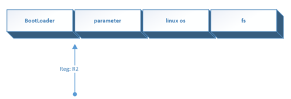
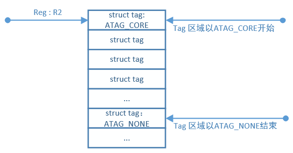

# Introduction

## Based on hi5630


​	hi -boot 是基于 u-boot 裁剪 、修改而来，编译生成目标文件非常小。hi -boot 已经适配了验证 所需的外围芯 ，若产品板外围芯片型号与单板上外围芯片型号不同时，需要适当修改相关硬件驱动代码,由于 Hi 5630 内部封装了 DDR 和一个 GEPHY，主要外围芯片为 FLASH 和外置以太 PHY.  ( [HW datasheet](pdf_resource/Hi5630HV110_G.Hn_PLC_datasheet_01.pdf))

**Note:  DDR 地址空间 0x80000000 ~ 0xFFFFFFFF , Flash 的地址空间 0x00000000 ~ 0x03FFFFFF**

hi-boot 主要文件结构如下:

```shell
.
├── applets
│   (应用程序,包括启动内核,hiboot 命令选择界面以及 tftp等)
├── arch
│   (芯片,架构的相关代码， 包括启动代码、CRG等)
├── board
│   (板级适配代码，包括 Flash 兼容,GPIO复用配置等)
├── command
│   (所有命令的实现)
├── drivers
│   (驱动)
├── include
│  	(header)
├── init
│   (启动代码以及环境变量配置)
├── lib
│   (基本 lib 实现以及解压实现)
├── mm
│   (内存管理)
├── multiupg
│   (组播升级)
├── net
│   (协议栈)
├── startcode
│   (第一阶段启动代码)
└── tools
    (压缩工具以及 ddr 初始化实现)
```

to make *hi_boot* :

```shell
# make package/gateway/sdk/hi_boot/{propare,compile,install} V=99
```


## Hi-Boot Startup

Hi-Boot  secction 1 startup located at *hisilicon/sdk/boot/hi-boot-ram/startcode/hi_startcode.c*, for secction 2 located at  *hisilicon/sdk/boot/hi-boot-ram/arch/arm/cortexa9/hi_start_hi5630.S* , the whole process as following: (more detail about bootloader by  [ubootframework](pdf_resource/ubootframework.pdf) )


## Communicate bewteen Hi-Boot & Linux



开机时执行 hi-boot, hi-boot引导完后，控制权就移交给 linux 系统了，但是linux需要一些基本信息，如内存大小，启动方式等，这就涉及到 hi-boot和 linux 通信。而通信格式由linux规定，如*Documentation/arm/Setup*




hi-boot会按照上述格式，在内存中划分一块atag参数区域，对该区域进行赋值。当赋值完成后，将cpu初始化成 MMU = off, D-cache = off, I-cache = dont care, r0 = 0, r1 = machine nr, r2 = atags or dtb pointer，跳转到linux代码起始处。[具体如](http://www.cnblogs.com/embedded-tzp/p/4449143.html)

