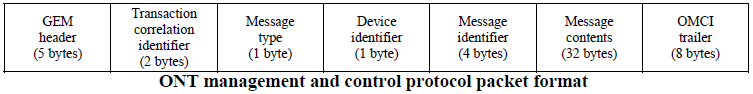

#  Hisilicon Platform Introduction

ARM ARMv7 , 667 Hz , 1 Core, Memory 256M , 

## 1.1 OpenWRT

[OpenWRT](https://openwrt.org/docs/guide-user/start) is embedded operation system  for Linux distribution based on GPL License .  OpenWRT did not contain any source code , this composed by each patch and zip, other word OpenWRT almost everything is an ".ipk ",  the ".ipk" is other name for ".tar.gz" . 

(Note: the static var for each package defined within ``open/tmp/*``  , to unzip *.tar.gz by ```tar -zxvf file1.tar.gz```  , to unzip *.tar.bz2 by  ```tar -jxvf file2.tar.bz2```. )

## 	1.2 Startup


```flow
sst=>start: Start
boot=>operation: Hi_Boot
kernel=>operation: Kernel
preinit=>operation: /etc/preinit,/sbin/init,/sbin/procd
pre1=>operation: Exec /lib/preinit/*
pre2=>operation: Exec /etc/init.d/*, /etc/init.d/hi_boot
xpon=>operation: Running /usr/bin/xpon
appm=>operation: Running Service hi_appm
e=>end
sst->boot->kernel->preinit->pre1->pre2->xpon->appm->e
```


## 1.3 Hisilicon Architecture


Hisilicon base on openWRT , OpenWrt takes a different approach to building a firmware, downloading, patch-ing and compiling everything from scratch, including the cross compiler.  OpenWrt does not contain any executables or even sources, it is an automated system for downloading the sources, patching them to work with the given platform and compiling them correctly for that platform. What this means is that just by changing the template, you can change any step in the process.

Sub-system Interface Introduction

| Interface Name | Description | Interact Subsystem    | Responsible                                                  | Type    |
| -------------- | ----------- | --------------------- | ------------------------------------------------------------ | ------- |
| HAL            | 配置，查询  | CFE, Services         | 硬件抽象层，对上层软件提供统一的业务化API层，屏蔽底层芯片具体实现和差异。 | outside |
| CFE            | 配置，查询  | Services              | 核心转发引擎，用于实现业务报文的软、硬加速转发功能，对上层软件提供控制API。 | outside |
| SAL            | 配置，查询  | CM                    | 网管业务抽象层，提供各类网关业务由cm模块封装接口，不对子系统以外提供接口。扩展sal层的功能，把业务实现也包含进入sal中。 | inside  |
| SML            | 配置，查询  | OMCI,OAM              | OMCI，OAM的业务抽象层                                        | inside  |
| CM             | 配置，查询  | CMS,CT Smart,CM Smart | 配置管理层，包括：对上层提供统一的业务管理API，供CWMP、WEB、IPC Service、Smartgateway等模块使用。屏蔽下层各业务子系统或模块的实现细节，负责将上层模块的不同数据模型转换成内部的数据模型，并调用下层子系统的API下发业务配置。内部还实现了对配置数据文件的管理和读、写等功能。 | inside  |
| IPC            | 访问控制    | CM,CMS ,Services      | 进程间通信模块，主要完成系统内部进程间互相通信，以及用户态访问内核态等功能。 | inside  |
| Notifiter      |             |                       | 事件管理模块，提供事件注册、管理、分发等功能。               |         |
| UCM            |             |                       | 统一配置管理模块，为业务模块提供统一配置方法和配置文件的管理等功能。 |         |
| IPC Services   |             |                       | 中国电信智能网关规定的dbus适配接口，按电信规定的API实现，对接上层中间件。模块内部调用CM子系统的API下发业务配置。 |         |
| OSGi           |             | Plug-in Bundle        | 提供插件服务                                                 |         |


## 1.4 Hisilicon partition table

flash layout table for hi_boot.

```shell
                    |--------------------|
            		|       Java B       |	java.bin,zize=0xE00000
            0x6000000 -------------------|
                    |       Java A       |	java.bin,zize=0xE00000
            0x4200000 -------------------|
                    |                    |
                    |		rootfs B	 |  root.squshfs,size=0x1900000              
 			0x2900000 -------------------|
                    |                    |
                    |	  	rootfs A	 |	root.squshfs,size=0x1900000
 	        0x1000000 -------------------|
                    |                    |
                    |	  	kernel B	 |	kernel.img size=0x50000
             0xB00000 -------------------|
                    |                    |
                    |     	kernel A     |  kernel.img size=0x50000
             0x600000 -------------------|
                    |		ENV		     |	env.bin, size=0xA0000
 	          0xc0000 -------------------|
                    |     	ENV          |  env.bin, size=0xA0000
 	          0x20000 -------------------|
                    |    	HI_Boot      |	hiboot.bin,size=0x20000
 	          0x00000 -------------------|
```

,and *mtd_<num>* for partition table in linux

```shell
dev:    size   erasesize  name
mtd0: 00040000 00020000 "boot"
mtd1: 00100000 00020000 "enva"
mtd2: 00100000 00020000 "envb"
mtd3: 00200000 00020000 "fac"
mtd4: 00200000 00020000 "cfga"
mtd5: 00200000 00020000 "cfgb"
mtd6: 002c0000 00020000 "log"
mtd7: 00500000 00020000 "kernela"
mtd8: 00500000 00020000 "kernelb"
mtd9: 01900000 00020000 "rootfsa"
mtd10: 01900000 00020000 "rootfsb"
mtd11: 02300000 00020000 "fwka"
mtd12: 02300000 00020000 "fwkb"
mtd13: 06e00000 00020000 "app"
mtd14: 00500000 00020000 "other"
```

System environment loading flow:


**Note: Recover default environment var should erase 'enva' and 'envb' partitions.**

CMS xml reading process


## 1.5.1  Hisilicon system configuration files

*board.xml*  contains  GPIO  map , LED  , optical setting.  source at ``sulotion/patch/openwrt/vendors/${manufacturer}/${chip_id}/``


*sysinfo.xml*  contains LOID info , mac addr , province .etc


*lastgood.xml*   restored command by ``hi_cfm config`` , and  file named ``${operator}_smart_${province}_${ui_ge_num}_${ui_fe_num}_${ui_voice_num}_${${ui_wlan24_num}+${ui_wlan58_num}}_${${ui_usb2_num} + ${ui_usb3_num}}.xml``   compress at   */config/cfm/config.tar* by command ``hi_cfm config`` , for example  *cmcc_smart_jiangsu_1_3_1_0_2.xml*  for hi_5662y type 1 .


**(Note: priority of configuration at /usr/bin/board_upgrade )**


## 1.5 Source Files Structure

**./root Structure**

```
├── Apps-plugin
│	(The third-part function, such like CMCC or CTC.)
├── buappconfig
│	(The third-part chip or hardware configeration.)
├── document
├── hisilicon
│	(The source file for gateway operations ,
│	 while cp to ./openwrt/package/gateway. hi-boot while in this folder .)
├── openwrt   
│   (The main source folder, this folder while generate 
│	after running "make" or "make chip=sd5116" .)
├── solution
│	(patch of openWRT, and open source software package.)
├── sysinfo
│	(The third-part app configeration.)
├── toolchain
│	(toolchain derictory , generate after compile.)
└── Tools 

(./App-plugin  ./document   ./hisilicon  ./solution  and  ./sysinfo are store in trunk , all other folder are genreate by compile )
```


**Kernel Solution & Builded path**

for 5116:

```shell
$ ls openwrt/target/linux/sd5116/files/drivers/mtd/hsan/
$ ls openwrt/build_dir/target-arm-openwrt-linux-uclibcgnueabi/linux-sd5116_generic/linux-3.18.11/
```

for 5663:

```shell
$ ls openwrt/target/linux/hsan/files/
$ ls openwrt/build_dir/target-arm-openwrt-linux-uclibcgnueabi/linux-hsan_generic/linux-3.18.11/
```

**Rootfs Solution & Builded path**

for 5116

```shell
$ ls openwrt/staging_dir/target-arm-openwrt-linux-uclibcgnueabi/root-sd5116/
$ ls openwrt/build_dir/target-arm-openwrt-linux-uclibcgnueabi/root-sd5116/

```
for 5663

```shell
$ ls openwrt/staging_dir/target-arm-openwrt-linux-uclibcgnueabi/root-hsan/
$ ls openwrt/build_dir/target-arm-openwrt-linux-uclibcgnueabi/root-hsan/
```


### 1.5.1 Download & Building

``openwrt/package/*`` contained all of the apps including gateway from Hisilicon and GPL programs.

```shell
$ svn checkout http://wx-svn.zyxel.cn/SW-31/mld_sg/Hisilicon_trunk/trunk/HSANV200R010C01SPC011
$ make chip=sd5116 V=s 
(used to make whole target ,  V=s means  to show the  build log. to direct province by 
'make chip=sd5116 province=heilongjiang V=s' , 
for H3 by 'make chip=hi5663h V=s' 
for H2 by 'make chip=hi5661y V=s' to copmile hi5661 project
for H2 by 'make chip=sd5116 V=s',to compile hi5662h project.)

$ make -C openwrt package/gateway/{prepare,config,compile,install} V=s
( to build Hisilicon operation module)
```

To build third part GPL open source program such as 'dnsmasq' , 'httping'  like following

```shell
$ make -C openwrt package/network/services/dnsmasq/{prepare,config,compile,install} V=s
$ make -C openwrt package/apps/httping/{prepare,config,compile,install} V=s
```

**Note: if you want to update the code in trunk, please commit the code in directory solution\patch\openwrt\package\network\services\(generate patch)**

```shell
$ make -c openwrt package/gateway/sdk/hi_boot/{prepare,config,compile,install} V=s
(to build the hi-boot)

$ make -C openwrt target/linux/install V=s
$ make chip=sd5116 image V=s
(to H3 by 'make chip=hi5663h V=s hitools image factory')
```
**Release Image**
The generated files at ./openwrt/bin/sd5116/

```shell
openwrt/bin/sd5116/
├── hi_boot.bin
├── hi_boot_dbg.bin
├── java.bin
├── java.jffs2.bin
├── kernel.images
├── root.jffs2-128k
└── root.squashfs
```

device and make table;

| Device Type | MCU    | Make Chip         |
| ----------- | ------ | ----------------- |
| H-1         | sd5116 | chip=sd5116       |
| H-2         | hi5662 | chip=sd5116       |
| H-3         | hi5663 | chip=hsan or Null |


### 1.5.2 Hi-Boot

```
├── bin
├── build_dir
│		(Temporary directory for building )
├── config
├── dl -> /home/chear/HisiliconSource/HSANV200R010C01SPC011/solution/package/openwrt
│		(Downloaded files by the toolchain, target or package)
├── docs
│		(Access "make -C /docs" to generate the openwrt.pdf)
├── include
├── package
│		(Main Hisilicon source files)
├── scripts
├── staging_dir
├── target
├── tmp
├── toolchain
├── tools
└── vendors
```

**hi_boot Building path**

```shell
$ ls openwrt/build_dir/target-arm-openwrt-linux-uclibcgnueabi/hi_gateway/sdk/hi_boot/
```


### 1.5.3 kernel

**Kernel Building path at:**

```shell
$ ls solution/package/openwrt/linux-3.18.11.tar.xz
$ ls solution/patch/linux-3.18.11/
(Linux zip and kernel patch for solution)
$ ls openwrt/target/linux/hsan/files/
(solution source to build)
$ ls openwrt/build_dir/target-arm-openwrt-linux-uclibcgnueabi/linux-hsan_generic/linux-3.18.11/
(finally building path)
```

**Rootfs Building path at:**

```shell
$ ls solution/patch/openwrt/package/base-files/files/
(This is for svn solution)
$ ls openwrt/package/base-files/files/etc/shadow
(This for openwrt building)
$ ls openwrt/build_dir/target-arm-openwrt-linux-uclibcgnueabi/root-sd5116/
(This for image release)
```

**To remove the whole source at ''*build_dir/target-arm-openwrt-linux-uclibcgnueabi/linux-hsan_generic/linux-3.18.11/*''  and want re-building using following command**

```shell
$ cd openwrt/
$ make target/linux/{clean,prepare,compile,install} V-s
$ make package/utils/busybox/{compile,install} V=s 
(To build busybox only, to get more pls check openwrt/tmp/.packageinfo)
```


## 1.6 Burn to board

###  1.6.1 burn rootfs and kernel
Reboot and entry into burn menu like following:
```shell
##### Menu #####
[0] Update bootbin
[1] Update debug bootbin
[2] Update kernela and rootfsa
[3] Update rootfsa
[4] Update kernela
[5] Update kernelb and rootfsb
[6] Update rootfsb
[7] Update kernelb
[8] Recover default environment
[r] Reboot
[e] Enter cmdline
Please enter your selection: 2
```

Note: console update pwd "hsan" 

### 1.6.2 burning Java partition

``` shell
##### Menu #####
[0] Update bootbin
[1] Update debug bootbin
[2] Update kernela and rootfsa
[3] Update rootfsa
[4] Update kernela
[5] Update kernelb and rootfsb
[6] Update rootfsb
[7] Update kernelb
[8] Recover default environment
[r] Reboot
[e] Enter cmdline
Please enter your selection: e
hi # ?
?               - alias for help
bootm           - boot
ddr_greenbox    - ddr_greenbox test
ddr_ssn         - ddr_ssn test
go              - start application at address 'addr'
help            - print command help
md              - memory display
mdio            - mdio sub-system
menu            - menu
mw              - memory write (fill)
nand            - NAND sub-system
ping            - send ICMP ECHO_REQUEST to network host
printenv        - print env
reset           - Perform RESET of the CPU
run             - run command that saved in env
saveenv         - save env
setenv          - set env
sfc             - sfc sub-system
sfc_nand        - sfc_nand sub-system
tftp            - tftp [loadAddress] filename
upg             - upg alias
hi # upg javaa 
```


**举例：将内存中0x8700000****的数据写入到nand flash**

- a. 写数据0x12345678到内存0x87000000，长度0x40000，即256k

  相关命令：``mw 0x87000000 0x12345678 0x40000``

- b. 擦除flash 1M的内容

  相关命令：``nand erase 0x100000 0x40000``

- c. flash 写：将内存0x87000000的内容写入flash 1M的地址，写入长度256k

  相关命令：``nand write 0x87000000 0x100000 0x40000``

- d. flash 读：读flash 1M地址内容到内存0x88000000.

  相关命令：``nand read 0x88000000 0x100000 0x40000``

实际操作如下图：


## 1.7 gPon debug

OAM message at physical layer falls into three types: **embedded OAM**, **PLOAM** and **OMCI**.

### 1.7.1 OMCI (ONT Management and Control Interface)

OMCI used to management and control ONT configuration by ME(Managed Entity) instance,the package like following:




### 1.7.2  PLOAM (Physical layer OAM)

Main functions provided by PLOAM:
1. Configuration of upstream burst

2. ONU activation

3. ONU registration

4. Update of encryption key, exchange

5. ProtectionSwitching Signalling

6. Power management


​    

package of PLOAM as following:

| Byte  | Name     | Description                     |
| ----- | -------- | ------------------------------- |
| 1-2   | ONU-ID   | 10比特的ONU-ID，最高6位没有使用 |
| 3     | 消息ID   |                                 |
| 4     | 消息编号 |                                 |
| 5-40  | 消息内容 |                                 |
| 41-48 | MIC      | 用于消息的完整性检测            |


### 1.7.3 command

to debug gPon within hisilicon platform, 

```shell
root@OpenWrt:~# cli /home/cli/log_cmd/klog/cfg_set -v module 0xf9002000 sys 0 dbg 0x0 print 0x10
root@OpenWrt:~# cli /home/cli/log_cmd/klog/cfg_set -v module 0xf9002000 sys 0 dbg 0x00 print 0x00
(Open or close ploam debug message for gPon)

root@OpenWrt:~# cli /home/cli/log_cmd/log/cfg_set -v module 0xf2003100 sys 0 dbg 0x38 print 0x38
(Open omci message for gPon)
root@OpenWrt:~# cli /home/cli/log_cmd/log/cfg_set -v module 0xfe000000 sys 0 dbg 0x0 print 0x0
(debug for spring adapter, NOTSURE?)

root@OpenWrt:~# cli /home/cli/log_cmd/log/cfg_set -v module 0xF0001000 dbg 0xff print 0xff sys 1

root@OpenWrt:~# cli /home/cli/log_cmd/log/cfg_set -v module 0xF6003000 dbg 0xff print 0xff sys 1
(to debug wan.)

root@OpenWrt:~# cli /home/cli/log_cmd/log/cfg_set -v module 0xF0004000 dbg 0xff print 0xff sys 1
(to debug sal emu service , such like hi_emu_speed.)

root@OpenWrt:~# cli /home/cli/log_cmd/log/cfg_set -v module 0xF7003000 dbg 0xff print 0xff sys 1
(to debug hal )

root@OpenWrt:~# cli /home/cli/log_cmd/log/cfg_set -v module 0xF600c000 dbg 0xff print 0xff sys 1
(to debug wlan )

root@OpenWrt:~# cli /home/cli/log_cmd/log/cfg_set -v module 0xF5005000 dbg 0xff print 0xff sys 1
(to debug hsan led driver )

root@OpenWrt:~# cli /home/cli/log_cmd/log/cfg_set -v module 0xF6007000 dbg 0xff print 0xff sys 1
(to debug hsan vxlan )
```


## 1.8 General Command

to reset factory setting, and dump network frame from **WAN** port to **LAN** port

disable and enable ACS control for ITMS(RMS) in GUI:

```shell
root@OpenWrt:~# hi_cfm test restore 
(To reset default env in partition /config/worka/*)
root@OpenWrt:~# cli /home/cli/cm/cm_ctrl -v value 0x2000000d	(disable)
root@OpenWrt:~# cli /home/cli/cm/cm_ctrl -v value 0x2000000e	(enable)
```

disable and enable TR069 wan control in GUI:

```shell
root@OpenWrt:~# cli /home/cli/cm/cm_ctrl -v value 0x2000000f	(disable)
root@OpenWrt:~# cli /home/cli/cm/cm_ctrl -v value 0x20000010	(enable) 
```

GPIO control (this part have not been open source from hisi.):

```shell
root@OpenWrt:~# cli /home/cli/hal/chip/gpio_read -v gpio 0
(reading value of GPIO_0, within hi5662y GPIO_0 for internet_led ) 
root@OpenWrt:~# cli /home/cli/hal/chip/gpio_write -v gpio 0 level 1
(setting GPIO_0 to 1)
```

