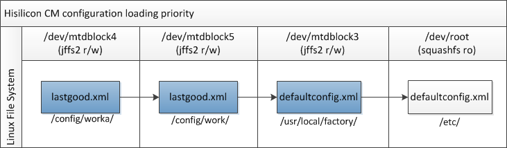

## Hisilicon CM (Config Management)

### CM Introduction

As the fallowing shows , the CM provide interface to upper protocol such like Web or TR069 to control  the system service and even hardware. 


CM could be :

- Operating business logical 
  provide  API  , received and collect configure message from WEB , Tr069  or other module , to forward and convert the format to SAL.
- Store data
- Initialize configuration ,CM loading configurations  by sequence and dependency  when device  startup 

mib configuration loading priority:




**CM Flow Process**


### CM Architecture
CM Contains two part: 

- **mib** (source at:  HSANV200R010C01SPC011/hisilicon/gateway/service/cm/mib/) 

​	To store the data , loading , initialize and maintenance database in memory.

- **odl** (source at:  HSANV200R010C01SPC011/hisilicon/gateway/service/cm/odl/)

​	To operating the data , logical verify ,event callback.

**(Note:  to debug CM while typed "log_voice_cli odl odl_log" to open CM Logs , log file at /tmp/log/message . )**

```shell
root@OpenWrt:~# cli /home/cli/log_cmd/log/cfg_set -v module 0xF2040000 dbg 0xff print 0xff sys 1 
root@OpenWrt:~# log_voice_cli odl odl_log
root@OpenWrt:~# tail -f -n 100 /tmp/log/messages
```

**Tips:  Both CM and Web all use ``/sbin/syslogd`` to store logging message while is based on busybox, default store at /etc/log/message , want display CM debug message stream to console by: **

```shell
root@OpenWrt:~# killall syslogd && /sbin/syslogd -l 7 -O /dev/console && log_voice_log odl odl_log
```

**by display web debug info by:**

```shell
root@OpenWrt:~# echo 1 > /config/work/weblog.txt
root@OpenWrt:~# killall syslogd && /sbin/syslogd -l 8 -O /dev/console
```

Files structure  as below

```shell
hisilicon/gateway/service/cm/
├── dhcpSimulation
├── downloadDiag
├── ftp
├── lanhost
├── mib
├── mib
   ├── defaultconfig.xml
   ├── include
   ├── Makefile
   └── source
├── odl
   ├── cli
   ├── include
   ├── Makefile
   └── source
├── odlapi
├── pppem
├── samba
├── service
├── stats
├── storage
├── timer
└── usbmount
```


#### GPon Service Interaction


#### Web Service Interaction


### Related API

source at: HSANV200R010C01SPC011/hisilicon/gateway/service/cm/odl/odlapi/

```c
word32 igdCmConfAdd(uword32 tab_id, uword8 *pucInfo, uword32 len);
word32 igdCmConfDel(uword32 tab_id, uword8 *pucInfo, uword32 len); 
word32 igdCmConfSet(uword32 tab_id, uword8 *pucInfo, uword32 len); 
word32 igdCmConfGet(uword32 tab_id, uword8 *pucInfo, uword32 len); 
word32 igdCmConfGetEntryNum(uword32 tab_id, uword32 *entrynum); 
word32 igdCmConfGetAllEntry(uword32 tab_id, uword8 *pucInfo, uword32 len); 
word32 igdCmOamCtrl(uword32 ulCmd); 

hi_int32 hi_notifier_create(hi_char8 *pc_name, hi_uint32 ui_data_size)； 
#define HI_DEF_NCALL(nt_name, type, data)； 
hi_int32 hi_notifier_call(hi_char8 *pc_name, hi_void *pv_data); 
```


### CM Sample


```c


```

