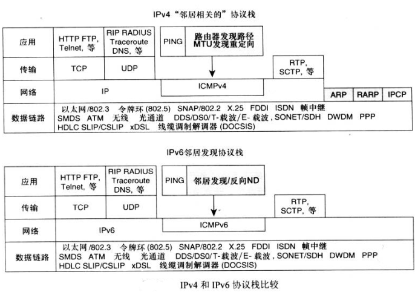
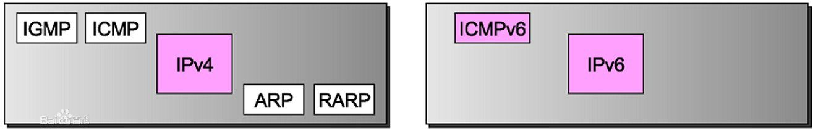
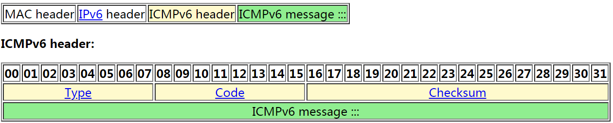

# 1. IPv6 Introduction

## 1.1 Background:

IPv6是一种用于分组交换网络的网络层协议，它提供跨多个IP网络的端到端数据报传输，它严格遵循先前版本的协议Internet协议版本4（IPv4）中开发的设计原则。​	

IPv4 和 IPv6 设计上并不是互操作的，但是有IPv6转换机制来允许IPv4和IPv6网络之间的通信 ， 比如 Tunnel隧道(Tunnel)是指将一种协议报头封装在另一种协议报头中，这样，一种协议就可以通过另一种协议的封装进行通信。IPv6隧道是将IPv6报头封装在IPv4报头中，这样IPv6协议包就可以穿越IPv4网络进行通信。在IPv4网络上配置IPv6隧道是一个比较麻烦的过程，而且隧道技术不能实现IPv4主机和IPv6主机之间的通信。

Windows 能够同时支持 ipv4 和ipv6两种网络

## 1.2 IPv6 Key Features

- Large IP Address Space 

  Large address pool about 2^128

- New Header Format 

- Neighbor Discovery Protocol (RFC 2461)

- Address Auto-configuration (RFC2462)

- Ipsec header support required

- Extensibility

## 1.3 IPv6 vs IPv4

- Expanded Address Space
- Header Format Simplification
- No checksum at IPv6 header
- Addressing Auto-Configuration
- No more IP broadcast 

# 2. IPv6 Packet Structure

IPv6 contain two part  a header and payload.  payloay must be less than 64KB by default . With a Jumbo Payload option (in a *Hop-By-Hop Options* extension header), the payload must be less than 4 GB.

## 2.1 IPv6 Header

ipv4 vs ipv6 , those ipv6 & ipv4  header are for IP layer.

- **Traffic Class (6+2)**:

  Indicated the IPv6 packet’s class or priority. Similar to the IPv4 ToS field.

  (IPv4 Type of Service field (TOS): TOS used to setting the priority of IP header)

- **Payload Length (16)**:

  Indicated the length of the IPv6 payload. Included the extension headers and  upper-layer PDU.

-  **Hop Limit**:

  Maximum number of links over which the IPv6 packet can travel before being discarded.

  (Hop Limit same for TTL)

- **Flow Label**:

  Indicated that this packet belongs to a specific sequence of packets (Originally created for giving real-time applications special service ,to ensure that they will not be reordered.)

- **Next Header**:

  Indicates either the type of the first extension or the protocol in the upper-layer PDU.

| Extension Header                                  | Type | Description                                                  |
| ------------------------------------------------- | ---- | ------------------------------------------------------------ |
| Hop-by-Hop Options                                | 0    | Options that need to be examined by all devices on the path. |
| Destination Options (before routing header)       | 60   | Options that need to be examined only by the destination of the packet. |
| *Routing*                                         | 43   | Methods to specify the route for a datagram (used with [Mobile IPv6](https://en.wikipedia.org/wiki/Mobile_IPv6)). |
| *Fragment*                                        | 44   | Contains parameters for fragmentation of datagrams.          |
| Authentication Header (AH)                        | 51   | Contains information used to verify the authenticity of most parts of the packet. |
| Encapsulating Security Payload (ESP)              | 50   | Carries encrypted data for secure communication.             |
| *Destination Options* (before upper-layer header) | 60   | Options that need to be examined only by the destination of the packet. |
| Mobility (currently without upper-layer header)   | 135  | Parameters used with [Mobile IPv6](https://en.wikipedia.org/wiki/Mobile_IPv6). |
| Host Identity Protocol                            | 139  | Used for [Host Identity Protocol](https://en.wikipedia.org/wiki/Host_Identity_Protocol) version 2 (HIPv2).[[11\]](https://en.wikipedia.org/wiki/IPv6_packet#cite_note-rfc7401-11) |
| Shim6 Protocol                                    | 140  | Used for [Shim6](https://en.wikipedia.org/wiki/Shim6).[[12\]](https://en.wikipedia.org/wiki/IPv6_packet#cite_note-rfc5533-12) |
| Reserved                                          | 253  | Used for experimentation and testing.[ |
| Reserved                                          | 254  | Used for experimentation and testing.[[13\]](https://en.wikipedia.org/wiki/IPv6_packet#cite_note-rfc3692-13)[[4\]](https://en.wikipedia.org/wiki/IPv6_packet#cite_note-rfc4727-4) |

( Protocol Data Unit(PDU)   ARP based for IPv4, IPv6 Realization function for Neighbor Discovery Protocol)

## 2.2  Hop-by-Hop Options Header

- Value of the next header is 0

- The Hop-by-Hop Options header is use to specify delivery parameter at each hop on the path to the destination 

  

- **Next Header (8 bits)** 

  Specifies the type of the next header.

- **Hdr Ext Len (8 bits)** 

  Length of this header in 8-octet units, not including the first 8 octets.

- **Options (variable)** 

  Contains one or more options, and optional padding fields to align options and to make the total header length a multiple of 8 octets. Options are TLV-coded.
  Routing

## 2.3 Routing

- **Next Header (8 bits)**

  Indicates the type of the next header.

- **Hdr Ext Len (8 bits)**

  The length of this header, in multiples of 8 octets, not including the first 8 octets.

- **Routing Type (8 bits)**

  A value between 0 and 255, as assigned by [IANA](https://en.wikipedia.org/wiki/IANA).[[14\]](https://en.wikipedia.org/wiki/IPv6_packet#cite_note-iana_routing_options-14)

# 3. IPv6 Addressing Syntax

- **The following is an IPv6 address in binary form:**

  *0010000111011010000000001101001100000000000000000010111100111011*

  *0000001010101010000000001111111111111110001010001001110001011010*

- **The 128-bit address is divided along 16-bit boundaries:**

  *0010000111011010 0000000011010011 0000000000000000 0010111100111011*

  *0000001010101010 0000000011111111 1111111000101000 1001110001011010*

- **Each 16-bit block is converted to hexadecimal and delimited with colons. The result is the following:**

  *21DA:00D3:0000:2F3B:02AA:00FF:FE28:9C5A*

## 3.1  Compressing Zeros

1. Some IPv6 addresses contain long sequences of zeros
2. A single contiguous sequence of 16-bit blocks set to 0 can be compressed to “::” (double-colon) 

Example:

| Standard                    | Compressed             |
| --------------------------- | ---------------------- |
| FE80:0:0:0:2AA:FF:FE9A:4CA2 | FE80::2AA:FF:FE9A:4CA2 |
| FF02:0:0:0:0:0:0:2          | FF02::2                |

## 3.2 Types of IPv6 Addresses

### 3.2.1 Unicast

Address of a single interface one-to-one delivery to single interface

(A [unicast](https://en.wikipedia.org/wiki/Unicast) address identifies a single network interface. The Internet Protocol delivers packets
sent to a unicast address to that specific interface.)

#### 3.2.1.1 Global Unicast Addresses

The structure of global unicast addresses defined in RFC 3587 . The three high-order bits are set to 001

Global Routing Prefix

(可在全球范围内路由和到达的，相当于IPv4里面的global addresses。前三个bit是001

例如：2000::1:2345:6789:abcd)

#### 3.2.1.2 Link-Local Addresses

Link-Local addresses always begin with FE80

Link-Local addresses are used between on-link neighbors and for Neighbor Discovery processes.

( 用于同一个链路上的相邻节点之间通信，相当于IPv4里面的169.254.0.0/16地址。Ipv6的路由器不会转发链路本地地址的数据包。前10个bit是1111 1110 10，由于最后是64bit的interface ID，所以它的前缀总是FE80::/64
例如：FE80::1 )

#### 3.2.1.3 EUI-64 Mac Addresss

Used for Stateless Address Configuration.

[主机](https://baike.baidu.com/item/%E4%B8%BB%E6%9C%BA)A 的[以太网](https://baike.baidu.com/item/%E4%BB%A5%E5%A4%AA%E7%BD%91)MAC 地址是 00-AA-00-3F-2A-1C。首先，通过在第三个和第四个字节之间插入 FF-FE 将其转换为 EUI-64 格式，其结果是 00-AA-00-FF-FE-3F-2A-1C。然后，对 U/L 位（第一个字节中的第七位）求反。第一个字节的[二进制](https://baike.baidu.com/item/%E4%BA%8C%E8%BF%9B%E5%88%B6/361457)形式为 00000000。将第七位求反后，变为 00000010 (0x02)。最后的结果是 02-AA-00-FF-FE-3F-2A-1C，当转换为[冒号](https://baike.baidu.com/item/%E5%86%92%E5%8F%B7/998617)[十六进制](https://baike.baidu.com/item/%E5%8D%81%E5%85%AD%E8%BF%9B%E5%88%B6/4162457)符号时，成为接口标识 2AA:FF:FE3F:2A1C。结果是，对应于 MAC 地址 00-AA-00-3F-2A-1C 的[网络适配器](https://baike.baidu.com/item/%E7%BD%91%E7%BB%9C%E9%80%82%E9%85%8D%E5%99%A8)的链接本地地址是 FE80::2AA:FF:FE3F:2A1C。

#### 3.2.1.4 Site-Local Addresses

- The first 10 bits are always fixed for site-local addresses, beginning with FEC0::/10
- Equivalent to the IPv4 private address space (10.0.0.0/8, 172.16.0.0/12, and 192.168.0.0/16)

(对于无法访问internet的本地网络，可以使用站点本地地址，这个相当于IPv4里面的private address（10.0.0.0/8, 172.16.0.0/12, and 192.168.0.0/16）。它的前10个bit是1111 1110 11，它最后是16bit的Subnet ID和64bit的interface ID，所以它的前缀是FEC0::/48。

值得注意的是，在RFC3879中，最终决定放弃单播站点本地地址。放弃的理由是，由于其固有的二义性带来的单播站点本地地址的复杂性超过了它们可能带来的好处。它在RFC4193中被ULA取代。)

#### 3.2.1.5 Unique Local Addresses

- All local addresses have the address prefix FC00::/7
- The Local (L) flag is set 1 to indicate that the prefix is locally assigned: FD00::/8

(在RFC4193中标准化了一种用来在本地通信中取代单播站点本地地址的地址。ULA拥有固定前缀FD00::/8，后面跟一个被称为全局ID的40bit随机标识符)

#### 3.2.1.6 Special Addresses

- Unspecified address

  ​	0:0:0:0:0:0:0:0 or ::

- Loopback address

  ​	0:0:0:0:0:0:0:1 or ::1

#### 3.2.1.7 Transition Addresses

- IPv4-compatible address

   ​	0:0:0:0:0:0:w.x.y.z or ::w.x.y.z

- IPv4-mapped address

  ​	0:0:0:0:0:FFFF:w.x.y.z or ::FFFF:w.x.y.z

- in6to4 address

  ​	lPrefix of 2002:WWXX:YYZZ::/48

- ISATAP address

  ​	Interface ID of ::0:5EFE:w.x.y.z

- Teredo address

  ​	Prefix 2001::/32

(IPv4-compatible address: FC4291中废弃了对这类地址的使用)

### 3.2.2 Multicast

Address of a set of interfaces one-to-many delivery to all interfaces in the

- IPv6 multicast addresses always begins with FF

- All-Nodes addresses

  ​	**FF01::1** (Interface Local), **FF02::1** (Link Local)

- All-Routers addresses

  ​	**FF01::2** (Interface Local),  **FF02::2** (Link Local),  **FF05::2** (Site Local)

  (其中FF01::到FF0F::的多播地址是保留专用地址, FF01::1 节点本地范围所有节点多播地址, FF02::1 链路本地范围所, 节点多播地址, FF01::2 节点本地范围所有路由器多播地址, FF02::2 链路本地范围所有路由器多播地址, sFF05::2 站点本地范围所有路由器多播地址)

Defined Values for the Scope Field

| **Scope** **Field Value** | **Scope**                |
| ------------------------- | ------------------------ |
| 0                         | Reserved                 |
| 1                         | Interface-local scope    |
| 2                         | Link-local   scope       |
| 3                         | Reserved                 |
| 5                         | Site-local scope         |
| 8                         | Organization-local scope |
| E                         | Global   scope           |
| F                         | Reserved                 |

#### 3.2.2.1 Solicited-Node Address

#### 3.2.2.2 Mapping IPv6 Multicast Addresses to Ethernet Addresses

### 3.3 Anycast

Address of a set of interfaces One-to-one-of-many delivery to a single interface in the set that is closest

(An anycast address is assigned to a group of interfaces, usually belonging to different nodes. A packet sent to an anycast address is delivered to just one of the member interfaces, typically the nearest host, according to the routing protocol's definition of distance. Anycast addresses cannot be identified easily, they have the same format as unicast addresses, and differ only by their presence in the network at multiple points. Almost any unicast address can be employed as an anycast address.

在IP网络上通过一个Anycast地址标识一组提供特定服务的主机，同时服务访问方并不关心提供服务的具体是哪一台主机（比如DNS或者镜像服务），访问该地址的报文可以被IP网络路由到这一组目标中的任何一台主机上，它提供的是一种无状态的、尽力而为的服务)

( Anycast addresses are used only as destination addresses and are assigned only to routers) 

# 4. IPv6 Auto Configuration

- Stateless

  ​	Receipt of Router Advertisement messages with one or more Prefix Information options RADVD

- Stateful

  ​	Use of a stateful address configuration protocol such as DHCPv6

- Both

  ​	Receipt of Router Advertisement messages and stateful configuration protocol

(一个典型的IPv6主机单播地址由3部分组成：全局路由前缀、子网ID和接口ID(64位)。全局 路由前缀用来识别分配给一个站点的一个地址范围。子网ID也称为子网前缀，一个子网ID与 一个链接相关联，以识别站点中某个链接。接口ID用来识别链接上的某个接口，在该链接上是惟一的。在无状态地址自动配置方式下，接口ID通常可以通过EUI64转换算法得到。接口ID由48位MAC地址转换得到。使用EUI 64转换算法得到的接口ID是随机器硬件固定的，也是全局惟一的.

作为对该算法的一种改进，RFC3041又引入了一种随机地址机制，他包含了用一组随机数字代替由MAC地址转换的接口ID。该地址具有一定的生存周期，随着生存周期的结束，该地址会自动更换，较好地解决了节点的Internet访问活动被跟踪的问题。

有状态和无状态是相对于分配地址的机器而言，在无状态地址自动配置方式下，网络接口接收路由器宣告的全局地址前缀，再结合接口ID得到一个可聚集全局单播地址。在有状态地址自动配置的方式下，主要采用动态主机配置协议（DHCP），需要配备专门的DHCP服务器，网络接口通过客户机/服务器模式从DHCP服务器处得到地址配置信息

# 5. ICMPv6

[ICMPv6（Internet Control Managemet Protocol Version 6)](<http://www.networksorcery.com/enp/protocol/icmpv6.htm>)  在IPv6中，ICMPv6实现了 IPv4中 **ICMP、ARP和IGMP** 的功能。

ICMP VS ICMPv6

ICMPv6 Frame:		

- **Type.** 8 bits.
  Specifies the format of the message.

  | Type | Description   |
  | ---- | ------------- |
  | 128  | Echo request. |
  | 129  | Echo reply.   |

  

- **Code.** 8 bits.
  Further qualifies the ICMPv6 message.

- **Checksum.** 16 bits.
  Checksum that covers the ICMPv6 message. This field contains the 16-bit one's complement of the one's complement sum of the entire ICMPv6 message starting with the ICMPv6 message type field, prepended with a pseudo-header of IPv6 header fields. The pseudo-header contains the following fields:

- **ICMPv6 message.** Variable length.
  Contains the data specific to the message type indicated by the *Type* and *Code* fields.

# 6. DHCPv6

[DHCPv6](https://baike.baidu.com/item/DHCPv6/2778674)是一个用来配置工作在IPv6网络上的IPv6主机所需的[IP](https://baike.baidu.com/item/IP%E5%9C%B0%E5%9D%80/150859)[地址](https://baike.baidu.com/item/IP%E5%9C%B0%E5%9D%80/150859)、IP前缀和/或其他配置的网络协议。)

