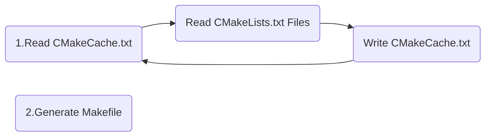

# Introduction

[CMake](<https://cmake.org/cmake/help/latest/>) is a tool to manage building of source code. CMake is widely used for the C and C++ languages, 

reference for [cmake-cookbook](https://github.com/dev-cafe/cmake-cookbook/blob/master/README.md)



to run *cmake* 

```shell
# cmake -P <script>.cmake
		-E <command>
		--build
```

## add_custom_command 

向目标添加规则，并通过执行命令生成输出。`add_custom_command`中声明的任何目标，即在相同的`CMakeLists.txt`中声明的任何目标，使用输出的任何文件作为源文件的目标，在构建时会有规则生成这些文件。因此，源文件生成在构建时，目标和自定义命令在构建系统生成时，将自动处理依赖关系

```Makefile
add_custom_command(  
  OUTPUT output1 [output2 ...]  
  COMMAND command1 [ARGS] [args1...]  
  [COMMAND command2 [ARGS] [args2...] ...]  
  [MAIN_DEPENDENCY depend]  
  [DEPENDS [depends...]]  
  [IMPLICIT_DEPENDS include_type language files...]  
  [WORKING_DIRECTORY dir]  
  [COMMENT comment]  
  [VERBATIM]  
  [APPEND]  
  [USES_TERMINAL]  
  [BYPRODUCTS [files...]]  
  [GENERATOR_FILE]  
)
```

## add_custom_target 

用户可以使用`add_custom_target`，在目标中执行定制命令。这与我们前面讨论的`add_custom_command`略有不同。`add_custom_target`添加的目标没有输出，因此总会执行。因此，可以在子目录中引入自定义目标，并且仍然能够在主`CMakeLists.txt`中引用它。

*CMakeLists.txt* sample

```cmake
cmake_minimum_required (VERSION 3.0)
project (demo
    VERSION 1.0
	DESCRIPTION "this is demo desc"
    LANGUAGES C)

message(STATUS "chear: ${PROJECT_NAME}")
message(STATUS "chear: ${PROJECT_SOURCE_DIR}")
message(STATUS "chear: ${PROJECT_BINARY_DIR}")
message(STATUS "chear: ${demo_SOURCE_DIR}")
message(STATUS "chear: ${demo_BINARY_DIR}")

add_executable(demo main.c)

# cmake 3.0 support add target to include *.h
#
# iref: include_directories( ${CMAKE_SOURCE_DIR}/include)

target_include_directories(demo
    PRIVATE
        ${CMAKE_SOURCE_DIR}/include
)
```

to  generate executable for project *demo* by  ``cmake && make demo ``

