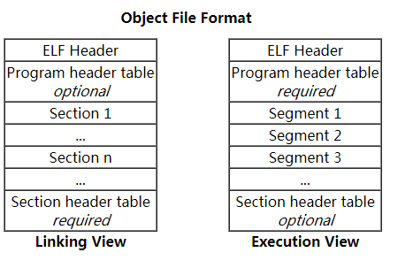
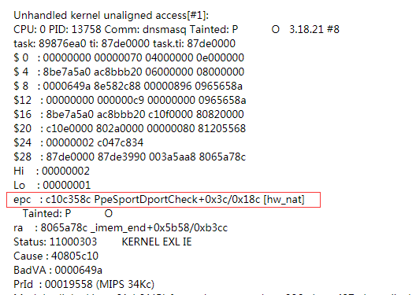
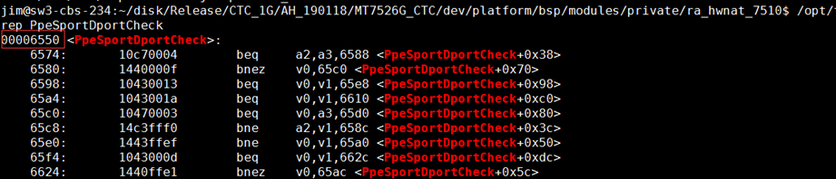
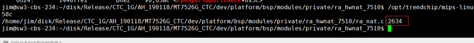
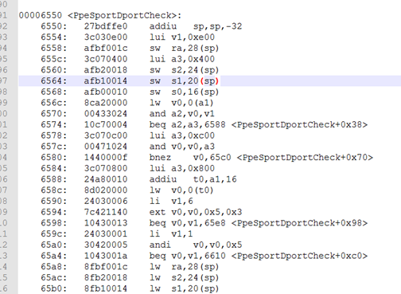
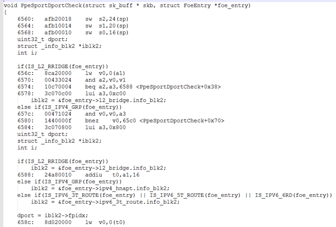

# Linux Building

building process.

```

                            kernel/built-in.o  certs/built-in.o
                            mm/built-in.o      fs/built-in.o
                            ipc/buit-in.o      security/built-in.o
                            crypto/built-in.o  block/built-in.o
                            lib/built-in.o     lib/lib.a
 head_64.o                  usr/built-in.o     drivers/built-in.o
 head64.o                   sound/built-in.o   firmware/built-in.o
 head.o    init/built-in.o  net/built-in.o     virt/built-in.o
    ||          ||             ||                ||

 $(head-y)    $(init-y)     $(core-y)  $(drivers-y)
                            $(net-y)   $(libs-y)  
                            $(virt-y)
     |            |             |          |
     |            |             |          |
      \          /               \        /
       \        /                 \      /

    KBUILD_VMLINUX_INIT         KBUILD_VMLINUX_MAIN
               \                   /
                 \              /
                       vmlinux   (compress or not)
```


# Linux ELF


**Object Files** are typically created by the  assembler and link editor , and are a binary format  representations of programs intended to be executed directly on a processor. Programs that require other abstract machines, such as shell scripts, are excluded. 

There are three main types of object files

- relocatable files  (*.o)

- executable files 

- shared  object ( *.so , *.a)

  

The **[Object File](<https://refspecs.linuxbase.org/elf/gabi4+/ch4.intro.html>)** format are **ELF( [Executable and Linkable Format](<https://ctf-wiki.github.io/ctf-wiki/executable/elf/elf-structure-zh/>) )**  , while	defines the structure for binaries, libraries, and core files such like   *.so , *.axf , *.bin , *.elf , *.o , *.prx , *.puff , *.ko , *.mod and *.so etc.

The formal specification allows the operating system to interpreter its underlying machine instructions correctly. With the right tools, such file can be analyzed and better understood. 

(**Tips:**  **Windows** platform using **PE ([Portable Executable](<https://en.wikibooks.org/wiki/X86_Disassembly/Windows_Executable_Files>)**) format, **Mac OS-X** used for **[Mach-O](<https://zhuanlan.zhihu.com/p/24858664>)** )

The **type** field tells us what the purpose of the file is. There are a few common file types.

- CORE (value 4)
- DYN (Shared object file), for libraries (value 3) , suck like *.so file.
- EXEC (Executable file), for binaries (value 2)
- REL (Relocatable file), before linked into an executable file (value 1) , such like *.o file.

For executable files there are four main sections, Each of these sections is loaded with different access rights, which can be seen with **[readelf -S](https://zhuanlan.zhihu.com/p/112754720)**.

**.text**

Contains executable code. It will be packed into a segment with read and execute access rights. It is only loaded once, as the contents will not change. This can be seen with the **objdump** utility.

**.data**

Initialized data, with read/write access rights

**.bss**

Uninitialized data, with read/write access rights (=WA)

**.rodata**

Initialized data, with read access rights only (=A).

**.stack & .heap**

stack to store local variable and parameter value for function

```shell
                    |--------------------| 0xFF                         
                    |	   stack    	 |
                    |--------------------|
                    |    ELF Header      |
                    |--------------------| 
                    |Program Header Table|
                    |--------------------| 
                    |    .Text           |
                    |--------------------| 
                    |    .rodata         |
                    |--------------------|
                    |	   heap          |
                    |--------------------|
                    |	    ...          |
                    |--------------------|
                    |	  .data          |
                    |--------------------|
                    |    Section Header  |
                    |    Table optional	 |
                    |--------------------| 0x00
```

(Note: Stack/Heap are in-memory structures which are created/modified during run-time so in essence they are not in the file itself - they can't be. Think of them as a special place in memory where each and every program can store run-time data and by run-time data I mean variables. function invocations, return values and all the nitty-gritty stuff that are hapening on the low level.)

*Commands to see section and headers*

- dumpelf (Linux command)
- elfls -p /bin/ps
- eu-readelf –section-headers /bin/ps
- readelf -S /bin/ps	       (gcc tools)
- objdump -h /bin/ps    (gcc tools)
- ld                                   (gcc tool for link)
- na                                  (gcc too)


**Note: ZyXEL and Econet toolchain at /opt/trendchip/mips-linux-uclibc-4.9.3/**

#  Kernel oops && panic

在 Linux 中 panic 的程度显然是高于oops，内核panic后，就死机了俗称内核崩溃。但是内核报oops，这个时候不见得会panic，它可能只是报个oops，杀死进程而已 。例如 [Kernel Oops和Panic是一回事吗](<http://www.eeworld.com.cn/mp/ymc/a52750.jspx>)


## Sample for MIPS Arch 

### Step 1.

**epc: exception program counter 异常程序计数器** ,
**ra :   return address   返回地址**




### Step 2.
通过 **epc** 值可知，crash的函数名为 **PpeSportDportCheck**，通过查找源文件位于*MT7526G_CTC\dev\platform\bsp\modules\private\ra_hwnat_7510\ra_nat.c*

```makefile
KERNELDIR := $(KERNEL_DIR)
#obj-$(CONFIG_RA_HW_NAT) += hw_nat.o
obj-m = hw_nat.o
hw_nat-objs := ra_nat.o foe_fdb.o util.o hwnat_ioctl.o ppe_api.o
EXTRA_CFLAGS += -g -DCONFIG_HNAT_V2 -DCONFIG_RA_HW_NAT_IPV6
#(Note: -g usd to debug info to this module)

all:
	$(MAKE) -C $(KERNELDIR) M=`pwd` modules
	$(STRIP) --strip-unneeded hw_nat.ko

clean:
	$(MAKE) -C $(KERNELDIR) M=`pwd` clean
```

在 Makefile 中加入调试参数 **-g**  ，如 "**EXTRA_CFLAGS += -g**" ，重新编译。

```shell
rm -rf ../platform/bsp/modules/private/ra_hwnat_7510/ra_nat.o
make modules
```

### Step 3.
通过 ToolChain 中的工具 **mips-linux-objdump**  得到该函数名的偏移地址为 **0x00006550** 

```shell
/opt/trendchip/mips-linux-uclibc-4.9.3/usr/bin/mips-linux-objdump -d ra_nat.o | grep PpeSportDportCheck
```

, 通过上面 crash 信息得到 crash 点的偏移为 **0x3c** ,因此真正crash的点为 **0x658c**



### Step  4.

通过 **mips-linux-addr2line**  , 找到代码对应的行数

```shell
/opt/trendchip/mips-linux-uclibc-4.9.3/usr/bin/mips-linux-addr2line -e ra_nat.o 658c
```



### Step  5.

使用 **mips-linux-objdump** 得到汇编代码。

```shell
/opt/trendchip/mips-linux-uclibc-4.9.3/usr/bin/mips-linux-objdump -d ra_nat.o >
list
```



### Step  6.

使用 **mips-linux-objdump** ，可以获得c语言代码和对应的反汇编代码

```shell
./opt/trendchip/mips-linux-uclibc-4.9.3/usr/bin/mips-linux-objdump -dS ra_nat.o >
list
```




## FAQ
###  1. kernel message info without 'epc'

```shell
CPU: 0 PID: 7551 Comm: test_ff.sh Tainted: P           O   3.18.21 #15
Stack : 00000006 c43e23ec 00000000 00000000 00000000 00000000 806da4e2 00000046
	  806d0000 806d5134 00001d7f 00000000 805f0498 805ebc98 00001d7f 00000000
	  806d5134 8a50ebd0 80540000 c43f0000 7fb7fcf8 80541ef4 8a707970 0000000a
	  8a707b5f 00000000 805f0498 8a70798c 8a70798c 00000035 c43f0000 8067db47
	  00000000 00000000 00000000 00000000 00000000 00000000 00000000 00000000
	  ...
Call Trace:
[<8001624c>] show_stack+0x88/0xa4
[<80543e04>] dump_stack+0x64/0x88
[<c11276bc>] xponmap_ioctl+0x1394/0x1494 [xponmap]
```
those kernel info print by "dump_stack()"  to show the function call relationship in kernel space  , to located *xponmap_ioctl*  by **objdump** should  by following  
```shell
objdump -d xponmap.ko |grep xponmap_ioctl
00001328 <xponmap_ioctl>:
    13ac:	12030241 	beq	s0,v1,1cb4 <xponmap_ioctl+0x98c>
    13b8:	14600026 	bnez	v1,1454 <xponmap_ioctl+0x12c>
    ...
```

Notes:  **0x1328+0x1394=0x26bc**  , the 0x26bc its the relative address in *xponmap.o*

```shell
dddr2line -e xponmap.o 0x26bc
```


###  2. [Common Tools](<https://www.cnblogs.com/kele-dad/p/9394568.html>) within GCC

| Tools   | Description |
| -------- | ----------- |
| ar     | 建立、修改、提取归档文件。归档文件是包含多个文件内容的一个大文件，其结构保证了可以恢复原始文件内容。 |
| add2line | 把程序地址转换为文件名和行号。在命令行中给它一个地址和一个可执行文件名，它就会使用这个可执行文件的调试信息指出在给出的地址上是哪个文件以及行号 |
| objcopy | 把一种目标文件中的内容复制到另一种类型的目标文件中 |
| objdump | 显示一个或者更多目标文件的信息。使用选项来控制其显示的信息。它所显示的信息通常只有编写编译工具的人才感兴趣 |
| readelf | 显示 elf 格式可执行文件的信息 |
| ld | GNU链接器，主要用于确定相对地址，把多个object文件、起始代码段、库等链接起来，并最终形成一个可执行文件。 |
| nm | nm 的主要功能是列出目标文件中的符号，这样就可以定位和分析执行程序和目标文件中的符号信息和它的属性。 |

**Note:  4 standard of C language,   K&R C  --> ANSI C --> C99 --> C11 **


### 3.  [memory usage in process](<https://www.cnblogs.com/zcblogs/p/3645302.html>)

```shell
# cat /proc/{pid}/maps       
00400000-00414000 r-xp 00000000 1f:05 193        /bin/zysh        代码段
00453000-00454000 rw-p 00013000 1f:05 193        /bin/zysh        数据段
00454000-0045d000 rwxp 00454000 00:00 0          [heap]           堆
2aaa8000-2aaae000 r-xp 00000000 1f:05 366        /lib/ld-uClibc-0.9.28.so共享库的内存地址
2aaae000-2aaaf000 rw-p 2aaae000 00:00 0 
2aaed000-2aaee000 r--p 00005000 1f:05 366        /lib/ld-uClibc-0.9.28.so
2aaee000-2aaef000 rw-p 00006000 1f:05 366        /lib/ld-uClibc-0.9.28.so
2aaef000-2ab4d000 r-xp 00000000 1f:05 319        /lib/libuClibc-0.9.28.so
2ab4d000-2ab8c000 ---p 2ab4d000 00:00 0 
2ab8c000-2ab8d000 r--p 0005d000 1f:05 319        /lib/libuClibc-0.9.28.so
2ab8d000-2ab8e000 rw-p 0005e000 1f:05 319        /lib/libuClibc-0.9.28.so
2ab8e000-2ab93000 rw-p 2ab8e000 00:00 0 
2ab93000-2ab96000 r-xp 00000000 1f:05 313        /lib/libnvram-0.9.28.so
2ab96000-2abd6000 ---p 2ab96000 00:00 0 
2abd6000-2abe4000 rw-p 00003000 1f:05 313        /lib/libnvram-0.9.28.so
2abe4000-2abe8000 r-xp 00000000 1f:05 365        /lib/libcfg.so
2abe8000-2ac28000 ---p 2abe8000 00:00 0 
2ac28000-2ac29000 rw-p 00004000 1f:05 365        /lib/libcfg.so
2ac29000-2ac38000 r-xp 00000000 1f:05 310        /lib/libpthread-0.9.28.so
2ac38000-2ac77000 ---p 2ac38000 00:00 0 
2ac77000-2ac7c000 rw-p 0000e000 1f:05 310        /lib/libpthread-0.9.28.so
2ac7c000-2ac7e000 rw-p 2ac7c000 00:00 0          
7ff41000-7ff56000 rwxp 7ff41000 00:00 0          [stack]         栈
```

**Note: 列说明 1. 内存段的虚拟地址; 2. 可执行权限  r-w-x ,  p 私有 s 公有 ; 3.在进程地址的偏移量 ; 4. 映像文件主次设备号; 5. 映像文件的节点号inode ; 6. 映像文件的路径**


```shell
/proc/{pid}/status
Name:	zysh
State:	S (sleeping)
Tgid:	9481
Ngid:	0
Pid:	9481
PPid:	7565
TracerPid:	0
Uid:	1000	1000	1000	1000
Gid:	0	0	0	0
FDSize:	32
Groups:	0 
VmPeak:	   12568 kB
VmSize:	   12568 kB
VmLck:	       0 kB
VmPin:	       0 kB
VmHWM:	    3920 kB
VmRSS:	    3920 kB
VmData:	    2340 kB
VmStk:	     136 kB
VmExe:	     192 kB
VmLib:	    6264 kB
VmPTE:	      24 kB
VmSwap:	       0 kB
Threads:	1
SigQ:	0/983
SigPnd:	00000000000000000000000000000000
ShdPnd:	00000000000000000000000000000000
SigBlk:	00000000000000000000000000000000
SigIgn:	00000000000000000000000000000000
SigCgt:	00000000000000000000000181884007
CapInh:	0000000000000000
CapPrm:	0000000000000000
CapEff:	0000000000000000
CapBnd:	0000003fffffffff
Cpus_allowed:	3
Cpus_allowed_list:	0-1
Mems_allowed:	1
Mems_allowed_list:	0
voluntary_ctxt_switches:	12
nonvoluntary_ctxt_switches:	19
```

**Note:  VmSize:整个进程使用虚拟内存大小，是VmLib, VmExe, VmData, 和VmStk的总和;
VmLck: 虚拟内存锁。进程当前使用的并且加锁的虚拟内存总数;
VmHWM: 表示进程所占用物理内存的峰值;
VmRSS: 虚拟内存驻留集合大小。这是驻留在物理内存的一部分。它没有交换到硬盘。它包括代码，数据和栈;
VmData: 虚拟内存数据。堆使用的虚拟内存;
VmStk: 虚拟内存栈  栈使用的虚拟内存;
VmExe: 可执行的虚拟内存, 可执行的和静态链接库所使用的虚拟内存;
VmLib: 虚拟内存库动态链接库所使用的虚拟内存**


### Linux Kernel Heap Spray

[Heap Spray](https://mp.weixin.qq.com/s/mj1U5I1-0jITU1rMik0ALA) 

