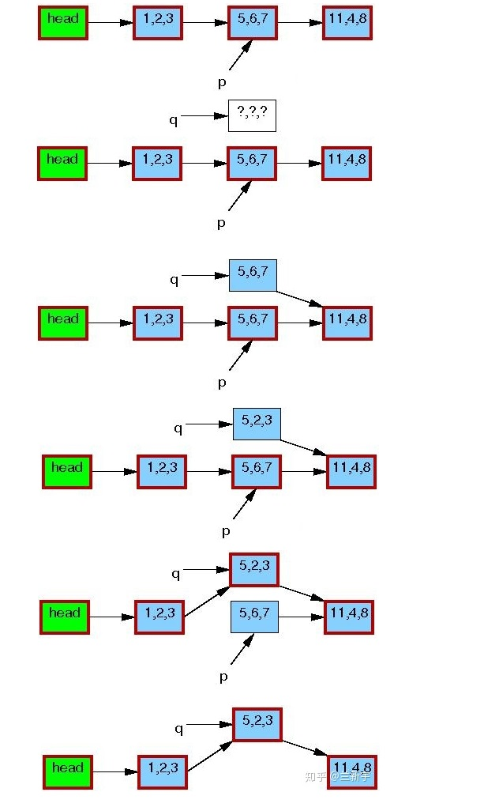

# Device Driver Model Introduction

看到最容易理解的关于 Device-Driver Model 的一句话是，乃至为什么要使用Device Driver Model？网上有人总结得很精辟：统一了编写设备驱动的格式，使驱动开发从论述题变为填空体，从而简化了设备驱动的开发.

# kobject , kset & ktype

​	

# Device Driver Bus Class

ref:

​	[Linux Device Driver Model](<https://freemandealer.github.io/2016/09/01/device-driver-linux-device-driver/>)

# 4. [Linux RCU](<https://zhuanlan.zhihu.com/p/89439043>)

RCU (Read Copy Update) , 设置了一个临界区域，在 read 的同时，可以进行 copy 操作, 或者说read和进行copy的线程并行,目的是为了update。

省去了同步机制, 提高了效率。

