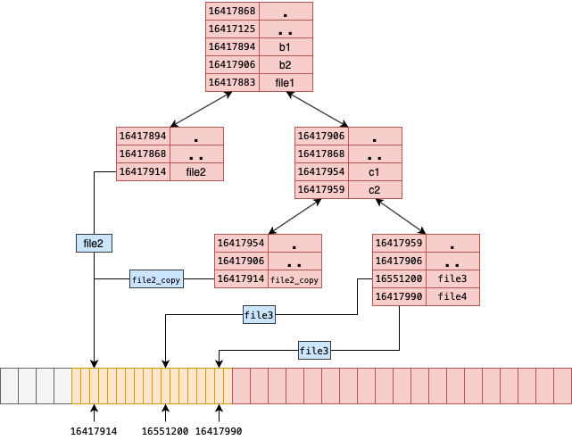
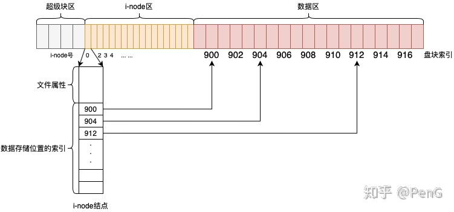

# 1. Introduction

[File System](https://zhuanlan.zhihu.com/p/291300196) is used to control how data is stored and retrieved , consists of the following three parts: file system API, logical part (data + information about data management structure), and the physical storage of data.

A FS provides a generalized structure over persistent storage, allowing the low-level structure of the devices (e.g., disk, tape, flash memory storage) to be abstracted away. Generally speaking, the goal of a filesystem is allow logical groups of data to be organized into *files*, which can be manipulated as a unit. In order to do this, the filesystem must provide some sort of index of the locations of files in the actual secondary storage. The fundamental operations of any filesystem are:

- Tracking the available storage space

- Tracking which block or blocks of data belong to which files

- Creating new files

- Reading data from existing files into memory

- Updating the data in the files

- Deleting existing files

  

# 2. File System Theory

**Metadata  is data about data.**  For example a file named  'A.txt' , so  'A.txt'  is data , and the owner  , write/read rules  ,  stored path all called metadata.

## 2.1  Physical Storage of data

Whatever NAND or SSD  , all the file system stored on physical  storage are  serial structure , such like memory address.

## 2.2 File System Structure

- 超级块superblock

超级块记录了关于文件系统本身的关键信息（metadata of metadata），包括文件系统的类型，大小，状态以及inode的结构（metadata）。由于超级块非常的重要，因此在文件系统中超级块存在着一定的冗余。

- i-节点区i-node

i代表index，i-node也叫索引节点。一个i-node存储一个文件的元数据，i-node实际上存储了关于所有权（用户、组），访问权限（可读可写可执行），数据的存储位置等等元数据，所以i-node就是一个文件的化身，一个文件对应一个i-node。

值得注意的是：i-node中并不存储文件名这一信息，关于这一点原因将在后面解释。

还有很重要的一点是所有的i-node组成一个线性结构，并且通过下标来标识，下标也叫做i-node号，这个和磁盘盘块号不一样，inode是建立在盘块上的。

- 数据区data

最后一个部分是数据区，文件的内容（数据）就保存在这个区域。一个磁盘上的块大小是固定的，如果一个文件的大小大于一个磁盘块的话，数据会分布在多个磁盘块之中，文件系统（i-node）负责追踪这些数据块。

​	

## 2.3  i-node

**i-node**  stores metadata for every file on your system in a table like structure usually located near the beginning of a partition. They store all the information except the file name and the data. 

**i-node** numbers are unique at the partition level. Every partition as its own **i-node** table. When a new file is created, it is assigned an **i-node** number and a file name. The **i-node** number is a unique number within that file system. Both name and **i-node** number are stored as entry in a directory. If you run out of **i-node**, you cannot create new files even if you have space left on the given partition.

( Note : Linux和Unix将文件的数据和元数据分开存放，具体来讲inode存储元数据，数据区存储数据。在 i-node 中不必存储真正的数据，但是需要存储数据被放在了数据区的哪个位置。inode保存着文件在数据区的盘块列表，这也是索引结点名称 i-node 的由来。)

# 3. jff2 FS

