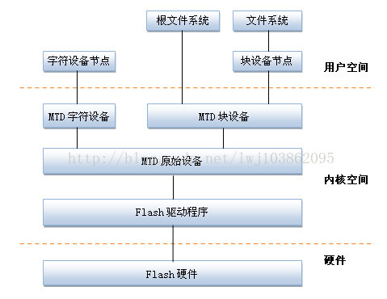
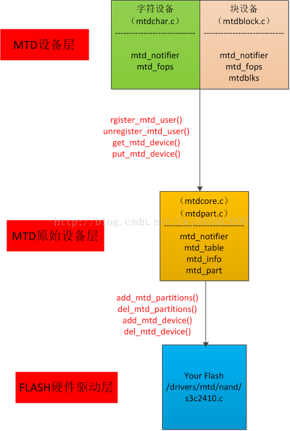

# NAND Flash Basic


*Note: What follows is a high-level description of the generic behaviour of flash. There are thousands of different NAND chips available, each potentially with slightly different instruction sets, block/page sizes, performance characteristics etc.*

- The **package** is the memory chip, i.e. the black rectangle with little electrical connectors sticking out of it. If you look at an SSD, a flash card or the internals of a flash array you will see many flash packages, each of which is produced by one of the big flash manufacturers: Toshiba, Samsung, Micron, Intel, SanDisk, SK Hynix. These are the only companies with the multi-billion dollar fabrication plants necessary to make NAND flash.
- Each package contains one or more **dies** (for example one, two, or four). The die is the smallest unit that can independently execute commands or report status.
- Each die contains one or more **planes** (usually one or two). Identical, concurrent operations can take place on each plane, although with some restrictions.
- Each plane contains a number of **blocks**, which are the smallest unit that can be erased. Remember that, it’s really important.
- Each block contains a number of **pages**, which are the smallest unit that can be programmed (i.e. written to).

The important bit here is that program operations (i.e. writes) take place to a page, which might typically be 8-16KB in size, while erase operations take place to a block, which might be 4-8MB in size. Since a block needs to be erased before it can be programmed again (*sort of, I’m generalising to make this easier), all of the pages in a block need to be candidates for erasure before this can happen.

#  MTD Overview

MTD subsystem (stands for Memory Technology Devices) provides an abstraction layer for raw flash devices. It makes it possible to use the same API when working with different flash types and technologies, e.g. NAND, OneNAND, NOR, AG-AND, ECC'd NOR, etc.

**(Note: **

- **[MTD is neither a block nor a char device.]((<http://linux-mtd.infradead.org/faq/general.html#L_mtd_what>) )  **

- **Ext2 ,ext3 and FAT are file systems work with block device not for MTD devices, MTD device work with jffs2 , yaffs2 or squashFS . **

- **the /dev/mtdblockX device nodes  are simple Flash Translation Layers (FTLs) over the MTD devices.) **

- **MTD subsystem does not deal with block devices like MMC, eMMC, SD, CompactFlash, etc**

  




# MTD structure




MTD files structure based on Linux5.4, 

```shell
linux-5.4.194/
├── drivers/mtd/chips
│	(CFI/jedec接口通用驱动 )
├── drivers/mtd/nand : 
│	( nand通用驱动和部分底层驱动程序)
├── drivers/mtd/maps 
│	( nor flash映射关系相关函数)
└── drivers/mtd/devices
    ( nor flash底层驱动)
```

*drivers/mtd/mtdpart.c*

```c
/**
 * struct mtd_part - our partition node structure
 *
 * @mtd: struct holding partition details
 * @parent: parent mtd - flash device or another partition
 * @offset: partition offset relative to the *flash device*
 */
struct mtd_part {
	struct mtd_info mtd;
	struct mtd_info *parent;
	uint64_t offset;
	struct list_head list;
};
```

*include/mtd.h*

```c

struct mtd_info {
	u_char type;
	uint32_t flags;
	uint32_t orig_flags; /* Flags as before running mtd checks */
	uint64_t size;	 // Total size of the MTD

	/* "Major" erase size for the device. Naïve users may take this
	 * to be the only erase size available, or may use the more detailed
	 * information below if they desire
	 */
	uint32_t erasesize;
	/* Minimal writable flash unit size. In case of NOR flash it is 1 (even
	 * though individual bits can be cleared), in case of NAND flash it is
	 * one NAND page (or half, or one-fourths of it), in case of ECC-ed NOR
	 * it is of ECC block size, etc. It is illegal to have writesize = 0.
	 * Any driver registering a struct mtd_info must ensure a writesize of
	 * 1 or larger.
	 */
	uint32_t writesize;

	/*
	 * Size of the write buffer used by the MTD. MTD devices having a write
	 * buffer can write multiple writesize chunks at a time. E.g. while
	 * writing 4 * writesize bytes to a device with 2 * writesize bytes
	 * buffer the MTD driver can (but doesn't have to) do 2 writesize
	 * operations, but not 4. Currently, all NANDs have writebufsize
	 * equivalent to writesize (NAND page size). Some NOR flashes do have
	 * writebufsize greater than writesize.
	 */
	uint32_t writebufsize;

	uint32_t oobsize;   // Amount of OOB data per block (e.g. 16)
	uint32_t oobavail;  // Available OOB bytes per block

	/*
	 * If erasesize is a power of 2 then the shift is stored in
	 * erasesize_shift otherwise erasesize_shift is zero. Ditto writesize.
	 */
	unsigned int erasesize_shift;
	unsigned int writesize_shift;
	/* Masks based on erasesize_shift and writesize_shift */
	unsigned int erasesize_mask;
	unsigned int writesize_mask;

	/*
	 * read ops return -EUCLEAN if max number of bitflips corrected on any
	 * one region comprising an ecc step equals or exceeds this value.
	 * Settable by driver, else defaults to ecc_strength.  User can override
	 * in sysfs.  N.B. The meaning of the -EUCLEAN return code has changed;
	 * see Documentation/ABI/testing/sysfs-class-mtd for more detail.
	 */
	unsigned int bitflip_threshold;

	/* Kernel-only stuff starts here. */
	const char *name;
	int index;

	/* OOB layout description */
	const struct mtd_ooblayout_ops *ooblayout;

	/* NAND pairing scheme, only provided for MLC/TLC NANDs */
	const struct mtd_pairing_scheme *pairing;

	/* the ecc step size. */
	unsigned int ecc_step_size;

	/* max number of correctible bit errors per ecc step */
	unsigned int ecc_strength;

	/* Data for variable erase regions. If numeraseregions is zero,
	 * it means that the whole device has erasesize as given above.
	 */
	int numeraseregions;
	struct mtd_erase_region_info *eraseregions;

	/*
	 * Do not call via these pointers, use corresponding mtd_*()
	 * wrappers instead.
	 */
	int (*_erase) (struct mtd_info *mtd, struct erase_info *instr);
	int (*_point) (struct mtd_info *mtd, loff_t from, size_t len,
		       size_t *retlen, void **virt, resource_size_t *phys);
	int (*_unpoint) (struct mtd_info *mtd, loff_t from, size_t len);
	int (*_read) (struct mtd_info *mtd, loff_t from, size_t len,
		      size_t *retlen, u_char *buf);
	int (*_write) (struct mtd_info *mtd, loff_t to, size_t len,
		       size_t *retlen, const u_char *buf);
	int (*_panic_write) (struct mtd_info *mtd, loff_t to, size_t len,
			     size_t *retlen, const u_char *buf);
	int (*_read_oob) (struct mtd_info *mtd, loff_t from,
			  struct mtd_oob_ops *ops);
	int (*_write_oob) (struct mtd_info *mtd, loff_t to,
			   struct mtd_oob_ops *ops);
	int (*_get_fact_prot_info) (struct mtd_info *mtd, size_t len,
				    size_t *retlen, struct otp_info *buf);
	int (*_read_fact_prot_reg) (struct mtd_info *mtd, loff_t from,
				    size_t len, size_t *retlen, u_char *buf);
	int (*_get_user_prot_info) (struct mtd_info *mtd, size_t len,
				    size_t *retlen, struct otp_info *buf);
	int (*_read_user_prot_reg) (struct mtd_info *mtd, loff_t from,
				    size_t len, size_t *retlen, u_char *buf);
	int (*_write_user_prot_reg) (struct mtd_info *mtd, loff_t to,
				     size_t len, size_t *retlen, u_char *buf);
	int (*_lock_user_prot_reg) (struct mtd_info *mtd, loff_t from,
				    size_t len);
	int (*_writev) (struct mtd_info *mtd, const struct kvec *vecs,
			unsigned long count, loff_t to, size_t *retlen);
	void (*_sync) (struct mtd_info *mtd);
	int (*_lock) (struct mtd_info *mtd, loff_t ofs, uint64_t len);
	int (*_unlock) (struct mtd_info *mtd, loff_t ofs, uint64_t len);
	int (*_is_locked) (struct mtd_info *mtd, loff_t ofs, uint64_t len);
	int (*_block_isreserved) (struct mtd_info *mtd, loff_t ofs);
	int (*_block_isbad) (struct mtd_info *mtd, loff_t ofs);
	int (*_block_markbad) (struct mtd_info *mtd, loff_t ofs);
	int (*_max_bad_blocks) (struct mtd_info *mtd, loff_t ofs, size_t len);
	int (*_suspend) (struct mtd_info *mtd);
	void (*_resume) (struct mtd_info *mtd);
	void (*_reboot) (struct mtd_info *mtd);
	/*
	 * If the driver is something smart, like UBI, it may need to maintain
	 * its own reference counting. The below functions are only for driver.
	 */
	int (*_get_device) (struct mtd_info *mtd);
	void (*_put_device) (struct mtd_info *mtd);

	/*
	 * flag indicates a panic write, low level drivers can take appropriate
	 * action if required to ensure writes go through
	 */
	bool oops_panic_write;

	struct notifier_block reboot_notifier;  /* default mode before reboot */

	/* ECC status information */
	struct mtd_ecc_stats ecc_stats;
	/* Subpage shift (NAND) */
	int subpage_sft;

	void *priv;

	struct module *owner;
	struct device dev;
	int usecount;
	struct mtd_debug_info dbg;
	struct nvmem_device *nvmem;
};
```

