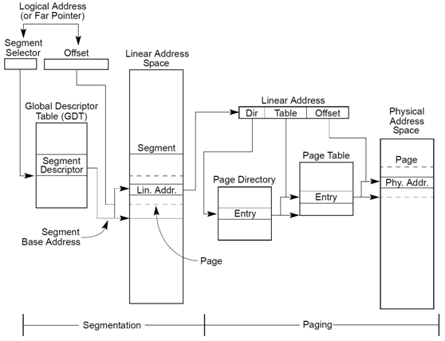
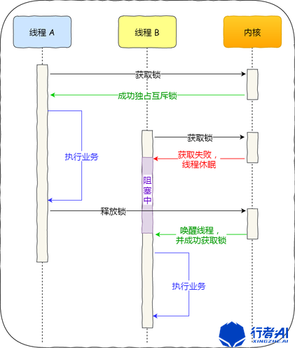
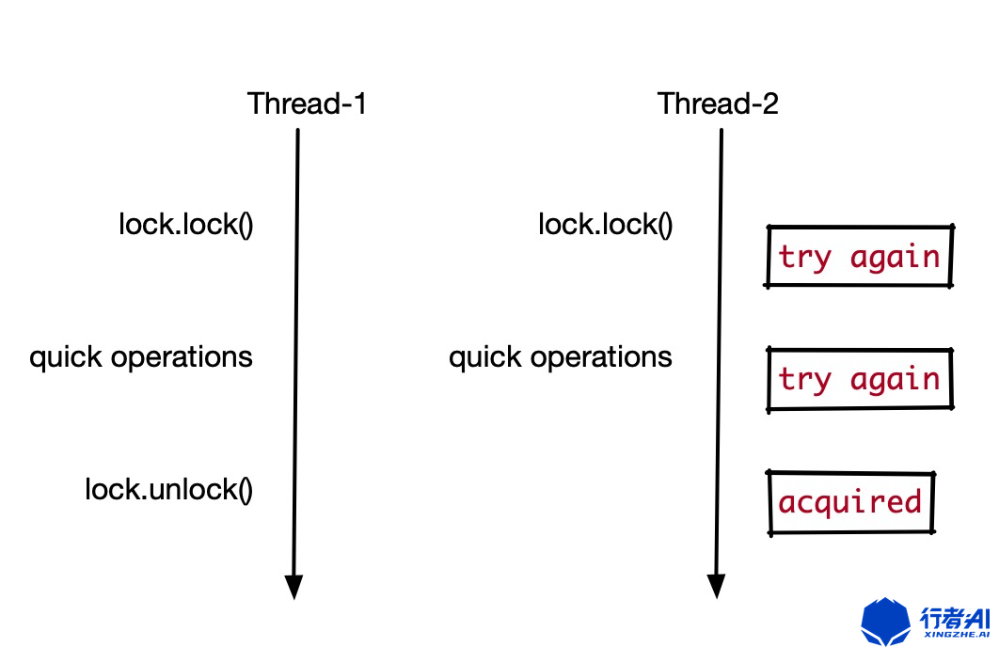

# Linux Memory

- logical address      (逻辑地址)

- virtual address      (虚拟地址)

- linear address       (线性地址)

- physical address   (物理地址)





*Logical Address*

逻辑地址，是由一个段选择符加上一个指定段内相对地址的偏移量(**Offset**)组成的，表示为 [段选择符：段内偏移量]，例如：[CS：EIP]

*Virtual Address*

虚拟地址，其实就是如上逻辑地址的**段内偏移Offset**。所以：

逻辑地址可以表示为 [段标识符：**虚拟地址**], 驱动代码或者应用程序中所用的地址就是**虚拟地址**，比如以下程序中指针p的输出：

```c
#include <stdio.h>
#include <stdlib.h>void main(void){	int *p;
	p = (int*)malloc(sizeof(int));
	printf("addres is %p\n", p);
	free(p);	return;
}
```

*Linear Address*

线性地址是平坦的统一地址空间。intel x86 中，线性地址是由逻辑地址经过段页式转换得到的。

*Physical Address*

物理地址就是物理内存的地址。但是注意在做页表转换的时候，这里存的可不是真正的物理地址，而是物理内存块的编号。

内核把物理内存按照4K大小编号，考虑k到物理内存的起始地址是固定的，所以从内存编号的序号就可以算出该编号对应的物理内存块的起始地址了。例如：

物理内存起始地址为0x50000000, 那么编号为0的物理块的起始地址为：0x50000000

编号为1的物理块的起始地址为 0x50001000 以此类推。

所以，根据物理内存块的编号，就可以转换得到该物理内存块的起始地址，也叫做物理内存的基地址。了解这一点非常重要，因为后续做页表映射的时候会用到。


# Memory Lock

- mutex lock
- spin lock








# Linux Memory Managemant

[url](<https://www.toutiao.com/i6855591224003265036>)

