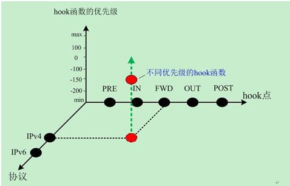
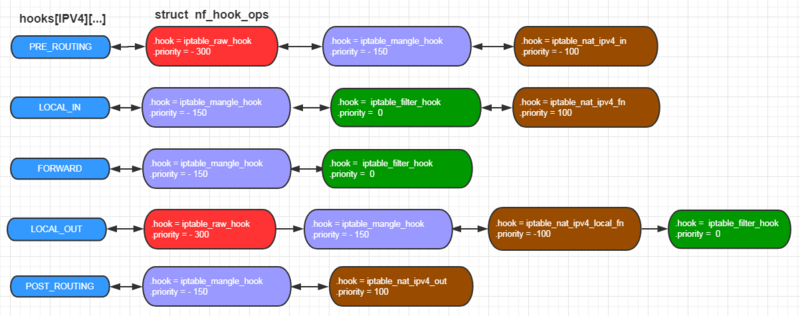
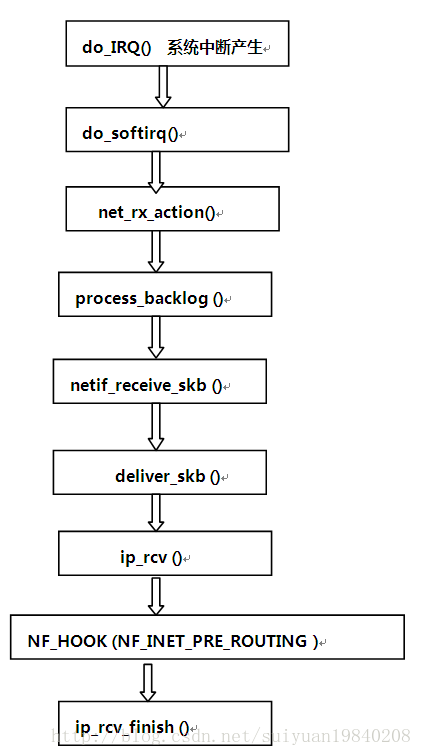
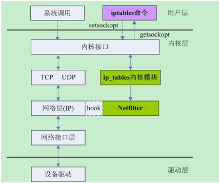

## Linux Netfilter

### Netfilter Hook

[Netfilter](<https://netfilter.org/documentation/HOWTO//netfilter-hacking-HOWTO-3.html>) is framework of kernel module for the linux , to provide  merely a series of hooks in various points in a protocol stack ( include  *IPv4*, *IPv6* , *ARP*, and *DECnet*), to support such as *[iptables](<http://www.zsythink.net/archives/1199>)*, The general and idealized *IPv4* traversal diagram looks like the following:

```text
A Packet Traversing the Netfilter System:

   --->PRE [1]------>[ROUTE]--->FWD [3] ----->POST [4]------>
       Conntrack    |       Mangle   ^    Mangle
       Mangle       |       Filter   |    NAT (Src)
       NAT (Dst)    |                |    Conntrack
       (QDisc)      |             [ROUTE]
                    v                |
					[2]				 [5]
                    IN Filter       OUT Conntrack
                    |  Conntrack     ^  Mangle
                    |  Mangle        |  NAT (Dst)
                    v                |  Filter		
           |--------------------------------|
           |		Protocol Stack 			|           
           |--------------------------------|
                    
                    
                 
[1]: NF_IP_PRE_ROUTING:  having passed the simple sanity checks.
[2]: NF_IP_LOCAL_IN:  destined for the box itself, the netfilter called _IP_LOCAL_IN 
	 				 hook, before being passed to the process.
[3]: NF_IP_FORWARD:	 destined to pass to another interface instead, the netfilter 						 called the NF_IP_FORWARD hook.
[4]: NF_IP_POST_ROUTING:  packet then passes a final netfilter NF_IP_POST_ROUTING hook.
[5]: NF_IP_LOCAL_OUT: The NF_IP_LOCAL_OUT hook is called for packets that are created locally
```


Kernel modules can register to listen at any of these hooks. A module that registers a function must specify the priority of the function within the hook; then when that netfilter hook is called from the core networking code, each module registered at that point is called in the order of priorites, and is free to manipulate the packet. The module can then tell netfilter to do one of five things:

1. F_ACCEPT: continue traversal as normal.
2. NF_DROP: drop the packet; don't continue traversal.
3. NF_STOLEN: I've taken over the packet; don't continue traversal.
4. NF_QUEUE: queue the packet (usually for userspace handling).
5. NF_REPEAT: call this hook again.




### Netfileter Table & Chain

 A packet selection system called *IP Tables* has been built over the net-filter framework. It is a direct descendent of **ipchains** ( which where from *kernel 2.2* , and replaced by **iptables** since *kernel 2.4* ,that came from **ipfwadm**, that came from BSD's **ipfw** IIRC), with extensibility. 

The **[iptables](<https://blog.csdn.net/longbei9029/article/details/53056744>)** has the following 4 built-in tables. **Filter, NAT, Mangle, Raw**  ,for the chain in other word the **chain = hook** 




### NAT , Mangle

command description for **iptables** rules, and based on hi_5662:

```shell
root@OpenWrt:~# iptables -t mangle -A PREROUTING  -p tcp  -m DOMAIN --name "www.toutiao.com" --match-dir 1 --j TRAFFIC --index 257 --mode 1
	-t			:if no -t option is default for 'filter'
	-A			:Append one or more rules to the end of the selected chain.
	-p 			:The  protocol of the rule or of the packet to check.
	-m 			:Specifies  a  match  to  use, that is, an extension module that tests 	                for a specific property. " -m matchname "	
	--match-dir	:DIR    IP address of Domain in direction(1 for up, 2 for down, 3 for both(default)
	--match-type :TYPE   Match type, 1 for ip address in NO DNS Pkt , 2 domain name in DNS pkt, 3 for both(default)
	--match-mode :MODE   Match mode, 0 for full match(default), 1 for sub match
	--name 		 :NAME   Match a domain name in dns reply pkt\n
	--j			 :This specifies the target of the rule;

TAFFIC target options:
	--index		 :The index of rule ,this will return to APP
	--mode		 :MODE 0: http process 1: mirror process
	
MARK target options:	
	--set-mark   :Set nfmark value\n"
  	--and-mark   :Binary AND the nfmark with value\n"
	--or-mark    :Binary OR  the nfmark with value\n"
	
	
root@OpenWrt:~# iptables -t mangle -A PREROUTING  -p tcp  -m DOMAIN --name "www.toutiao.com" --match-dir 1 --j MARK --or-mark 0x80000000
root@OpenWrt:~# iptables -t mangle -A POSTROUTING -p tcp   -m DOMAIN --name "www.toutiao.com" --match-dir 2 --j MARK --or-mark 0x80000000
```


### self defined chain

### Linux Netfilter Defination

```c
struct nf_hook_ops
{
    	/* list成员用于维护Netfilter hook的列表。*/
        struct list_head list;		//链表成员
        /* User fills in from here down. */
        nf_hookfn *hook;			//钩子函数指针
        struct module *owner;
        int pf;						//协议簇，对于ipv4而言，是PF_INET
    	/* hooknum这个成员用于指定安装的这个函数对应的具体的hook类型 */
        int hooknum;				//hook类型
        /* Hooks are ordered in ascending priority. */
        int priority;				//优先级
};
...
int nf_register_hook(struct nf_hook_ops *reg)
{
      struct list_head *i;
      spin_lock_bh(&nf_hook_lock);
      list_for_each(i, &nf_hooks[reg->pf][reg->hooknum]) {
           if (reg->priority < ((struct nf_hook_ops *)i)->priority)
                 break;
      }
      list_add_rcu(&reg->list, i->prev);
      spin_unlock_bh(&nf_hook_lock);
    
      synchronize_net();
      return 0;
}
```

register hook.

```c
static struct nf_hook_ops auth_ops =
{
    .list = {NULL,NULL},
    .hook = wlan_share_option82_func,
    .pf = PF_BRIDGE,
    .hooknum = NF_BR_PRE_ROUTING,
    .priority = NF_BR_PRI_FIRST
};
static int __init wlan_share_init(void){
    nf_register_hook(&auth_ops);
    return 0;
}

/* this function will add infomation ont the option 182*/
static unsigned int wlan_share_option82_func(
    unsigned int hooknum,
    struct sk_buff *skb,
    const struct net_device *in,
    const struct net_device *out, 
    int (*okfn)(struct sk_buff *) ){
    struct iphdr *iph = NULL;
    struct ipv6hdr *ip6h = NULL;
    struct udphdr *udph = NULL;
    struct dhcp_packet *packet = NULL;
//  hi_eth_cb_s_ntc *p_hi_cb_tmp = NULL;
	unsigned char opt82field[256];
	
    if(!skb)
        return NF_ACCEPT;
    
    if(!g_wlan_share_uid_en)
        return NF_ACCEPT;
	
	iph = ip_hdr(skb);

//	p_hi_cb_tmp = skb->hi_cb;
	//printk("dev name: %s, uc_port: %#x\n", skb->dev->name, p_hi_cb_tmp->uc_port);
	if(strcmp(g_wlan_share_siddev, skb->dev->name))
		return NF_ACCEPT;

    if((skb->protocol == htons(ETH_P_8021Q) || (skb->protocol == htons(ETH_P_IP)) ||(skb->protocol == htons(ETH_P_IPV6))) 
        && (skb->len >= sizeof(struct ethhdr)))
    {
        if(skb->protocol == htons(ETH_P_8021Q))
        {
            iph=(struct iphdr *)((u8*)iph+4);
        }

        if (iph->version == 4) {
            if ((skb->len < 20)  
                ||((iph->ihl * 4) > skb->len) 
                || (skb->len < ntohs(iph->tot_len))
                || ((iph->frag_off & htons(0x1FFF)) != 0)){
                return NF_ACCEPT;
            }
            if(iph->protocol == IPPROTO_UDP) {
                udph = (struct udphdr *)((unsigned char *)iph+iph->ihl*4);
            }
        } else if (iph->version == 6) {
            ip6h = (struct ipv6hdr *)iph;
            if ((skb->len < sizeof(struct ipv6hdr)) 
                || (skb->len < sizeof(struct ipv6hdr) + ntohs(ip6h->payload_len))){
                return NF_ACCEPT;
            }
            if (HI_FALSE == __wlan_get_ipv6_udp_hdr(ip6h, &udph)){
                return NF_ACCEPT;
            }
        } else {
            return NF_ACCEPT;        
        }
        		
        if(udph) {
            if(ntohs(udph->dest) == SERVER_PORT) { //DHCP 
            	packet = (unsigned char *)udph + sizeof(struct udphdr);
                //printk("cookie: %#x\n", ntohl(packet->cookie));
		        opt82field[OPT_CODE] = 82;
		        opt82field[OPT_LEN]  = 0;
		        OPT82_AddSubOpt(opt82field, 2/*RemoteID*/, g_wlan_share_userid, g_wlan_share_userid_len);
		        add_option_string(packet->options, opt82field, skb);
		    }
        }
    }
    return NF_ACCEPT;
}
```



([Note](<https://blog.csdn.net/wuruixn/article/details/7957368>) : 数据在协议栈里的发送过程中，从上至下依次是“加头”的过程，每到达一层数据就被会加上该层的头部；与此同时，接受数据方就是个“剥头”的过程，从网卡收上包来之后，在往协议栈的上层传递过程中依次剥去每层的头部，最终到达用户那儿的就是裸数据了。)




 

