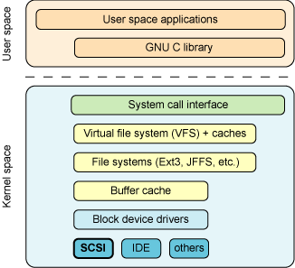

**SCSI (Small Computer System Interface  Linux)**  is a standard for parallel interfaces , and is one of the most commonly used interface for disk drives that was first completed in 1982.  SCSI include SCSI-1 , SCSI-2 , SCSI-3 standard , supports up to seven peripheral devices, such as hard drive , CD-ROM , and scanner , SCSI even early more than Linux.

[SCSI](<https://www.ibm.com/developerworks/cn/linux/l-scsi-subsystem/>) arch for linux :

[USB for Linux](<http://tech.it168.com/a2010/0510/884/000000884174_all.shtml>)

