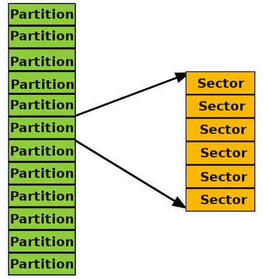
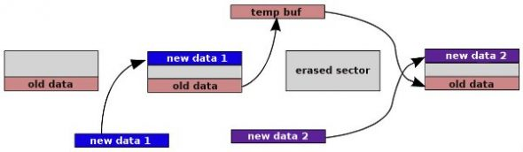

# Working with MTD Devices

This article shows how kernel and application developers (in C) can make use of MTD in Linux.

MTD  (Memory Technology Devices) are NAND/NOR-based flash memory chips used  for storing non-volatile data like boot images and configurations.  Readers are cautioned not to get confused with USB sticks, SD cards,  etc., which are also called flash devices, but are not MTD devices. The  latter are generally found on development boards, used to store boot  loaders, an OS, etc.

Even  though MTD devices are for data storage, they differ from hard disks  and RAM in several aspects. The biggest difference is that while hard  disk sectors are rewritable, MTD device sectors must be erased before  rewriting — which is why they are more commonly called erase-blocks.  Second, hard disk sectors can be rewritten several times without wearing  out the hardware, but MTD device sectors have a limited life and are  not usable after about 10^3-10^5 erase operations. The worn out  erase-blocks are called bad blocks and the software must take care not  to use such blocks.

Like  hard disks, MTD devices can be partitioned and can therefore act as  independent devices. On a system with one or more MTD devices, device  and partition information can be obtained from the `/proc/mtd` file. A typical `/proc/mtd` file is as follows:

```shell
cat /proc/mtd 
dev:  size    erasesize name 
mtd0: 000a0000 00020000 "misc" 
mtd1: 00420000 00020000 "recovery" 
mtd2: 002c0000 00020000 "boot" 
mtd3: 0fa00000 00020000 "system" 
mtd4: 02800000 00020000 "cache" 
mtd5: 0af20000 00020000 "userdata"
```

A  partitioned MTD device can be depicted as in Figure 1, which shows the  relation between an MTD device, a partition and a sector.



Figure 1: An MTD device

As  already said, MTD write operations are different from usual storage  devices. Therefore, before we move further, let’s understand how write  operations take place on MTD devices. Figure 2 shows a typical write  case.



Figure 2: An MTD write operation

The  left-most part shows a sector that has some data at the end. The rest  of the sector has not been written since the last erase. A user wants to  write “new data 1″ to this sector at offset 0. Since this part of the  sector has already been erased, it is ready to be written and so “new  data 1″ can be directly written to the sector. Later, the user may want  to write “new data 2″, again at offset 0. To do this, the sector must be  erased. Since the sector needs to be erased in entirety, the “old data”  must be backed up in a temporary buffer. After erasing the complete  sector, the “new data 2″ and “old data” must be written at appropriate  offsets.

This  procedure is the reason there are specific file systems for MTD  devices, like JFFS2 and YAFFFS, and flash translation layers (FTL) like  NFTL, INFTL, etc. These FTLs and file systems take special care of MTD  device properties to hide complexity from the user.

In  the first section that follows, we will look at how to access,  read/write and erase MTD devices from Linux applications. The second  section describes the same things in kernel space, so that this article  can be useful to both application as well as kernel developers.

## Accessing MTDs from applications

The user must know the device partition to work upon, which can be found from `/proc/mtd` as shown earlier. Assuming users want to work on the “userdata” partition, they must use the`/dev/mtd5` device.

The first thing to do is to get information about the MTD device. Use the `MEMGETINFO ioctl`command, as follows:

```c
#include <stdio.h>
#include <fcntl.h>
#include <sys/ioctl.h>
#include <mtd/mtd-user.h>
 
int main()
{
    mtd_info_t mtd_info;
    int fd = open("/dev/mtd5", O_RDWR);
ioctl(fd, MEMGETINFO, &mtd_info);
 
    printf("MTD type: %u\n", mtd_info.type);
    printf("MTD total size : %u bytes\n", mtd_info.size);
    printf("MTD erase size : %u bytes\n", mtd_info.erasesize);
 
    return 0;
}
```
Error handling has been omitted for brevity. The `mtd_info_t` structure is used with the`MEMGETINFO` command. The MTD type can be `MTD_ABSENT`, `MTD_RAM`, `MTD_ROM`, `MTD_NAND`, `MTD_NOR`, etc., which are defined in the `mtd/mtd-abi.h` header file. The `mtd_info.size` indicates the size of the whole device (i.e., the partition, in this case). Finally, `mtd_info.erasesize` indicates the sector size. During an erase operation, this is the minimum size that can be erased, as we’ll see later.

Reading MTD devices is similar to ordinary devices:

```c
/* read something from last sector */
unsigned char buf[64];
lseek(fd, -mtd_info.erasesize, SEEK_END);
read(fd, buf, sizeof(buf));
```

A  write operation can be performed in the same way, provided the sector  has been erased previously. Finally, we come to the erase operation.  Here is an example of erasing a partition, sector by sector:

```c
void erase_partition(mtd_info_t *mtd_info, int fd) {
    erase_info_t ei;
    ei.length = mtd_info->erasesize;
  
    for(ei.start = 0; ei.start < mtd_info->size; ei.start += mtd_info->erasesize) {
        ioctl(fd, MEMUNLOCK, &ei);
        ioctl(fd, MEMERASE, &ei);
    }
}
```
All sectors of the device are writeable after this erase operation. Notice the use of `MEMUNLOCK`before `MEMERASE`, which is essential to allow the erase operation.

## Accessing MTDs from kernel space

This  section will repeat the functions explained in the previous section,  but in kernel space. This needs a separate section since the erase  operation is more complex here  –  the erase operation may sleep and  therefore the kernel programmer has to wait until the operation is  completed. This is the case for applications too, but the sleep is  transparently taken care of by the scheduler.

As explained earlier, the first MTD information is the `mtd_info` structure. This is retrieved by iterating through all registered MTD devices:

```c
#include <linux/kernel.h>
#include <linux/mtd/mtd.h>
#include <linux/err.h>
 
static struct mtd_info *mtd_info = NULL;
  
int init_module(void) {
    int num;
    for(num = 0; num < 64; num++) {
        mtd_info = get_mtd_device(NULL, num);
        if(IS_ERR(mtd_info)) {
            printk("No device for num %d\n", num);
            continue;
        }
        if(mtd_info->type == MTD_ABSENT) {
            put_mtd_device(mtd_info);
            continue;
        }
        if(strcmp(mtd_info->name, "userdata")) {
            put_mtd_device(mtd_info);
            continue;
        }
        printk("MTD type: %u\n", mtd_info->type);
        printk("MTD total size : %u bytes\n", mtd_info->size);
        printk("MTD erase size : %u bytes\n", mtd_info->erasesize);
        return 0;
    }
    mtd_info = NULL;
    return 0;
}
  
void cleanup_module(void)
 
{
 
if(mtd_info)
        put_mtd_device(mtd_info);
}
```

The above kernel module searches for the “userdata” partition. The function `get_mtd_device()`, when invoked with the first argument `NULL`,  returns the MTD device associated with the minor number specified in  the second argument. On a successful search, it increments the reference  count of the device. That’s why, before exiting, a call to `put_mtd_device()` must be made to release (decrement) the reference count.

Additionally, the module uses the `flag MTD_ABSENT` (which  is available to applications too). This check is required to function  correctly with some probing device drivers used to allocate placeholder  MTD devices on systems that have socketed or removable media.

Having retrieved the `mtd_info` structure, reading is relatively simple:

```c
/* read something from last sector */
u_char buf[64];
 
mtd_info->read(mtd_info, mtd_info.size-mtd_info.erasesize, sizeof(buf), buf);
```
The  second argument of the read function specifies the read offset, and the  third the length to read. Note that the read operation too may sleep  and, therefore, it must not be performed in an interrupt context. The  write operation can be performed as follows (assuming the sector has  been previously erased):

```c
/* write something to last sector */
mtd_info->write(mtd_info, mtd_info.size-mtd_info.erasesize, sizeof(buf), buf);
```

As  mentioned before, the read, write and erase operations may sleep.  Therefore, kernel code must wait for the operation to finish. Here is an  example of erasing the partition and waiting to finish the operation:

```c
#include <linux/sched.h>
 
void erase_partition(struct mtd_info *mtd_info) {
    unsigned int start;
    for(start = 0; start < mtd_info->size; start += mtd_info->erasesize) 
        erase_sector(mtd_info, start, mtd_info->erasesize);
}
  
void erase_sector(struct mtd_info *mtd_info, unsigned int start, unsigned int len) 
 
{
    int ret;
    struct erase_info ei = {0};
    wait_queue_head_t waitq;
    DECLARE_WAITQUEUE(wait, current);
     
    init_waitqueue_head(&waitq);
    ei.addr = start;
    ei.len = mtd_info->erasesize;
    ei.mtd = mtd_info;
    ei.callback = erase_callback;
    ei.priv = (unsigned long)&waitq;
    ret = mtd_info->erase(mtd_info, &ei);
    if(!ret)     {
        set_current_state(TASK_UNINTERRUPTIBLE);
        add_wait_queue(&waitq, &wait);
        if (ei.state != MTD_ERASE_DONE && ei.state != MTD_ERASE_FAILED)
            schedule();
        remove_wait_queue(&waitq, &wait);
        set_current_state(TASK_RUNNING);
  
        ret = (ei.state == MTD_ERASE_FAILED)?-EIO:0;
    }
}
  
void erase_callback (struct erase_info *instr) {
    wake_up((wait_queue_head_t *)instr->priv);
}
```

The `erase_partition()` function iterates over all sectors, and erases them with `erase_sector()`. At the core of `erase_sector()` is the `mtd_info->erase` call, which (as mentioned previously) may sleep. Therefore, `erase_sector()` prepares a wait queue and a wait queue head.

After a call to `mtd_info->erase`, the function prepares itself to relinquish the CPU (presuming that`mtd_info->erase` will sleep) by changing task state to `TASK_UNINTERRUPTIBLE` and adding itself to the wait queue head. Before relinquishing the CPU, it checks if erase is done, through the`ei.state` flag. If erase is done successfully, this flag will be set to `MTD_ERASE_DONE`.

If the erase operation is not complete, the task relinquishes the CPU by calling `schedule()`. Later, when the erase operation is complete, the driver calls the callback function provided in`ei.callback`. Here the task wakes up to itself, then removes itself from the wait queue, changes the task state to `TASK_RUNNING` and finally, the `erase_sector()` function returns.

MTD  devices have many more features that can be used by application  programmers. ECC (error correction codes) and OOB (out of band) data are  some of them. The MTD framework is integrated into the Linux kernel —  therefore it makes working with MTD devices very simple, as we have seen  in this article.