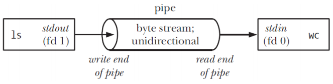

# Linux Process Introduction

IPC ( Inter-Process Communication) , the **Software Program** is image for machine code and data which is stored in disks and can be executed it is a passive static entity, but the **Process** is  program which executing under CPU, can  apply and own the system resource .  contain the program and info of current  activity it is a dynamic entity. 

The ways for Linux IPCs  such like **Signal** , **Pipe /FIFO** , **Message queue** , **Semaphore**, **Share Memory** ect. more detail check the [following url](https://beej.us/guide/bgipc/).


## Signal

**Signals** are a limited form of [inter-process communication](https://en.wikipedia.org/wiki/Inter-process_communication) (IPC), typically used in [Unix](https://en.wikipedia.org/wiki/Unix), [Unix-like](https://en.wikipedia.org/wiki/Unix-like), and other [POSIX](https://en.wikipedia.org/wiki/POSIX)-compliant operating systems. A signal is an [asynchronous](https://en.wiktionary.org/wiki/asynchronous) notification sent to a [process](https://en.wikipedia.org/wiki/Process_(computing)) or to a specific [thread](https://en.wikipedia.org/wiki/Thread_(computer_science)) within the same process in order to notify it of an event that occurred. 

When a signal is sent, the operating system interrupts the target process' normal [flow of execution](https://en.wikipedia.org/wiki/Control_flow) to deliver the signal. Execution can be interrupted during any [non-atomic instruction](https://en.wikipedia.org/wiki/Atomic_operation). If the process has previously registered a **signal handler**, that routine is executed. Otherwise, the default signal handler is executed. 

Embedded programs may find signals useful for inter-process  communications, as the computational and memory footprint for signals is  small. 

Signals are similar to [interrupts](https://en.wikipedia.org/wiki/Interrupt), the difference being that interrupts are mediated by the processor and handled by the [kernel](https://en.wikipedia.org/wiki/Kernel_(operating_system))  while signals are mediated by the kernel (possibly via system calls)  and handled by processes. The kernel may pass an interrupt as a signal  to the process that caused it (typical examples are [SIGSEGV](https://en.wikipedia.org/wiki/SIGSEGV), [SIGBUS](https://en.wikipedia.org/wiki/SIGBUS), [SIGILL](https://en.wikipedia.org/wiki/SIGILL) and [SIGFPE](https://en.wikipedia.org/wiki/SIGFPE)). 

Each signal has a current disposition, which determines how the  process behaves when it is delivered the signal.

( Note: 信号是Unix/Linux系统在一定条件下生成的事件。信号是一种异步通信机制，进程不需要执行任何操作来等待信号的到达。信号异步通知接收信号的进程发生了某个事件，然后操作系统将会中断接收到信号的进程的执行，转而去执行相应的信号处理程序。)

### Related APIs

```C
#include <signal.h> 
void (*signal (int, void (*)(int)))(int);

typedef void (*sighandler_t)(int);
/*如果signal()调用成功，返回最后一次为安装信号signum而调用signal()时的handler值；
失败则返回SIG_ERR。*/
sighandler_t signal(int signum, sighandler_t handler);
/* sigaction函数用于改变进程接收到特定信号后的行为。*/
int sigaction(int signum, const struct sigaction* act, struct sigaction* oldact);
int kill(pid_t pid, int sig);
int sigqueue(pid_t pid, int sig, const union sigval value);
```

### Sending Signals

```C
#include <signal.h>
#include <sys/types.h>
#include <unistd.h>
void new_op(int,siginfo_t*,void*);
int main(int argc,char**argv) {
    struct sigaction act;
    int sig;
    sig=atoi(argv[1]);
    sigemptyset(&act.sa_mask);
    act.sa_flags=SA_SIGINFO;
    act.sa_sigaction=new_op;
    
    if(sigaction(sig,&act,NULL) < 0) {
        printf("install sigal error\n");
    }   
    
    while(1) {
        sleep(2);
        printf("wait for the signal\n");
    }   
}   

void new_op(int signum,siginfo_t *info,void *myact) {
    printf("receive signal %d", signum);
    sleep(5);

}
```


Note:

| SIGABRT   | 6    | Terminate (core dump) | Process abort signal                              |
| --------- | ---- | --------------------- | ------------------------------------------------- |
| SIGALRM   | 14   | Terminate             | Alarm clock                                       |
| SIGBUS    | N/A  | Terminate (core dump) | Access to an undefined portion of a memory object |
| SIGCHLD   | N/A  | Ignore                | Child process terminated, stopped, or continued   |
| SIGCONT   | N/A  | Continue              | Continue executing, if stopped                    |
| SIGFPE    | N/A  | Terminate (core dump) | Erroneous arithmetic operation                    |
| SIGHUP    | 1    | Terminate             | Hangup                                            |
| SIGILL    | N/A  | Terminate (core dump) | Illegal instruction                               |
| SIGINT    | 2    | Terminate             | Terminal interrupt signal                         |
| SIGKILL   | 9    | Terminate             | Kill (cannot be caught or ignored)                |
| SIGPIPE   | N/A  | Terminate             | Write on a pipe with no one to read it            |
| SIGPOLL   | N/A  | Terminate             | Pollable event                                    |
| SIGPROF   | N/A  | Terminate             | Profiling timer expired                           |
| SIGQUIT   | 3    | Terminate (core dump) | Terminal quit signal                              |
| SIGSEGV   | N/A  | Terminate (core dump) | Invalid memory reference                          |
| SIGSTOP   | N/A  | Stop                  | Stop executing (cannot be caught or ignored)      |
| SIGSYS    | N/A  | Terminate (core dump) | Bad system call                                   |
| SIGTERM   | 15   | Terminate             | Termination signal                                |
| SIGTRAP   | 5    | Terminate (core dump) | Trace/breakpoint trap                             |
| SIGTSTP   | N/A  | Stop                  | Terminal stop signal                              |
| SIGTTIN   | N/A  | Stop                  | Background process attempting read                |
| SIGTTOU   | N/A  | Stop                  | Background process attempting write               |
| SIGUSR1   | N/A  | Terminate             | User-defined signal 1                             |
| SIGUSR2   | N/A  | Terminate             | User-defined signal 2                             |
| SIGURG    | N/A  | Ignore                | High bandwidth data is available at a socket      |
| SIGVTALRM | N/A  | Terminate             | Virtual timer expired                             |
| SIGXCPU   | N/A  | Terminate (core dump) | CPU time limit exceeded                           |
| SIGXFSZ   | N/A  | Terminate (core dump) | File size limit exceeded                          |
| SIGWINCH  | N/A  | Ignore                | Terminal window size changed                      |

### Handling Signals

​	


## Pipe

The **pipe** in Linux is identical in concept to the pipe in Unix, and is a core element of the Unix philosophy. The core idea that relates to pipes is you can pipeline simple Apps together and create a complex operation using pipes instead of needing large, complex applications.

(Note: 父进程和子进程之间，或者两个兄弟进程之间，可以通过系统调用建立起一个单向的通信管道。但是这种管道只能由父进程开建立，对于子进程来说是静态的，与生俱来的。管道两端的进程各自都将该管道视作一个文件。一个进程写，另一个进程读。并且，通过管道传递的内容遵循“先入先出”（FIFO）的原则。每个管道都是单向的，需要双向通信时就要建立两个管道。)

### 1. Pipe == byte stream buffer in kernel

- Sequential (can’t lseek())

- Multiple readers/writers difficult

### 2. Unidirectional

-  Write end + read end


``` shell
ls | wc -l
```


#####  Related basic APIs

```C
/*
filedes[0]: used only for read
filedes[1]: used only for write
*/
int filedes[1];
int pipe(int filedes[1]);
write(filedes[1], buf, count);
read(filedes[0], buf, count);
Close();
```

##### Sample:

```c
#include <unistd.h>
#include <sys/types.h>
#include <errno.h>
main() {
	int pipe_fd[2];
	pid_t pid;
	char r_buf[100];
	char w_buf[4];
	char* p_wbuf;
	int r_num;
	int cmd;
	
	memset(r_buf,0,sizeof(r_buf));
	memset(w_buf,0,sizeof(r_buf));
	p_wbuf=w_buf;
	if(pipe(pipe_fd)<0)
	{
		printf("pipe create error\n");
		return -1;
	}
	
	if((pid=fork())==0)
	{
	    printf("\n");
	   close(pipe_fd[1]);
                       sleep(3);//确保父进程关闭写端
	    r_num=read(pipe_fd[0],r_buf,100);
                       printf("read num is %d   the data read from the pipe is %d\n",r_num,atoi(r_buf));

                       close(pipe_fd[0]);
	    exit();
	}
	else if(pid>0)
	{
	close(pipe_fd[0]);//read
	strcpy(w_buf,"111");
	if(write(pipe_fd[1],w_buf,4)!=-1)
		printf("parent write over\n");
	close(pipe_fd[1]);//write
		printf("parent close fd[1] over\n");
	sleep(10);
	}	
}

```


## FIFO (named pipe)

-  pipes (anonymous) can only be used by related processes

-  FIFOs == pipe with name in file system

- Creation:

     	mkfifo(pathname, permissions)

-  Any process can open and use FIFO

-  I/O is same as for pipes


###  Related basic APIs

```C
open(pathname, O_WRONLY/O_RDONLY);
#Open write/read end
open();
# locks until other end is opened Opens are synchronized
open(pathname, O_RDONLY | O_NONBLOCK);
# can be useful
```

#### Sample

```c

```


## Message Queue

#### Related basic APIs
```c
# Queue management (analogous to files)
# open/create MQ, set attributes
# flags (analogous to open()):
# 	O_CREAT – create MQ if it doesn’t exist
#	O_EXCL – create MQ exclusively
#	O_RDONLY, O_WRONLY, O_RDWR – just like file open
#	O_NONBLOCK – non-blocking I/O
# mode sets permissions
# &attr: attributes for new MQ
#	NULL gives defaults
mqd = mq_open(name, flags [, mode, &attr]);
# close MQ
mq_close();
# remove MQ pathname
mq_unlink();

# I/O
# send message
mq_send();
# receive message
mq_receive();

# Other:
# set/get MQ attributes
mq_setattr(); / mq_getattr(); 
# request notification of msg arrival
mq_notify();


```

#### Sample:

```c

```


Socket


Semaphore


Shared Memory