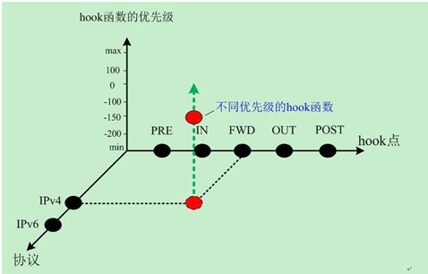
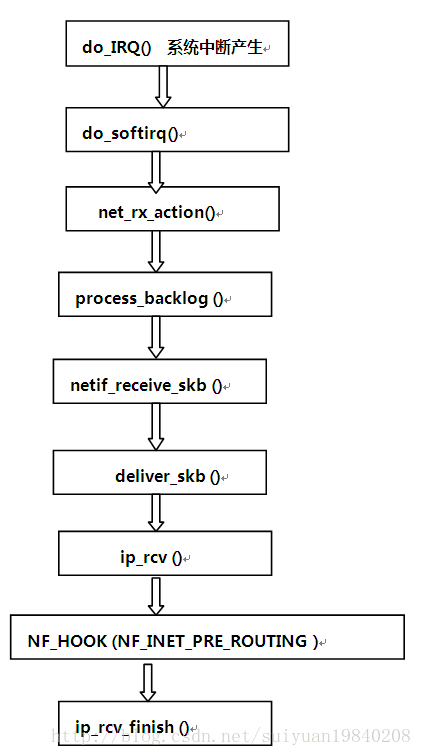

## Linux Netfilter

### Netfilter Base

[Netfilter](<https://netfilter.org/documentation/HOWTO//netfilter-hacking-HOWTO-3.html>) is merely a series of hooks in various points in a protocol stack (at this stage, IPv4, IPv6 and DECnet). The (idealized) IPv4 traversal diagram looks like the following:

```text
A Packet Traversing the Netfilter System:

   --->PRE [1]------>[ROUTE]--->FWD [3] ----->POST [4]------>
       Conntrack    |       Mangle   ^    Mangle
       Mangle       |       Filter   |    NAT (Src)
       NAT (Dst)    |                |    Conntrack
       (QDisc)      |             [ROUTE]
                    v                |
					[2]				 [5]
                    IN Filter       OUT Conntrack
                    |  Conntrack     ^  Mangle
                    |  Mangle        |  NAT (Dst)
                    v                |  Filter		
                 
[1]: NF_IP_PRE_ROUTING  having passed the simple sanity checks
[2]: NF_IP_LOCAL_IN
[3]: NF_IP_FORWARD
[4]: NF_IP_POST_ROUTING
[5]: NF_IP_LOCAL_OUT 	
```


Kernel modules can register to listen at any of these hooks. A module that registers a function must specify the priority of the function within the hook; then when that netfilter hook is called from the core networking code, each module registered at that point is called in the order of priorites, and is free to manipulate the packet. The module can then tell netfilter to do one of five things:

1. F_ACCEPT: continue traversal as normal.
2. NF_DROP: drop the packet; don't continue traversal.
3. NF_STOLEN: I've taken over the packet; don't continue traversal.
4. NF_QUEUE: queue the packet (usually for userspace handling).
5. NF_REPEAT: call this hook again.




### Linux Netfilter Defination

```c
struct nf_hook_ops
{
    	/* list成员用于维护Netfilter hook的列表。*/
        struct list_head list;		//链表成员
        /* User fills in from here down. */
        nf_hookfn *hook;			//钩子函数指针
        struct module *owner;
        int pf;						//协议簇，对于ipv4而言，是PF_INET
    	/* hooknum这个成员用于指定安装的这个函数对应的具体的hook类型 */
        int hooknum;				//hook类型
        /* Hooks are ordered in ascending priority. */
        int priority;				//优先级
};
...
int nf_register_hook(struct nf_hook_ops *reg)
{
      struct list_head *i;
      spin_lock_bh(&nf_hook_lock);
      list_for_each(i, &nf_hooks[reg->pf][reg->hooknum]) {
           if (reg->priority < ((struct nf_hook_ops *)i)->priority)
                 break;
      }
      list_add_rcu(&reg->list, i->prev);
      spin_unlock_bh(&nf_hook_lock);
    
      synchronize_net();
      return 0;
}
```

register hook.

```c
static struct nf_hook_ops auth_ops =
{
    .list = {NULL,NULL},
    .hook = wlan_share_option82_func,
    .pf = PF_BRIDGE,
    .hooknum = NF_BR_PRE_ROUTING,
    .priority = NF_BR_PRI_FIRST
};
static int __init wlan_share_init(void){
    nf_register_hook(&auth_ops);
    return 0;
}

/* this function will add infomation ont the option 182*/
static unsigned int wlan_share_option82_func(
    unsigned int hooknum,
    struct sk_buff *skb,
    const struct net_device *in,
    const struct net_device *out, 
    int (*okfn)(struct sk_buff *) ){
    struct iphdr *iph = NULL;
    struct ipv6hdr *ip6h = NULL;
    struct udphdr *udph = NULL;
    struct dhcp_packet *packet = NULL;
//  hi_eth_cb_s_ntc *p_hi_cb_tmp = NULL;
	unsigned char opt82field[256];
	
    if(!skb)
        return NF_ACCEPT;
    
    if(!g_wlan_share_uid_en)
        return NF_ACCEPT;
	
	iph = ip_hdr(skb);

//	p_hi_cb_tmp = skb->hi_cb;
	//printk("dev name: %s, uc_port: %#x\n", skb->dev->name, p_hi_cb_tmp->uc_port);
	if(strcmp(g_wlan_share_siddev, skb->dev->name))
		return NF_ACCEPT;

    if((skb->protocol == htons(ETH_P_8021Q) || (skb->protocol == htons(ETH_P_IP)) ||(skb->protocol == htons(ETH_P_IPV6))) 
        && (skb->len >= sizeof(struct ethhdr)))
    {
        if(skb->protocol == htons(ETH_P_8021Q))
        {
            iph=(struct iphdr *)((u8*)iph+4);
        }

        if (iph->version == 4) {
            if ((skb->len < 20)  
                ||((iph->ihl * 4) > skb->len) 
                || (skb->len < ntohs(iph->tot_len))
                || ((iph->frag_off & htons(0x1FFF)) != 0)){
                return NF_ACCEPT;
            }
            if(iph->protocol == IPPROTO_UDP) {
                udph = (struct udphdr *)((unsigned char *)iph+iph->ihl*4);
            }
        } else if (iph->version == 6) {
            ip6h = (struct ipv6hdr *)iph;
            if ((skb->len < sizeof(struct ipv6hdr)) 
                || (skb->len < sizeof(struct ipv6hdr) + ntohs(ip6h->payload_len))){
                return NF_ACCEPT;
            }
            if (HI_FALSE == __wlan_get_ipv6_udp_hdr(ip6h, &udph)){
                return NF_ACCEPT;
            }
        } else {
            return NF_ACCEPT;        
        }
        		
        if(udph) {
            if(ntohs(udph->dest) == SERVER_PORT) { //DHCP 
            	packet = (unsigned char *)udph + sizeof(struct udphdr);
                //printk("cookie: %#x\n", ntohl(packet->cookie));
		        opt82field[OPT_CODE] = 82;
		        opt82field[OPT_LEN]  = 0;
		        OPT82_AddSubOpt(opt82field, 2/*RemoteID*/, g_wlan_share_userid, g_wlan_share_userid_len);
		        add_option_string(packet->options, opt82field, skb);
		    }
        }
    }
    return NF_ACCEPT;
}
```



([Note](<https://blog.csdn.net/wuruixn/article/details/7957368>) : 数据在协议栈里的发送过程中，从上至下依次是“加头”的过程，每到达一层数据就被会加上该层的头部；与此同时，接受数据方就是个“剥头”的过程，从网卡收上包来之后，在往协议栈的上层传递过程中依次剥去每层的头部，最终到达用户那儿的就是裸数据了。)


 

