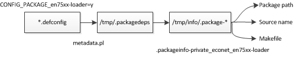
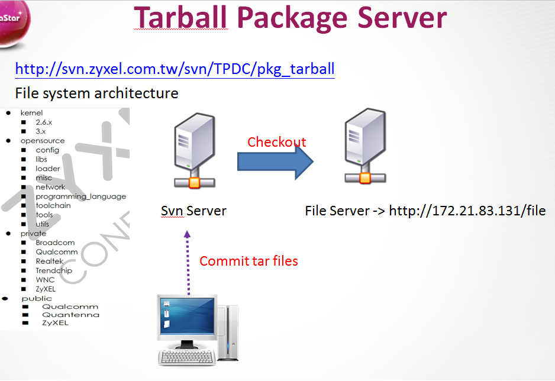
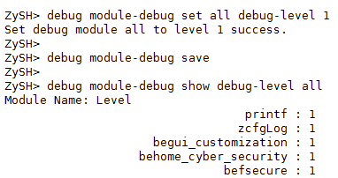
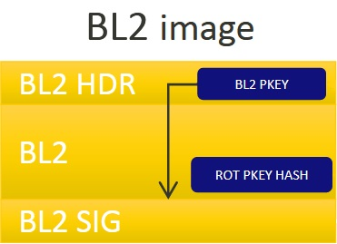
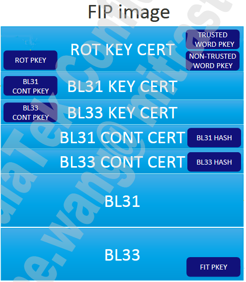

# 	1. OPAL

## 1.1 OPAL Arch Overview

OPAL is a Linux-based, open and dynamic  platform .


### 1.1.1 Build Script for OpenWRT

to get correct description pls do:

```shell
$ TOPDIR=$PWD make -C package/busybox DUMP=1 V=99
Package: busybox
Menu: 1
Version: 1_20_1-5
...
```


### 1.1.2 OPAL Property

Some general principles can be applied no matter which kernel version is used in order to make binary drivers work with your custom kernel , turn on kernel debugging features such as:

```Makefile
#– CONFIG_DEBUG_KERNEL
#– CONFIG DETECT SOFTLOCKUP
#– CONFIG DEBUG KOBJECT
#– CONFIG KALLSYMS
#– CONFIG KALLSYMS ALL
```

OPAL　building procress:



OPAL based on OpenWrt, and has 3 rules  for

- Target :  ``BuildTarget`` for Linux kernel to configure HW.


### 1.1.3 [Differ Container & Images](<https://zhuanlan.zhihu.com/p/348837988>)

  Host: ``HostBuild``  for tools

  Package:  ``BuildPackage`` for package running on the device.


Downloading Server:




## 1.2 Building OPAL Source

### 1.2.1 Clone OPAL Repo by git ,and building it.


```shell
## checkout repo
chear@sw3-cbs-30:~$ git clone https://btc-git.zyxel.com/MT03749/opal
chear@sw3-cbs-30:~$ git checkout -b local_branch origin/master
## start docker container
chear@sw3-cbs-30:~$ ropd
## building whole code
cpe-opal$ make P=DX3301-T0_Generic V=99

## to building the bootloader, and generate zld.bin, 
## quilt is enabled by default for kernel patches, 
## but not for packages, using "QUILT=1" to quilt enable.
cpe-opal$ make package/private/econet/en75xx-loader/{clean,install} QUILT=1 V=99

## to building zyxel package ,and install to rootfs folder
cpe-opal$ make package/private/zyxel/zcfg_be/{clean,compile} V=99 

## to building kernel module (building Virtual Kernel Package)
cpe-opal$ make package/kernel/{clean,install} V=99

## to building linux kernel & rootfs ,then generate ras.bin
cpe-opal$ make P=DX3301-T0_Generic target/linux/install V=99

## to update & generate rootfs.squash
cpe-opal$ make package/install V=99
cpe-opal$ TOPDIR=$PWD INCLUDE_DIR=$PWD/include make -C target/linux/ firmware_release V=99
```

to running  ``make target/linux/install V=99``  ,final Makefile for **"kernel-defaults.mk"** , **"kernel-build.mk"**.

```Makefile

define Kernel/CompileImage/Default
    $(if $(CONFIG_TARGET_ROOTFS_INITRAMFS),,rm -f $(TARGET_DIR)/init)
    +$(MAKE) $(KERNEL_MAKEOPTS) $(subst ",,$(KERNELNAME))
    $(KERNEL_CROSS)objcopy -O binary $(OBJCOPY_STRIP) -S $(LINUX_DIR)/vmlinux $(LINUX_KERNEL)
    $(KERNEL_CROSS)objcopy $(OBJCOPY_STRIP) -S $(LINUX_DIR)/vmlinux $(KERNEL_BUILD_DIR)/vmlinux.elf
endefs
```


### 1.2.2 Generate patch by quilt.

```shell
# quilt series
# quilt new 449-ZYXEL_BUGFIX_test_Hsiwei.patch
# quilt add test_file.c 
(file need to edit.)
# vim test_file.c
# quilt refresh 
( generate patch for '449-ZYXEL_BUGFIX_test_Hsiwei.patch')
```

*Tips 1: to stop docker*

```shell
$ docker ps -a
$ docker stop ${container_id}
```

*Tips 2: to check and verify the ssh connection access by*

```shell
# to check client
$ ssh -vvv git@btc-git.zyxel.com
# to check server
$ ssh -d -p 23
```

*Tips 3:  to add git alias by*

```shell
$ git config --global alias.b “remote -vv” 
```

*Tips 3: to keep patch when building package*

```shell
# to building bootloader for OPAL 
$ make package/private/econet/en75xx-loader/{clean,install} V=99 QUILT=1
```

*Tips 4: 'tig' [usage by](<https://linux.cn/article-11069-1.html>)*

### 1.2.3 Zcfg debug for 'zysh'




## 1.3  System Startup

`en75xx-loader`  hex binary arch:

```shell
##      |---------------|
##      |     trx       |   trx.h
##      |---------------|
##      |    header     |	header.c
##      |---------------|
##      |   boot.img    |
##      |---------------|
##      |   lzma.img    |
##      |---------------|
##      |   spram.bin   |
##      |---------------|
##      |   MRD         |   mic.c
##      |---------------|
```

trx header structure:

```c
struct trx_header {
	unsigned int magic;			/* "HDR0" */
	unsigned int header_len;    /*Length of trx header*/
	unsigned int len;			/* Length of file including header */
	unsigned int crc32;			/* 32-bit CRC from flag_version to end of file */
	unsigned char version[32];  /*firmware version number*/
	unsigned char customerversion[32];  /*firmware version number*/
//	unsigned int flag_version;	/* 0:15 flags, 16:31 version */
	unsigned int kernel_len;	//kernel length
	unsigned int rootfs_len;	//rootfs length
    unsigned int romfile_len;	//romfile length
	#if 0
	unsigned int reserved[42];  /* Reserved field of header */
	#else
	unsigned char Model[32];
	unsigned int decompAddr;//kernel decompress address
	unsigned int openjdk_len;	//openjdk length
	unsigned int osgi_len;		//osgi length
	unsigned int imageflag;		/*tclinux+openjdk+osgi 1;tclinux+openjdk 2;tclinux+osgi 3*/
	unsigned int reserved[29];  /* Reserved field of header */
	unsigned char chipId[CHIP_ID_LEN];		/* Provided by Makefile */
	unsigned char boardId[BOARD_ID_LEN];		/* Provided by Makefile */
	unsigned char modelId[MODEL_ID_LEN];			/* Provided by Makefile */
	unsigned int defcfg_len;	//default config length
	unsigned int imageSequence;
	unsigned char swVersionInt[SW_VERSION_LEN];	/* Provided by Makefile */
	unsigned char swVersionExt[SW_VERSION_LEN];	/* Provided by Makefile */
 	unsigned int rootfsChksum;
	unsigned int kernelChksum;
	unsigned int defcfgChksum;
    unsigned int headerChksum;
};
```

header structure:

```c
typedef struct tcboot_header{
	unsigned int resv1[2];					//0x00 ~ 0x04, this 8bytes must not use becaust of jump instruction in start.s
	unsigned int tcboot_len;				//0x08
	unsigned int tcboot_magic_num;			//0x0c
	unsigned int lzma_flash_start_addr;	    //0x10
	unsigned int lzma_flash_end_addr;		//0x14
	unsigned int bootram_flash_start_addr;	//0x18
	unsigned int bootram_flash_end_addr;	//0x1c
	unsigned int resv2;					    //0x20
	unsigned int chip_flash_info;			//0x24
	union {
		unsigned int ecc_info;				//0x28
		unsigned int en7522_page_size;		//0x28
	};
	unsigned int bypass;					//0x2c
	unsigned int spram_exe_addr;			//0x30
	unsigned int lzma_exe_addr;			    //0x34
	unsigned int verify_start_addr;		    //0x38
	unsigned int verify_end_addr;			//0x3C
	unsigned int resv3[2];					//0x40 ~ 0x44
	unsigned int move_data_int_flash_start_addr;	//0x48
	unsigned int move_data_int_flash_end_addr;		//0x4C
	unsigned int boot2_flash_start_addr;	//0x50
	unsigned int boot2_flash_end_addr;		//0x54
	unsigned int spram_flash_start_addr;	//0x58
	unsigned int spram_flash_end_addr;		//0x5c
} TCBOOT_HEADER;
```


# 2. OPAL 2.0

## 2.1 zyrepo

Clone and checkout repo by zyrepo

```shell
chear@Build_Opal_Docker$ zyrepo init -u git@btc-git.zyxel.com:opal20/manifest.git -m opal_econet_old.xml
(MTK: -m opal21_mtk_v7_6_5_0.xml )
```

download code and checkout branch:

```shell
chear@Build_Opal_Docker$ zyrepo sync
chear@Build_Opal_Docker$ zyrepo branch -b develop
chear@Build_Opal_Docker$ zyrepo branch -b CTB_7528HU_7561DU_HGW500TX2X2E_20210801
# building  project
chear@Build_Opal_Docker$ cd opal & make P=HGW500TX2X2E_EXTERNAL V=s
```

Commit and upload source code to gitlab

```shell
chear@Build_Opal_Docker$ zyrepo foreach -c "git status"
# Download and merge source to local develop branch 
chear@Build_Opal_Docker$ zyrepo foreach -c "git pull origin CTB_7528HU_7561DU_HGW500TX2X2E_20210801 --rebase"

# branch format such like "bugfix-ctbbu-xxxxxx"
chear@Build_Opal_Docker$ zyrepo branch -b bugfix-ctbbu-SMT_fast_startup
chear@Build_Opal_Docker$ git commit

# Upload commit change to server and auto merge.
chear@Build_Opal_Docker$ zyrepo upload -t CTB_7528HU_7561DU_HGW500TX2X2E_20210801 -m yes
```


**Tips:  use  ' [git cherry-pick [commit_hash]](<https://www.ruanyifeng.com/blog/2020/04/git-cherry-pick.html>) ' to merge update to current branch.**

main files structure for opal2.0

```shell
opal2p0
  ├── acts_build.sh -> opal/scripts/acts_build.sh
  ├── econet_old
  ├── manifest
  ├── ./opal/package/
  │   ├── private
  │   ├── econet -> ../../../econet_old/econet
  │   └── zyxel -> ../../../zyxel_private/zyxel
  │   └── public-zyxel -> ../../zyxel_public/public-zyxel
  ├── opalcicd
  ├── zyrepo
  ├── .zyrepo
  │   ├── manifest
  │   ├── manifest_name
  │   ├── manifest.xml -> manifest/opal_econet_old.xml
  │   ├── zyrepo -> .zyrepo/zyrepo
  │   └── .zyrepo
  ├── zyxel_private
  └── zyxel_public
```


Note: debug SPI Nand flash :

```shell
# echo "211" > /proc/driver/spi_nand_debug
len = 0x4, buf[0]=2, buf[1]=1, buf[2]=1
Set SPI NAND DEBUG LEVLE to 2
Set _SPI_NAND_WRITE_FAIL_TEST_FLAG to 1
Set _SPI_NAND_ERASE_FAIL_TEST_FLAG to 1

# cat /proc/driver/spi_nand_debug
flash size=[134217728], SPI NAND DEBUG LEVEL=2, _SPI_NAND_WRITE_FAIL_TEST_FLAG=0, _SPI_NAND_ERASE_FAIL_TEST_FLAG=0

# echo all > /proc/yaffs
( to trace all for yaffs in kernel.)

# echo "rw_test 2 8" > /proc/driver/spi_nand_test
cmd:rw_test, arg1=2, arg2=8
write_test: run at vpe:0, cpu:0
read_test: run at vpe:1, cpu:1
read_test: times=2, block_idx=8
write_test: times=2, block_idx=8

# echo "read 2 8" > /proc/driver/spi_nand_test
# echo "getFeature 2 8" > /proc/driver/spi_nand_test
# echo "dumpBmt 2 8" > /proc/driver/spi_nand_test
```


## 2.2  ZCMD Startup  Sequence

source at  *package/private/zyxel/zcmd/zcmd.c* , zcmdDataModelInit:

```c
	if(zcmdRomfileGet(filePath) == ZCFG_SUCCESS) {
		sprintf(sysCmd, "mv %s %s", filePath, ZCFG_CONFIG_FILE_PATH);
		ZOS_SYSTEM(sysCmd);
		strcpy(configType, "rom");
		zcmdReqRomfileClean();
	}
	else if(access(ZCFG_CONFIG_FILE_PATH, F_OK) == 0){
		strcpy(configType, "config");
		if(access(ZCFG_CONFIG_FILE_BAK_PATH, F_OK) != 0){ //maybe a restored config
			forceRomConvert = 1;
			printf("[ZCMD]%s:%d : maybe a restored config, forceRomConvert\n", __FUNCTION__, __LINE__);
		}
	}
	else if(zcmdRomdGet(romdPath) == ZCFG_SUCCESS){ /* reset case, use romd*/
		sprintf(sysCmd, "mv %s %s", romdPath,ZCFG_CONFIG_FILE_PATH);
		ZOS_SYSTEM(sysCmd);
		printf("[ZCMD]%s:%d : cmd : %s\n", __FUNCTION__, __LINE__, sysCmd);
		strcpy(configType, "romd");
	}
	else 
	{ /* reset case, use system default config*/
		sprintf(sysCmd, "mv %s %s", zcfg_config_file_tmp_path, ZCFG_CONFIG_FILE_PATH);
		ZOS_SYSTEM(sysCmd);
		printf("[ZCMD]%s:%d : cmd : %s\n", __FUNCTION__, __LINE__, sysCmd);
		strcpy(configType, "default config");
	}
	printf("[ZCMD]%s:%d : use %s\n", __FUNCTION__, __LINE__, configType);
	zcmdRomConvert(ZCFG_CONFIG_FILE_PATH, zcfg_predef_file_tmp_path, forceRomConvert);
	runTimeConfDataModel = json_object_from_file(ZCFG_CONFIG_FILE_PATH);
	if(is_error(runTimeConfDataModel)){
		/* to reboot..*/
	}
	zcmdConfigUpdate(runTimeConfDataModel);
```


# 2. MTK Bootloader SDK

to update docker image

```shell
$ docker ps 
chear@sw3-cbs-opal:~$ docker ps
CONTAINER ID   IMAGE                          COMMAND   CREATED          STATUS          3714815f17f5   ubuntu_18_04_env:bootloader    "bash"    14 minutes ago   Up 14 minutes 

$ docker commit -m "ln to sh" -a "chear" 3714815f17f5 ubuntu_18_04_env:bootloader
```

main configuration files tree in the SDK .

```shell
./defconfig/WX5600-T0/
|-- atf.config
|-- u-boot-env.txt
|-- uboot_config
└-- zloader.config
./Uboot-upstream/configs/zyxel_wx5600_t0_defconfig
./Uboot-upstream/arch/arm/dts/
|-- mt7986.dtsi
└-- wx5600-t0-c2-2.dts
./Uboot-upstream/board/mediatek/mt7986/
|-- Kconfig
|-- MAINTAINERS
|-- Makefile
|-- bootmenu_emmc.c		
|-- bootmenu_sd.c
|-- bootmenu_snand.c
|-- bootmenu_snor.c
|-- bootmenu_ubi.c
|-- built-in.o
└-- mt7986_rfb.c
./Uboot-upstream/arch/arm/cpu/armv8/u-boot-spl.lds
./atf-20220114-95c4e1886/fdts/mt7986.dts
	(arm-trusted-firmware:https://github.com/ARM-software/arm-trusted-firmware)
```

​	mt7981 flash partition layout.

```text
	|-----------|
	|  bl2.img  |
	|-----------|
	|  env      |	u-boot-env.bin
	|-----------|
	|  factory  |	RootFS
	|-----------|
	|  fip.bin  |                           |-----------|
	|-----------|                           | kernel    |
	|  zloader  |   zloader.bin.gz.uImage   | rootfs    |  (ubi volume ubi0_0 ubi0_3)
	|-----------|                           | zyfwinfo  |
	|  ubi      |   kernel && rootfs -------| root_data |
	|-----------|                           |-----------|
	|  ubi 2    |  
	|-----------|
	|  zyubi    |          |--------|
	|-----------|  --------| romfile|
	                       | rom-d  |
	                       | wwan   | ubi volume ubi1_0 ~ ubi1_4
	                       | data   |
	                       | misc   |
	                       |--------|
(Note: with in mt7981 , /sys/devices/virtual/ubi/ubi1/ means 'zyubi' partition.)
```

*openwrt-mediatek-ex3320t0-ex3320-t0-squashfs-sysupgrade.bin* layout:

```shell
openwrt-mediatek-ex3320t0-ex3320-t0-squashfs-sysupgrade.bin
|-----------|-------
|  CONTROL  |  
|-----------|  tar -cvf ${file} sysupgrade/ 
|  kernel   |	
|-----------|
|  root     |
|-----------| 
|  zyfwinfo | (zyfwinfo image contain kernel_chksum, zyfwinfw_chksum, root_chksum)
|-----------|-------
| meta_data | metadata_json && fwtool -I - ${sysuprade}.bin
|-----------|-------
```


bl2.img* layout:



*fip.bin*  layout:




zloader image:

```shell
 bootloader-factory.bin                 zld.bin
	|-----------|                      |-----------|
	|  bl2.bin  |                      |zld_img_hdr| contains image type,
	|-----------|                      |  .bin     |    size, checksum.
	| uboot-env |                      |-----------|
	|-----------|                      | bl2.bin   |
	|  fip.bin  |                      |-----------|
	|-----------|                      | fip.bin   |
	|  zloader  |                      |-----------|
	|-----------|                      | zloader   |
	                                   |-----------| 
```

**(both *bootloader-factory.bin* and *zld.bin*  are skip 'Factory' partition while exist by /dev/mtd3)**


to building MTK bootloader , chip based on **mt7986**

```shell
$ git clone git@btc-git.zyxel.com:opal20/sdk/mediatek/mt7986_v7.6.2.1_mp/bootloader.git
$ git checkout pre_develop
$ make clean
$ make PROFILE=WX5600-T0 V=99 
```

to building whole code by

```shell
# ./opt/trendchip/mips-linux-uclibc-4.9.3/usr/bin/mips-linux-addr2line -e ra_nat.o 658c
# zyrepo sync
# zyrepo branch -b pre_develop
###  'opal20checkout -m7986' replace privious zyrepo command.
# cd opal && make P=WX5600-T0 V=99
```

to building MTK  for **mt7981**  for AX3000

```shell
$ ropd_mt7981
# opal20checkout.sh --m7981
# make P=HGW500GX2X2M V=99
# make package/private/zyxel/esmd/{clean,compile} V=99
```

*openwrt-$(target)squashfs-sysupgrade.bin* layout

```shell
openwrt-mediatek-ex3320t0-ex3320-t0-squashfs-sysupgrade.bin
|-----------|-------
|  CONTROL  |  
|-----------|  tar -cvf ${file} sysupgrade/ 
|  kernel   |	
|-----------|
|  root     |
|-----------| 
|  zyfwinfo | (zyfwinfo image contain kernel_chksum, zyfwinfw_chksum, root_chksum)
|-----------|-------
| meta_data | metadata_json && fwtool -I - ${sysuprade}.bin
|-----------|-------
```

make  *${board}-squashfs-sysupgrade.bin*  flow:

```shell
## 1. make zyfwinfo
zyfwinfo -e little -n 0 -d 08/16/2022 -t 05:22:28 -k ex3320-t0-kernel.bin -r root.squashfs -s "V5.71(YAK.0)a0_20220810" -S "V5.71(YAK.0)a0_20220810" -p "EX3320-T0" -m "4A30" -o openwrt-mediatek-ex3320t0-ex3320-t0-squashfs-zyfwinfo.bin

## 2. calculate check sume and tar files
OPDIR=`pwd` zyfwinfo=${board}squashfs-zyfwinfo.bin sh sysupgrade-zytar.sh --board ex3320-t0 --kernel ex3320-t0-kernel.bin --rootfs root.squashfs --zyfwinfo ${board}-squashfs-zyfwinfo.bin openwrt-mediatek-ex3320t0-ex3320-t0-squashfs-sysupgrade.bin

## 3. append meta_data to end of image.
echo '{  "metadata_version": "1.1", "compat_version": "1.0",   "supported_devices":["mediatek,mt7981-spim-snand-rfb"], "version": { "dist": "OpenWrt", "version": "21.02-SNAPSHOT", "revision": "r0-102e107c", "target": "mediatek/ex3320t0", "board": "ex3320-t0" }, "zyfwinfo": { "product_name": "EX3320-T0", "model_id": "4A30", "fw_ver": "V5.71(YAK.0)a0_20220810", "extfw_ver": "V5.71(YAK.0)a0_20220810", "build_date": "08/19/2022", "build_time": "02:30:00", "kernel_chksum": "0x459b", "rootfs_chksum": "0x7a7b", "blocksize": "128kB" } }' | fwtool -I - ${board}-squashfs-sysupgrade.bin
```


# 3. OPAL EN7529 MOS

go debug Gpon s

```shell
# echo msg int 1 >/proc/gpon/debug
# echo msg oam 1 >/proc/gpon/debug
## captured path /tmp/omcicapture.raw, /tmp/omcicapture.cmd,
## /tmp/omcicapture.rxtx
# moscli capture enable cmd
# moscli capture enable raw
# moscli capture enable rxtx

# ponmgr gpon get info
 ONU Info:
 ONU ID:    255
 ONU State: O2
 SN:        ZYXE8cada669
 PASSWD:
 ASCII:     0000000035
 HEX:       30303030303030303335
 Key Idx:   1
 Key:       4a291684cf4463ad33f0e700d7e6b50f
 O1 Timer:  10000 ms
 O2 Timer:  100 ms
 OMCC ID:   65535
```

to upgrade omci [plug-in](\\172.25.5.39\cpeswdoc\cpesw\Vendor\EcoNet\China\MT752X\2015\SOP_for_OMCI_add-on_Wireshark\omci.lua) for *WireShark* by *[SOP_for_OMCI_add-on_Wireshark.docx](//172.25.5.39/cpeswdoc/cpesw/Vendor/EcoNet/China/MT752X/2015/SOP_for_OMCI_add-on_Wireshark.docx)*

start to capture omci package on Wireshark

```shell
# /usr/bin/sys wan2lan on
# /usr/bin/sys wan2lan 15
```

Enable MOS log

```shell
# cdbg 1 1
# cdbg 2 OMCI 1
# cdbg 3 OMCI all 1
# cdbg 10 debug all com 1
```

To get PLOAM message by:

```shell
# echo msg int 1 >/proc/gpon/debug
# echo 'msg oam 1' >/proc/gpon/debug
# dmesg|less
```


# FAQ:

### 1.  switch branch 'develop' to 'CTB_7528HU_7561DU_HGW500TX2X2E_20210801' 

```shell
chear@Build_Opal_Docker$ zyrepo branch -b develop
chear@Build_Opal_Docker$ zyrepo foreach -c "git pull origin develop --rebase"
chear@Build_Opal_Docker$ zyrepo foreach -c "git remote update"
chear@Build_Opal_Docker$ zyrepo branch -b CTB_7528HU_7561DU_HGW500TX2X2E_20210801
Switch to existed branch  CTB_7528HU_7561DU_HGW500TX2X2E_20210801
```

**Note: **
``git remote update`` will update all of your branches set to track remote ones, but not merge any changes in.

``git fetch`` will update only the branch you're on, but not merge any changes in.

``git pull`` will update *and* merge any remote changes of the current branch you're on. This would be the one you use to update a local branch.

delete remote branch:

```shell
chear@Build_Opal_Docker$ git push origin :bugfix-ctbbu-test
chear@Build_Opal_Docker$ zyrepo foreach -c "git push origin :bugfix-ctbbu-test"
```


###  2.  Display 'PRODUCT_NAME'  from flash within mrd

get production name for actual address by  ``atrf [offset],[length]`` in zloader .(Note: [offset] and [length] all are decimal value.) 

```shell
ZHAL> atrf 261667,32
[DEBUG] Read len=32 from flash=0x0003fe23 to ram=0x80020000
0003FE23: 00 4E 42 47 37 35 31 30 00 00 00 00 00 00 00 00    .NBG7510........
0003FE33: 00 00 00 00 00 00 00 00 00 00 00 00 00 00 00 00    ................
# actual address from flash should be decimal val,
```

verify production name by ``atsh`` 

```shell
ZHAL> atsh
Firmware Version       : V1.00(ABZY.0)b5
Bootbase Version       : V1.01 | 11/10/2021  7:06:00
Vendor Name            : ZyXEL
Product Model          : NBG7510
Serial Number          : 123456789012345
First MAC Address      : 001122AABBCC
Last MAC Address       : 001122AABBDB
MAC Address Quantity   : 16
Default Country Code   : FF
Boot Module Debug Flag : 01
RootFS      Checksum   : f50ec1e9
Kernel      Checksum   : fe58c60e
Main Feature Bits      : 00
Other Feature Bits     :
840d8444: 04060d00 00000000 00000000 00000000
840d8454: 00000000 00000000 00000000 0000
```


### 3.  write romfile partition to switch SMT mode

romfile partition header:

```c
struct romfile_header
{
	unsigned char magic;	//should be ROMFILE_MAGIC
	unsigned char type;
	unsigned int length;
	unsigned short total_crc;	//should be 2 bytes, caculate crc with total_crc=0
	unsigned char data[0];
};
```

romfile data header from actual address like following:

```shell
ZHAL> atrf 262144,512
[DEBUG] Read len=512 from flash=0x00040000 to ram=0x80020000
00040000: 01 5A 68 D9 00 00 CD BA 7B 0A 20 20 22 53 65 72    .Zh.....{.  "Ser
00040010: 76 69 63 65 73 22 3A 7B 20 20 20 0A 20 20 7D 2C    vices":{   .  },
00040020: 0A 20 20 22 44 65 76 69 63 65 49 6E 66 6F 22 3A    .  "DeviceInfo":
00040030: 7B 20 20 20 20 0A 20 20 7D 2C 0A 20 20 22 44 53    {    .  },.  "DS
00040040: 4C 22 3A 7B 0A 20 20 7D 2C 0A 20 20 22 49 6E 74    L":{.  },.  "Int
```

write 8 byte header to TE_config.rom to make file `romfile_partition` , and finally write to romfile partition for flash.

```shell
cd /data/ && tftp -g -r romfile_partition 192.168.123.7
mtd writeflash /data/romfile_partition 262144 0 /dev/mtd1 && sys atcr reboot
```

FS differ:

|                   | MTK mt7981                                         | Econet en75xx      |
| ----------------- | -------------------------------------------------- | ------------------ |
| File System       | ubi                                                | jffs2              |
| ras.bin Partition | contains (kernel ,rootfs , zyfwinfo , rootfs_data) | kernel , rootfs    |
| FW Header         | zyfwinfo volume                                    | header for ras.bin |


### 4.  zyrepo upload failed 

‘zyrepo upload -t  CTB_MT7981_HGW500GX2X2M_20220607 -m yes’ get following error on docker *ropd20_mt7981*:

```shell
opal20/sdk/mediatek/mt7981_v7.6.5.0/openwrt :
upload_one: ismerge = 0, merge = yes, have commit = 0
execute cmd =  git push -u origin bugfix-ctbbu-fw_generator_mtk_mash_upgrade
     Branch 'bugfix-ctbbu-fw_generator_mtk_mash_upgrade' set up to track remote branch 'bugfix-ctbbu-fw_generator_mtk_mash_upgrade' from 'origin'.
     Traceback (most recent call last):
  File "/opt/tools/zyrepo/zyrepo", line 1768, in <module>
    main(sys.argv[1:])
  File "/opt/tools/zyrepo/zyrepo", line 1734, in main
    exec_upload(args)
  File "/opt/tools/zyrepo/zyrepo", line 1480, in exec_upload
    repo_upload(, manifest_default, manifest_projects, args1)
  File "/opt/tools/zyrepo/zyrepo", line 1033, in repo_upload
    needMerge = upload_one(project,args1.target,branch,args1.merge,tag,commit)
  File "/opt/tools/zyrepo/zyrepo", line 1007, in upload_one
    print("    ",err)
UnicodeEncodeError: 'ascii' codec can't encode characters in position 144-148: ordinal not in range(128)
```

to fix this issue  by :

```shell
chear@Build_Opal_Docker6604: sudo apt-get update
chear@Build_Opal_Docker6604: sudo apt-get install -y locales
chear@Build_Opal_Docker6604: sudo locale-gen "en_US.UTF-8"
chear@Build_Opal_Docker6604: echo "export LC_ALL=en_US.UTF-8" >> /home/chear/.bashrc
chear@Build_Opal_Docker6604: source ~/.bashrc
```

this issue may cased by **'UTF-8 locales'** .


### 5.  Debug Zcfg for OPAL

print debug info for be_module .

```shell
# zysh
ZySH> debug module-debug set all debug-level 7
ZySH> debug module-debug set printf debug-level 0
```


### 6.  Packet mirror for MTK platform

ports defined on  *linux-5.4.194/arch/arm64/boot/dts/mediatek/ex3320-t0.dts*

```c
switch@0 {
	compatible = "mediatek,mt7531";
	reg = <31>;
	reset-gpios = <&pio 39 0>;	
	ports {
		#address-cells = <1>;
		#size-cells = <0>;		
		port@1 {
				reg = <1>;
				label = "lan3";
		};		
		port@2 {
				reg = <2>;
				label = "lan2";
		};		
		port@3 {
				reg = <3>;
				label = "lan1";
		};		
		port@6 {
			reg = <6>;
			label = "cpu";
			ethernet = <&gmac0>;
			phy-mode = "2500base-x";
			
			fixed-link {
					speed = <2500>;
					full-duplex;
					pause;
			};
		};
	};
};
```

to mirror lan port by follow, ``switch mirror target [PORT_NUM] [TYPE]``,  [TYPE] values by (0 off/1 Rx/2 Tx/3 all) , the following cmd this mirror packet from lan3 (port 1) to lan1 (port 3) 

```shell
root@EX3320-T0:/# switch mirror target 1 3
root@EX3320-T0:/# switch mirror monitor 3
```

to get wan packet by 

```shell
root@EX3320-T0:/# tcpdump -ni eth1.4 -ve
```


## 7.   clean and delete all volume in 'zyubi'  on uboot

to get all ubi part info by following:

```shell
# MT7981> mtd list
# MT7981> ubi part zyubi
ubi0: attaching mtd9
ubi0: scanning is finished
ubi0: attached mtd9 (name "zyubi", size 34 MiB)
ubi0: PEB size: 131072 bytes (128 KiB), LEB size: 126976 bytes
ubi0: min./max. I/O unit sizes: 2048/2048, sub-page size 2048
ubi0: VID header offset: 2048 (aligned 2048), data offset: 4096
ubi0: good PEBs: 276, bad PEBs: 0, corrupted PEBs: 0
ubi0: user volume: 1, internal volumes: 1, max. volumes count: 128
ubi0: max/mean erase counter: 13/9, WL threshold: 4096, image sequence number: 1657010496
ubi0: available PEBs: 202, total reserved PEBs: 74, PEBs reserved for bad PEB handling: 19
```

to delete volume on ubi by:

```shell
# MT7981> ubi remove romfile
Remove UBI volume romfile (id 0)
```

get info for ubi partition  in kernel by

```shell
root@EX3320-T0:# ubinfo /dev/ubi1
```


## 8. Direct building Kernel

to direct compile kernel without patch by :

```shell
# export PATH=/work/cpe-opal/EXTDISK/mtk_cicd/opal20/opal/staging_dir/toolchain-aarch64_cortex-a53_gcc-8.4.0_musl/bin/:$PATH

# make -C /work/cpe-opal/EXTDISK/mtk_cicd/opal20/opal/build_dir/target-aarch64_cortex-a53_musl/linux-mediatek_ex3320t1/linux-5.4.194 KCFLAGS="-fmacro-prefix-map=/work/cpe-opal/EXTDISK/mtk_cicd/opal20/opal/build_dir/target-aarch64_cortex-a53_musl=target-aarch64_cortex-a53_musl" HOSTCFLAGS="-O2 -I/work/cpe-opal/EXTDISK/mtk_cicd/opal20/opal/staging_dir/host/include  -Wall -Wmissing-prototypes -Wstrict-prototypes" CROSS_COMPILE="aarch64-openwrt-linux-musl-" ARCH="arm64" KBUILD_HAVE_NLS=no KBUILD_BUILD_USER="" KBUILD_BUILD_HOST="" KBUILD_BUILD_TIMESTAMP="Sun Oct  9 10:01:46 2022" KBUILD_BUILD_VERSION="0" HOST_LOADLIBES="-L/work/cpe-opal/EXTDISK/mtk_cicd/opal20/opal/staging_dir/host/lib" KBUILD_HOSTLDLIBS="-L/work/cpe-opal/EXTDISK/mtk_cicd/opal20/opal/staging_dir/host/lib" CONFIG_SHELL="bash" V=''  cmd_syscalls=  KERNELRELEASE=5.4.194 CC="aarch64-openwrt-linux-musl-gcc"
```

