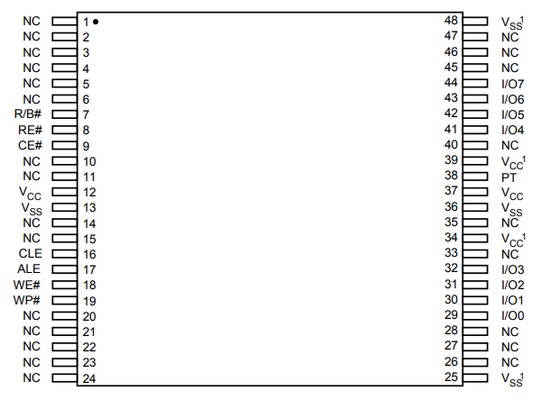

## 1. Introduction

Perralle NAND Flash




## 1. Econet

data struct  and flash spec tables:

```c
struct SPI_NAND_FLASH_INFO_T {
	const u8								mfr_id;
	const u8								dev_id;
	const u8								*ptr_name;
	u32										device_size;	/* Flash total Size */
	u32										page_size;		/* Page Size 		*/
	u32										erase_size;		/* Block Size 		*/
	u32										oob_size;		/* Spare Area (OOB) Size */
	SPI_NAND_FLASH_READ_DUMMY_BYTE_T		dummy_mode;
	SPI_NAND_FLASH_READ_SPEED_MODE_T		read_mode;
	struct spi_nand_flash_ooblayout			*oob_free_layout;
	u8										die_num;
	SPI_NAND_FLASH_WRITE_SPEED_MODE_T		write_mode;
	u32										feature;
	struct SPI_NAND_ECC_FAIL_CHECK_INFO_T	ecc_fail_check_info;
	SPI_NAND_FLASH_WRITE_EN_TYPE_T			write_en_type;
	struct SPI_NAND_UNLOCK_BLOCK_INFO_T		unlock_block_info;
	struct SPI_NAND_QUAD_EN_INFO_T			quad_en;
	struct SPI_NAND_ECC_EN_INFO_T			ecc_en;
#ifdef TCSUPPORT_NAND_FLASH_OTP
	char									otp_page_num;
#endif
#if defined(TCSUPPORT_PARALLEL_NAND)
	u32										ext_id;
	u32										timing_setting;
	u8										min_ecc_req;
	u8										addr_cycle;
#endif
};

const struct SPI_NAND_FLASH_INFO_T parallel_nand_flash_tables[] = {
	{
		mfr_id:						_SPI_NAND_MANUFACTURER_ID_MXIC,
		dev_id:						0xF1,
		ptr_name:					"MX30LF1G18AC",
		device_size:				_SPI_NAND_CHIP_SIZE_1GBIT,
		page_size:					_SPI_NAND_PAGE_SIZE_2KBYTE,
		erase_size:					_SPI_NAND_BLOCK_SIZE_128KBYTE,
		oob_size:					_SPI_NAND_OOB_SIZE_64BYTE,
		feature:					SPI_NAND_FLASH_FEATURE_NONE,
		ext_id:						0x029580,
		timing_setting:				0x44333,
		min_ecc_req:				4,
		addr_cycle:					4,
	}
}
```

