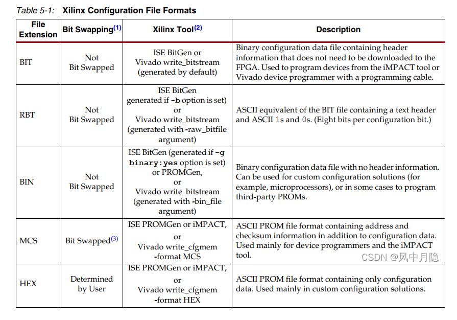

# 	RealTek FTTR

RealTek **RTL9617C**  HW block diagram


Data path diagram


**Fleet Conntrack Driver** data path


## 1. Source and structure

flash layout :

```text
                    | -------------------|
                    |     app            |  ubi_apps (80M)                         
                    | -------------------|
                    |     rootfs_0       |  ubi_r1 (27M)
                    | -------------------|
                    |     kenrel_0       |  ubi_k1 (6M)
                    | -------------------|       
                    |     dtb_1          |  ubi_DTB1(256k)
                    | -------------------|
                    |     plugin         |
                    | -------------------|
                    |     rootfs_0       |  ubi_r0 (27M)
                    | -------------------|
                    |     kenrel_0       |  ubi_k0 (6M)
                    | -------------------|
                    |     dtb_0          |  ubi_DTB0 (256k)
                    | -------------------|
                    |     fpga           |  ubi_fpga (20M)
                    | -------------------|
                    |     config         |  ubi_config (10M)
             0x2c0000 -------------------|------------------------------------
                    |     env2           |  (256k)
             0x280000 -------------------|------------------------------------
                    |     evn1           |  (512k)
             0x200000 -------------------|------------------------------------
                    |    boot            |	(2M)
             0x000000 -------------------|------------------------------------
```


Building all

```shell
$ svn co http://wx-svn.zyxel.cn/SW3-1/turnkey_trunk/realtek_trunk/USDK-v2.2_cmcc_fttr_20230331/sdk
$ make preconfig510_9617C_cmcc_Board-CMCC_fttr_main_8832c_8192xb_8221b_efem
$ make preconfig510_9607DM_cmcc_Board-CMCC_8832c_8192xb_1efem_fttr_slave
$ make menuconfig
$ make all
```

generate SMT image

```shell
$ make progimages_fullcombined 
```


### 1.1 Building Bootloader

useful  *bootloader* file structure 

```text
$ tree ./bootloader
./
├── u-boot -> u-boot-2020.01
├── u-boot-2020.01
│   ├── board/realtek_10G_PON/
│   └── configs/rtk-multi-boot_rtl8277c-spinand_soc_board_defconfig
├── u-boot-env
│   └── uboot-env-8277C_demo.txt
├── host_build_tools
│   ├── arm-trusted-firmware-tools-1.5
│   └── nandinfo_venus
├── (...)
├── bootloader.conf
│   (generate by make menuconfig under root folder)
├── Makefile
├── Makefile.img
├── Makefile.mkenv
└── image
    ( output image)
```

building *bootloader*

```shell
$ make -C bootloader clean V=s
$ make bootloader_gpt_image V=s
```

building module

```shell
$ make user/cwmp-tr069_clean 
$ make user/cwmp-tr069_only
$ make user/cwmp-tr069_romfs
```

building image

```shell
$ make modules_install V=s
$ make image V=s
$ make vmimg V=s
```


### 1.2 building Kernel

*linux-5.10.x* files structure

```text
$ tree ./bootloader
./
├── linux-5.10.x
│   └── arch/arm64/boot/dts/realtek/rtl8277C-engboard.dts
├── vendors\Realtek\luna\conf510
│   └── 9617C_cmcc_Board-CMCC_fttr_main_8832c_8192xb_8221b_efem
├── roomfs 	(temp folder)
├── tmpfs   (temp folder)
└── image
    ( output image)
```

building *kernel*

```shell
$ make linux_clean V=s
$ make linux_only V=s
$ make image vmimg V=s
```


## 1.3 Upgrade

to upgrade kernel & rootfs

```shell
TAURUS# run upt
ca77xx_eth_initialize: auto_scan_active_port=1
ca77xx_ni_auto_scan_active_port: active_port=2
Taurus-SoC
PHY ID 0x001CCAC4 1000Mbps full duplex
Using Taurus-SoC device
TFTP from server 192.168.1.7; our IP address is 192.168.1.2
Filename 'img.tar'.
Load address: 0x5000000
```


## 2. FPGA

### 2.1 FPGA 启动模式

系统上电后，微处理器 (MIC) 需要配置 FPGA 的模式,  一般情况下 **M[2:0] (M0, M1, M2)**  通过硬件电路来配置。


### 2.2  Slave Serial Mode  Pin Description

其使用的管脚情况如下所示：


**（以 FTTR 为例，当主芯片上电后将设置 FPGA  为 Slave Seriel 模式)**


###  2.3  Slave SelectMAP mode


### 2.4  JTAG Pin Description

JTAG 主要用于芯片内部测试.标准的 JTAG 接口是4线：**TMS、 TCK、TDI、TDO**，分别为模式选择、时钟、数据输入和数据输出线。


### 2.5 FPGA 上电启动过程

FPGA 上电启动后电压达到 **VCC** 后在 Tpor (10~50ms) 时间内一直复位 FPGA 内部逻辑，直等到 **PROG_B** 为高以后，紧接着延迟TPL时间后，**INIT_B** 信号拉高后初始化完成，FPGA 开始加载配置工作。


### 2.6 FPGA 数据格式




### 2.7 FTTR FPGA Intro

在 FTTR 项目中，Realtek 主芯片通过 GPIO 连接 FPGA  芯片，并且 FPGA 配置为 **Slave Serial**  模式


这里需要注意根据选择的配置方式对 FPGA BANK0 的 M0、M1、M2 进行配置：
Slave Serial Mode 时：M[2:0] = 111；
Slave SelectMAP Mode 时：M[2:0] = 110


dts 配置如下

```c
olt {
		compatible = "rtk,olt";
		timeout = <30>;
		hsgmii_port = <6>; /*hsgmii port physical port*/
		olt_rst_gpio = <&gpio4 10 GPIO_ACTIVE_HIGH>;
		olt_device_gpio = <&gpio4 8 GPIO_ACTIVE_LOW>;
		olt_done_gpio = <&gpio4 9 GPIO_ACTIVE_LOW>;
};
```


1. 差分信号 LVDS
2. 单端信号 serial


## FAQ

### 1. output kernel message on telnet or ssh

```shell
telnet 192.168.1.1
# consoleset on
# killall klogd
# cat /proc/kmsg &
```


### 1. restore default config setting

```shell
# flash default cs
# flash default hs
```


