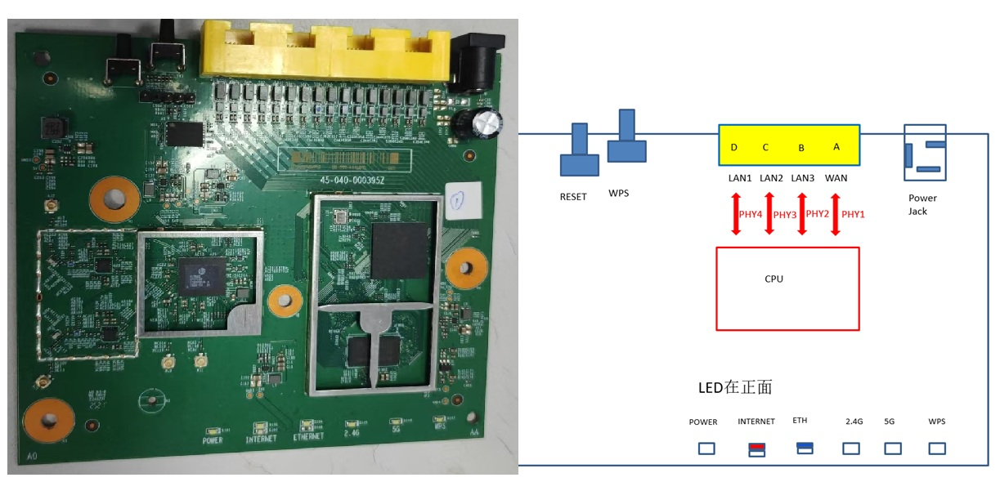
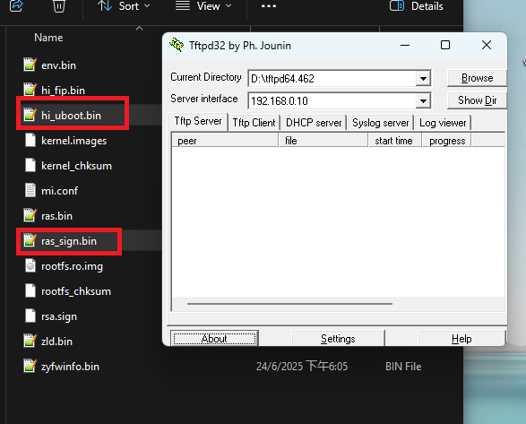
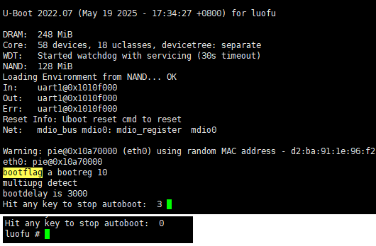
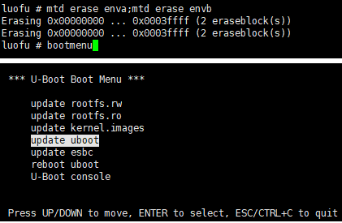
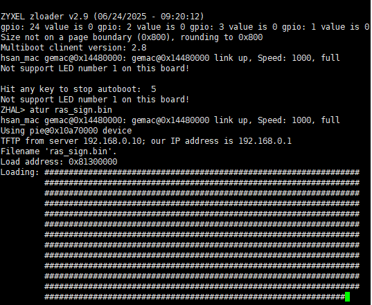
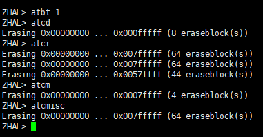
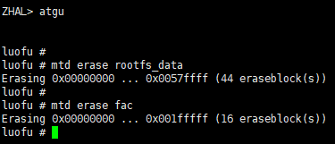
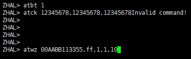
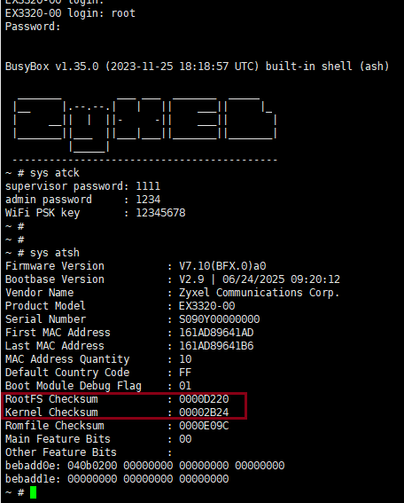
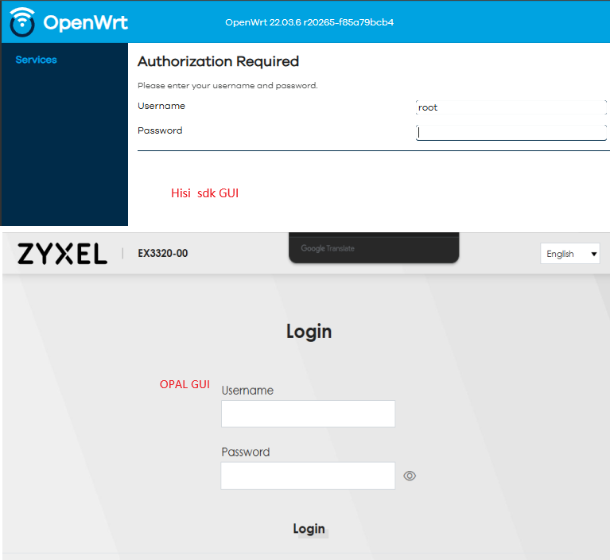

# 1. Introduction

文档用于将 EX3320-00  从 Hisi SDK  升级至 OPAL 系统




# 2. Prepare & Environment

1. 升级 FW 需要预先安装如下软件：

  - 软件 ( [MobaXterm_Installer_v20.6.zip](file://172.25.5.39/cpeswdoc/cpesw/Software/MobaXterm_Installer_v20.6.zip)  or [Xshell-6.0.0197p.exe](<file://172.25.5.39/cpeswdoc/cpesw/Software/Xshell-6.0.0197p.exe>) , 以及 [tftp](<file://172.25.5.39/cpeswdoc/cpesw/Software/tftpd32.329.zip>) )
  - 串口连接工具，以及[CH340](file://172.25.5.39/cpeswdoc/cpesw/Software/CH341SER.ZIP)串口驱动

2. 将需要升级的文件拷贝至tftp 文件夹下,如



**(Note： hisi sdk 默认登录用户名密码: root/Hisilicon@521， OPAL console 默认登录名密码： root/e78a2a88， GUI 默认登录用户 supervisor/e78a2a88 )**

具体升级分为三个步骤

1. 进入 U-Boot 环境更换 bootloader
2. 重启进入 zloader 环境，更新FW 并擦除原有分区信息。  
3. 写入数据
4. 进入 opal 页面，升级完成


# 3. 升级步骤

   1. EX3302-00 上电后进入读秒阶段，按任意键进入u-boot 环境



   2. 进入 u-boot 环境

      ```shell
      1. 擦除 enva 和 envb 分区
      luofu # mtd erase enva;mtd erase envb
         
      2.进入升级菜单升级 update uboot
      luofu # bootmenu
      ```



   3. 重启后进入zloader 命令行环境

      ```shell
      zloader > atur ras_sign.bin
      ```

      

      

   4. 擦除 opal分区

      ```shell
      1. 打开zloader写保护
      zloader > atbt 1
      2. 擦除 opal 分区
      zloader > atcd
      zloader > atcr
      zloader > atcm
      zloader > atcmisc
      ```

      


   5. 擦除rootfs_data 分区

      ```shell
      zloader > atgu
      luofu # mtd erase rootfs_data
      luofu # mtd erase fac
      ```

      

   6. 重启后再次进入zloader 开始写入数据

      ```shell
      1. 打开写保护
      zloader > atbt 1
      
      2. 依次写入[WiFi PSK key] [admiin password] [supervior password]
      zloader > atck 1235678,12345678,12345678
      
      3. 写入mac 地址 [mac] [coutnry code] [EngDbgFlag] [FeatureBit] [MacNumber]
      zloader > atwz 00AABB113355,D0,1,1,c
      
      4. 写入 SN
      zloader > atsn 5011010003385
      ```

      

7. 重启后验证 opal 升级成功 ，运行 sys atsh 后查看 kernel Checksum 和 rootfs  Checksum 是否和 Release FW 一致，升级完成

   

8. 登录 192.168.1.1 OPAL 页面

   