​                                                                                                                                                                                                                                                                                                          

# 1. FTTR介绍

FTTR 主芯片选用 RTL9617C-VW-CG双核 1.0 GH 主频 。FPGA 芯片选用 *XILINX XC7A100T-2FGG676I*， 属于XILINX Artix-7 系列。 [user guide](<https://docs.xilinx.com/r/en-US/ug470_7Series_Config/Non-Continuous-SelectMAP-Data-Loading>)

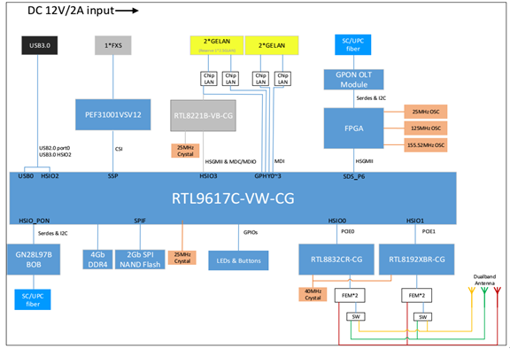

- High-Z status : 电路的输出状态, 既不是高电平，也不是低电平，由于高电阻而处于悬空状态
- open-drain : 漏极开路即高阻状态
- Push-Pull : 推挽
- ABORT : 停止状态
- deasserted(de-asserted) : 意思就是解除active状态，就是信号变为非active状态，可以是高也可以是低。
- asserted : 意思就是把信号变为active（可以理解为有效），根据系统要求不同，该有效电平可以是高电平（即高有效），也可以是低电平（即低电平有效）。
- Hight-Impedance : 高阻态
- leading-edge/ tailing-edge : 起始沿，拖尾沿


# 2. FPGA 启动模式

系统上电后，用以加载系统的微处理器 （MIC） 需要配置 FPGA 的模式, 一般情况下通过 FPGA 上的 **M[2:0]** Pin 脚以硬件电路来配置。 [FPGA 有多种配置方式](<https://blog.csdn.net/uio159753/article/details/103959762>)，这里介绍四种JTAG，Slave SelectMap ，Slave Serial ， Master SPI，并且重点介绍 Slave Serial。 [FPGA 7 series Configuration User Guide](<https://www.yumpu.com/en/document/read/16448791/xilinx-ug470-7-series-fpgas-configuration-user-guide>)


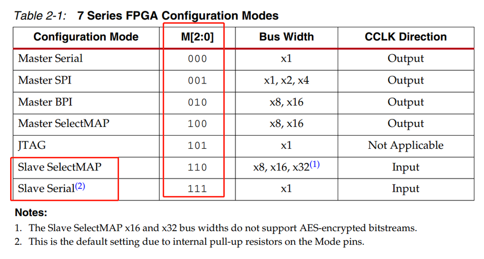


# 3.  Slave Serial Mode

**Slave Serial** 外部控制加载FPGA配置模式，通常称为从模式，此方式是由MIC控制，以串行数据传输， 配置时序。并且读取配置文件下载到FPGA中。从配置模式的优点是配置文件可以较为灵活的存储到不同类型的非易失存储器中。以 FTTR 为例，当主芯片上电后将设置 FPGA 为 Slave Seriel 模式。

## 3.1 Slave Serial Pin Description

其使用的管脚情况如下所示：

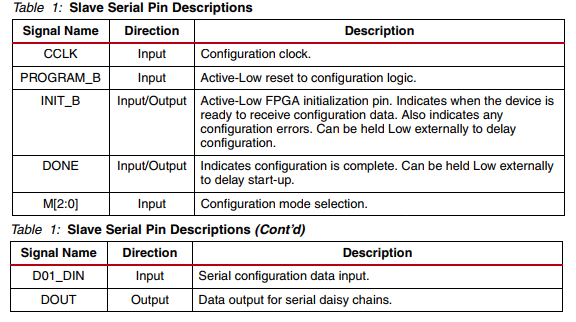

- CCLK ：为FPGA提供持续的时钟输入

- PROGRAM_B: Slave-FPGA配置逻辑复位（下降沿有效），此pin 脚用于系统启动后reset FPGA，也可用于在 MIC 不重启的情况下直接 reset FPGA 

- INIT_B ：从串模式下，作为起始信号

- DONE：FPGA程序加载完成后会将此引脚拉高，以表示加载完毕。

- M[2:0]:提供模式选择，在Slave Serial 中M[2:0]  = 111

- D01_DIN, DOUT: 为数据线用于串行数据的输入输出

[程序的基本配置顺序](<https://blog.csdn.net/u014586651/article/details/122168317>)

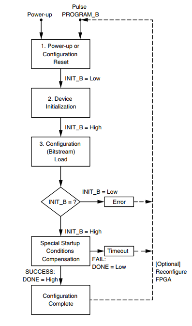

硬件连接如


## 3.2 Slave Seiral Mode上电启动过程

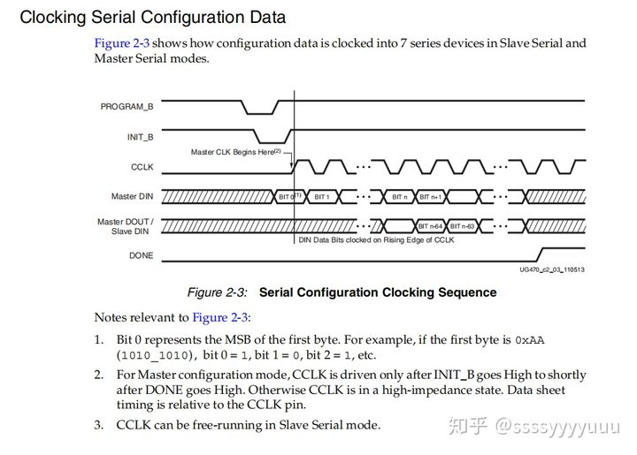

从时序图中也可以看到，整个配置过程大致如下：

1. 系统上电后，MIC首先将 **PROG_B**置为高电平，之后将 **PROG_B** 置为低电平，此时通知 FPGA复位，重置内部逻辑，延时 **Tpor** (100 μs) 充分复位内部逻辑后，将**PROG_B**置为高电平。

2. **INIT_B** 保持低电平，将 **PROG_B**置高电平大于50us后，FPGA将 **INIT_B**置为高电平，在**INIT_B**由低向高跳变的瞬间，采样配置模式选择位 **M[2:0]**，采用从串配置模式。

3. FPGA 采样配置模式后，微处理器开始配置FPGA时钟**CCLK**和数据，在**CCLK**的每个上升沿，每bit数据被传入到 **DIN**，数据字节先发低位，再发高位，配置过程中若发生错误，则**INIT_B**呈现低电平。

4. 所有配置数据传送完成，FPGA校验无误将 **DONE**输出高电平，否则为低电平。

5. **DONE**为高后，FPGA释放全局三态(GTS)，激活IO管脚，释放全部置位复位(GSR)和全局写使能(GWE)有效，开始执行配置区里的逻辑，从串模式配置完成。 

通过 **FPGA Slave Serial Mode** 的时序图，和 FPGA 上电后的启动过程， 可以得出 **INIT_B** 脚信号拉高表示FPGA重置完成，**DONE**  pin脚被拉高表示 FPGA 完成配置工作。


# 4.  Slave SelectMAP mode

**Slave SelectMap** 模式和 **Slave Serial** 同为从模式，区别在于 [SelectMap](<https://docs.xilinx.com/v/u/en-US/xapp583-fpga-configuration>) 使用并行数据输入。SelectMap配置接口提供了8/16/32bit位宽的双向数据总线，启动后首先自动检测总线位宽，然后将特殊的32位同步字符发送到配置逻辑。同时多了 CSI_B, RDWR_B 引脚用于并行数据控制。
其Pin 脚使用情况

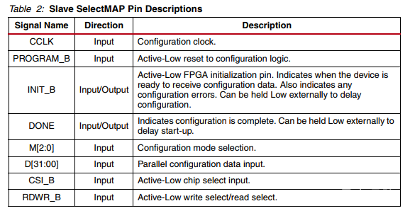

- CCLK： 配置时钟

- PROGRAM_B: 逻辑复位

- INIT_B: 开始配置触发信号

- DONE: Slave-FPGA加载完成

- M[2:0] : 模式选择 M[2:0]=110

- D[31:0]:  数据信号

- CSI_B:  Chip Select Input片选信号 1 ,Enable SelectMAP bus , 0 Disable SelectMAP bus

- RDWR_B： 读写控制 1 Reading from Slave-FPGA， 0 Writing to Slave-FPGA

程序的基本配置顺序如

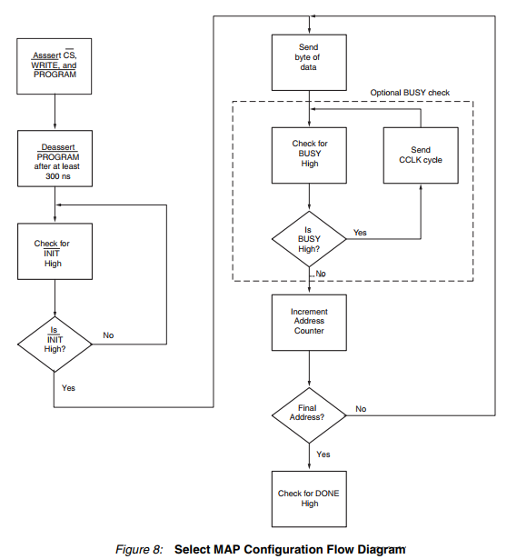

**Slave SelectMap** 支持连续数据写入和非连续数据写入。

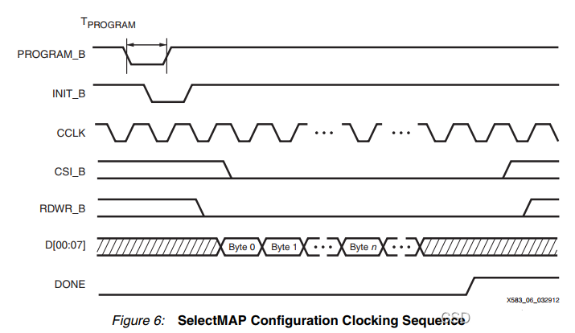

以连续数据写入为例，要求时钟，数据不间断。整个配置过程大致如下：

1. 系统上电后，MIC首先将 **PROG_B**置为高电平，之后将 **PROG_B** 置为低电平，复位FPGA内部逻辑重新配置FPGA，延时 **Tpor** (100 μs) 充分复位内部逻辑后，将**PROG_B**置为高电平。

2. MIC 将CSI_B 拉低,使能 SelectMAP Interface, 同时拉低  RDWR_B 使能 FPGA 写入，然后MIC通过 CCLK 的上升沿向FPGA 写入数据。

3. 数据传输完成 FPGA 拉高 DONE引脚 ，同时MIC 拉高 CSI_B Disable  SelectMap Interface, 完成传输操作


# 5.  JTAG Mode

FPGA 使用标准的JTAG 模式来进行配置。通过JTAG接口，可以直接对FPGA进行单独的硬件重新配置。JTAG 主要用于芯片内部测试.标准的 JTAG 接口是4线：**TMS、 TCK、TDI、TDO**，分别为模式选择、时钟、数据输入和数据输出线。

- Test Clock Input (TCK) 为TAP操作提供一个独立的，基本的时钟信号

- Test Mode Selection Input (TMS) TMS 信号用来控制 TAP 状态机的转换。通过 TMS信号，可以控制 TAP 在不同状态间相互转换。 TMS 信号在 TCK 的上升沿有效

- Test Data Input （TDI） TDI 是数据输入的接口。所有要输入到特定寄存器的数据都是通过 TDI 接口一位一位串行输入的。

- Test Data Output(TDO) 为数据输出接口。所有要从特定寄存器中输出的数据都是通过 TDO 接口一位一位串行输出的

- Test Reset Input (TRST)  非强制行的可选接口，可以用来对 TAP Controller 进行复位。

**(TAP 是指 Test Access Port 测试访问口， 在芯片内部用来控制芯片状态的中间层)**


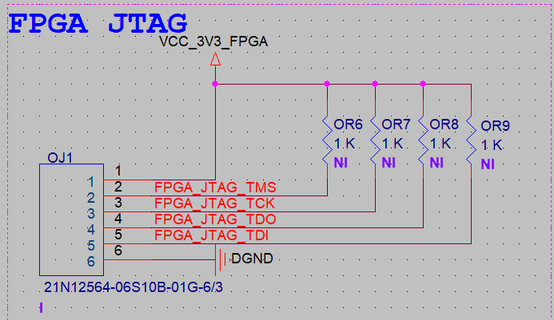


# 6.  Master SPI 模式

Master SPI模式是使用最广泛的配置模式，由于 FPG A 上的数据具有掉电易失的属性，所以通过外挂一个SPI存储器,将逻辑代码存储在SPI存储器中，FPGA上电后就会自动载入存储器中的逻辑代码。下图为官方给出的详细配置原理图。

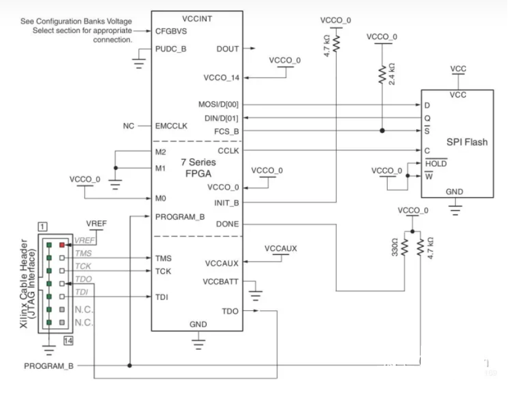

主要Pin 脚使用情况：

- CSO_B（Chip Select Output）: 仅用于并行配置多个 FPGA，用于向下游设备输出芯片使能信号。 否则，CSO_B为高阻态 .

- MOSI（Master-Output, Slave-Input）:用于 SPI flash 和 FPGA 间传输数据
- FSC_B（Flash Chip Select）：用于读取 SPI flash时输出低电平
- DIN （Date Input）： 用于传输数据，并在每个 CCLK信号的上升沿读取数据。

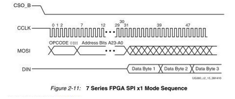

其上电时序为

1. 在Master SPI 模式中FPGA 的 FCS_B pin 脚接入 SPI Flash 的CS pin脚。FPGA 上电后，通过输出FCS_B低电平来使能 SPI Flash。

2. FPGA （Master）发送指令至  SPI Flash（Slave），SPI Flash 接受指令后，通过 DIN pin脚发送数据至 FPGA

3. FPGA接受 Flash中的数据 ，并且执行Flash中的逻辑代码


# 7. FPGA 数据格式

FPGA 支持多种[文件格式](<https://blog.csdn.net/liuhandd/article/details/124376332>)，常用为 bit, bin, msc 格式。 bit 格式为bit 流文件，可以下载到 FPGA 当中运行，掉电后会被丢失，bit 格式文件包含了用以调试的头文件。 bin 格式同为二进制文件，由bit文件生成而来 ，不包含头文件。Bit 文件和bin文件及所有的bit 流文件都不需要 Bit-Swapped。msc 格式为 ASCII文件格式，同时包含地址和校验 等PROM 的调试信息。

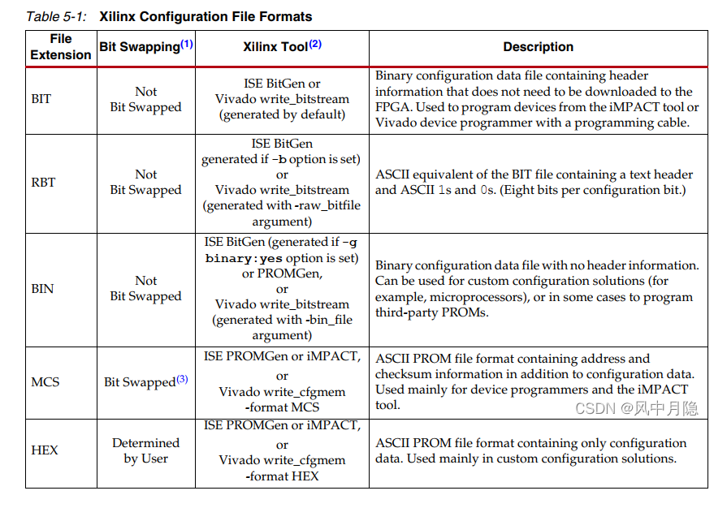

## 7.1 FPGA 比特反转

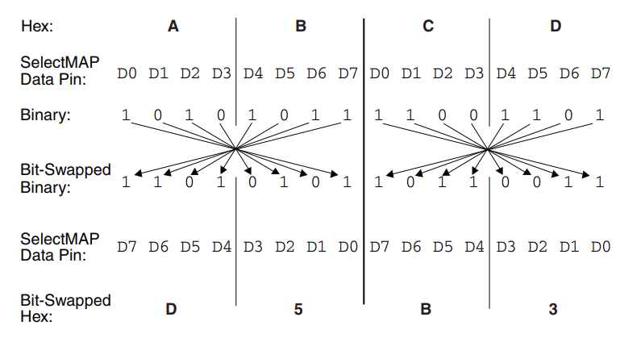


#  8. FTTR FPGA Driver

在 FTTR 项目中，Realtek 主芯片通过 HSGMII接口与FPGA 芯片传输数据，同时使用GPIO 连接 FPGA 芯片控制引脚，并且 FPGA 配置为 **Slave Serial** 模式。

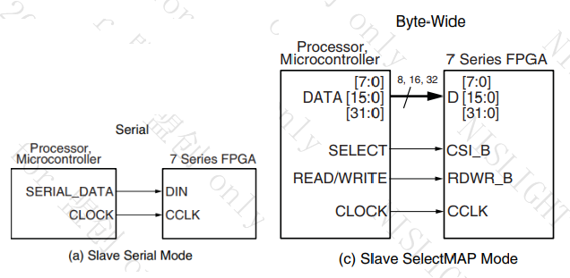

这里需要注意根据选择的配置方式对 FPGA BANK0 的 M0、M1、M2 进行配置：

Flash Mode： M[2:0] = 001;
Slave Serial Mode 时：M[2:0] = 111;
Slave SelectMAP Mode 时：M[2:0] = 110;

FPGA 通过 **HSGMII** 接口传输数据，然后通过读取 GPIO 控制 FPGA,dts 配置如下 , 

```c
sloader {
	compatible = "rtk,sloader";
	gpio-progb = <&gpio4 10 GPIO_ACTIVE_LOW>;
	gpio-done  = <&gpio4 9 GPIO_ACTIVE_LOW>;
	reserved-fpga1 = <&gpio3 9 GPIO_ACTIVE_HIGH>;
	cs-as-input  = <&gpio0 13 GPIO_ACTIVE_LOW>;
	rxd-as-input  = <&gpio0 14 GPIO_ACTIVE_LOW>;
};

olt {
		compatible = "rtk,olt";
		timeout = <30>;
		hsgmii_port = <6>; /*hsgmii port physical port*/
		olt_rst_gpio = <&gpio4 10 GPIO_ACTIVE_HIGH>;    /* PROGRAM_B, 'GPIO_OUTPUT' */
		olt_device_gpio = <&gpio4 8 GPIO_ACTIVE_LOW>;   /* INIT_B, 'GPIO_INPUT'*/
		olt_done_gpio = <&gpio4 9 GPIO_ACTIVE_LOW>;     /* DONE, 'GPIO_INPUT' */
};


```

```c
static void fpga_slave_serial_cfg(unsigned char *file)
{
    struct file *fp = NULL;
#if LINUX_VERSION_CODE < KERNEL_VERSION(4,0,0)
    mm_segment_t old_fs;
#endif
    loff_t pos = 0;
    int read_size = -1, file_size_cnt = 0 ,i = 0;;
    unsigned char *data_buf = NULL;

    fp = filp_open(file, O_RDONLY, 0644);
    if(IS_ERR(fp)) {
        printk(KERN_CRIT "fpga_slave_serial_cfg: filp_open failed!\n");
        return;
    }

    data_buf = (unsigned char *)kmalloc(DATA_BUF_LEN, GFP_KERNEL);
    if (NULL == data_buf) {
        filp_close(fp, NULL);
        
        printk(KERN_CRIT "fpga_slave_serial_cfg: kmalloc failed!\n");
        return;
    }
#if LINUX_VERSION_CODE < KERNEL_VERSION(4,0,0)
    old_fs = get_fs();
    set_fs(KERNEL_DS);
#endif
    // 1. Configuration Reset and drive CCLK low
    gpio_set_value(PIN_PROGRAM_B, VOL_LOW);
    udelay(1000);
    gpio_set_value(PIN_PROGRAM_B, VOL_HIGH);
    
    // Drive cclk low
    gpio_set_value(PIN_CCLK, VOL_LOW);
    
    // 2. Wait for Device Initialization
    // poll init_b, or just delay here
    udelay(10000);

    printk(KERN_INFO "Start slave serial cfg, done: %d.\n", gpio_get_value(PIN_DONE));
    
    // 3. Configuration (Bitstream) Load
    pos = 0;
    memset(data_buf, 0, DATA_BUF_LEN);

#if LINUX_VERSION_CODE < KERNEL_VERSION(4,0,0)
    while ((read_size = vfs_read(fp, data_buf, DATA_BUF_LEN, &pos)) > 0)
#else
    while ((read_size = kernel_read(fp, data_buf, DATA_BUF_LEN, &pos)) > 0)
#endif
    {
        file_size_cnt += read_size;
        shift_data_out(data_buf, read_size);
        
        memset(data_buf, 0, DATA_BUF_LEN);
    }
    printk(KERN_INFO "total write: %d.\n", file_size_cnt);

    // 4. Check INIT_B
    // skip

    // 5. Wait for DONE to assert
    for (i = 0; i < 10; i++) {
        if (gpio_get_value(PIN_DONE)) {
            printk(KERN_CRIT "Slave serial config DONE!\n");
            break;
        }
        udelay(5);
    }

    if (i >= 10) {
        printk(KERN_CRIT "Slave serial config failed!\n");
    }

    // 6. Compensate for Special Startup Conditions
    // skip

    filp_close(fp, NULL);
#if LINUX_VERSION_CODE < KERNEL_VERSION(4,0,0)
    set_fs(old_fs);
#endif
    kfree(data_buf);
}
```

以 FTTR 为例 ，FPGA 的CCLK pin 脚接入主芯片的GPIO_6，当需要在 DIN pin脚传输 1bit数据时GPIO_6拉高电平，传输完毕再拉低电平。

```c
static void shift_data_out(unsigned char *data, int len)
{
    int i = 0, j = 0;
    if (NULL == data || 0 == len) {
        printk(KERN_CRIT "shift_data_out invalid parameter.\n");
        return;
    }    
    local_irq_disable();
    for (i = 0; i < len; i++) {
        // MSB to LSB
        for (j = 0; j < BITS_PER_BYTE; j++) {
            // 1. output data bit
            if (0 == (data[i] & (1 << (7 - j)))) {
                gpio_set_value(PIN_DIN, VOL_LOW);
            } else {
                gpio_set_value(PIN_DIN, VOL_HIGH);
            }
            
            // 2. delay
#if USE_DUMMY_DELAY
            dummy_delay(DUMMY_DELAY_CNT);
#else
            udelay(1);
#endif            
            // 3. drive CCLK high
            gpio_set_value(PIN_CCLK, VOL_HIGH);

            // 4. delay
#if USE_DUMMY_DELAY
            dummy_delay(2*DUMMY_DELAY_CNT);
#else
            udelay(2);
#endif
            // 5. drive CCLK low
            gpio_set_value(PIN_CCLK, VOL_LOW);

            // 6. delay
#if USE_DUMMY_DELAY
            dummy_delay(DUMMY_DELAY_CNT);
#else
            udelay(1);
#endif                        
        }
    }
    local_irq_enable();   
}
```


# 9. FTTR OLT端软件接口

OLT 通过 HSGMII 高速接口连接 XG ONU。其连接过程为

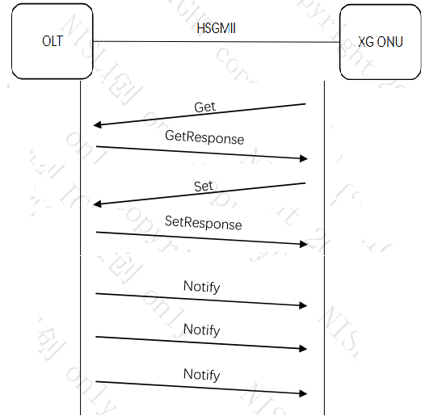

- XG ONU使用 Get 方法仅需发送  Message ID 及 ONU ID，OLT 端收到后会使用 GetResponse 方法答复，并且也会携带对应的 Message ID 和 ONU ID

- XG ONU使用 Set 方法需要发送Message ID ， ONU ID及消息内容，OLT 端收到后会使用 SetResponse 方法答复，并且携带对应的 Message ID及 ONU ID

- OLT 端对于Notify 消息会发送3此，每次间隔100ms ， XG ONU不需要回复

OLT 和XG ONE 的报文发送格式为，当Magic Code 或者Message ID 不匹配，OLT端将不会回复信息

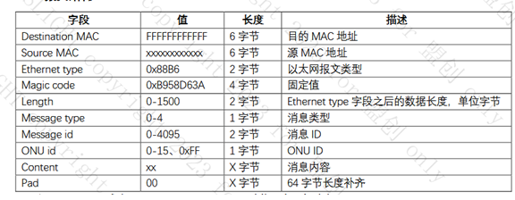

以获取及设置认证的 LOID 为例，其发送和接受信息过程如：

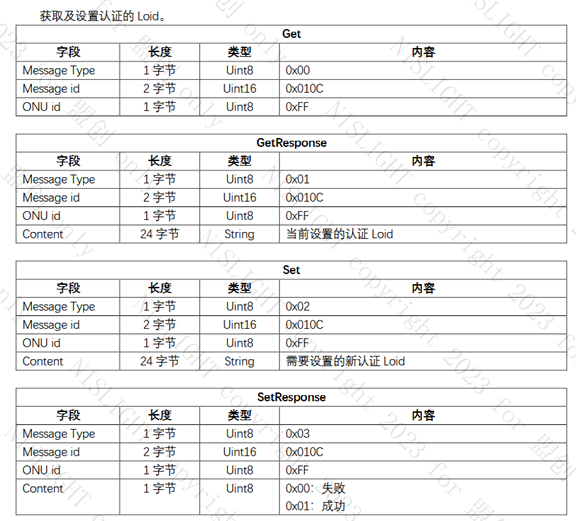


ref:

[xilinx Doc](<https://zhuanlan.zhihu.com/p/390270351>)

