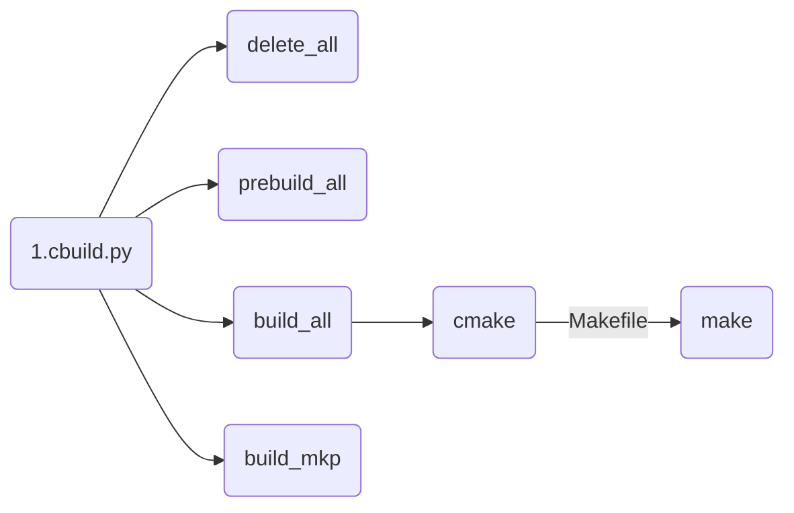
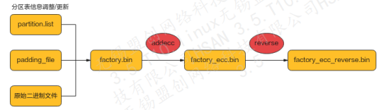

#  hi_5682 HSAN_3.5 T12 SDK Introduce

## 1. 编译指令
编译步骤:



编译 v200 xiling ，并生成 web 和 multiboot 升级文件

```shell
$ ./cbuild.py -c=xiling -p=xgpon -t=release

##  ./output/xiling_xgpon_release/images/upgrade_pkg/
##		├── V1.1.0.AA.BB.bin  
##		├── V1.1.0.AA.BB1.bin  
##		├── xiling_multi_upg.bin  
##		└── xiling_multi_upg.ini
$ cd tools/hosttool/hi_multi_upg_package
$ ./make_upgrade_package xiling xgpon release /work/cpe-hisi/sdk xgpon
```

编译 v300 tiangong0 ，并生成升级包 (  tiangong0 不支持 bootram 方式升级 u-boot 分区) 

```shell
$ ./cbuild.py -c=tiangong0 -p=cmcc_hgu -t=release

## ./tmp/tiangong0_cmcc_hgu_release/tools/hosttool/hi_multi_upg_package/
##		├── tiangong0_ker_fs_fwk.bin
##		├── tiangong0_ker_fs_multi.bin
##		├── tiangong0_ker_fs_multi.ini
##		└── tiangong0_ker_fs_sign.bin
$ cd tmp/tiangong0_cmcc_hgu_release/tools/hosttool/hi_multi_upg_package
$ ./hi_mk_upgpkg tiangong0 cmcc_hgu release rw
```

SMT Image 格式及打包指令，



```shell
## to build SMT image ，可以指定 block size, page size ,oob size，reverse byte
$ cd tools/hosttool/hi_make
$ ./mkp ~/feat-migrate-to-C2020_baseline/sdk tiangong0 cmcc_hgu release 64 2048 128 4
```


## 2. 主要配置文件及介绍

​	一个单板对应一个  _overlay.dts 文件 ，先将 .dts 编译生成.dtbo文件，多个.dtbo 按特定格式打包成一个dtbo.img，再将dtbo.img 拼接到 dtb 尾部系统。最后将整个 dtb 放到 kernel 的首部，升级后使用。 

比如 tiangong0 的平台中，在  cmcc_hgu 的 *product_info.cmake*  中配置的  *_overlay.dts 文件, 并配置 vendor_id 和 board_id，系统启动后通过 *.overlay.dts 中配置的 vendor_id 和 board_id 去匹配板级配置文件，如果匹配成功则引导启动kernel，匹配失败则重启。

```text
 chip/tiangong0/dts/vendor3_13_overlay.dts
 chip/tiangong0/dts/vendor3_30290_overlay.dts
 chip/tiangong0/product_cmcc_hgu/cmake/product_info.cmake
```

SDK 板级配置文件：

```text
 gateway/rootfs/config/conf/cfm/board_vendor3_tiangong0_13.xml
 gateway/rootfs/config/conf/cfm/board_vendor3_tiangong0_197264.xml
 gateway/rootfs/config/conf/cfm/board_vendor3_tiangong0_197264.xml
 gateway/rootfs/config/conf/cfm/sysinfo.xml
 gateway/rootfs/config/conf/cfm/preconfig/cmcc_smart_jt_4_0_1_0_2.xml
```
Flash 分区表，及 flash spec ：

```text
 chip/tiangong0/dts/tiangong0_partition_cmcc_hgu.dtsi
 chip/xiling/dts/xiling_partition_cmcc_hgu.dtsi
 ./open_source/local/u-boot/patch-u-boot-2022.07/drivers/mtd/nand/raw/nand_ids.c
```


## 3.  hsan 配置文件及主要命令

v300 主要启动配置文件

```text
/usr/local/factory/factory.txt 
(用以配置 board.username, board.userpwd ，如缺失 hidemessage.xml 显示为空 )

/usr/local/factory/board.xml
(在 tiangong0 ,cmcc_hug 中对应 board_vendor3_tiangong0_13.xml)

/usr/local/factory/bob_config.ini
(gpon 校准文件)

/usr/local/factory/sysinfo.xml
```