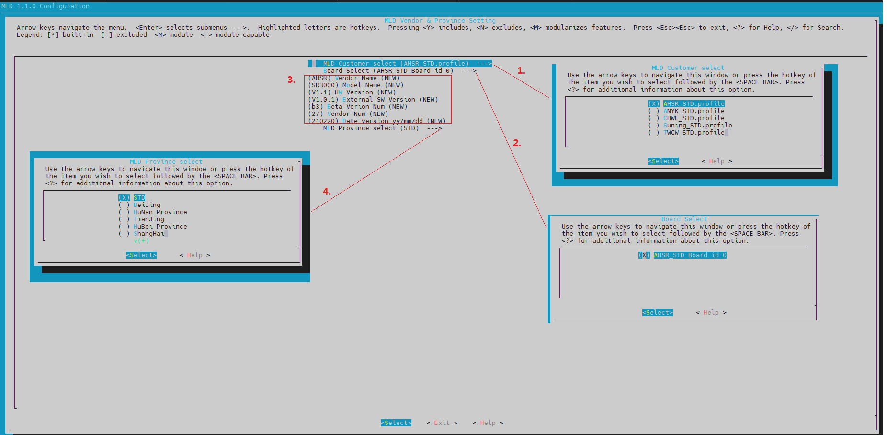

# 1. 如何编译

**预配置信息** 当前在 Trunk 中预设置的  vendor=AHSR , province = STD.  所以如果在不做任何省份配置的情况下，直接 ``make all`` , 生成的 tcboot.bin 中的信息应为  vendor = AHSR , province = 0 ,STD ,  0 指的是STD的省份编号。 在生成的 ras.bin 当中已经包含了所有 province 和 vendor 的配置信息。如果想更换配置文件，只需要修改 MRD 中对应的 vendor 和 province 就能切换包括 romfile 和 profile。

如果需要 Release FW 修改诸如 HW Version  , ISW, ESE ,VendorName 。 则需要运行 ``./province_setting.sh`` 配置脚本，用以生成配置文件 profile，并最终存入 rootfs. 生成配置文件过程如:


(Note: 在 profile 中预设 board_id ，因当前 board_id 的 GPIO 为空，故默认 board_id=0 。使用 *vendor_province_board* 作为主键来确定 profile，进而读取版本号等信息。)
最终生成 profile 格式为：

```txt
KEY=AHSR_STD_0
VENDOR_NAME=AHSR
DESCRIPT=An Hui Sheng Reng
MODEL_NAME=SR3000
HW_VERSION=V2.1
ESW_VERSION=V2.0.1


KEY=ANYK_STD_0
VENDOR_NAME=ANYK
DESCRIPT=ShiDa
MODEL_NAME=AK-A8-M
HW_VERSION=V1.0
ESW_VERSION=V1.0.1


KEY=CHWL_STD_0
VENDOR_NAME=CHWL
DESCRIPT=Sicuan ChangHong
MODEL_NAME=BWR660
HW_VERSION=A0
ESW_VERSION=V1.0.0


KEY=Suning_STD_0
VENDOR_NAME=Suning
DESCRIPT=SuNing
MODEL_NAME=SH-LYQ01
HW_VERSION=V1.0
ESW_VERSION=V1.0.0


KEY=TWCW_STD_0
VENDOR_NAME=TWCW
DESCRIPT=TWCW
MODEL_NAME=WSL172
HW_VERSION=V1.0
ESW_VERSION=V1.0.0
```

### 1.1 直接编译

​	由于预配置文件已经预先生成，并加入了 svn , 下载项目后如果只是调试可以直接编译。在 svn中预设的 vendor=AHSR ， province=STD。 不需要更改省份和vendor，常用于编译调试FW。

``` shell
$ cd trunk-utils/MLD_Scripts/
$ ./all.sh HGW-500TX2X2-E
$ make all
```


## 1.2 单独编译

如果需要 Release FW 修改诸如 HW Version , ISW, ESE ,VendorName 。 则需要运行 ./province_setting.sh 配置脚本，用以生成配置文件 profile，并最终存入 rootfs.  运行 ./province_setting.sh 配置脚本界面如下：




1.  MLD Customer select 代表需要选择的 profile 文件，其和 ``product-depconfig/province_config/vendors/`` 目录下的文件相对应。
2.  Board Select 表示需要选择的 board_id, 当前情况下，只有一个board_id ,既 board_id=0
3.  Model Name，HW Version， External  SW Version 等表示 profile 显示信息，会被压缩并写入 Profile.lzma 可以在 GUI 上查看。 Beta Version Num ， Vendor Num 和 Date Version 被用以生成内部版本号, 分别对应其中的  [1.00(XXC.0)] [BateVersion]_[DateVersion].[VendorNum].STD ， 如 “1.00(XXC.0)b3_210219.27.STD”  。
4.  MLD Province select 表示需要写入 tcboot.bin 的省份编码。
5.  点击离开并保存

需要更改已存在的其它省份和vendor，常用于release FW时的编译。具体的运行名利如下：

运行 ``./province_setting.sh`` 更新信息，保存配置文件后单独编译：

```shell
$ ./province_setting.sh
$ make all
```


### 1.3 只修改内部版本号

针对已经编译过的FW， 需要只更改 vendor 和 province 以及对应内部版本号后的编译过程，不会改变rootfs， kernel checksum 的情况，编译命令如下：

```shell
$ ./province_setting.sh
$ make province
$ make ras
```


## 1.4  新增 Province

在 `` product-depconfig/province_config/config/`` 目录下新增所需要添加的省份  *config _ {Vendor} _ {province}.xml*  (在不指定省份的情况下为 *config _ {vendor}_STD.xml* )。如在安徽圣仁下新增重庆的省份配置  ``config_AHSR_CHQ.xml``  ， 运行

```shell
$ ./province_setting.sh
$ make all
```


### 1.5  新增 Vendor & Province

在 `` product-depconfig/province_config/vendor/`` 目录下新增所需要添加的 Vendor  *{Vendor} _ {Province}.profile* 如不指定省份则为 *{vendor}_STD.profile* , 并运行

```shell
$ ./province_setting.sh
$ make all
```


# 2. 新增 profile

新增profile，则需要在 ``product-depconfig/province_config/vendors`` 中新建对应的``*.profile`` 文件。 

**文件名格式为 ``VendorName_ProvinceName.profile`` ， 其中 VendorName 为供应商简称， ProvinceName为省份简称，未指定特定省份则默认为 *STD* 。 profile 文件和 ``product-depconfig/province_config/config/``  目录中的的romfile文件相对应**。

profile 文件格式为：

```TXT
#************************************************************
#    This profile records current models information.
#    They will be operated by /etc/init.d/rcs
#    'BOARD_ID' identify the profiles.
#    'DISPLAY_VENDOR' used to display in GUI ,
#    'DESCRIPT' its whole vendor info display within GUI
#    'MODEL_NAME' subset for the vendor
#    'HW_VERSION'
#    'ESW_VERSION' external software version display for GUI 
#    'BETA' beta version \ --> ('BETA'&'VNUM' used to generate internal software version)
#    'VNUM' vendor num   /
#************************************************************
BOARD_ID=0
DISPLAY_VENDOR=Suning
DESCRIPT=SuNing 
MODEL_NAME=SH-LYQ01
HW_VERSION=V1.0
ESW_VERSION=V1.0.0
BETA=b1
VNUM=28


BOARD_ID=2
DISPLAY_VENDOR=Suning2
DESCRIPT=SuNingNew
MODEL_NAME=001
HW_VERSION=V2.0
ESW_VERSION=V3.0.0
BETA=b1
VNUM=28
 
```

``# `` 内容为注释。 ``province_setting.sh`` 会自动替换。不同的 board_id 直接通过回车换行来区分。新增profile 后。重复  *1.1 单独编译* 则可以将 profile 编入 rootfs。

- BOARD_ID  通过 board_id 来区分同一个vendor 的不同profile
- DISPLAY_VENDOR reserved 字段
- DESCRIPT  reserved 字段
- MODEL_NAME  对应 province_setting.sh 界面中的 Model Name
- HW_VERSION 对应于 province_setting.sh 界面中的 HW Version
- ESW_VESION  对应于 province_setting.sh 界面中的  External  SW Version
- BETA   对应于 province_setting.sh 界面中的  Beta Version Num
- VNUM  对应于 province_setting.sh 界面中的   Vendor Num 


# 3. 在运行环境中切换 Vendors & Province

## 3.1 Zloader 中修改

```shell
ZHAL> atvp
Vendor [Suning] , Province [0, STD]
```

如果在zloader中找不到 ``atvp``命令，则需要在系统启动后运行 ``atwz`` 将 EngDebugFlag 设置为 1.

```shell
$ sys atwz 0 1 1
$ reboot -f  
```


## 3.2 设备启动后修改

Vendors & Province 保存在 MRD 里面，通过在 console下面的 ``sys atvp`` 可以查看或更改 Vendor & Province 信息。

```shell
$ sys atvp
vendor = Suning , province = 0  (STD)
$ sys atvp ANSR ANH
$ sys atbr
```

(Note:  ``sys atvp [VendorName] [ProvinceName]`` 命令将 [VendorName] & [ProvinceName] 分别写入FS ``/tmp/vendor`` ,`` /tmp/province`` , 命令中参数  [VendorName] 区分大小写如AHSR， Ahsr 对应的应该是两个 Vendor ， [ProvinceName] 不区分大小写，省份编码根据移动规范命名。)


