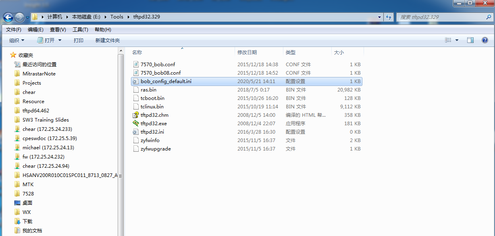

# hisi 平台 导入 bob 校准文件

用于 GN25L95 bob 校准, 默认使用 tftpd64.exe 上传活下载文件, 默认本机 ip 地址 为 192.168.1.7。

## 1. 获取 bob 默认校准文件并通过 tftp 上传

```shell
root@OpenWrt:~# cd /etc/bob/
root@OpenWrt:~# tftp -p -l bob_config_default.ini 192.168.1.7
```



检查校准文件是否正确，可以通过查看  000220 地址的 第四位是否为 0x35 来判断。既此位为 reg 0xa4 的值。


( 如附件已包含 bob_config.ini 可跳过这步 ) 


## 2. 更新bob 校准文件

```shell
root@OpenWrt:~# cd /tmp/ && tftp -g -r bob_config.ini 192.168.1.7
root@OpenWrt:~# cp ./bob_config.ini /usr/local/factory/bob_config.ini
root@OpenWrt:~# reboot
```

bob_config_default.ini 和 bob_config.ini 相同，将bob_config_default.ini 改为 bob_config.ini 以进行下列操作，如果附件为 bob_config.ini 则忽略。

for bob chip **GN25L95** , check the value of table_2 0xA4, and make sure it’s 0x35, fail if not.

```shell
root@OpenWrt:~# cli /home/cli/bob/get_reg_data -v tab 2 reg 0xA4
```

