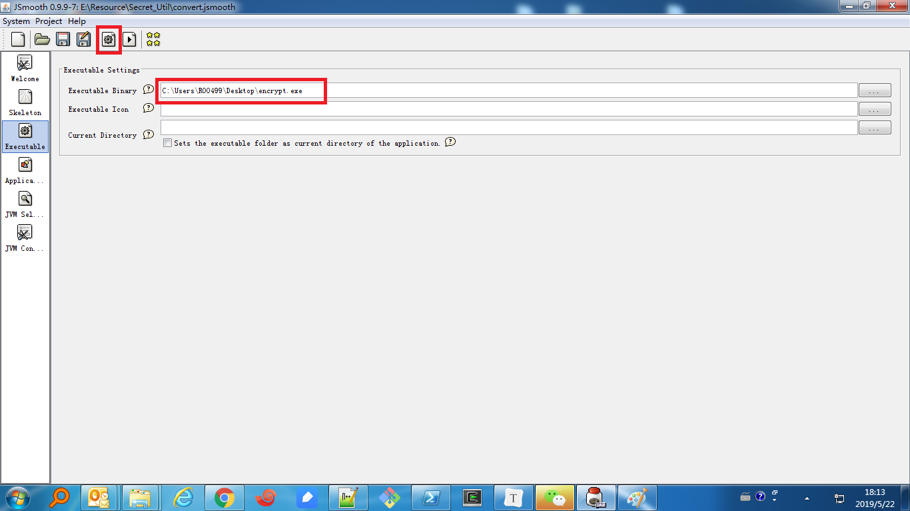

# Note()

jsmooth used to convert from java program to exe on windows

1.  download url  [jsmooth](<https://sourceforge.net/projects/jsmooth/>)
2.  needed  pre-install  JVM
3.  can release the individual executable file

   

​     