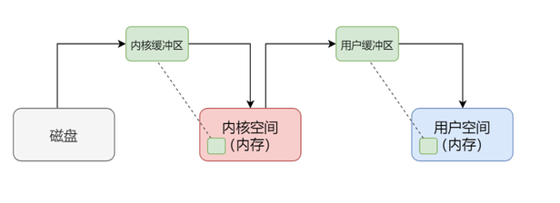
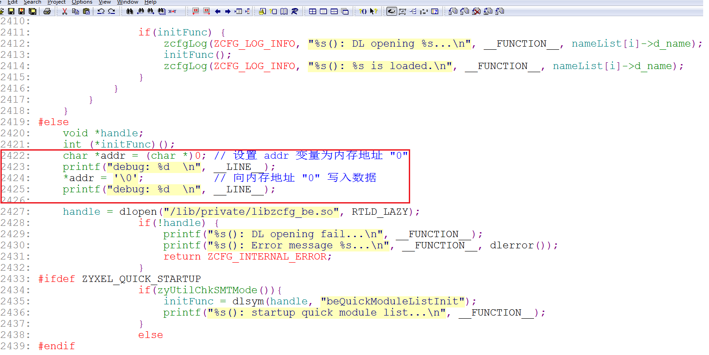
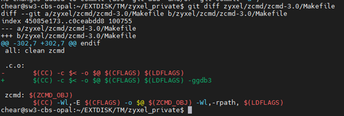
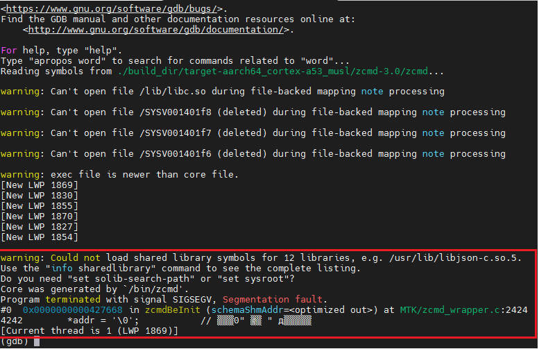
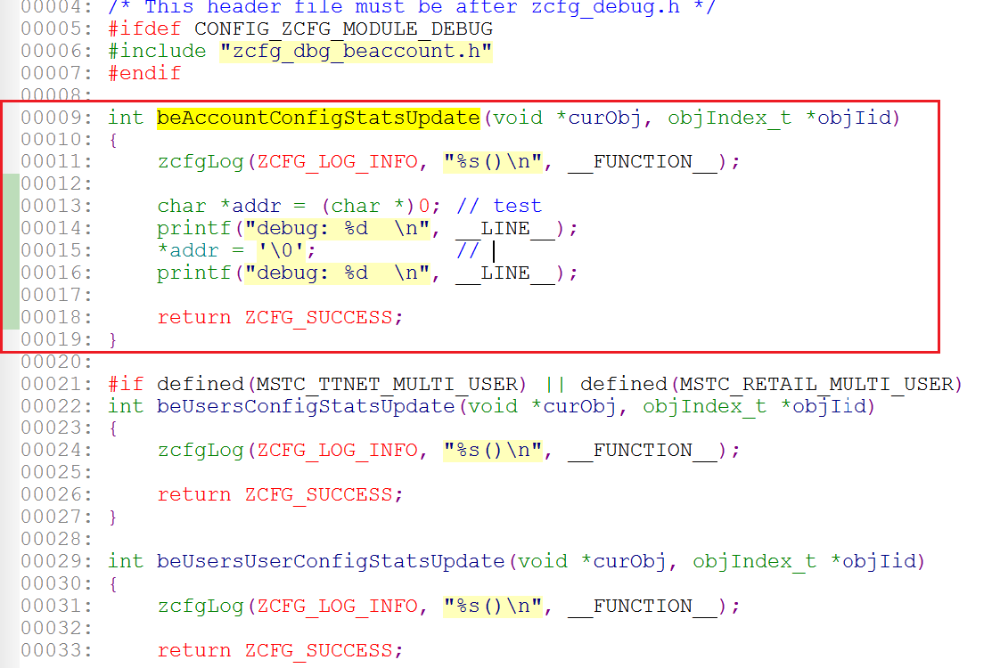
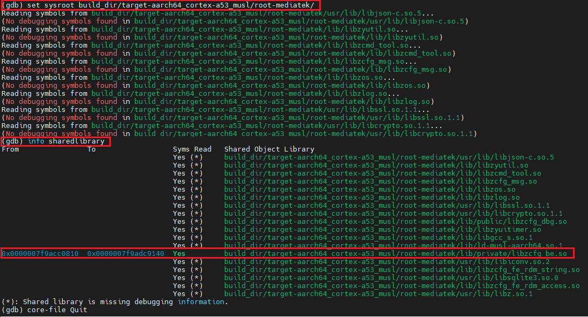
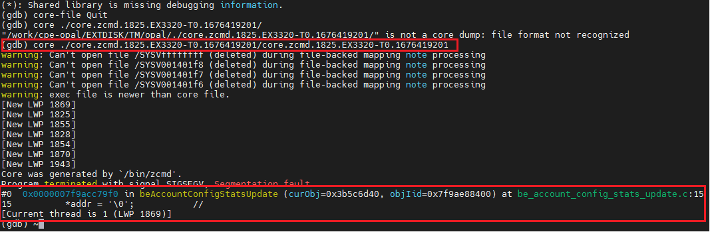

[TOC]

------


## 1. Linux coredump modules

分析 [core dump](<https://cloud.tencent.com/developer/article/1860631>) 是Linux应用程序调试的一种有效方式，core dump又称为“核心转储”，是该进程实际使用的物理内存的“快照”。分析core dump文件可以获取应用程序崩溃时的现场信息，如程序运行时的CPU寄存器值、堆栈指针、栈数据、函数调用栈等信息。

以下情况会出现应用程序崩溃导致产生core dump：

1. 内存访问越界 （数组越界、字符串无\n结束符、字符串读写越界）
2. 多线程程序中使用了线程不安全的函数，如不可重入函数
3. 多线程读写的数据未加锁保护（临界区资源需要互斥访问）
4. 非法指针（如空指针异常或者非法地址访问）
5. 堆栈溢出


## 2. 配置 coredump

通过修改 Kernel 的配置文件打开或者关闭 coredump 功能

```c
CONFIG_COREDUMP=y
CONFIG_BINFMT_ELF=y
```


### 2.1 通过 ``uilmit`` 打开 coredump 文件限制。

`` uilimit`` [^1] 命令用以显示或设置用户可以使用的资源，打开 coredump 需要设置 ``ulimit -c unlimited`` ， 通过写入 ``/proc/sys/kernel/core_pattern`` 来设置 coredump 文件保存路径。

查看进程中的 ulimit 限制, ``cat /proc/[PID]/limits ``

```shell
root@EX3320-T0:/tmp/var/home/root# cat /proc/1789/limits 
Limit                     Soft Limit           Hard Limit           Units     
Max cpu time              unlimited            unlimited            seconds   
Max file size             unlimited            unlimited            bytes     
Max data size             unlimited            unlimited            bytes     
Max stack size            8388608              unlimited            bytes     
Max core file size        0                    unlimited            bytes     
Max resident set          unlimited            unlimited            bytes     
Max processes             901                  901                  processes 
Max open files            1024                 4096                 files     
Max locked memory         65536                65536                bytes     
Max address space         unlimited            unlimited            bytes     
Max file locks            unlimited            unlimited            locks     
Max pending signals       901                  901                  signals   
Max msgqueue size         819200               819200               bytes     
Max nice priority         0                    0                    
Max realtime priority     0                    0                    
Max realtime timeout      unlimited            unlimited            us  
```


### 2.2 通过代码来设置 coredump

对于没有 ``ulimit`` 命令的平台，可以通过代码来实现保存应用程序的 coredump

```c
#include <sys/resource.h>

void init_core_dump()
{
		struct rlimit limit;
		memset(&limit , 0 ,sizeof(limit));
		limit.rlim_cur = RLIM_INFINITY;
		limit.rlim_max = RLIM_INFINITY;
		setrlimit(RLIMIT_CORE , &limit);
}

int main(int argc, char **argv) {
    init_core_dump()；  
    return 0;
}
```


### 2.3  在 zyxel 中设置 coredump
```c
CONFIG_COREDUMP=y
CONFIG_BINFMT_ELF=y
CONFIG_ZYXEL_RECORD_CALL_TRACE=y
COFNIG_ZYXEL_DEC_AND_GZIP_CORE=y
```

 ``CONFIG_ZYXEL_RECORD_CALL_TRACE``  用于保存 kernel 的崩溃信息， ``COFNIG_ZYXEL_DEC_AND_GZIP_CORE`` 用于压缩并保存应用程序的 crash 信息。

在 zyxel 的项目中可以在  ``/misc/coredump_rule.txt`` 中设置 coredump 的参数 ,  user space 程序默认保存路径 ``/misc/coredump/*`` ， kernel space 程序默认保存路径 ``/misc/koops/*`` ,

``/misc/coredump_rule.txt``  文件如下：

```shell
root@EX3320-T0:/misc# cat /misc/coredump_rule.txt 
Folder_Path=/data/coredump
Pre_Threshold=150000
Post_Threshold=8000000
```

其中“Folder_Path” 用于指定 coredump 文件的保存位置，默认保存路径为 */misc/coredump/core.*.gz*
, Pre_Threshold 则用于限制 core 文件的 [内核缓冲区](<https://blog.csdn.net/m110572/article/details/125236240>) 的大小 ， Post_Threshold 用来限制 core 文件的大小。



OPAL 补丁位于 ``target/linux/mediatek/zyxel-patches-5.4/0030-ZYXEL_ENHANCE_save_koops_and_gzip_coredump.patch``

主要文件如下

```shell
└── linux-5.4.194
    ├── arch/arm64/kernel/traps.c
    ├── fs/coredump.c
    └── fs/binfmt_elf.c
```


## 3. 调试 coredump

创建测试文件 test.c 手动产生 crash，编译后产生 test , 运行后crash 并且生成 ``/misc/coredump/core.test.29873.EX3320-T0.1675315063.gz``  

测试程序如下：

```c
int main(int argc, char **argv) {
    printf("debug: coredump  \n");
    char *addr = (char *)0; // 设置 addr 变量为内存地址 "0"
    printf("debug: %d  \n", __LINE__);
    *addr = '\0';           // 向内存地址 "0" 写入数据
    printf("debug: %d  \n", __LINE__);
    return 0;
}
```

编译 test.c ， ``-ggdb3`` 产生 gdb可以使用的 debug 信息 .（普通调试可以使用 ``-g`` ), ``-Wall -Wextra`` 用以显示所有警告。

命令如下：

```shell
./staging_dir/toolchain-aarch64_cortex-a53_gcc-8.4.0_musl/bin/aarch64-openwrt-linux-musl-gcc -ggdb3 -std=c99 -Wall -Wextra test.c -o test
```

使用 ``gdb`` 查看崩溃信息，显示在 11 行崩溃。

```shell
# ./build_dir/toolchain-aarch64_cortex-a53_gcc-8.4.0_musl/gdb-10.1/gdb/gdb test core.test.25165.EX3320-T1.1675124079
warning: Could not load shared library symbols for 2 libraries, e.g. /lib/libgcc_s.so.1.
Use the "info sharedlibrary" command to see the complete listing.
Do you need "set solib-search-path" or "set sysroot"?
Core was generated by `./test'.
Program terminated with signal SIGSEGV, Segmentation fault.
#0  0x0000000000400618 in main (argc=1, argv=0x7fd9516bd8) at ../test.c:11
11          *addr = '\0';           // 向内存地址 "0" 写入数据
(gdb)
```


## 4. 调试 coredump 内核信息

创建 test_module.c 用于手动制造 OOPS。

```c
#include <linux/module.h>
static int __init test_module_init(void)
{
	int *a;
	a = (int*) 0x00001234;
	*a = 2;
	printk("chear_kernel: test module oops");
	return 0;
}

static void __exit test_module_exit(void) {}

module_init(test_module_init);
module_exit(test_module_exit);

MODULE_AUTHOR("chear");
MODULE_LICENSE("GPL");
MODULE_DESCRIPTION("TEST");
```

单独编译 *test_module.ko* 

```shell
export PATH=/work/cpe-opal/EXTDISK/merge_cicd/opal/staging_dir/toolchain-aarch64_cortex-a53_gcc-8.4.0_musl/bin/:$PATH
make -C ../build_dir/target-aarch64_cortex-a53_musl/linux-mediatek_ex3320t0/linux-5.4.194/ V=1 CROSS_COMPILE="aarch64-openwrt-linux-musl-" ARCH="arm64" M=`pwd` modules
```

运行后 设备重启， crash 信息如下

```shell
 Unable to handle kernel paging request at virtual address 0000000000001234
 Mem abort info:
   ESR = 0x96000046
   EC = 0x25: DABT (current EL), IL = 32 bits
   SET = 0, FnV = 0
   EA = 0, S1PTW = 0
 Data abort info:
   ISV = 0, ISS = 0x00000046
   CM = 0, WnR = 1
 user pgtable: 4k pages, 39-bit VAs, pgdp=00000000430bf000
 [0000000000001234] pgd=0000000041887003, pud=0000000041887003, pmd=0000000000000000
 Internal error: Oops: 96000046 [#1] SMP
 [arch/arm64/kernel/traps.c,__die,309]: oops_name: /misc/koops/2023-02-03_08-12-48_oops.txt
 Modules linked in: test_module(+) nf_nat_rtsp nf_conntrack_rtsp nf_nat_ftp nf_conntrack_ftp nciTMSkmod(P) exLinuxETH(P) Lservices(P) xt_connlimit pppoe ppp_async nf_conncount l2tp_ppp iptable_nat xt_state xt_nat xt_helper xt_connzextmark xt_conntrack xt_connmark xt_connbytes xt_REDIRECT xt_MASQUERADE xt_FLOWOFFLOAD xt_CT pptp pppox ppp_mppe ppp_generic nf_nat_tftp nf_nat_snmp_basic nf_nat_sip nf_nat_pptp nf_nat_irc nf_nat_h323 nf_nat_amanda nf_nat nf_flow_table_hw nf_flow_table nf_conntrack_tftp nf_conntrack_snmp nf_conntrack_sip nf_conntrack_pptp nf_conntrack_netlink nf_conntrack_irc nf_conntrack_h323 nf_conntrack_broadcast nf_conntrack_amanda nf_conntrack ipt_REJECT ebtable_nat ebtable_filter ebtable_broute zy_nfhook xt_zextmark xt_time xt_tcpmss xt_statistic xt_recent xt_quota xt_policer xt_pkttype xt_owner xt_multiport xt_mark xt_mac xt_limit xt_length xt_iprange xt_hl xt_ecn xt_dscp xt_comment xt_addrtype xt_TCPMSS xt_NFQUEUE xt_LOG xt_HL xt_DSCP xt_CLASSIFY xt_AUTOMAP
[2023/2/3 16:12:49] [ 2741.996445]  ts_kmp ts_fsm ts_bm slhc nfnetlink_queue nfnetlink nf_reject_ipv4 nf_log_ipv4 nf_defrag_ipv6 nf_defrag_ipv4 mtk_warp_proxy(P) mtfwd mt_wifi(P) libcrc32c iptable_raw iptable_mangle iptable_filter ipt_ECN ip_tables ebtables ebt_zextmark_m ebt_zextmark ebt_vlan ebt_stp ebt_redirect ebt_policer ebt_pkttype ebt_mark_m ebt_mark ebt_limit ebt_ip6 ebt_ip ebt_ftos ebt_arp ebt_among ebt_AUTOMAP ebt_802_3 crc_ccitt asn1_decoder fuse sch_tbf sch_ingress sch_htb sch_hfsc em_u32 cls_u32 cls_tcindex cls_route cls_matchall cls_fw cls_flow cls_basic act_skbedit act_mirred act_gact ip6t_rt ip6t_mh ip6t_ipv6header ip6t_hbh ip6t_frag ip6t_eui64 ip6t_ah nf_log_ipv6 nf_log_common ip6table_mangle ip6table_filter ip6_tables ip6t_REJECT nf_reject_ipv6 nfsd ip_gre gre sit l2tp_netlink l2tp_core udp_tunnel ip6_udp_tunnel tunnel4 ip_tunnel rpcsec_gss_krb5 auth_rpcgss oid_registry vfat fat lockd sunrpc grace autofs4 nls_utf8 nls_iso8859_1 nls_cp437 sha512_generic sha1_generic seqiv md5 md4 ghash_generic
  gf128mul gcm des_generic libdes cts ctr ccm cbc arc4 mtk_warp mtkhnat leds_gpio gpio_button_hotplug conninfra crc32c_generic [last unloaded: mapfilter]
 CPU: 1 PID: 4612 Comm: insmod Tainted: P                  5.4.194 #0
 Hardware name: MediaTek MT7981 RFB (DT)
 pstate: 40000005 (nZcv daif -PAN -UAO)
 pc : test_module_init+0x10/0x1000 [test_module]
 lr : do_one_initcall+0x74/0x1c8
 sp : ffffffc015603ba0
 x29: ffffffc015603ba0 x28: 0000000000000003 
 x27: ffffffc0109a8250 x26: ffffffc008b29000 
 x25: ffffffc015603d60 x24: ffffffc0108d1618 
 x23: 0000000000000000 x22: ffffffc008b2c000 
 x21: ffffff80033e0000 x20: ffffffc0108d1618 
 x19: ffffffc010a03000 x18: 0000000000000000 
 x17: 0000000000000000 x16: 0000000000000000 
 x15: 5416010b13001b1f x14: ff00000000000000 
 x13: 0000000000000000 x12: 0000000000000018 
 x11: 0101010101010101 x10: ffffffff7f7f7f7f 
 x9 : ffffff800ff5d510 x8 : ffffffff0010bc48 
 x7 : ffffffbfff5d6000 x6 : 0000000000000000 
 x5 : 0000000000000000 x4 : 0000000000141f87 
 x3 : ffffff800bcc0380 x2 : 0000000000000002 
 x1 : 0000000000001234 x0 : 0000000000000000 
 Call trace:
  test_module_init+0x10/0x1000 [test_module]
  do_one_initcall+0x74/0x1c8
  do_init_module+0x40/0x1e0
  load_module+0x1ac0/0x1d08
  __do_sys_init_module+0x140/0x1d0
  __arm64_sys_init_module+0x18/0x20
  el0_svc_common.constprop.2+0x7c/0x110
  el0_svc_handler+0x20/0x80
  el0_svc+0x8/0x680
 __die,321,oops=/misc/koops/2023-02-03_08-12-48_oops.txt
 Code: a9bf7bfd d2824681 52800042 910003fd (b9000022) 
 __die,334, close oops_file
 ---[ end trace fe801b31e67ffb17 ]---
 Kernel panic - not syncing: Fatal exception
 SMP: stopping secondary CPUs
 Kernel Offset: disabled
 CPU features: 0x00002,20002008
 Memory Limit: none
 Rebooting in 3 seconds..
```

使用内核自带脚本 ``scripts/decodecode`` 分析  **Code: a9bf7bfd d2824681 52800042 910003fd (b9000022) ** 可以获取出错的指令, 并且对比反编译后的 c 代码可以确定行号。

解析结果如下：

```shell
$./scripts/decodecode < ./decode.txt
Code: a9bf7bfd d2824681 52800042 910003fd (b9000022)
All code
========
   0:   fd                      std
   1:   7b bf                   jnp    0xffffffffffffffc2
   3:   a9 81 46 82 d2          test   $0xd2824681,%eax
   8:   42 00 80 52 fd 03 00    rex.X add %al,0x3fd52(%rax)
   f:   91                      xchg   %eax,%ecx
  10:*  22 00                   and    (%rax),%al               <-- trapping instruction
  12:   00                      .byte 0x0
  13:   b9                      .byte 0xb9

Code starting with the faulting instruction
===========================================
   0:   22 00                   and    (%rax),%al
   2:   00                      .byte 0x0
   3:   b9                      .byte 0xb9
```

用 objdump 分析对应代码 ,对比  decodecode 解析出的代码，可以找到对应的偏移量为 10。

```shell
$ ./staging_dir/toolchain-aarch64_cortex-a53_gcc-8.4.0_musl/bin/aarch64-openwrt-linux-objdump -d module_test/test_module.o

module_test/test_module.o:     file format elf64-littleaarch64


Disassembly of section .init.text:

0000000000000000 <init_module>:
   0:   a9bf7bfd        stp     x29, x30, [sp, #-16]!
   4:   d2824681        mov     x1, #0x1234                     // #4660
   8:   52800042        mov     w2, #0x2                        // #2
   c:   910003fd        mov     x29, sp
  10:   b9000022        str     w2, [x1]
  14:   90000000        adrp    x0, 0 <init_module>
  18:   91000000        add     x0, x0, #0x0
  1c:   94000000        bl      0 <printk>
  20:   52800000        mov     w0, #0x0                        // #0
  24:   a8c17bfd        ldp     x29, x30, [sp], #16
  28:   d65f03c0        ret

Disassembly of section .exit.text:

0000000000000000 <cleanup_module>:
   0:   d65f03c0        ret
```

使用 addr2line  找到 test_module.c 对应的代码。

```shell
$ ./staging_dir/toolchain-aarch64_cortex-a53_gcc-8.4.0_musl/bin/aarch64-openwrt-linux-addr2line -e ./module_test/test_module.o 10
/work/cpe-opal/EXTDISK/merge_cicd/opal/module_test/test_module.c:7
```


## 5. 调试 coredump 内核信息

### 5.1 zcmd 中调试 coredump

在 zcmd 中引入错误代码



在 Makefile 中加入编译选项 –ggdb3 or -g



编译后烧入主板，重启后系统运行zcmd会崩溃并生成core 文件 ``/misc/coredump/core.zcmd.1825.EX3320-T0.1676419201.gz`` .

( zcmd 崩溃后可能会导致主系统串口无法登陆，此时可以重启进入 zloader 命令行并运行‘atsw’指令以从系统启动，同时在启动后注意查看 boot flag是否改变，以确定启动顺序改变.)

导出 coredump 文件，并使用 tar 解压 *core.zcmd.1825.EX3320-T0.1676419201.gz*，用 gdb 查看 core 文件可以轻松找到引起崩溃所对应的文件和行数

```shell
# ./build_dir/toolchain-aarch64_cortex-a53_gcc-8.4.0_musl/gdb-10.1/gdb/gdb
(gdb) file build_dir/target-aarch64_cortex-a53_musl/zcmd-3.0/zcmd
(gdb) core core.zcmd.1825.EX3320-T0.1676419201
```

成功获取错误的行号




### 5.2  查看动态链接库 coredump文件

在 *be_account_config_stats_update.c* 引入错误代码



解压 *core.zcmd.1827.OpenWrt.1676419200.gz* , 使用 gdb 调试 coredump

```shell
# ./build_dir/toolchain-aarch64_cortex-a53_gcc-8.4.0_musl/gdb-10.1/gdb/gdb
(gdb) file build_dir/target-aarch64_cortex-a53_musl/zcmd-3.0/zcmd
(gdb) core core.zcmd.1827.OpenWrt.1676419200
(gdb) set sysroot build_dir/target-aarch64_cortex-a53_musl/root-mediatek/
(gdb) info sharedlibrary
```

查看动态链接库的偏移地址



查看错误行号




### 5.3. gdb 调试 coredump总结

使用 gdb 分析 coredump 可以快速定位错误文件和行号，同时注意

\1. 在使用 gdb 调试 coredump 之前应该在所需要调试的程序或者动态链接库中加入 –ggdb3 来重新编译生成带有调试信息的可执行文件和动态链接库

\2. 在gdb 中读入 coredump 文件时，需要将已加入 –ggdb3 且重新编译后的库文件加入到gdb的搜索路径。比如我们在 7.2 的示例中把重新编译后的 libzcfg_be.so 拷贝到 build_dir/target-aarch64_cortex-a53_musl/root-mediatek/lib/private/ 目录下以替换原有的 libzcfg_be.so ，同时在 gdb 命令行使用“set sysroot build_dir/target-aarch64_cortex-a53_musl/root-mediatek”将 libzcfg_be.so加入到gdb搜索路径。

3.当获取行号出现乱码时，可以在 gdb 中使用“info sharedlibrary”确认动态链接库是否已经被加入到 gdb的搜索路径。如果没有则需要重新加入。

 


[^1]: ``ulimit`` is *shell* buildin command, local at  *busybox-1.31.1/shell/shell_common.c*