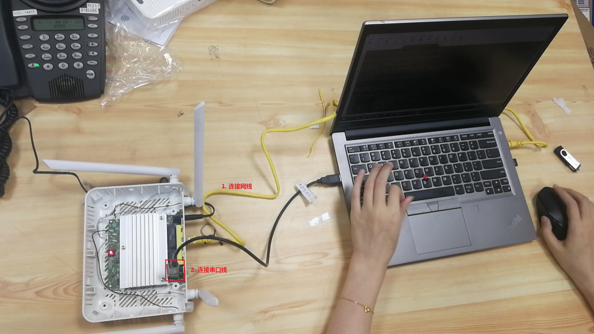
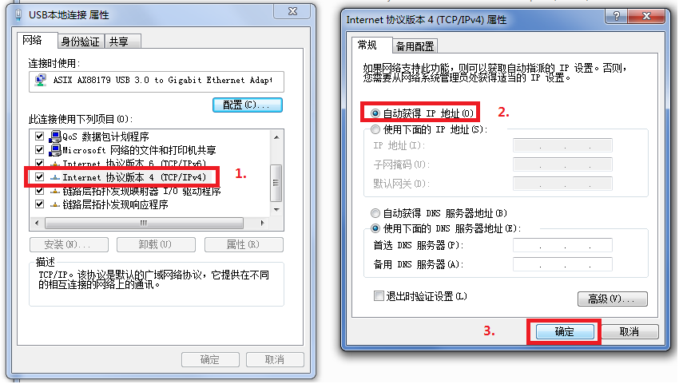

# wifi6 路由器 Firmware 升级  SOP

## 1. 使用 Express 升级

##### 1.1 搭建组播升级环境如下图所示

##### 1.2下载 [<u>Express</u>](\\172.25.5.39\firmware\WX\HGW-500TX2X2-E v3\100ABZY0b6_20220104) 组播升级工具 , 运行后如下，单击 "Start" 按钮

##### 1.3 重新给设备上电后， 红色和蓝色LED  双闪，表示正在进行组播升级;  升级完成后红色和蓝色 LED 改为常亮,此时表示升级成功，可以单击 Stop 按钮关闭 Express 升级工具 ，并重启路由器。​

##### 1.4  登录 GUI 通过查看外部版本号, 验证是否升级成功

## 2. 使用 atub 命令升级 tcboot

##### 2.1 搭建升级环境连接路由器串口及网线如1.1 所示，下载 [<u>升级文件_b6</u>](\\172.25.5.39\firmware\WX\HGW-500TX2X2-E v3\100ABZY0b6_20220104) 如：

##### 2.2 打开串口工具 , 如 [<u>MobaXterm_Installer_v20.6.zip</u>](<\\172.25.5.39\cpeswdoc\cpesw\Software\MobaXterm_Installer_v20.6.zip>)  or [<u>Xshell-6.0.0197p.exe</u>](<\\172.25.5.39\cpeswdoc\cpesw\Software\Xshell-6.0.0197p.exe>)  , 在开机读秒的时间内按任意键进入 ZBoot 命令操作模式, 输入 ``atub V1.00(ABZY.0)b6_20220104.bm``  升级tcboot 如

**(请注意命令提示符 "ZHAL>")**

##### 2.3 打开 [<u>tftp</u>](\\172.25.5.39\cpeswdoc\cpesw\Software\tftpd32.329.zip) 工具，设置 Host IP 为 192.168.1.1 并选择升级文件，此处为"[<u>V1.00(ABZY.0)b6_20220104.bm</u>](\\172.25.5.39\firmware\WX\HGW-500TX2X2-E v3\100ABZY0b6_20220104\V1.00(ABZY.0)b6_20220104.bm)" , 单击 "Put" 按钮，如：

​	 **升级成功后路由器自动重启， tftp 显示如：**

## 3. 使用 atur 命令升级 ras

##### 3.1 搭建升级环境连接路由器串口及网线如 1.1 所示，并下载升级文件 [<u>V1.00(ABZY.0)b6_20220104.bin</u>](\\172.25.5.39\firmware\WX\HGW-500TX2X2-E v3\100ABZY0b6_20220104\V1.00(ABZY.0)b6_20220104.bin) 如 2.1所示

##### 3.2 打开串口工具进入 ZBoot 命令操作模式, 输入 ``atur V1.00(ABZY.0)b6_20220104.bin``

##### 3.3 打开 tftp ，输入 Host IP, 并选择升级文件 "V1.00(ABZY.0)b6_20220104.bin" ,如图

##### 3.4 点击 put 后，开始升级，升级完成后自动重启。

## 4. 页面升级

##### 4.1 搭建升级环境如 1.1, 设置 pc 自动获取 ip 地址如：

##### 4.2 进入升级页面 ZNet 为 [http://192.168.123.0/LocalFirmwareUpgrade](http://192.168.123.1/LocalFirmwareUpgrade) ，同时请注意区分 ZNet, TM , ZyXEL, 后两者的升级页面为 [192.168.0.1/FirmwareUpgrade](http://192.168.0.1/FirmwareUpgrade)  和 [192.168.1.1/FirmwareUpgrade](http://192.168.1.1/FirmwareUpgrade) 。选择升级文件如 [<u>V1.00(ABZY.0)b6_20220104.bin</u>](\\172.25.5.39\firmware\WX\HGW-500TX2X2-E v3\100ABZY0b6_20220104\V1.00(ABZY.0)b6_20220104.bin) ， 点击"Upload" 按钮进行升级, 此时路由器的 LED 为红灯和蓝灯常亮，当 LED 变为蓝灯单闪表示路由器升级成功并且已重启。

##### 4.3 通过登录GUI 查看版本号，验证是否升级成功，如1.4

## 5. 数据生成工具

##### 5.1 拷贝生成工具  [<u>EX3220-T0_TM_GenKeyTool_V2.3_64_v7_2.zip</u>](\\172.25.5.39\firmware\WX\Windows Utility\GenKeyTool\EX3220-T0_TM_GenKeyTool_V2.3_64_v7_2.zip)  至桌面，并解压至当前文件夹。 Win+ R 进入程序运行窗口，输入 cmd 后点击确定。 然后输入 “cd Desktop\EX3220-T0_TM_GenKeyTool_V2.3_64_v7_2” 进入生成工具文件夹。如：

##### 5.2 运行命令 “EX3220-T0_TM_GenKeyTool_V2.3_64_v7_2.exe --devcnt 3 --mac 1C740D999190 --macqty 16 --sn RG6GLEEX2112000001 --adminpwlen 8 --adminpwprefix Adm@ --adminpwsrc MAC --supervisorpwlen 10  --supervisorpwsrc SN --supervisorpwencrypt SHA256 --psk_fix password” ， 打印数据并在当前文件夹生成数据文件 output.txt。 命令行参数解释请参考一同被解压的 Note.txt 文件。

## 6. 使用 telnet 将生成信息写入路由器

##### 6.1 将网络连接至路由器如 1.1 所示， Win+R  打开生成的数据文件 output.txt , 生成数据格式为：

##### 6.2 登录路由器 GUI 并开启telnet功能如：

##### 6.3 使用 telnet 登录路由器 如：

 

###### 6.4 通过 “sys atsh” 查看 Debug Flag, 当 Debug Flag 为 ‘1’ 能够进行后续操作； 为 ‘0’ 则无法进行后续操作，需要联系RD修改 Debug Flag 如：

##### 6.5  输入telnet 用户名和密码登录路由器后，使用 "sys atsn" 命令修改  “Serial Number”，修改完成后使用 “sys atsh” 命令查看修改结果如：（注意使用 admin 登录命令提示符为 ZySH> ,而使用 root 登录则命令提示符变为 # ）

##### 6.6 根据生成数据使用 "sys atck" 修改 "WiFi PSK key", "admin password" 和 “supervisor password” , 内容如 6.1 所示， 修改完成后使用 "sys atck" 查询修改结果如：

##### 6.7 使用命令  “sys atwz” 修改 mac 地址,修改完成后使用 "sys atsh" 查看修改结果

