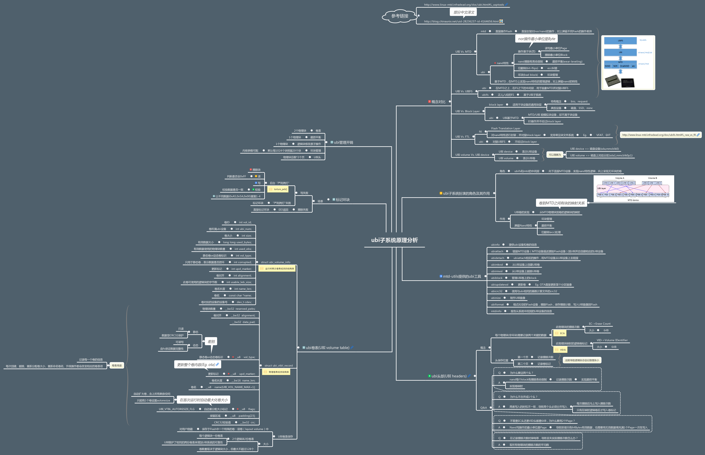
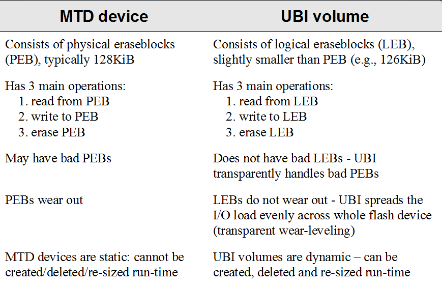
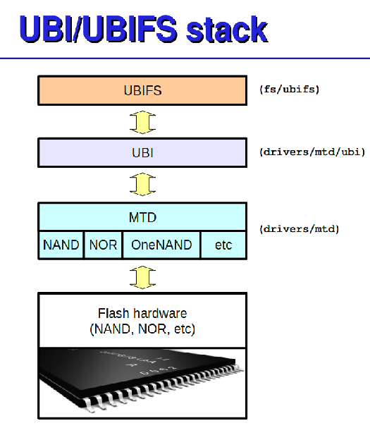

# 1.  UBI (Unsorted Block Images) & UBIFS Introduction

*UBI* [^1] its a volume management system for *raw flash* [^2 ] devices which manages multiple logical volumes on a single physical flash device and spreads the I/O load (i.e, wear-leveling) across whole flash chip.

- UBI is **not** a **FTL(Flash Translation Layer)** [^3], and it has nothing to do with FTL .
- UBI works with bare flashes, and it **does not** work with consumer flashes like *MMC, RS-MMC, 	eMMC , SD, mini-SD, micro-SD, CompactFlash,  MemoryStick,  USB flash drive*, etc; instead, UBI works with **raw** flash devices, which are mostly found in embedded devices like mobile phones, etc.

ref : [UBI introduction for cn](<https://blog.51cto.com/knifeedge/5136332>)


[UBIFS](https://elixir.bootlin.com/linux/v5.0/source/Documentation/filesystems/ubifs.txt) file-system stands for **Unsorted Block Images File System** . UBIFS is a flash file system means designed to work with flash devices and that completely different to any traditional file-system in Linux, like Ext2 , JFS , etc. That represents a separate class of file-systems which work with MTD devices, not block devices.

- Difference MTD device & Block device

| MTD Device                                                   | Block Device                                                 |
| ------------------------------------------------------------ | ------------------------------------------------------------ |
| consist of eraseblocks size about 128KiB                     | consist of sectors typically 512 bytes.                      |
| Maintains3 main operations - read from offset within eraseblock, write to some offset within eraseblock, and erase a whole  eraseblock | Maintains 2 main operations - read a whole  block and write a whole block. |
| erase whole eraseblock before re-write                       | just re-written.                                             |
| eraseblocks wear-out and become bad after 10^3 erase cycles  | sectors are devoid of the wear-out property                  |
| bad eraseblocks not hidden  and should deal with in software | bads sectors are re-mapped and hidden by hardware,           |

[UBIFS overview](<https://www.cnblogs.com/gmpy/p/10874475.html>)



- Difference MTD & UBI



[UBI stack](<http://www.linux-mtd.infradead.org/doc/ubifs.pdf>)




main source file for UBIFS , after `mount` command should be perform

```shell
# tree linux-5.4.194/fs/ubifs/
├── super.c
├── dir.c
├── file.c
├── commit.c
├── ubifs.h
├── ubifs-media.h
├── journal.c
├── lprops.c
├── io.c
├── orphan.c
└── xattr.c
```

main source for UBI framework

```shell
# tree linux-5.4.194/drivers/mtd/ubi/
├── attach.c
├── block.c
├── build.c
├── cdev.c
├── debug.c
├── debug.h
├── eba.c
├── fastmap.c
├── fastmap-wl.c
├── gluebi.c
├── io.c
├── kapi.c
├── misc.c
├── ubi.h
├── ubi-media.h
├── upd.c
├── vmt.c
├── vtbl.c
└── wl.c

```


# 2. UBI User-space tools


The source at `build_dir/target-aarch64_cortex-a53_musl/mtd-utils-2.1.2/ubi-utils/` contains the following UBI tools [^2]:

- `ubinfo` - provides information about UBI devices and volumes found in the system;
- `ubiattach` - attaches MTD devices (which describe raw flash) with UBI which creates corresponding UBI devices;
- `ubidetach` - detaches MTD devices from UBI devices (the opposite to what `ubiattach` does);
- `ubimkvol` - creates UBI volumes on UBI devices;
- `ubirmvol` - removes UBI volumes from UBI devices;
- `ubiblock` - manages block interfaces for UBI volumes. 	See [here](http://www.linux-mtd.infradead.org/doc/ubi.html#L_ubiblock) for more information;
- `ubiupdatevol` - updates UBI volumes; this tool uses the 	[UBI volume update feature](http://www.linux-mtd.infradead.org/doc/ubi.html#L_volupdate) which 	leaves the volume in "corrupted" state if the update was interrupted; additionally, this tool may be used to wipe out UBI volumes;
- `ubicrc32` - calculates `CRC-32` checksum of 	a file with the same initial seed as UBI would use;
- `ubinize` - generates UBI images;
- `ubiformat` - formats empty flash, erases flash and preserves erase counters, flashes UBI images to MTD devices;
- `mtdinfo` - reports information about MTD devices 	found in the system.

All UBI tools support an "-h" option which prints basic usage information.


# 3.  Make UBI Image

zyxel mtd layout:

```text
	|-----------|
	|  bl2.img  |
	|-----------|
	|  env      |  u-boot-env.bin
	|-----------|
	|  factory  |  RootFS
	|-----------|
	|  fip.bin  |                           |-----------|
	|-----------|                           | kernel    |
	|  zloader  |   zloader.bin.gz.uImage   | rootfs    |  (ubi volume ubi0_0 ubi0_3)
	|-----------|                           | zyfwinfo  |  
	|  ubi      |   kernel && rootfs -------| root_data |
	|-----------|                           |-----------|
	|  ubi 2    |  
	|-----------|
	|  zyubi    |          |--------|
	|-----------|  --------| romfile|
	(mtd partitions)       | rom-d  |
	                       | wwan   | (ubi volume ubi1_0 ~ ubi1_4)
	                       | data   | ubi1_0(2M),ubi1_1(2M),ubi1_2(2M) 
	                       | misc   | , ubi1_3(20M) , ubi1_4(Max)
	                       |--------| 
```

mtd partitions dts setting

```c
nmbm_spim_nand {
		compatible = "generic,nmbm";
		#address-cells = <1>;
		#size-cells = <1>;

		lower-mtd-device = <&spi_nand>;
		forced-create;

		partitions {
			compatible = "fixed-partitions";
			#address-cells = <1>;
			#size-cells = <1>;
			partition@0 {
				label = "BL2";
				reg = <0x00000 0x0100000>;
				read-only;
			};
			partition@100000 {
				label = "u-boot-env";
				reg = <0x0100000 0x0080000>;
			};
			partition@180000 {
				label = "Factory";
				reg = <0x180000 0x0200000>;
			};
			partition@380000 {
				label = "FIP";
				reg = <0x380000 0x01C0000>;
			};
			partition@540000 {
				label = "zloader";
				reg = <0x540000 0x0040000>;
			};
			partition@580000 {
				label = "ubi";
				reg = <0x580000 0x2800000>;
			};
			partition@2D80000 {
				label = "ubi2";
				reg = <0x2D80000 0x2800000>;
			};
			partition@5580000 {
				label = "zyubi";
				reg = <0x5580000 0x2300000>;
			};
		};
	};
&spi0 {
	pinctrl-names = "default";
	pinctrl-0 = <&spi0_flash_pins>;
	status = "okay";
	spi_nand: spi_nand@0 {
		#address-cells = <1>;
		#size-cells = <1>;
		compatible = "spi-nand";
		reg = <0>;
		spi-max-frequency = <52000000>;
		spi-tx-buswidth = <4>;
		spi-rx-buswidth = <4>;
	};
};

spi0_flash_pins: spi0-pins {
		mux {
			function = "spi";
			groups = "spi0", "spi0_wp_hold";
		};

		conf-pu {
			pins = "SPI0_CS", "SPI0_HOLD", "SPI0_WP";
			drive-strength = <MTK_DRIVE_8mA>;
			bias-pull-down = <MTK_PUPD_SET_R1R0_00>;
		};

		conf-pd {
			pins = "SPI0_CLK", "SPI0_MOSI", "SPI0_MISO";
			drive-strength = <MTK_DRIVE_8mA>;
			bias-pull-down = <MTK_PUPD_SET_R1R0_00>;
		};
	};
```


## 3.1 Making UBI Partition Image

### 3.1.1  Make  Kernel & Rootfs

compress and make kernel image ,  binding dtb file.

```shell
# mkimage -f ./ex3320-t1-kernel.bin.its ./ex3320-t1-kernel.bin.new
```

making rootfs image

```shell
# mksquashfs4 ./root-mediatek root.squashfs -nopad -noappend -root-owned -comp xz -Xpreset 9 -Xe -Xlc 0 -Xlp 2 -Xpb 2  -b 128k -p '/dev d 755 0 0' -p '/dev/console c 600 0 0 5 1' -processors 1
```

generate zyfwinfo image ,  zyfwinfo volumn contains version and checksum ,  source of binary at `./tools/private/zyxel/zyfwinfo`

```shell
# zyfwinfo -e little -n 0 -d 12/01/2022 -t 03:34:48 -k ex3320-t1-kernel.bin -r root.squashfs -s "V5.71(YAJ.0)a1" -S "V5.71(YAJ.0)a1" -p "EX3320-T1" -m "4A31" -o openwrt-mediatek-ex3320t1-ex3320-t1-squashfs-zyfwinfo.bin
```


### 3.1.2  Generate UBI image

make ubi image 

```shell
# ubinize-zyimage.sh  --kernel ex3320-t1-kernel.bin --zyfwinfo openwrt-mediatek-ex3320t1-ex3320-t1-squashfs-zyfwinfo.bin  root.squashfs openwrt-mediatek-ex3320t1-ex3320-t1-squashfs-factory.bin.tmp -p 256KiB -m 4096   -E 5
```

finally use `ubinize`  to to making  source at `script/ubinize-zyimage`

```shell
cat "$ubinizecfg"
ubinize $ubinize_seq -o "$outfile" $ubinize_param "$ubinizecfg"
err="$?"
[ ! -e "$outfile" ] && err=2
rm "$ubinizecfg"
```

whole command for  **`ubinize` **

```shell
# ubinize -Q 1669635946 -o  openwrt-mediatek-ex3320t1-ex3320-t1-squashfs-factory.bin.tmp -p 256KiB -m 4096 -E 5 tmp.6QV9WE02Bx
```

configuration for ubinize for ubi  and ubi2 partition

```reStructuredText
[kernel]
mode=ubi
vol_id=0
vol_type=dynamic
vol_name=kernel
image=/work/cpe-opal/EXTDISK/mtk_cicd/opal20/opal/build_dir/target-aarch64_cortex-a53_musl/linux-mediatek_ex3320t1/ex3320-t1-kernel.bin
[rootfs]
mode=ubi
vol_id=1
vol_type=dynamic
vol_name=rootfs
image=/work/cpe-opal/EXTDISK/mtk_cicd/opal20/opal/build_dir/target-aarch64_cortex-a53_musl/linux-mediatek_ex3320t1/root.squashfs
vol_size=19729408
[zyfwinfo]
mode=ubi
vol_id=2
vol_type=dynamic
vol_name=zyfwinfo
image=/work/cpe-opal/EXTDISK/mtk_cicd/opal20/opal/build_dir/target-aarch64_cortex-a53_musl/linux-mediatek_ex3320t1/tmp/openwrt-mediatek-ex3320t1-ex3320-t1-squashfs-zyfwinfo.bin
[rootfs_data]
mode=ubi
vol_id=3
vol_type=dynamic
vol_name=rootfs_data
vol_size=1MiB
vol_flags=autoresize
```

### 3.1.3  Generate "*-squashfs-sysupgrade.bin"

tar all image and generate final upgrade image

```shell
# sh sysupgrade-zytar.sh --board ex3320-t1 --kernel ex3320-t1-kernel.bin --rootfs root.squashfs --zyfwinfo openwrt-mediatek-ex3320t1-ex3320-t1-squashfs-zyfwinfo.bin openwrt-mediatek-ex3320t1-ex3320-t1-squashfs-sysupgrade.bin
```

source `script/sysupgrade-zytar.sh` 

```shell
mkdir -p "${tmpdir}/sysupgrade-${board}"
echo "BOARD=${board}" > "${tmpdir}/sysupgrade-${board}/CONTROL"

[ -z "${zyfwinfo}" ] || cp "${zyfwinfo}" "${tmpdir}/sysupgrade-${board}/zyfwinfo"

if [ -n "${rootfs}" ]; then
	case "$( get_fs_type ${rootfs} )" in
	"squashfs")
		dd if="${rootfs}" of="${tmpdir}/sysupgrade-${board}/root" bs=1024 conv=sync
		;;
	*)
		cp "${rootfs}" "${tmpdir}/sysupgrade-${board}/root"
		;;
	esac
fi
[ -z "${kernel}" ] || cp "${kernel}" "${tmpdir}/sysupgrade-${board}/kernel"

mtime=""
if [ -n "$SOURCE_DATE_EPOCH" ]; then
	mtime="--mtime=@${SOURCE_DATE_EPOCH}"
fi

(cd "$tmpdir"; tar --sort=name --owner=0 --group=0 --numeric-owner -cvf sysupgrade.tar sysupgrade-${board} ${mtime})
err="$?"
if [ -e "$tmpdir/sysupgrade.tar" ]; then
	cp "$tmpdir/sysupgrade.tar" "$outfile"
else
	err=2
fi
rm -rf "$tmpdir"

exit $err
```


## 3.2 Generate zyubi Partition UBI Image

generate romfile.bin

```shell
if [ -f defcfg/EX3320-T1/TE_config.rom ]; then 
cp TE_config.rom TE_config_tmp.rom; 
sh scripts/ubinize-romfile.sh --romfile TE_config_tmp.rom --tmp_path /work/cpe-opal/EXTDISK/mtk_cicd/opal20/opal/tmp --vol_size 0x00200000 --ENDIAN Little /work/cpe-opal/EXTDISK/mtk_cicd/opal20/opal/build_dir/target-aarch64_cortex-a53_musl/linux-mediatek_ex3320t1/tmp/openwrt-mediatek-ex3320t1-ex3320-t1-squashfs-romfile.bin.tmp -p 256KiB -m 4096   -E 5; 
cat openwrt-mediatek-ex3320t1-ex3320-t1-squashfs-romfile.bin.tmp >> openwrt-mediatek-ex3320t1-ex3320-t1-squashfs-romfile.bin; 
rm openwrt-mediatek-ex3320t1-ex3320-t1-squashfs-romfile.bin.tmp; 
else 
echo "missing: TE_config.rom"; 
touch openwrt-mediatek-ex3320t1-ex3320-t1-squashfs-romfile.bin; 
fi
```

generate UBI image for zyubi 

```shell
# sh ubinize-romfile.sh --romfile TE_config_tmp.rom --tmp_path ./tmp --vol_size 0x00200000 --ENDIAN Little openwrt-mediatek-ex3320t1-ex3320-t1-squashfs-romfile.bin.tmp -p 128KiB -m 2048   -E 5
# cat openwrt-mediatek-ex3320t1-ex3320-t1-squashfs-romfile.bin.tmp >> openwrt-mediatek-ex3320t1-ex3320-t1-squashfs-romfile.bin
```

source  file `script/ubinize-romfile.sh`

```shell
cat "$ubinizecfg"
ubinize $ubinize_seq -o "$outfile" $ubinize_param "$ubinizecfg"
err="$?"
[ ! -e "$outfile" ] && err=2
rm "$ubinizecfg" romfile_header ROMFILE.img
```

final command 

```shell
ubinize -Q 1669635946 -o openwrt-mediatek-ex3320t1-ex3320-t1-squashfs-romfile.bin.tmp -p 256KiB -m 4096 -E 5 tmp.reoap0jEnF
```

ubinize configuration for zyubi partition 

```shell
[romfile]
mode=ubi
vol_id=0
vol_type=static
vol_name=romfile
image=/work/cpe-opal/EXTDISK/mtk_cicd/opal20/opal/tmp/ROMFILE.img
vol_size=2097152
```


## 3.3 Mount zyubi partition

`/etc/init/mount_zyubi.sh`  should check and verify  volume  for zyubi partition when system startup.  if lose volume within zyubi partition list ,then create it.

```shell
function check_zypartition() {
	# get MTD number by name
	if MTD=`grep $ZYUBI_PARTITION /proc/mtd`;
	then
	MTD=${MTD/mtd/}; # replace "mtd" with nothing
	MTD=${MTD/:*/}; # replace ":*" (trailing) with nothing
	fi

	if [ "$MTD" != "" ] 
	then
	echo "[$0]: $ZYUBI_PARTITION partition is on MTD devide $MTD"

		# try to attach data partition mtd to ubi, will format automatically if empty,
		if UBI=`ubiattach -m "$MTD"`;
		then
			UBI=${UBI##*"number "}; # cut all before "number ", still need to get rid of leading space
			UBI=${UBI%%,*}; # cut all after ","
			# check and create volume "data" with 2 Mib
			if mk_ubi_vol $UBI romfile $DEFAULT_ROMFILE_PARTITION_SIZE; then
				echo ">>>>create romfile volume<<<<"
			fi
			# check and create volume "rom-d" with 2 Mib
			if mk_ubi_vol $UBI rom-d $DEFAULT_ROMD_PARTITION_SIZE; then
				echo ">>>>create rom-d volume<<<<"
			fi
			# check and create volume "wwan" with 2 Mib
			if mk_ubi_vol $UBI wwan $DEFAULT_WWAN_PARTITION_SIZE; then
				echo ">>>>create wwan volume<<<<"
			fi
			# check and create volume "data" with 20 Mib, then mount it.
			if mk_ubi_vol $UBI data $DEFAULT_DATA_PARTITION_SIZE; then
				echo ">>>>mount data partition<<<<"
				mkdir -p ${DEFAULT_DATA_MOUNT_POINT}
				mount -t ubifs ubi"$UBI":data ${DEFAULT_DATA_MOUNT_POINT};
			fi
			# check and create volume "misc" with rest storage of $ZYUBI_PARTITION partition, then mount it.
			if mk_ubi_vol $UBI misc $DEFAULT_MISC_PARTITION_SIZE; then
				echo ">>>>mount misc partition<<<<"
				mkdir -p ${DEFAULT_MISC_MOUNT_POINT}
				mount -t ubifs ubi"$UBI":misc ${DEFAULT_MISC_MOUNT_POINT};
			fi	
		else
			echo ">>>>UBI attach fail<<<<"
		fi
	else
	echo "[$0]: cannot find $ZYUBI_PARTITION partition."
	fi
}
```


## 3.4 Source `uibnize`

source at `build_dir/target-aarch64_cortex-a53_musl/mtd-utils-2.1.2/ubi-utils/ubinize.c`  

```shell
# ubinize -h
Usage: ubinize [options] <ini-file>

Generate UBI images. An UBI image may contain one or more UBI volumes which
have to be defined in the input configuration ini-file. The flash
characteristics are defined via the command-line options.

-o, --output=<file name>     output file name
-p, --peb-size=<bytes>       size of the physical eraseblock of the flash
                             this UBI image is created for in bytes,
                             kilobytes (KiB), or megabytes (MiB)
                             (mandatory parameter)
-m, --min-io-size=<bytes>    minimum input/output unit size of the flash
                             in bytes
-s, --sub-page-size=<bytes>  minimum input/output unit used for UBI
                             headers, e.g. sub-page size in case of NAND
                             flash (equivalent to the minimum input/output
                             unit size by default)
-O, --vid-hdr-offset=<num>   offset if the VID header from start of the
                             physical eraseblock (default is the next
                             minimum I/O unit or sub-page after the EC
                             header)
-e, --erase-counter=<num>    the erase counter value to put to EC headers
                             (default is 0)
-x, --ubi-ver=<num>          UBI version number to put to EC headers
                             (default is 1)
-Q, --image-seq=<num>        32-bit UBI image sequence number to use
                             (by default a random number is picked)
-E, --eof-markers=<num>      number of eof-markers to put at the end of the
                             output image
-v, --verbose                be verbose
-h, --help                   print help message
-V, --version                print program version

For more information see `man 8 ubinize`
```

main code for ubinize.c

```c
int main(int argc, char * const argv[])
{	
	...
	/*
	 * Skip 2 PEBs at the beginning of the file for the volume table which
	 * will be written later.
	 */
	seek = ui.peb_size * 2;
	if (lseek(args.out_fd, seek, SEEK_SET) != seek) {
		err = -1;
		sys_errmsg("cannot seek file \"%s\"", args.f_out);
		goto out_free;
	}

	for (i = 0; i < sects; i++) {
		const char *sname = iniparser_getsecname(args.dict, i);
		const char *img = NULL;
		struct stat st;
		int fd, j;

        err = read_section(&ui, sname, &vi[i], &img, &st);
		/*
		 * Make sure that volume ID and name is unique and that only
		 * one volume has auto-resize flag
		 */
		if (vi[i].flags & UBI_VTBL_SKIP_CRC_CHECK_FLG &&
		    vi[i].type != UBI_VID_STATIC)
			return errmsg("skip-check is only valid for static volumes");

		if (vi[i].flags & UBI_VTBL_AUTORESIZE_FLG) {
			if (autoresize_was_already)
				return errmsg("only one volume is allowed "
					      "to have auto-resize flag");
			autoresize_was_already = 1;
		}

		err = ubigen_add_volume(&ui, &vi[i], vtbl);
		
		if (img) {
			fd = open(img, O_RDONLY);
			if (fd == -1) {
				err = fd;
				sys_errmsg("cannot open \"%s\"", img);
				goto out_free;
			}

			err = ubigen_write_volume(&ui, &vi[i], args.ec, st.st_size, fd, args.out_fd);
			close(fd);
		}
	}

	err = ubigen_write_layout_vol(&ui, 0, 1, args.ec, args.ec, vtbl, args.out_fd);
	return 0;
}
```


# 4 UBI command

## 4.1 u-boot commands

```shell
MT7981> ubi
ubi - ubi commands

Usage:
ubi detach - detach ubi from a mtd partition
ubi part [part] [offset]
 - Show or set current partition (with optional VID header offset)
ubi info [l[ayout]] - Display volume and ubi layout information
ubi check volumename - check if volumename exists
ubi create[vol] volume [size] [type] [id] [--skipcheck]
 - create volume name with size ('-' for maximum available size)
ubi write[vol] address volume size - Write volume from address with size
ubi write.part address volume size [fullsize]
 - Write part of a volume from address
ubi read[vol] address volume [size] - Read volume to address with size
ubi remove[vol] volume - Remove volume
ubi skipcheck volume on/off - Set or clear skip_check flag in volume header
[Legends]
 volume: character name
 size: specified in bytes
 type: s[tatic] or d[ynamic] (default=dynamic)
```

For example remove 'romfile'  volume within zyubi partition:

```
MT7981> ubi part zyubi
ubi0: attaching mtd9
ubi0: scanning is finished
ubi0: attached mtd9 (name "zyubi", size 80 MiB)
ubi0: PEB size: 262144 bytes (256 KiB), LEB size: 253952 bytes
ubi0: min./max. I/O unit sizes: 4096/4096, sub-page size 4096
ubi0: VID header offset: 4096 (aligned 4096), data offset: 8192
ubi0: good PEBs: 320, bad PEBs: 0, corrupted PEBs: 0
ubi0: user volume: 4, internal volumes: 1, max. volumes count: 128
ubi0: max/mean erase counter: 3/1, WL threshold: 4096, image sequence number: 0
ubi0: available PEBs: 1, total reserved PEBs: 319, PEBs reserved for bad PEB handling: 38
MT7981> ubi remove romfile
Remove UBI volume romfile (id 0)
```


## 4.2 Linux UBI commands

```shell
# ubiattach -m /dev/ubi1
# ubirmvol /dev/ubi1 -N romfile
# ubimkvol /dev/ubi1 -N romfile -s 2097152
```


# 5. FW upgrade

## 5.1  Upgrade Firmware from zloader

atur & multiboot 

```c
/* ref ubi_helper.c write_ubi2_tar_image() */
int zld_write_ubi2_tar_image(const void *data, size_t size,
				struct mtd_info *mtd) {
	const void *kernel_data, *rootfs_data;
	size_t kernel_size, rootfs_size;
	int ret;
	uint16_t new_seqnum =0;

#if 1  // ZYXEL
	const void *zyfwinfo_data;
	size_t zyfwinfo_size = 0;

	ret = parse_tar_image(data, size, &kernel_data, &kernel_size,
			      &rootfs_data, &rootfs_size, &zyfwinfo_data, &zyfwinfo_size);
#else
	ret = parse_tar_image(data, size, &kernel_data, &kernel_size,
			      &rootfs_data, &rootfs_size);
#endif
	if (ret){
		return ret;
	}

	ret = mount_ubi(mtd);
	if (ret){
		return ret;
	}
	new_seqnum = zld_increase_seqnum((uint16_t)zldInfo.img.imageSequence);
	
	zld_modify_seqnum_of_zyfwinfo((PZY_FW_INFO)zyfwinfo_data, new_seqnum);

	/* Remove this volume first in case of no enough PEBs */
	remove_ubi_volume("rootfs_data");

	ret = update_ubi_volume("kernel", -1, kernel_data, kernel_size);
	if (ret)
		goto out;

	ret = update_ubi_volume("rootfs", -1, rootfs_data, rootfs_size);
	if (ret)
		goto out;

#if 1  // ZYXEL
	if ( zyfwinfo_size != 0 ) {
		ret = update_ubi_volume("zyfwinfo", -1, zyfwinfo_data, zyfwinfo_size);
		if (ret)
			goto out;
	}
#endif
	ret = create_ubi_volume("rootfs_data", 0, -1, true);
out:
	umount_ubi();
	return ret;
}

int update_ubi_volume(const char *volume, int vol_id, const void *data,
			     size_t size) {
	struct ubi_volume *vol;
	struct ubi_device *ubi;
	int ret;

	ubi = ubi_devices[0];

	printf("Updating volume '%s' from 0x%lx, size 0x%zx ... ", volume,
	       (ulong)data, size);

	vol = find_ubi_volume(volume);
	if (vol) {
		if (vol_id < 0)
			vol_id = vol->vol_id;

		ret = remove_ubi_volume(volume);
		if (ret)
			return ret;
	}

	if (vol_id < 0)
		vol_id = UBI_VOL_NUM_AUTO;

	ret = create_ubi_volume(volume, size, vol_id, false);
	if (ret)
		return ret;

	vol = find_ubi_volume(volume);
	if (!vol) {
		cprintln(ERROR, "*** Cannot find volume '%s' ***", volume);
		return -ENODEV;
	}

	ret = ubi_start_update(ubi, vol, size);
	if (ret < 0) {
		cprintln(ERROR, "*** Cannot start volume update on '%s' ***",
			 volume);
		return ret;
	}

	ret = ubi_more_update_data(ubi, vol, data, size);
	if (ret < 0) {
		cprintln(ERROR, "*** Failed to update volume '%s' ***",
			 volume);
		return ret;
	} else if (ret) {
		size = ret;
		ret = ubi_check_volume(ubi, vol->vol_id);
		if (ret < 0) {
			cprintln(ERROR, "*** Failed to update volume '%s' ***",
				 volume);
			return ret;
		}
		if (ret) {
			cprintln(ERROR, "*** Volume '%s' is corrupt ***",
				 volume);
			vol->corrupted = 1;
		}
		vol->checked = 1;
	}
	printf("OK\n");
	return 0;
}
```


## 5.2 Upgrade Firmware from GUI

'kernel' , 'rootfs' , 'zyfwinso'  have same upgrade process,  'rootfs_data' volume is empty , mountd on /overlay

```c
	// remove volumes by 
    if(removeVolumn(ubidev, "kernel") < 0){
        return ZCFG_INTERNAL_ERROR;
    }   
	zos_snprintf(sysCmd, sizeof(sysCmd), "ubirmvol /dev/%s -N %s", ubidev, volumnName);

    // create volumes
    if(createVolumn(ubidev, "kernel", kernel_length) < 0){       
        return ZCFG_INTERNAL_ERROR;
    }
	zos_snprintf(sysCmd, sizeof(sysCmd), "ubimkvol /dev/%s -N %s -s %d", ubidev, volumnName, volumnLength);
  	
    // update volumes   
    if((updateVolumn(ubidev, boardName, "kernel", "kernel")) != ZCFG_SUCCESS){       
        return ZCFG_INTERNAL_ERROR;
    }
	sos_snprintf(sysCmd, sizeof(sysCmd), "ubiupdatevol /dev/%s_%d /tmp/%s%s", ubidev, i, boardName, volumnName);

    sync(); //commit buffer cache to disk
    //reboot the system after firmware upgrade!
    if(option == IMG_WRITE_AND_REBOOT || option == IMG_CHECK_AND_WRITE){
        sleep(1);
        system("reboot");
    }
```

to check the rom-d volume

```shell
# hexdump -C /dev/ubi1_1
00000000  ff ff ff ff ff ff ff ff  ff ff ff ff ff ff ff ff  |................|
*
0022e000
# ubicrc32 /dev/ubi1_1
0x9e838e0e
```


[^1]:UBI (Unsorted Block Images)，是一个针对Raw Flash 建立在 MTD上，提供 wear-leveling 和 volumn management 功能的子系统。作用是在MTD上实现nand特性的管理逻辑，向上屏蔽nand的特性。
[^2 ]:Raw Flash [only contains flash core without controller func ](<https://zhuanlan.zhihu.com/p/477228830>). 即移除了用以实现如坏块管理，擦除均衡，ECC和垃圾回收等功能的抽象层FTL(Flash Translation Layer) ，只保留读写，擦除功能，反之集成了以上功能的则称为Managed Flash
[^3]: FTL (Flash Translation Layer) the abstraction layer provides corresponding wear-leveling , bad block management, ECC verification , sector mapping and other underlying functions. FTL devices has raw flash plus a controller ,that run firmware to emulates block device. ( 由于 Flash Memory 存在按块擦写、擦写次数的限制、读写干扰、电荷泄露等的局限，为了最大程度的发挥 Flash Memory  的价值，通常需要有一个特殊的软件层次，实现坏块管理、擦写均衡、ECC、垃圾回收等的功能，这一个软件层次称为 FTL（Flash  Translation Layer）)
[^4]: [ubi offictial main](<http://www.linux-mtd.infradead.org/doc/ubi.html>)