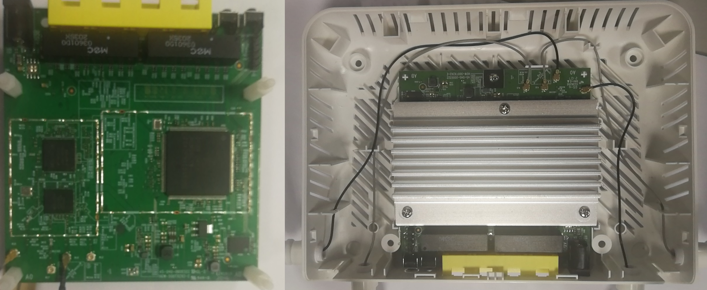

# 1. Introduction

文档用于将 wifi6 (or PI )  升级至 OPAL 系统海外版。



**(Note： wifi6 or PI 默认登录用户名密码: root/!@34qwer ， OPAL 默认登录名密码： root/e78a2a88 )**

具体升级分为三个步骤 

1. 备份 wifi cal 文件 RT30xxEEPROM.bin ， MAC 地址以及 Serial Number
2.  升级 FW, 包括  *.bm 及 *.bin 
3.   恢复之前备份的 RT30xxEEPROM.bin ，MAC 以及 SN ，设置 GUI 登录密码并且恢复出产设置，最后重启。


# 2. Prepare & Environment

升级 FW 需要预先安装如下软件：

- 软件 ( [MobaXterm_Installer_v20.6.zip](<\\172.25.5.39\cpeswdoc\cpesw\Software>)  or [Xshell-6.0.0197p.exe](<\\172.25.5.39\cpeswdoc\cpesw\Software>) , 以及 [tftp](<\\172.25.5.39\cpeswdoc\cpesw\Software>) )
- 串口连接工具，以及串口驱动

## 2.1 搭建升级环境

1. 插入串口线，并将网线连接电脑及路由器。


2. 设置电脑端 IP 地址如下

   

   

3. 打开 tftp 并设置 Host IP 为 192.168.1.1， 如下图：

   

   

# 3. 开放升级权限

开机后在 5 秒内按任意键进入 zloader 命令行, 运行 ``atsh`` 命令输出如下图：


保存 Wifi 6 的 SerialNumber 以及 Mac 信息用于升级后恢复。

复制 Producti Model 给 ``atse``  , 如在此例中复制 SH-LYQ01 至 atse，具体如下：

```shell
ZHAL> atse SH-LYQ01
0009010A09A00B00B800001002803B04105A
```

**(Note:  参数为设备型号，可以通过atsh读取 ‘Product Model’ , atse need SerialNumber to generate pwd seed.)**

把字符串复制，并填到 http://172.21.83.77/aten.php 中会产生对应的 passwd , 


```shell
ZHAL> aten 1,886387413284852333284811581
```

具体操作如下图：


将 Debug Flag 写入 MRD

```shell
ZHAL> atwz 7089CCFF982C,ff,1,0,10
(其中 7089CCFF982C 为 atsh 截图中的 "First MAC Address")
```


# 4.  Upgrade

## 4.1 更新 bootloader

下载 OPAL2  B2版下载地址: ``\\172.25.5.39\firmware\WX\HGW-500TX2X2-E v3\V535YAC0b2.zip``

**(Note: 具体以最新的 OPAL Release 邮件为准)**

开机后在 5 秒内按任意键进入 zloader 命令行， 进入 zloader 后运行指令 ``atub``  来升级 bootloader，过程如下图：

```shell
ZHAL> atub YAC100.bm
(升级 bootbase)
```


## 4.1.1 更新 Debug Flag

当通过命令 ``atub``  更新 bootloader 时出现如下情况则需要更新 Debug Flag.


## 4.2 更新 FW

重新上电，在 5 秒内按任意键进入 zloader 命令行， 进入 zloader 后运行指令 ``atur``  来升级 FW,  更新 FW 需要先运行指令 ``atdc`` 来关闭 modle校验机制。过程和升级 bootloader 类似，具体如下图：

```shell
ZHAL> atdc
ZHAL> atur V535YAC0b1.bin
(此文件包含 Linux & Rootfs)
```


写入 wifi cal 文件， SN 以及 Mac 地址,过程如下：


## 4.4 查看更新是否成功

登录系统运行 ``sys atsh`` ， Product Model 为 "NBG7510" 则 FW 升级成功。

```shell
NBG7510_SMT Username: root
Password: 
# sys atsh
# sys atsh
Firmware Version        : V5.35(YAC.0)b2
Bootbase Version        : V1.00 | 08/16/2021 06:02:45
Vendor Name             : ZyXEL
Product Model           : NBG7510
Serial Number           : S210Y16023352
First MAC Address       : 4CC53E083738
Last MAC Address        : 4CC53E083747
MAC Address Quantity    : 16
Default Country Code    : 00
Boot Module Debug Flag  : 01
Kernel Checksum         : 86CAFF38
RootFS Checksum         : D7F4A748
Romfile Checksum        : 0000E6BC
Main Feature Bits       : 00
Other Feature Bits      : 
7fb096f9: 00000000 00000000 00000000 00000000
7fb09709: 00000000 00000000 00000000 
```
至此 FW 已经切换至 OPAL 平台，更新完成。


# 5. Recover Backup

## 5.1 更新 wifi cal， sn以及 mac

恢复 wifi 校准文件， SN 以及 Mac 地址


```shell
# cd /tmp & 
# tftp -g -r RT30xxEEPROM.bin 192.168.1.7
# mtd writeflash /tmp/RT30xxEEPROM.bin 131072 172032 reservearea
(恢复 wifi cal 文件， wifi 文件由 HW 提供)

# sys atwz 7089CCFF99B8 FF 01 00 10
# sys atsn 5011010000033
( OPAL Exernal 的 SN 最大长度为 13)
```


**(Note:  RT30xxEEPROM.bin  从 B2 版本以后使用由 HW 新提供的 cal 文件 。)**

## 5.2 更新 GUI admin 登录密码以及恢复出产设置

通过板子背面的标签写入 admin 密码，wifi 密码，并且恢复出厂设置，如下图：


启动后按任意键进入 zloader 模式， 输入 ``atck`` 命令，密码为主板背面标签所示，最后 ``atcr`` 清空预配置，具体命令如下：

```shell
ZHAL> atbt 1
ZHAL> atck d784f35f,r!5c575k,e78a2a88
......ZHAL> 
ZHAL> atck
supervisor password: e78a2a88
admin password     : r!5c575k
WiFi PSK key       : d784f35f
ZHAL> atcr
Also erase misc partition done.
```

最后登录 GUI ，完成全部操作。


# FAQ

###  1.  Update Debug Flag accss Multiboot

修改 Debug Flag 参考  [EX3301_root_pwd.txt](\\172.25.5.39\cpeswdoc\cpesw\Document\SW3 Training Slides\OPAL\Manufacture\EX3301_root_pwd.txt)  ， 需要注意的是使用此文档可以修改 Memory Buffer 中的 Debug Flag ， 同时要求Serial Number 不能为空，否则 ``atse``  返回空值, 之后使用 ``atwz`` 命令写入 mtd flash

```shell
ZHAL> atwz 7089CCFF97B0,ff,1,0,10
```

当 Serial Number 为空时可以使用  [MultiBootSrv_192.168.1.99.exe](\\172.25.5.39\cpeswdoc\cpesw\Document\SW3 Training Slides\OPAL\Manufacture\Multiboot\MultiBootSrv_192.168.1.99.exe.7z)  来修改 Debug Flag，如


### 2.  OPAL Upgarde bootbase & kernel

上电进入 zloader,  使用 ``atub`` 升级 bootbase

```shell
ZHAL> atdc
ZHAL> atub YAC100.bm 
```

重启之后再次进入 zloader ，使用 ``atur`` 升级 Kernel & Rootfs

```shell
ZHAL> atdc
ZHAL> atur V535YAC0b1.bin
```

在 zloader 命令环境下设置mac 地址

```shell
ZHAL> atwz 7089CCFF99,ff,1,0,10
(参数分别为 [MAC addr], [Country code], [EngDbgFlag], [FeatureBit], [MAC Number])
```


### 3. OPAL Update wifi calibration

更新 WiFi Cal 文件需要将 RT30xxEEPROM.bin 写入系统的 reservearea 分区， 步骤如下:

1. 打开tftp软件, 配置如下:


2. 通过 tftp 软件下载校准文件如RT30xxEEPROM.bin ， 并写入 reservearea 分区

```shell
# cd /tmp/
# tftp -g -r RT30xxEEPROM.bin 192.168.123.7
# mtd writeflash /tmp/RT30xxEEPROM.bin 4096 172032 reservearea
```

(Note: OPAL2 External B1 版本 br0 Mac 地址为 192.168.123.1 )

 

### 4. 查找登录密码

```shell
# sys atck
supervisor password: root
admin password     : admin
WiFi PSK key       : 12345678

# sys atcr reboot
```


### 5. 如何登陆 telnet

在产测模式下需要先修改 IP 地址为  192.192.192.4， 再登陆 telnet 客户端。(对于笔记本可能还需要关闭无线功能)


