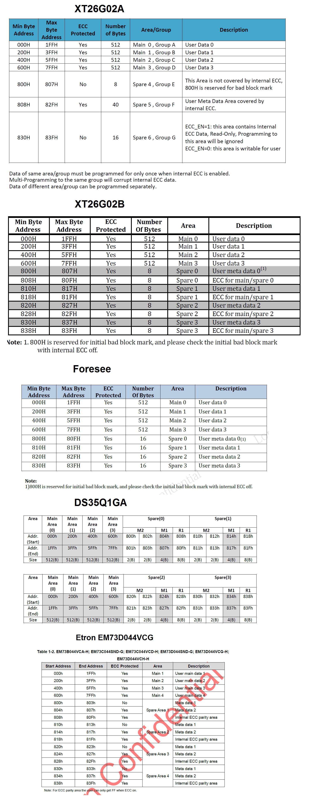

[TOC]


# 1. Introduction

Memory device overview


NAND flash contains **Raw NAND Flash (并行接口)** , **Serial NAND Flash (串行接口)**


## 1.1 ONFI

**ONFI (Open Nand Flash Interface)**  Using an open interface standard strengthens compatibility and interoperability of NAND devices from different vendors . This defines following memory origanization. To  check ONFI by  [spec](<https://media-www.micron.com/-/media/client/onfi/specs/onfi_4_2-gold.pdf>) .


**One-Time Programmable**

**FDM (Factory Defect Mapping)**


## 1.2 Toggle


Memory Mapping Diagram


Note:

CA ( Columen Address ) : The 12-bit address is capable of addressing from 0 ~ 4095 bytes , however only 0 ~ 2111 are valid. Byte 2112 through 4095 of each page are "out of bounds" , do not exist in the device , and can not be addressed.

RA ( Row Address )  : RA < 5 : 0 > select a page inside block , and RA < 16 : 6 > select block.

Most NAND flash I/O frequency about 80 - 108 MHz ( Etron 80 MHz , XTX 90 MHz , Fudan Micro 104 MHz ,Dosilicon 84 MHz , Foresee 108 MHz ) , the MCU frequency maybe 250 MHz.


## 1.1 SLC & MLS

   Nand Flash按照内部存储数据单元的电压的不同层次，也就是单个内存单元中，是存储1位数据，还是多位数据，可以分为 **SLC (Single-Level Cell) ** 和 **MLC (Multi-Level Cell)** 。那么软件如何识别系统上使用过的SLC还是MLC呢？ 
   Nand Flash设计中，有个命令叫做Read ID，读取ID，读取好几个字节，一般最少是4个，新的芯片，支持5个甚至更多，从这些字节中，可以解析出很多相关的信息，比如此Nand Flash内部是几个芯片（chip）所组成的，每个chip包含了几片（Plane），每一片中的页大小，块大小，等等。在这些信息中，其中有一个，就是识别此flash是SLC还是MLC。

- SLC ,MLC  指的是 Flash 颗粒与使用 Paralle or  Serial 接口并没有关系.
- 串行与并行主要区别在于IO口的数量上.
- EMMC = NAND + 主控IC，用以管理坏块以及ECC， 一般 EMMC 都选用 MLS 颗粒


## 1.2 Nand Flash的一些typical特性

1. 页擦除时间是200us，有些慢的有800us

2. 块擦除时间是1.5ms

3. 页数据读取到数据寄存器的时间一般是20us

4. 串行访问（Serial access）读取一个数据的时间是25ns，而一些旧的Nand Flash是30ns，甚至是50ns

5. 输入输出端口是地址和数据以及命令一起multiplex复用的

6. Nand Flash的编程/擦除的寿命：即，最多允许10万次的编程/擦除，达到和接近于之前常见的Nor Flash，几乎是同样的使用寿命了。

7. 封装形式：48引脚的TSOP1封装 或 52引脚的ULGA封装 ， 主要是基于 8 pin 的wson 封装

  **(Note: DQ3 ~ DQ0 为 XTX Nand 芯片 I/O pin脚, SPI Nand flash 常用 WSON 封装，总共 8 pin 脚。)**


**Nand Flash Chip Internal Arch**:


## 1.3 Nand Flash控制器与Nand Flash芯片

写驱动，是写Nand Flash 控制器的驱动，而不是Nand Flash 芯片的驱动，因为独立的Nand Flash芯片，一般来说，是很少直接拿来用的，多数都是硬件上有对应的硬件的Nand Flash的控制器，去操作和控制Nand Flash，包括提供时钟信号，提供硬件ECC校验等等功能，写的驱动软件，是去操作Nand Flash的控制器, 然后由控制器去操作Nand Flash芯片，实现我们所要的功能。

由于Nand Flash读取和编程操作来说，一般最小单位是页，所以Nand Flash在硬件设计时候，就考虑到这一特性，对于每一片（Plane），都有一个对应的区域专门用于存放，将要写入到物理存储单元中去的或者刚从存储单元中读取出来的，一页的数据，这个数据缓存区，本质上就是一个缓存buffer，但是只是此处datasheet里面把其叫做页寄存器page register而已，实际将其理解为页缓存，更贴切原意。

而正是因为有些人不了解此内部结构，才容易产生之前遇到的某人的误解，以为内存里面的数据，通过Nand Flash的FIFO，写入到Nand Flash里面去，就以为立刻实现了实际数据写入到物理存储单元中了，而实际上只是写到了这个页缓存中，只有当你再发送了对应的编程第二阶段的确认命令，即 *0x10*，之后，实际的编程动作才开始，才开始把页缓存中的数据，一点点写到物理存储单元中去。


# 2. OOB

对于[Nand Flash](<https://www.cnblogs.com/zhugeanran/p/8423484.html>)，每一个页，对应一个空闲区域 ( *'OOB' or  ‘Redundant Area‘ or ‘Spare Area‘, 一般在 linux 系统中称为 OOB* )，这个区域是基于Nand Flash的硬件特性，数据在读写的时候容易出错，为了保证数据的正确性，就产生了这样一个检测和纠错的区域，用来放置数据的校验值。OOB的读写操作，一般都是随着页的操作一起完成，也就是在读写页的时候，对应的OOB就产生了。

OOB main usage：

1. mark invalid block 标记是否存在坏块

2. store ECC checksum 存储ECC校验

3. store File-System info such as JFFS2/Yaffs2 
   **(Note: 存储一些与文件系统相关的信息，对于ramfs/jffs2文件系统映像文件中没有OOB的内容，需要根据OOB的标记略过坏块，然后将一页的数据写入，然后计算这一页数据的ECC校验码，然后将它写入到OOB区；而对于yaffs文件系统，因为本身包含有OOB区的数据（里面纪录有坏块标记，ECC校验码，其他信息），所以首先需要检查坏块，如果是，则跳过，然后写入数据，最后写入OOB数据。)**


XTX-spi-nand flash Array  Organization chart as following:


## 2.1 OOB (spare area) Layerout

The NAND datasheet gives the ECC requirement for the NAND device. For **SLC device 1/4 bits per 512 bytes** are common currently. For **MLC devices with 4/8/16 bits per 512 bytes ECC** requirements.

(Note: OOB layout just careful for burner , the Hisilicon or Econet ,even MLD not need.)

### Metadata

For every **Page** within each **Block** , contains main area and oob area ,while corresponde for stored data and ecc data, the [Layout](<https://processors.wiki.ti.com/index.php/TI81XX_PSP_UBOOT_User_Guide#BCH_Flash_OOB_Layout>) like the following :


OOB 区域的管理,各芯片厂商不同，一般都有写保护用户无法直接写入，但是如果关闭 **ECC Protection**则可以对其写入数据。 以 xtx_A , xtx_b 以及 江波龙 (Foresee) 为例，比较的 OOB (spare area) 排版:

*(Note: For example XT26G02A , in the 32 bit platform ,  every paage address in  0x000 ~ 0x7FF  used to store main data ,  and address in 0x800 ~ 0x807, 0x808 ~ 0x82F, 0x830 ~ 0x83F used to store ECC data.  The ECC protect register addrss general will be **0x90 or 0xb0** )*



  

## 2.2 ECC (Error Checking and Correction) Verification

**ECC**，是一种用于Nand Flash的差错检测和修正的算法。由于操作的时序和电路稳定性等原因，常常会出现一些bit出错，也就是原来的某个位，本来是0而变成了1，或者本来是1而变成0。从现象来看，问题其实看起来并不是特别的严重，但是如果恰好某个重要的文件的某一位发生了变化，那么问题就大了，可能会导致此时文件不能运行，如果这个文件是一个影响系统的程序，那么直接将导致系统会出现问题，所以对于Nand Flash就出现了这样一个机制。它能纠正1个bit的错误和检测出2个bit的错误，对于1bit以上的错误无法纠正，而对于2bit以上的错误不能保证能检测。对于ECC其纠错算法是什么样的呢？

1. 当往Nand Flash写入数据时候，每256个字节生成一个ECC校验，针对这些数据会生成一个ECC校验码，然后保存到对应的page的OOB数据区。
2. 当读取Nand Flash的数据时候，每256个字节就会生成一个ECC校验，那么对于这些数据就会计算出一个ECC校验码，然后将从OOB中读取存储的ECC校验和计算的ECC校验想比较，


## 2.3 Bad Block Management

Device with Bad Block have the same quality level and same AC and DC characterristics as device where all the blocks are valid. A bad block  does not affect the performance of valid blocks. 

Any block where the *1st* Byte in the spare area of the 1st or 2nd page does not contain  *0xFF* its bad block. System soft should initially check the first spare area location for **non FF** data on the first page of each block prior to performing any program or erase operations on the NAND flash device.


Nand Flash 适用Wear-Leveling负载平衡 来管理坏块，由于Nand Flash的block，都是有一定寿命限制的，所以如果你每次都往同一个block擦除然后写入数据，那么那个block就很容易被用坏了，所以我们要去管理一下，将这么多次的对同一个block的操作，平均分布到其他一些block上面，使得在block的使用上，相对较平均，这样相对来说，可以更能充分利用Nand Flash。
对于Nand Flash，比较严重的是坏块，也就是说一个块中包含有一个或者多个位是坏的，而现在对于坏块有两种分类:

1. 出厂的时候就存在坏块：在出厂之前，就会做对应的标记，标记为坏块，一般芯片厂商会将每个坏块第一个page的spare erea的第6个byte标记为不等于0xff。
2. 使用过程中产生的坏块，就需要将这个块作为坏块来处理，为了与固有的坏块信息保持一致，也需要将新发现的坏块的第一个page的spare eare的第6个Byte标记为非0xff的值。

　　对于上面的处理方式，如果我们需要擦除一个块之前，必须先要检查下第一个page的spare eare的第6byte是否为0xff,如果是就证明是一个好块，是可以擦除；如果不是，就证明这是一个坏块，那么就不能擦除，对于这种方法，难免会出现一些错误操作，所以Nand Flash专门设计了一个BBT(bad block table)的坏块表用来进行管理。各个Nand的坏块管理的方法还不尽一样，有的会将bbt放到block0，因为block0一定是好块，但是block0一般是用来作为boot，那么也将导致不能放bbt，也有的会将bbt放到最后一个分区。

**从上面可以看出，OOB是每一个页都会有的数据，里面存放的的有ECC，而BBT是一个flash才会有的，针对每个block的坏块识别是第一个spare erea的第六个字节。**


## 2.4 Bad Block Marking

具体标记的地方是，对于现在常见的页大小为2K的Nand Flash，是块中第一个页的oob起始位置的第1个字节（旧的小页面，pagesize是512B甚至256B的Nand Flash，坏块标记是第6个字节），如果不是0xFF，就说明是坏块。相对应的是，所有正常的块，好的块，里面所有数据都是0xFF的。

对于坏块的标记，本质上，也只是对应的flash上的某些字节的数据是非0xFF而已，所以，只要是数据，就是可以读取和写入的。也就意味着，可以写入其他值，也就把这个坏块标记信息破坏了。对于出厂时的坏块，一般是不建议将标记好的信息擦除掉的。

uboot中有个命令是

```
nand scrub
```

就可以将块中所有的内容都擦除了，包括坏块标记，不论是出厂时的，还是后来使用过程中出现而新标记的。

```
nand erase
```

只擦除好的块，对于已经标记坏块的块，不要轻易擦除掉，否则就很难区分哪些是出厂时就坏的，哪些是后来使用过程中用坏的了。


# 3. Read & Write

对芯片执行 **write** 操作时，对 *Cache Register(or Cache Page)* 中的 2k 数据计算 ECC，然后在写入实际存储单元既 *Data Register(or Array)*。 在对芯片执行 **read** 操作时，从实际存储单元中读取数据并且存放在到 *Cache Page*, 再计算 *Cache Page* 中 *Main Data* 的 ECC 和实际存储在 *Cache Page oob* 的ECC进行比较,完成校验。

signal captured for reading flash:


(Note: previous captured signal based command ``spinand readp 1 0`` while to read block 0 ,page 1 in flash.)


## Bit Convert 位反转

Nand Flash的位反转现象，主要是由以下一些原因/效应所导致：

1. 漂移效应（Drifting Effects）
   漂移效应指的是，Nand Flash中cell的电压值，慢慢地变了，变的和原始值不一样了。

2. 编程干扰所产生的错误（Program-Disturb Errors）
   此现象有时候也叫做，过度编程效应（over-program effect）。对于某个页面的编程操作，即写操作，引起非相关的其他的页面的某个位跳变了。

3. 读操作干扰产生的错误（Read-Disturb Errors）
   此效应是，对一个页进行数据读取操作，却使得对应的某个位的数据，产生了永久性的变化，即Nand Flash上的该位的值变了。

对应位反转的类型，Nand Flash位反转的类型和解决办法，有两种：

1. 一种是nand flash物理上的数据存储的单元上的数据，是正确的，只是在读取此数据出来的数据中的某位，发生变化，出现了位反转，即读取出来的数据中，某位错了，本来是0变成1，或者本来是1变成0了。此处可以成为软件上位反转。此数据位的错误，当然可以通过一定的校验算法检测并纠正。
2. 另外一种，就是nand flash中的物理存储单元中，对应的某个位，物理上发生了变化，原来是1的，变成了0，或原来是0的，变成了1，发生了物理上的位的数据变化。此处可以成为硬件上的位反转。此错误，由于是物理上发生的，虽然读取出来的数据的错误，可以通过软件或硬件去检测并纠正过来，但是物理上真正发生的位的变化，则没办法改变了。不过个人理解，好像也是可以通过擦除Erase整个数据块Block的方式去擦除此错误，不过在之后的Nand Flash的使用过程中，估计此位还是很可能继续发生同样的硬件的位反转的错误。

以上两种类型的位反转，其实对于从Nand Flash读取出来的数据来说，解决其中的错误的位的方法，都是一样的，即通过一定的校验算法，常称为ECC，去检测出来，或检测并纠正错误。如果只是单独检测错误，那么如果发现数据有误，那么再重新读取一次即可。实际中更多的做法是，ECC校验发现有错误，会有对应的算法去找出哪位错误并且纠正过来。其中对错误的检测和纠正，具体的实现方式，有软件算法，也有硬件实现，即硬件Nand Flash的控制器controller本身包含对应的硬件模块以实现数据的校验和纠错.


# 4. SPI Nand Flash Spec Defination with code

以 Dosilicon 的 DS35Q1GA  **(mid: 0xE5, dev_id: 0x71)** 为例, 在 Econet, Hisilicon, ZyXEL 等各平台中定义如下：

To explain **DS35Q1GA** chip from *Dosilicon*  **(mid: 0xE5, dev_id: 0x71)** , spec info defined within Hisilicon, Econet and ZyXEL platfrom as following.

## 4.1 **Hisilicon** platfrom struct below:

```c
struct hi_fmc_spi_nand_spl_ids_s
{       
    struct hi_fmc_nand_spl_dev st_dev;
    hi_char8 *pc_name;
    hi_uint32 ui_chip_size;         /* 单位为MB，最大支持4096 */
    hi_uchar8 uc_read_addr_cycle;                               
    hi_uchar8 uc_write_addr_cycle;
    hi_uchar8 uc_erase_addr_cycle;                               
    hi_uchar8 uc_rsv;
    hi_uint32 ui_options;
    struct hi_fmc_spi_nand_param  st_fmc_spi_nand_param;
};
struct hi_fmc_spi_nand_param
{
    hi_uchar8 uc_read_if_type;
    hi_uchar8 uc_read_cmd;
    hi_uchar8 uc_read_dummy_num;
    hi_uchar8 uc_write_if_type;
    hi_uchar8 uc_write_cmd;
    hi_uchar8 uc_write_dummy_num;
    hi_uchar8 uc_protect_reg;
    hi_uchar8 uc_conf_reg;
    hi_uchar8 uc_feature_special_addr;
    hi_uchar8 uc_feature_special_data;
    hi_uchar8 uc_rsv[2];
};
```

spec definition：

```c
...
{
    {
        {0xE5,0x71},       //id
        2,                 //id_len
        {0}
    },
    "DS35Q1GA",
    128,                       //chipsize MB
    HI_NAND_ADDR_CYCLE_5_E,    //read
    HI_NAND_ADDR_CYCLE_5_E,    //write
    HI_NAND_ADDR_CYCLE_3_E,    //erase
    0,                         //padding 1Byte
    0,                         //options
    {
#ifdef HI_FMC_NAND_MULT_IO        
    HI_SPI_NAND_QUADIN_QUADOUT_E,      //read 4IO
    HI_SPI_NAND_CMD_READ_QUAD,         //read Cache*4,0x6B
    HI_SPI_NAND_STD_READ_DUMMY_NUM,    //1byte
    HI_SPI_NAND_QUADIN_QUADOUT_E,      //write 4IO
    HI_SPI_NAND_CMD_WRITE_QUAD,        //(PL*4) (0x32)
    HI_SPI_NAND_WRITE_DUMMY_NUM,       //0byte
#else
    HI_SPI_NAND_STD_E,      //read STD
    HI_SPI_NAND_CMD_READ,   //read CMD(0x03)
    HI_SPI_NAND_STD_READ_DUMMY_NUM, //1byte
    HI_SPI_NAND_STD_E,      //write STD
    HI_SPI_NAND_CMD_PP,     //Page Program Load(PL) CMD (0x02)
    HI_SPI_NAND_WRITE_DUMMY_NUM, //0byte
#endif
    0x2,0x0,0x0,0x0,{0}
    }                                     
},
...
```


## 4.2 **Econet** platfrom struct:

Econet use *./linux-ecnt/drivers/mtd/chips/spi_nand_flash_table.c* to configure spi nand flash both in bootload and kernel, those  struct define as following.

```c
struct SPI_NAND_FLASH_INFO_T {
	const u8								mfr_id;
	const u8								dev_id;
	const u8								*ptr_name;
	u32										device_size;	/* Flash total Size */
	u32										page_size;		/* Page Size 		*/
	u32										erase_size;		/* Block Size 		*/
	u32										oob_size;		/* Spare Area (OOB) Size */
	SPI_NAND_FLASH_READ_DUMMY_BYTE_T		dummy_mode;
	SPI_NAND_FLASH_READ_SPEED_MODE_T		read_mode;
	struct spi_nand_flash_ooblayout			*oob_free_layout;
	u8										die_num;
	SPI_NAND_FLASH_WRITE_SPEED_MODE_T		write_mode;
	u32										feature;
	struct SPI_NAND_ECC_FAIL_CHECK_INFO_T	ecc_fail_check_info;
	SPI_NAND_FLASH_WRITE_EN_TYPE_T			write_en_type;
	struct SPI_NAND_UNLOCK_BLOCK_INFO_T		unlock_block_info;
	struct SPI_NAND_QUAD_EN_INFO_T			quad_en;
	struct SPI_NAND_ECC_EN_INFO_T			ecc_en;
	char									otp_page_num;
};
```

spec info as below:

```c
...
/* only use user meta data with ECC protected */
struct spi_nand_flash_ooblayout ooblayout_fm = {
	.oobsize = 64, 
	.oobfree = {{0,16} , {16,16}, {32,16}, {48,16}}
};
/* Mitrastar update to suit Fudan Micron Chip for type "FM25S01A" */
{
	mfr_id: 					_SPI_NAND_MANUFACTURER_ID_FM,
	dev_id: 					_SPI_NAND_DEVICE_ID_FM25S01A,
	ptr_name:					"_SPI_NAND_DEVICE_ID_FM25S01A",
	device_size:				_SPI_NAND_CHIP_SIZE_1GBIT,
	page_size:					_SPI_NAND_PAGE_SIZE_2KBYTE,
	oob_size:					_SPI_NAND_OOB_SIZE_64BYTE,
	erase_size: 				_SPI_NAND_BLOCK_SIZE_128KBYTE,
	dummy_mode: 				SPI_NAND_FLASH_READ_DUMMY_BYTE_APPEND,
	read_mode:					SPI_NAND_FLASH_READ_SPEED_MODE_SINGLE,
	write_mode:					SPI_NAND_FLASH_WRITE_SPEED_MODE_SINGLE,
	oob_free_layout :			&ooblayout_fm, 	
	feature:					SPI_NAND_FLASH_FEATURE_NONE,
	die_num:					1,
	ecc_fail_check_info:		{0x30, 0x30},
	write_en_type:				SPI_NAND_FLASH_WRITE_LOAD_FIRST,
	unlock_block_info:			{0x78, 0x0},
	quad_en:					{0x01, 0x01},
	ecc_en:						{_SPI_NAND_ADDR_FEATURE, 0x10, 0x10},
#ifdef TCSUPPORT_NAND_FLASH_OTP
	otp_page_num:				-1,
#endif
},
...
```


spi flash spec table reference diagram:


ecc layout


## 4.3 ZyXEL  (MLD) platfrom struct:

```c
struct SPI_NAND_FLASH_INFO_T {
     const u8                            mfr_id;
     const u8                            dev_id;
     const u8                            *ptr_name;
     u32                                 device_size;    /* Flash total Size */
     u32                                 page_size;      /* Page Size        */
     u32                                 erase_size;     /* Block Size       */
     u32                                 oob_size;       /* Spare Area (OOB) Size */
     SPI_NAND_FLASH_READ_DUMMY_BYTE_T    dummy_mode;
     u32                                 read_mode;
     u32                                 write_mode;
     struct spi_nand_flash_ooblayout     *oob_free_layout;
     u32                                 feature;
 };
```

spec info defination:

```c
  {
     mfr_id:                     _SPI_NAND_MANUFACTURER_ID_DS,
     dev_id:                     _SPI_NAND_DEVICE_ID_DS35Q1GA,
     ptr_name:                   "_SPI_NAND_DEVICE_ID_DS35Q1GA",
     device_size:                _SPI_NAND_CHIP_SIZE_1GBIT,
     page_size:                  _SPI_NAND_PAGE_SIZE_2KBYTE,
     oob_size:                   _SPI_NAND_OOB_SIZE_64BYTE,
     erase_size:                 _SPI_NAND_BLOCK_SIZE_128KBYTE,
     dummy_mode:                 SPI_NAND_FLASH_READ_DUMMY_BYTE_APPEND,
     read_mode:                  SPI_NAND_FLASH_READ_SPEED_MODE_DUAL,
     write_mode:                 SPI_NAND_FLASH_WRITE_SPEED_MODE_SINGLE,
     oob_free_layout :           &ooblayout_ds,
     feature:                    SPI_NAND_FLASH_FEATURE_NONE,
 },
```


## 4.4 Hisilicon NAND Flash Arch

SPI Nand driver in hisi platform based on HSAN arch. The basic specfication loaded within bootloader, and transfor to kernel by  paramater. 

Most general action such like earse , read , write, has been defined in hi-boot. 

**FMC (FPGA Mezzanine Card)**

 ```mermaid
graph LR
hi_flash_init -->|&g_st_fmc_spi_nand_reg|fmc_probe(fmc_probe)
fmc_probe-->|hi_fmc_nand_chip_init|C(get_nand_chip)
C -->D(Loading nand spec)
 ```


### 4.4.1 Hi-Boot

hi-boot 中 spec 信息保存在 *drivers/mtd/fmc/hi_fmc_tbl.c*  中， 并且在 *drivers/mtd/flash.c* 中初始化，以 XTX SPI
 NAND Flash 2Gbit (256M)  为例代码如下：

```c
struct hi_fmc_nand_spl_ids_s g_ast_fmc_nand_spl_ids[] =
{ 
	/*
     * chear: XTX spi nand flash to H3
     */
    //XT26G02AWSEGA
    {
        { 
        {0x0B, 0xE2, 0x1, 0x00, 0x84, 0x00, 0x00, 0x00}, 
        2,
        HI_NAND_ECC_16BIT_E,
        HI_NAND_PAGE_SIZE_2K_E,
        HI_NAND_BLOCK_SIZE_64_E  
    },        
        "XT26G02AWSEGA",
        256,
        2048, 
        131072, 
        64,
        HI_NAND_ADDR_CYCLE_5_E,//原来为0
        HI_NAND_ADDR_CYCLE_5_E, 
        HI_NAND_ADDR_CYCLE_3_E,
        0, 
        0,
       {
#ifdef HI_FMC_NAND_MULT_IO
			HI_SPI_NAND_QUAD_IO_E, 
			HI_SPI_NAND_CMD_READ_QUAD_ADDR, 
			HI_SPI_NAND_STD_READ_DUMMY_NUM, 
			HI_SPI_NAND_QUADIN_QUADOUT_E, 
			HI_SPI_NAND_CMD_WRITE_QUAD, 
			HI_SPI_NAND_WRITE_DUMMY_NUM,
			{0}
#else
			HI_SPI_NAND_STD_E, 
			HI_SPI_NAND_CMD_READ, 
			HI_SPI_NAND_STD_READ_DUMMY_NUM, 
			HI_SPI_NAND_STD_E, 
			HI_SPI_NAND_CMD_PP, 
			HI_SPI_NAND_WRITE_DUMMY_NUM,
			{0}
#endif
     	},
     	{
		 0x2,0x0,{0,0}
		},
        HI_NULL
    }      
};
```

**(Note: 在新发布的 hisi 中，诸如 page_size ,block_size , ecc_bit, oob_size, 都是从寄存器中获取。寄存器地址 0x10A20000 )**


### 4.4.2 Kernel

#### kernel image consists


mtd 分区通过 mtdparts 参数的形式传给 kernel，之后再 mtd driver 里面建立分区，并建立文件系统。

```shell

mtdparts=hi_nfc:256K(boot),1M(enva),1M(envb),2M(fac),2M(cfga),2M(cfgb),2816K(log),5M(kernela),5M(kernelb),25M(rootfsa),25M(rootfsb),35M(fwka),35M(fwkb),110M(app),-(other)
rootfstype=squashfs
commandline=console=ttyAMA1,115200 r quiet
```


mtd 信息通过 HSAN 模块传递给 kernel，其传递方式与 SPI Nor Flash Driver 相似，都是通过在hi-boot 中Tag写入内存地址 **0x5441000A**， 之后在 kernel中解析得到诸如，page_size, black_size, earse_size 等信息并且保存于全局变量 *g_pc_flash_info* 中。解析代码位于 *solution/patch/linux-3.18.11/arch/arm/kernel/atags_parse.c* 


##  4.5 Hisilicon nand Debug command for nand flash

### 4.5.1 Downloading file and write to flash

Downloading  hi_boot.bin to memory address at **0x84000000**, then writing to address at **0x20000**  in flash , then next to read and display **0x100**(256) byte at first head, **0x88000000** its memory address to display with it.

```shell
hi # tftp 0x84000000 env.bin    
TFTP from server 192.168.1.7;  our IP address is 192.168.1.3
Filename 'env.bin'.
Load address: 0x84000000 maxsize: 0x1000
Loading: size: 0x2000  blksize: 0x4000
#
done.transferred: 0x2000 file size: 0x2000

hi # nand write 0x84000000 0x20000 0x2000
OK
hi # nand read 0x88000000 0x20000 0x100
OK
hi # md 0x88000000 0x100
88000000: e7daac50 00000350 746f6f62 616c6564    P...P...bootdela
88000010: 00313d79 61687465 3d726464 303a3030    y=1.ethaddr=00:0
88000020: 30303a30 3a30303a 313a3030 70690031    0:00:00:00:11.ip
88000030: 72646461 3239313d 3836312e 332e312e    addr=192.168.1.3
88000040: 72657300 69726576 39313d70 36312e32    .serverip=192.16
88000050: 2e312e38 61670037 61776574 3d706979    8.1.7.gatewayip=
88000060: 2e323931 2e383631 00372e31 6d74656e    192.168.1.7.netm
88000070: 3d6b7361 2e353532 2e353532 2e353532    ask=255.255.255.
88000080: 65760030 79666972 62006e3d 66746f6f    0.verify=n.bootf
88000090: 3d67616c 656b0041 6c656e72 67616c66    lag=A.kernelflag
880000a0: 7200413d 66746f6f 616c6673 00413d67    =A.rootfsflag=A.
880000b0: 6176616a 67616c66 6200413d 62746f6f    javaflag=A.bootb
880000c0: 663d6e69 3d656c69 625f6968 2e746f6f    in=file=hi_boot.
880000d0: 206e6962 7a697366 20303d65 74726170    bin fsize=0 part
880000e0: 6f6f623d 62640074 6f6f6267 69663d74    =boot.dbgboot=fi
880000f0: 683d656c 6f625f69 645f746f 622e6762    le=hi_boot_dbg.b
88000100: ffffffff ffffffff ffffffff ffffffff    ................
```


### 4.5.2 read content from flash and display it

Read  flash address from 0x20000 length for 0x100 (256 byte) to memory 0x88000000 and display is. 

**(Note: 0x20000 in flash used to store enviroment variable, 0x20000 means 1 block ,0 page)**


```shell
hi # nand read 0x88000000 0x20000 0x100 
OK
hi # md 0x88000000 0x100                
88000000: f9750f1a 0000035c 746f6f62 616c6564    ..u.\...bootdela
88000010: 00333d79 61687465 3d726464 303a3030    y=3.ethaddr=00:0
88000020: 30303a30 3a30303a 313a3030 70690031    0:00:00:00:11.ip
88000030: 72646461 3239313d 3836312e 332e312e    addr=192.168.1.3
88000040: 72657300 69726576 39313d70 36312e32    .serverip=192.16
88000050: 2e312e38 61670037 61776574 3d706979    8.1.7.gatewayip=
88000060: 2e323931 2e383631 00372e31 6d74656e    192.168.1.7.netm
88000070: 3d6b7361 2e353532 2e353532 2e353532    ask=255.255.255.
88000080: 65760030 79666972 62006e3d 66746f6f    0.verify=n.bootf
88000090: 3d67616c 656b0041 6c656e72 67616c66    lag=A.kernelflag
880000a0: 7200413d 66746f6f 616c6673 00413d67    =A.rootfsflag=A.
880000b0: 6176616a 67616c66 6200413d 62746f6f    javaflag=A.bootb
880000c0: 663d6e69 3d656c69 625f6968 2e746f6f    in=file=hi_boot.
880000d0: 206e6962 7a697366 20303d65 74726170    bin fsize=0 part
880000e0: 6f6f623d 62640074 6f6f6267 69663d74    =boot.dbgboot=fi
880000f0: 683d656c 6f625f69 645f746f 622e6762    le=hi_boot_dbg.b
88000100: 5e77ffe5 f9e3b6bf f3bffd3b fbecaeff    ..w^....;.......
```

Read oob data from flash

```shell
hi # nand read dump.oob 1
*t OOB:
	ff ff ff ff ff ff ff ff
	ff ff ff ff ff ff ff ff
	ff ff ff ff ff ff ff ff
	ff ff ff ff ff ff ff ff
```


### 4.5.3 direct dump date from flash chip

```shell
hi # nand dump 0x20000 1
Page 00020000 dump:
	1a 0f 75 f9 5c 03 00 00 62 6f 6f 74 64 65 6c 61
	79 3d 33 00 65 74 68 61 64 64 72 3d 30 30 3a 30
	30 3a 30 30 3a 30 30 3a 30 30 3a 31 31 00 69 70
	61 64 64 72 3d 31 39 32 2e 31 36 38 2e 31 2e 33
	00 73 65 72 76 65 72 69 70 3d 31 39 32 2e 31 36
	38 2e 31 2e 37 00 67 61 74 65 77 61 79 69 70 3d
	31 39 32 2e 31 36 38 2e 31 2e 37 00 6e 65 74 6d
	61 73 6b 3d 32 35 35 2e 32 35 35 2e 32 35 35 2e
	30 00 76 65 72 69 66 79 3d 6e 00 62 6f 6f 74 66
	6c 61 67 3d 41 00 6b 65 72 6e 65 6c 66 6c 61 67
	3d 41 00 72 6f 6f 74 66 73 66 6c 61 67 3d 41 00
	6a 61 76 61 66 6c 61 67 3d 41 00 62 6f 6f 74 62
	69 6e 3d 66 69 6c 65 3d 68 69 5f 62 6f 6f 74 2e
	62 69 6e 20 66 73 69 7a 65 3d 30 20 70 61 72 74
	3d 62 6f 6f 74 00 64 62 67 62 6f 6f 74 3d 66 69
	6c 65 3d 68 69 5f 62 6f 6f 74 5f 64 62 67 2e 62
	69 6e 20 66 73 69 7a 65 3d 30 20 70 61 72 74 3d
	62 6f 6f 74 00 6b 65 72 6e 65 6c 61 3d 66 69 6c
	65 3d 6b 65 72 6e 65 6c 2e 69 6d 61 67 65 73 20
	66 73 69 7a 65 3d 30 20 70 61 72 74 3d 6b 65 72
	6e 65 6c 61 00 6b 65 72 6e 65 6c 62 3d 66 69 6c
	65 3d 6b 65 72 6e 65 6c 2e 69 6d 61 67 65 73 20
	66 73 69 7a 65 3d 30 20 70 61 72 74 3d 6b 65 72
	6e 65 6c 62 00 72 6f 6f 74 66 73 61 3d 66 69 6c
	65 3d 72 6f 6f 74 2e 6a 66 66 73 32 2d 31 32 38
	6b 20 66 73 69 7a 65 3d 30 20 70 61 72 74 3d 72
	6f 6f 74 66 73 61 00 72 6f 6f 74 66 73 62 3d 66
	69 6c 65 3d 72 6f 6f 74 2e 6a 66 66 73 32 2d 31
	32 38 6b 20 66 73 69 7a 65 3d 30 20 70 61 72 74
	3d 72 6f 6f 74 66 73 62 00 6a 61 76 61 61 3d 66
	69 6c 65 3d 6a 61 76 61 2e 6a 66 66 73 32 2e 62
	69 6e 20 66 73 69 7a 65 3d 30 20 70 61 72 74 3d
	66 77 6b 61 00 6a 61 76 61 62 3d 66 69 6c 65 3d
	6a 61 76 61 2e 6a 66 66 73 32 2e 62 69 6e 20 66
	73 69 7a 65 3d 30 20 70 61 72 74 3d 66 77 6b 62
	00 70 72 6f 74 65 63 74 5f 61 64 64 72 3d 62 65
	67 69 6e 3d 30 78 31 36 30 30 30 30 20 65 6e 64
	3d 30 78 32 36 30 30 30 30 00 63 6f 6e 73 6f 6c
	65 3d 6f 6e 00 70 61 73 73 77 64 3d 65 70 5e 6b
	00 66 61 63 74 6f 72 79 5f 6d 6f 64 65 3d 31 00
	6d 74 64 70 61 72 74 73 3d 68 69 5f 6e 66 63 3a
	31 32 38 4b 28 62 6f 6f 74 29 2c 36 34 30 4b 28
	65 6e 76 61 29 2c 36 34 30 4b 28 65 6e 76 62 29
	2c 31 4d 28 66 61 63 29 2c 31 4d 28 63 66 67 61
	29 2c 31 4d 28 63 66 67 62 29 2c 31 36 36 34 4b
	28 6c 6f 67 29 2c 35 4d 28 6b 65 72 6e 65 6c 61
	29 2c 35 4d 28 6b 65 72 6e 65 6c 62 29 2c 33 35
	4d 28 72 6f 6f 74 66 73 61 29 2c 33 35 4d 28 72
	6f 6f 74 66 73 62 29 2c 33 35 4d 28 66 77 6b 61
	29 2c 33 35 4d 28 66 77 6b 62 29 2c 39 38 4d 28
	61 70 70 29 2c 2d 28 6f 74 68 65 72 29 00 72 6f
	6f 74 66 73 74 79 70 65 3d 6a 66 66 73 32 00 63
	6f 6d 6d 61 6e 64 6c 69 6e 65 3d 63 6f 6e 73 6f
	6c 65 3d 74 74 79 41 4d 41 31 2c 31 31 35 32 30
	30 20 72 00 ff ff ff ff ff ff ff ff ff ff ff ff
	ff ff ff ff ff ff ff ff ff ff ff ff ff ff ff ff
	...
	ff ff ff ff ff ff ff ff ff ff ff ff ff ff ff ff
OOB:
	ff ff ff ff ff ff ff ff
	ff ff ff ff ff ff ff ff
	ff ff ff ff ff ff ff ff
	ff ff ff ff ff ff ff ff

```


### 4.5.4 reading data from burner machine

To read flash addresss for 0x20000 which on  burner such like

```shell
[Michael]#spinand readp 1 0
Read data @ 0000
__________________________________________________________________________
ADDR  00 01 02 03 04 05 06 07-08 09 0a 0b 0c 0d 0e 0f         ASCII
--------------------------------------------------------------------------
0000: 1a 0f 75 f9 5c 03 00 00-62 6f 6f 74 64 65 6c 61     ..u.\...bootdela
0010: 79 3d 33 00 65 74 68 61-64 64 72 3d 30 30 3a 30     y=3.ethaddr=00:0
0020: 30 3a 30 30 3a 30 30 3a-30 30 3a 31 31 00 69 70     0:00:00:00:11.ip
0030: 61 64 64 72 3d 31 39 32-2e 31 36 38 2e 31 2e 33     addr=192.168.1.3
0040: 00 73 65 72 76 65 72 69-70 3d 31 39 32 2e 31 36     .serverip=192.16
0050: 38 2e 31 2e 37 00 67 61-74 65 77 61 79 69 70 3d     8.1.7.gatewayip=
0060: 31 39 32 2e 31 36 38 2e-31 2e 37 00 6e 65 74 6d     192.168.1.7.netm
0070: 61 73 6b 3d 32 35 35 2e-32 35 35 2e 32 35 35 2e     ask=255.255.255.
0080: 30 00 76 65 72 69 66 79-3d 6e 00 62 6f 6f 74 66     0.verify=n.bootf
0090: 6c 61 67 3d 41 00 6b 65-72 6e 65 6c 66 6c 61 67     lag=A.kernelflag
00a0: 3d 41 00 72 6f 6f 74 66-73 66 6c 61 67 3d 41 00     =A.rootfsflag=A.
00b0: 6a 61 76 61 66 6c 61 67-3d 41 00 62 6f 6f 74 62     javaflag=A.bootb
00c0: 69 6e 3d 66 69 6c 65 3d-68 69 5f 62 6f 6f 74 2e     in=file=hi_boot.
00d0: 62 69 6e 20 66 73 69 7a-65 3d 30 20 70 61 72 74     bin fsize=0 part
00e0: 3d 62 6f 6f 74 00 64 62-67 62 6f 6f 74 3d 66 69     =boot.dbgboot=fi
00f0: 6c 65 3d 68 69 5f 62 6f-6f 74 5f 64 62 67 2e 62     le=hi_boot_dbg.b
0100: 69 6e 20 66 73 69 7a 65-3d 30 20 70 61 72 74 3d     in fsize=0 part=
0110: 62 6f 6f 74 00 6b 65 72-6e 65 6c 61 3d 66 69 6c     boot.kernela=fil
0120: 65 3d 6b 65 72 6e 65 6c-2e 69 6d 61 67 65 73 20     e=kernel.images 
0130: 66 73 69 7a 65 3d 30 20-70 61 72 74 3d 6b 65 72     fsize=0 part=ker
0140: 6e 65 6c 61 00 6b 65 72-6e 65 6c 62 3d 66 69 6c     nela.kernelb=fil
0150: 65 3d 6b 65 72 6e 65 6c-2e 69 6d 61 67 65 73 20     e=kernel.images 
0160: 66 73 69 7a 65 3d 30 20-70 61 72 74 3d 6b 65 72     fsize=0 part=ker
0170: 6e 65 6c 62 00 72 6f 6f-74 66 73 61 3d 66 69 6c     nelb.rootfsa=fil
0180: 65 3d 72 6f 6f 74 2e 6a-66 66 73 32 2d 31 32 38     e=root.jffs2-128
0190: 6b 20 66 73 69 7a 65 3d-30 20 70 61 72 74 3d 72     k fsize=0 part=r
01a0: 6f 6f 74 66 73 61 00 72-6f 6f 74 66 73 62 3d 66     ootfsa.rootfsb=f
01b0: 69 6c 65 3d 72 6f 6f 74-2e 6a 66 66 73 32 2d 31     ile=root.jffs2-1
01c0: 32 38 6b 20 66 73 69 7a-65 3d 30 20 70 61 72 74     28k fsize=0 part
01d0: 3d 72 6f 6f 74 66 73 62-00 6a 61 76 61 61 3d 66     =rootfsb.javaa=f
01e0: 69 6c 65 3d 6a 61 76 61-2e 6a 66 66 73 32 2e 62     ile=java.jffs2.b
01f0: 69 6e 20 66 73 69 7a 65-3d 30 20 70 61 72 74 3d     in fsize=0 part=
--------------------------------------------------------------------------
Read data @ 0200
__________________________________________________________________________
ADDR  00 01 02 03 04 05 06 07-08 09 0a 0b 0c 0d 0e 0f         ASCII
--------------------------------------------------------------------------
0000: 66 77 6b 61 00 6a 61 76-61 62 3d 66 69 6c 65 3d     fwka.javab=file=
0010: 6a 61 76 61 2e 6a 66 66-73 32 2e 62 69 6e 20 66     java.jffs2.bin f
0020: 73 69 7a 65 3d 30 20 70-61 72 74 3d 66 77 6b 62     size=0 part=fwkb
0030: 00 70 72 6f 74 65 63 74-5f 61 64 64 72 3d 62 65     .protect_addr=be
0040: 67 69 6e 3d 30 78 31 36-30 30 30 30 20 65 6e 64     gin=0x160000 end
0050: 3d 30 78 32 36 30 30 30-30 00 63 6f 6e 73 6f 6c     =0x260000.consol
0060: 65 3d 6f 6e 00 70 61 73-73 77 64 3d 65 70 5e 6b     e=on.passwd=ep^k
0070: 00 66 61 63 74 6f 72 79-5f 6d 6f 64 65 3d 31 00     .factory_mode=1.
0080: 6d 74 64 70 61 72 74 73-3d 68 69 5f 6e 66 63 3a     mtdparts=hi_nfc:
0090: 31 32 38 4b 28 62 6f 6f-74 29 2c 36 34 30 4b 28     128K(boot),640K(
00a0: 65 6e 76 61 29 2c 36 34-30 4b 28 65 6e 76 62 29     enva),640K(envb)
00b0: 2c 31 4d 28 66 61 63 29-2c 31 4d 28 63 66 67 61     ,1M(fac),1M(cfga
00c0: 29 2c 31 4d 28 63 66 67-62 29 2c 31 36 36 34 4b     ),1M(cfgb),1664K
00d0: 28 6c 6f 67 29 2c 35 4d-28 6b 65 72 6e 65 6c 61     (log),5M(kernela
00e0: 29 2c 35 4d 28 6b 65 72-6e 65 6c 62 29 2c 33 35     ),5M(kernelb),35
00f0: 4d 28 72 6f 6f 74 66 73-61 29 2c 33 35 4d 28 72     M(rootfsa),35M(r
0100: 6f 6f 74 66 73 62 29 2c-33 35 4d 28 66 77 6b 61     ootfsb),35M(fwka
0110: 29 2c 33 35 4d 28 66 77-6b 62 29 2c 39 38 4d 28     ),35M(fwkb),98M(
0120: 61 70 70 29 2c 2d 28 6f-74 68 65 72 29 00 72 6f     app),-(other).ro
0130: 6f 74 66 73 74 79 70 65-3d 6a 66 66 73 32 00 63     otfstype=jffs2.c
0140: 6f 6d 6d 61 6e 64 6c 69-6e 65 3d 63 6f 6e 73 6f     ommandline=conso
0150: 6c 65 3d 74 74 79 41 4d-41 31 2c 31 31 35 32 30     le=ttyAMA1,11520
0160: 30 20 72 00 ff ff ff ff-ff ff ff ff ff ff ff ff     0 r.............
...
01f0: ff ff ff ff ff ff ff ff-ff ff ff ff ff ff ff ff     ................
--------------------------------------------------------------------------
Read data @ 0400
__________________________________________________________________________
ADDR  00 01 02 03 04 05 06 07-08 09 0a 0b 0c 0d 0e 0f         ASCII
--------------------------------------------------------------------------
0000: ff ff ff ff 3a 32 ad e3-34 1d 5e 55 26 51 6f 9b     ....:2..4.^U&Qo.
0010: 79 87 c0 1c 7b 28 79 a9-fc c6 96 da 27 7a c9 2f     y...{(y.....'z./
0020: ff ff ff ff ff ff ff ff-ff ff ff ff ff ff ff ff     ................
...
01f0: ff ff ff ff ff ff ff ff-ff ff ff ff ff ff ff ff     ................
--------------------------------------------------------------------------
OOB data @ 0000
__________________________________________________________________________
ADDR  00 01 02 03 04 05 06 07-08 09 0a 0b 0c 0d 0e 0f         ASCII
--------------------------------------------------------------------------
0000: ff ff ff ff ff ff ff ff-ff ff ff ff ff ff ff ff     ................
0010: ff ff ff ff ff ff ff ff-ff ff ff ff ff ff ff ff     ................
0020: ff ff ff ff ff ff ff ff-ff ff ff ff ff ff ff ff     ................
0030: ff ff ff ff ff ff ff ff-ff ff ff ff ff ff ff ff     ................
--------------------------------------------------------------------------

```


### 4.5.5 erase date in flash

To  erase address 0x20000  in chip , 0x40000 for length while means 1M，then write 0x0 to it and next to read and display with it.

```shell
hi # nand erase 0x20000 0x40000
Erasing at 0x00040000 complete.
OK
hi # nand read 0x88000000 0x20000 0x100  
OK
hi # md 0x88000000 0x100
88000000: ffffffff ffffffff ffffffff ffffffff    ................
88000010: ffffffff ffffffff ffffffff ffffffff    ................
...
880000f0: ffffffff ffffffff ffffffff ffffffff    ................
88000100: ffffffff ffffffff ffffffff ffffffff    ................
hi # nand write 0x84000000 0x0  0x16a10
hi # nand read 0x88000000 0x20000 0x40000
hi # md 0x88000000 0x100
  
```


### 4.5.6 verify the bad block on burner

```shell
[Michael]#spinand probe 1
[Michael]#load 3
[Michael]#spinand verify
```


## 4.6 Econet Nand Flash Debug Command

to get  status by send get feature command ( *0F* ) within flash chip , *spinand_set_dbg*  [0,1,2,3] to setting debug level.

```shell
bldr> spinand_status
Die 0:
  0xa0:0x44
  0xb0:0x10
  0xc0:0x0
bldr> spinand_set_dbg 1
```

read page from nand flash ,  within this command  *0x80* its page number, its ctromfile for this image, *0x800*  means whole page , *0* read mode in this means signal read,  second *0* to convert *[Addr]* , or 1 means direct read data from cache page in flash ( *00 00 80*  followed by 13h command)

```shell
bldr> spinand_read 80 800 0 1
```

*spinand_read [Addr] [Len] [READ_MODE (0,1)] [Address_Type(0,1)]*

```shell
bldr> spinand_write 40000 1 0 a

SPI NAND Write to 0x40000, len 0x1, speed=0x0
```

 

## 4.7 SMT image build

SMT image different to generated FW image file while is used to mirrored FW to the board flash one bit by one bit , the generated FW image should be **revert byte (Big-Endian or Little-Endian),  increase oob area and fill verify data within it , and add header info to final output image**.

The Econet and MLD Header contains following info , store data in structure ``hdrNandHeader_t`` ,  and ``hdrPartInfo_t``:

```c
typedef struct hdrPartInfo_s {
	unsigned long addr;
	unsigned long partSize;
	unsigned long imgSize;
	unsigned long imgVersion;
	unsigned char  reserve_p;
    unsigned char  error_bit;
	unsigned short Good_blocks;
} hdrPartInfo_t;

typedef struct hdrNandHeader_s {
	hdrNandInfo_t nand;
	char productVersion[32];
	unsigned char reserve[4];
	unsigned short CGBP0;
	unsigned char Bad_block0;
	unsigned char Reserve_Area[3];
	unsigned char swap_flag;
	unsigned char partQTY;
} hdrNandHeader_t ;
```

