[TOC]

## Mitrastar Info:


make menuconfig
General setup  --->  

- Configure standard kernel features (for small systems)  --->
- Load all symbols for debugging/ksymoops
- Include all symbols in kallsyms
- Do an extra kallsyms pass  

 

注: 配置CONFIG_KALLSYMS_ALL之后，就不需要修改all_symbol静态变量为1了 

``` shell
                    |--------------------|
                    |                    |
                    |                    |
                    ~                    ~
                    |                    |
                    |                    |
            0xc05d 1dc0                  |
                     --------------------| _end
                    |                    |
                    |                    |
                    |    BSS             |
                    |                    |
                    |                    |
            0xc05a 4500                  |
                     --------------------| __bss_start
                    |                    |
            0xc05a 44e8      			 |
                    ---------------------| _edata
                    |                    |
                    |                    |
                    |    DATA            |
                    |                    |
                    |                    |
            0xc058 2000                  |
                     --------------------| __data_start  init_thread_union
                    |                    | 
                      0xc058 1000 _etext |
                     --------------------|
                    |                    |
                    | rodata             |
                    |                    |
           0xc056 d000                  |
		             --------------------| __start_rodata
                    |                    |
                    |                    |
                    | Real text          |
                    |                    |
                    |                    |
                      0xc02a 6000   TEXT |
                     --------------------| _text        __init_end    
                    |                    |
                    | Exit code and data | DISCARD 这个section在内核完成初始化后
                    |                    |         会被释放掉
                      0xc002 30d4        |
                     --------------------| _einittext
                    |                    |
                    | Init code and data |
                    |                    |
                0xc000 8000 _stext       |
                     --------------------|<------------ __init_begin
                    |                    |
 0xc000 0000        |--------------------|

 

arch/arm/kernel/vmlinux.lds.S
```


## 20190514  Linux C

### [different between device_driver and platform_driver](<https://stackoverflow.com/questions/15610570/what-is-the-difference-between-a-linux-platform-driver-and-normal-device-driver>).

1. Platform devices are **inherently not discoverable**, i.e. the hardware cannot say *"Hey! I'm present!"* to the software. Typical examples are i2c devices, `kernel/Documentation/i2c/instantiating-devices` states:

   > Unlike PCI or USB devices, I2C devices are not enumerated at the hardware level (at run time). Instead, the software must know (at compile time) which devices are connected on each I2C bus segment. So USB and PCI are *not* platform devices.

2. Platform devices are bound to drivers **by matching names**,

3. Platform devices should be **registered very early** during system boot. Because they are often critical to the rest of the system (platform) and its drivers.

So basically, the question "*is it a platform device or a standard device?*" is **more a question of which bus it uses**. To work with a particular platform device, you have to:

1. **register a platform driver** that will manage this device. It should define a *unique* name,
2. **register your platform device**, defining the same name as the driver.

> Platform driver is for those devices that are on chip.

Not true (in theory, but true in practice). i2c devices are not onChip, but are platform devices because they are not discoverable. Also we can think of onChip devices which are *normal* devices. Example: an integrated PCI GPU chip on a modern x86 processor. It is discoverable, thus not a platform device.

> Normal device driver are for those that are interfaced to the processor chip. before coming across one i2c driver.

Not true. Many *normal* devices are interfaced to the processor, but not through an i2c bus. Example: a USB mouse.

**[EDIT]** In your case, have a look to `drivers/usb/host/ohci-pnx4008.c`, which is a USB host controller platform device (Here the USB host controller is not discoverable, whereas USB devices, which will connect to it, are). It is a platform device registered by the *board file* (`arch/arm/mach-pnx4008/core.c:pnx4008_init`). And within its probe function, it registers its i2c device to the bus with `i2c_register_driver`. We can infer that the USB Host controller chipset *talks to* the CPU through an i2c bus.

Why that architecture? Because on one hand, this device can be considered a bare i2c device providing some functionalities to the system. On the other hand, it is a USB Host capable device. It needs to register to the USB stack (`usb_create_hcd`). So probing only i2c will be insufficient. Have a look to `Documentation/i2c/instantiating-devices`.


### ioremap_nocache()

```c
void __iomem * ioremap_nocache (unsigned long offset, unsigned long size);
/*
 * ioremap     -   map bus memory into CPU space
 * @offset:    bus address of the memory
 * @size:      size of the resource to map
 *
 * ioremap performs a platform specific sequence of operations to
 * make bus memory CPU accessible via the readb/readw/readl/writeb/
 * writew/writel functions and the other mmio helpers. The returned
 * address is not guaranteed to be usable directly as a virtual
 * address.
 */
```

调用ioremap_nocache()函数之后，返回一个线性地址,此时CPU 可以访问设备的内存(已经将其映射到了线性地址空间中了)，此时CPU可以使用访问内存的指令访问设备的内存空间，此时我们就可以像访问内存一样来访问设备的内存(寄存器)。

ioremap是为一段高端的物理内存建立映射（即增加相关的页表内容），驱动常用mmap为可能不连续的一系列逻辑上相关的（如整体是一个文件）物理内存段建立映射，并呈现一个连续的虚拟地址空间。

应用程序常用mmap是系统调用，只能应用程序用。 ioremap是kernel提供的函数，只能在kernel里用。
usage:

```c
// 全局定义两个变量
static void __iomem *vaddr_base;
volatile u32 rw32;

// 从物理地址 0x9C016000 开始映射 0x200 大小给虚拟地址 vaddr_base
// 只执行一次
vaddr_base = ioremap_nocache(0x9C016000, 0x200);

// 读写0x9C016000+0x100寄存器bit24~bit27为0001
rw32 = *(volatile u32*)(vaddr_base + 0x100); // 读
printk("Reg0x%x = 0x%x\n", 0x9C016000 + 0x100, rw32);
rw32 &= 0xf0ffffff;
rw32 |= 0x01000000;
*(volatile u32*)(vaddr_base + 0x100) = rw32; // 写

iounmap(vaddr_base);
```


## 20190703  Hisi HTTP Speed test

### Hisilicon 移动下载仿真测试 (httping)


ITMS Setting

```s
InternetGatewayDevice   
  └──  DownloadDiagnostics
     ├── DiagnosticsState	(seting to "Requested")
     ├── Interface 						    						("InternetGatewayDevice.WANDevice.1.WANConnectionDevice.1.WANPPPConnection.1" for pppoe wan  ,
 or "InternetGatewayDevice.WANDevice.1.WANConnectionDevice.1.WANIPConnection.1" for DHCP wan)
     ├── DownloadURL		(http://192.168.8.3:51473/170 or http://192.168.8.3:51473/1.4G)
```

Test Report
| Province | ROMTime       | EOMTime       | TotalBytesReceived | Result     |
| -------- | ------------- | ------------- | ------------------ | ---------- |
| Sichuan  | 1562138596102 | 1562138598246 | 62331827           | *abnormal* |
| Shanxi   | 1562146461085 | 1562146463390 | 65966221           | *abnormal* |
| QingHai  | 1562149484828 | 1562149497017 | 187274868          | *normal*   |

(Note: ‘unsigned int‘ with same stored format as 'int' , only different while for display format . 'double'  stored)

```shell
$cli /home/cli/log_cmd/log/cfg_set -v module 0xF0004000 dbg 0xff print 0xff sys 1
(to print debug info)
$cli /home/cli/cm/cm_ctrl -v value 0x2000000d
(disable ACS control)
$cli /home/cli/cm/cm_ctrl -v value 0x2000000e
(enable ACS control)
$cli /home/cli/cm/cm_ctrl -v value 0x2000000f
(disable Tr069 wan control)
$cli /home/cli/cm/cm_ctrl -v value 0x20000010
(enable Tr069 wan control)
```

speed test command for *httping*

```shell
$httping http://192.168.8.3:51473/170 -d pppoe-wan_3002 -c 1 -G -b --priority 0 --tos 0 -y 0.0.0.0/54326 
```

- -d : for device name
- -c :  means how many times to connect
- -G:  do a GET request instead of HEAD
- -b : show transfer speed in KB/s
- --tos  : Type - Of - Service
- -y : bind to ip-address (and thus interface)

windows 下生成大小为500 M的文件

```shell
fsutil file createnew null.txt 5278350000
```


## 20190719   Speed Testing

###  MTK En_7528 speed test :

1. Http Download:

```shell
# gdbus call -y -d com.ctc.igd1 -o /com/ctc/igd1/Diagnostics/HttpDownload -m com.ctc.igd1.Properties.Set com.ctc.igd1.HttpDownloadTest URL "<\"http://1.204.169.133:16906/MDAuMDAuMDN1NE56OTdISHhYN0trNkxmL0pNWGlxZTN0b1c4V0hjYjBpMnFueUR0Q1pCUHZaYXVzOEdBZEhYWjRxLzREaHV2cUhjUXhHNXJiWEFhTVVnaTN6YjhzUT09.dat\">"    

# gdbus call -y -d com.ctc.igd1 -o /com/ctc/igd1/Diagnostics/HttpDownload -m com.ctc.igd1.HttpDownloadTest.StartTest 10

# gdbus call -y -d com.ctc.igd1 -o /com/ctc/igd1/Diagnostics/HttpDownload -m com.ctc.igd1.Properties.Get com.ctc.igd1.HttpDownloadTest Result

```


2. SpeedtestFF :

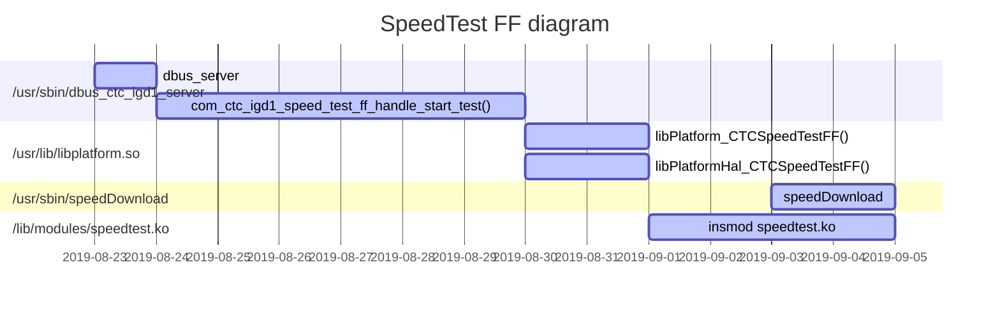

to setting values:

```shell
# gdbus call -y -d com.ctc.igd1 -o /com/ctc/igd1/Diagnostics/HttpDownload -m com.ctc.igd1.Properties.Set com.ctc.igd1.SpeedTestFF URL "<\"http://202.107.217.212:16039 \">"
(or http://61.175.31.158:16039, http://61.154.53.106:16039)

# gdbus call -y -d com.ctc.igd1 -o /com/ctc/igd1/Diagnostics/HttpDownload -m com.ctc.igd1.Properties.Set com.ctc.igd1.SpeedTestFF Ticket "<\"0000022222\">"

# gdbus call -y -d com.ctc.igd1 -o /com/ctc/igd1/Diagnostics/HttpDownload -m com.ctc.igd1.Properties.Set com.ctc.igd1.SpeedTestFF SpeedType "<byte 0x01>"

# gdbus call -y -d com.ctc.igd1 -o /com/ctc/igd1/Diagnostics/HttpDownload -m com.ctc.igd1.SpeedTestFF.StartTest 10
```

to getting values:

```shell
# gdbus call -y -d com.ctc.igd1 -o /com/ctc/igd1/Diagnostics/HttpDownload -m com.ctc.igd1.Properties.Get com.ctc.igd1.SpeedTestFF URL
(<'http://202.107.217.212:16039 '>,)

# gdbus call -y -d com.ctc.igd1 -o /com/ctc/igd1/Diagnostics/HttpDownload -m com.ctc.igd1.Properties.Get com.ctc.igd1.SpeedTestFF Ticket
(<'0000022222'>,)

# gdbus call -y -d com.ctc.igd1 -o /com/ctc/igd1/Diagnostics/HttpDownload -m com.ctc.igd1.Properties.Get com.ctc.igd1.SpeedTestFF SpeedType
(<byte 0x00>,)

# gdbus call -y -d com.ctc.igd1 -o /com/ctc/igd1/Diagnostics/HttpDownload -m com.ctc.igd1.Properties.Get com.ctc.igd1.SpeedTestFF Result
(<uint32 1>,)

# gdbus call -y -d com.ctc.igd1 -o /com/ctc/igd1/Diagnostics/HttpDownload -m com.ctc.igd1.Properties.GetAll com.ctc.igd1.SpeedTestFF
({'TestingStatus': <true>, 'Result': <uint32 1>, 'Ticket': <'0000022222'>, 'SpeedType': <byte 0x01>, 'URL': <'http://202.107.217.212:16039 '>, 'DW_SPEED_MAX_RATE': <'0'>, 'DW_SPEED_RATE': <'0'>, 'UP_SPEED_MAX_RATE': <'0'>, 'UP_SPEED_RATE': <'0'>, 'BEGIN_TIME': <'2019-11-06 10:26:46'>, 'END_TIME': <'2019-11-06 10:26:56'>},)
```

**(Note: all those above command can running within Econet's FW. )**


## 20190812  Mitrastar's FW Debug

### MfgMode

```shell
# zysh
ZySH> configure terminal
config$ btt off
config$ testled on
config$ ethctl
```

#### Debug command

```shell
# zysh
ZySH> debug module-debug set all debug-level 1
Set debug module all to level 1 success.
ZySH> 
ZySH> debug module-debug save 
ZySH> 
ZySH> debug module-debug show debug-level all
```

### ePon & gPon Register

```shell
# atbp show
Number of MAC Addresses (1-32)    :  10  
Base MAC Address                  :  00:19:cb:0a:05:87  
Serial Number                     :  649A0649A0896B944  
Password for Useradmin            :  12345  
SSID for first wireless (10-31)   :  ChinaNet-b944  
Password for first wireless (8-31):  12345678  
WAN working mode [0|1|2|3|4|5|6|7]:  0  (0,4 for ePon, 1 for gPon) 
GPON Serial Number                :  MSTC0A000058  
GPON Password                     :  2334567834  
Semi-manufactured SN              :  0Y0000000000  

```

to register ePon should setting **Base MAC Address ** by  "00:19:CB:0A:05:87" ( **0590-3**)  and running  *"onuoamd"* app , to register gPon should setting **GON Serial Number** by  "MSTC0A000058" and running 	"*mosapp*". ( **serial number must be capital case.**)


#### Capture frame for ePon in Econet platform

1.  open package mirror :

```shell
/usr/sbin/sys wan2lan on 15
```

2. open *Wireshark* ( install slow_new plugin) , and choise *slow_new* as following.

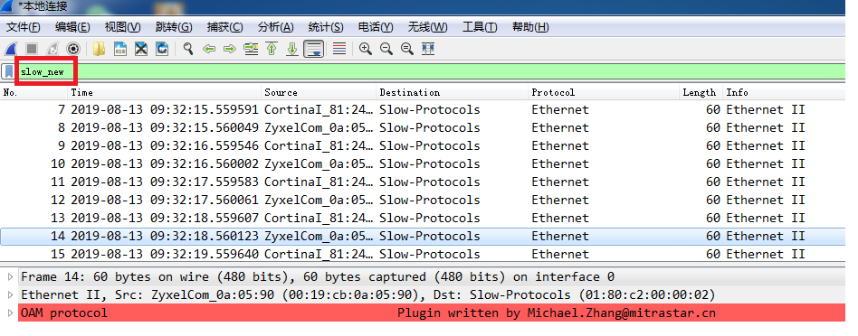


#### Capture frame for gPon Econet platform

develop with gPon can not use *wireshark* to capture frame directly , to capture frame by following:

```shell
# moscli ploamtrace on
# Debug Level: 10
Debug Level: 14
[42949464360ms]PLOAM: Send REI message.(3A080000 00000400 00000000)
[42949474380ms]PLOAM: Send REI message.(3A080000 00000500 00000000)
AsicSetSyncModeAndEnable(): NotSupportedFunc for this arch(HIF_MT)!
[DfsCacEndUpdate] CAC end. Enable MAC TX.
[42949477900ms]GPON IRQ: A PLOAM message received interrupt.DBG_GRP_0[1f0006], DBG_GRP_1[40000]
[42949477900ms]PLOAM: Receive Assign_ONU_ID message.(FF033643 4D4440B2 00004800)
[42949477900ms]The serial number of PLOAM message is incorrect
[42949477900ms]Receive the PLOAM message same:FF033643
[42949477900ms]Receive the PLOAM message same:FF033643
[42949477930ms]GPON IRQ: A PLOAM message received interrupt.DBG_GRP_0[1f0006], DBG_GRP_1[40000]
[42949484400ms]PLOAM: Send REI message.(3A080000 00000600 00000000)
[42949494420ms]PLOAM: Send REI message.(3A080000 00000700 00000000)
[42949504440ms]PLOAM: Send REI message.(3A080000 00000800 00000000)
[42949506780ms]GPON IRQ: A PLOAM message received interrupt.DBG_GRP_0[1f0006], DBG_GRP_1[40000]
[42949506780ms]PLOAM: Receive Assign_ONU_ID message.(FF033643 4D4440B2 00004800)
[42949506780ms]The serial number of PLOAM message is incorrect
[42949506780ms]Receive the PLOAM message same:FF033643
[42949506780ms]Receive the PLOAM message same:FF033643
[42949506810ms]GPON IRQ: A PLOAM message received interrupt.DBG_GRP_0[1f0006], DBG_GRP_1[40000]
[42949514460ms]PLOAM: Send REI message.(3A080000 00000900 00000000)
```

(more detail at [GponKownledge](pdf_resource/GPON_Knowledge_Introduce.pptx)  , the following sequence of events to register on OLT  by  **1) serial number  ; 2) password ; 3) LOID** )


## 20190816   Linux Debug

### econet 7526 crash info

1. epc info shows without offset address

```shell
User Mode page fault at process 1052 (zysh)
CPU: 1 PID: 1052 Comm: zysh Tainted: P           O   3.18.21 #96
task: 99ed8b30 ti: 9ac6c000 task.ti: 9ac6c000
$ 0   : 00000000 77b69415 00000000 77e7d8e0
$ 4   : 00000004 00000000 776693e4 00000000
$ 8   : 77ae42f4 77ade924 00000000 ffffffff
$12   : 77e62000 f0000000 00000001 77656ad0
$16   : 00000000 00000000 00000006 00000000
$20   : 00000001 004370b8 00898990 00000001
$24   : 000000bd 77b47de0                  
$28   : 77671330 7f9e6ef8 00892260 776582b8
Hi    : 00000249
Lo    : 0001cbed
epc   : 776582c8 0x776582c8
 Tainted: P           O  
ra    : 776582b8 0x776582b8
Status: 01000013	USER EXL IE 
Cause : 0080d008
BadVA : 00000000
PrId  : 0001992f (MIPS 1004Kc)
ort Status Speed Duplex TX_FC RX_FC
Segmentation fault
```

2. 提前打印出将要crash 的地址信息

```shell
# cat /proc/1052/maps 
00400000-00430000 r-xp 00000000 1f:00 1106       /usr/bin/zysh
00430000-00431000 rw-p 00030000 1f:00 1106       /usr/bin/zysh
...
77654000-7765a000 r-xp 00000000 1f:00 1175       /usr/lib/libmtkswitch.so.1.
...
```


3. 算偏移量  **776582c8 - 77654000 = 42c8** ， 通过 *mips-linux-objdump* 以及偏移量, 查找 **libmtkswitch.so** 文件的偏移地址

```shell
# /opt/trendchip/mips-linux-uclibc-4.9.3/usr/bin/mips-linux-objdump -d  libmtkswitch.so |
00004270 <macMT7530GetPortLinkState>:
...
42c8:	304300ff 	andi	v1,v0,0xff
...
```


4. 计算偏移量  **42c8 - 4270 = 58**  ,  继续通过 *mips-linux-objdump* 查找对应的 **libmtkswitch.o** 文件的对应地址，之后加上偏移量 **58** ，得到相对应的偏移地址 **1838**

```shell
# /opt/trendchip/mips-linux-uclibc-4.9.3/usr/bin/mips-linux-objdump -d ./libmtkswitch.o |grep  "macMT7530GetPortLinkState"
000017e0 <macMT7530GetPortLinkState>: 
```


5. 查找与地址相对应的代码为 : *sysapps/ethcmd/mtkswitch_api.c*  中的 1307 行。

```shell
# /opt/trendchip/mips-linux-uclibc-4.9.3/usr/bin/mips-linux-addr2line -e ./libmtkswitch.o 1838
/home/chear/EN7528_CTC_NEW/dev/build/sysapps/ethcmd/mtkswitch_api.c:1307
```


## 20190826  

### system crash (without any response) when plug-in usb-flash disc

sample script to running *dd*  command within 11 times to testing the USB hung issue.

```shell
# for i in $(seq 1 11); do echo ${i}; dd if=/dev/mtd2 of=/mnt/usb1_1/test.bin;  done

("for i in {1..10}; do echo ${i}; dd if=/dev/mtd2 of=/mnt/usb1_1/test.bin;done", for /bin/bash in x86 or x64)
```

"*for i in 1 2 3 4 5 6 7 8 9 10 ; do echo ${i}; dd if=/dev/mtd2 of=/mnt/usb1_1/test.bin; done*" can both running in **busybox sh**  and **bash**


 *umount* usb-flash with following issue, should remove *minidlna* first.	

```shell
# umount /mnt/usb1_1/
umount: can't umount /mnt/usb1_1/: Device or resource busy
# ps |grep "minidlna"
7264 root     10880 S    /usr/sbin/minidlna -R -f /etc/minidlna/minidlna.conf
# kill -9 7264
# umount /mnt/usb1_1/
# usb 1-1: USB disconnect, device number 4
```


## 20190828 Econet command

### econet original image login

econet's FW web server based on  **boa** , binary local file at */boaroot/cgi-bin/*
```shell
# prolinecmd xponmode set epon 	(or gpon, to switch ePon or gPon) 
# sys wan2lan on 15
# prolinecmd restore defualt
```


## 20190917  Replace FW

### Switch FW between Econet and Mitrastar within en7528 chip

Econet for *tcboot.bin & tclinux.bin* ,and  Mitrashar for *loader.img & ras.bin* , the more important its both boot-loader with same size for 256k.

#### switch loader.img to tcboot.bin

1. login to u-boot, and download *tcboot.bin* to memory  , then write to flash. 

```shell
u-boot # loadx 0x80000000 			(upload tcboot.bin with x-modem by serial port)
u-boot # nander 0 40000				(earse nand flash from 0x0 to 0x40000 for 256k)
u-boot # nandwr 0 80000000 40000	(write nand flash from 0x0 to 0x40000,sync from 										memory at 0x80000000 )  
```

2. reboot and upgrade *tclinux.bin* ( Econet boot-loader login password by telecomadmin / nE7jA%5m)

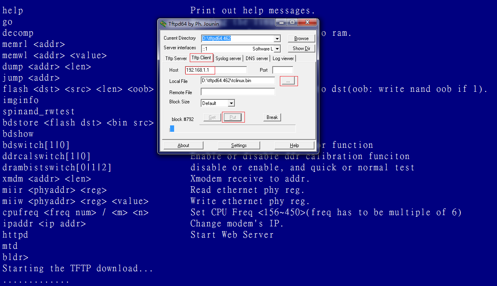


#### switch tcboot.bin to loader.img

1. Rename loader.img to tcboot.bin  (not working) 


```shell

```

(No Complete)


## 20190919 kernel hook for net filte

source  code:

```c
struct nf_sockopt_ops
{
    struct list_head list;
    
    int pf;
    
    /* Non-inclusive ranges: use 0/0/NULL to never get called. */
    int set_optmin;
    int set_optmax;
    int (*set)(struct sock *sk, int optval, void *user, unsigned int len);

    int get_optmin;
    int get_optmax;
    int (*get)(struct sock *sk, int optval, void *user, int *len);
        
    /* Number of users inside set() or get(). */
    unsigned int use;
    struct task_struct *cleanup_task;
};  

// usage:
static struct nf_hook_ops httpd_hooks = {   
    .hook = httpd_syn_flood_hook_fun,
    .pf = NFPROTO_IPV6,
    .owner = THIS_MODULE,
    .hooknum =  NF_BR_LOCAL_IN, 
    .priority = NF_IP_PRI_FIRST, // NF_IP_PRI_FIRST, //NF_IP_PRI_LAST ;NF_IP_PRI_MANGLE;
};  
```


## 20190925  Hisi child-process count

### Hisi count child-process for mini_httpd

re-move the child-process when "mini_httpd" crate by *fork()*.

```shell
# ps |grep mini_httpd|grep -v grep|awk '{print int($0)}'|xargs kill -9
```

to count the child-process when accept by "mini_httpd" , the *1190*  means the parent-process.

```shell
# ps |grep mini_httpd|grep -v grep|grep -v 1190|awk '{print NR}'|tail -n1
or
# pgrep mini_httpd|wc -l
```

to count the TCP connection while "mini_httped" listened , hex '1F90' convert decimal with '8080'. 

```shell
# cat /proc/net/tcp6 |grep "1F90" |awk 'END{print NR}'
```


## 20190927  system() and popen() difference

### system() and popen() difference in Linux C

both *[system()](<http://man7.org/linux/man-pages/man3/system.3.html>)* and *[popen()](<http://man7.org/linux/man-pages/man3/popen.3.html>)* are source in glibc for  POSIX library , 


```c
#include <stdio.h>
FILE *popen(const char *command, const char *type);
int pclose(FILE *stream);

#include <stdlib.h>
int system(const char *command);
```
ref: [Linux Man Page List ](<http://man7.org/linux/man-pages/dir_all_by_section.html>)


## 20191017  Quilt patch management

*[quilt](<<http://www.shakthimaan.com/downloads/glv/quilt-tutorial/quilt-doc.pdf>)*  command used to manage patch.

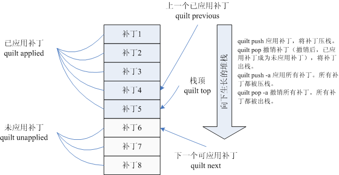

```shell
# diff -u solution/package/openwrt/dnsmasq-2.72/dnsmasq-2.72/VERSION  openwrt/build_dir/target-arm-openwrt-linux-uclibcgnueabi/dnsmasq-full/dnsmasq-2.72/VERSION > dns.patch

```


## 20191018  Hisi debug

TR069  debug value for  **InternetGatewayDevice.Time.CurrentLocalTime** , source at *hisilicon/gateway/cms/*

the test case as following:

1. display the cwmp's log and capture data

```shell
root@OpenWrt:~# cli /home/cli/hal/port/port_mirror_set -v igr 0x200 egr 0x200 dport 0
root@OpenWrt:~# log_voice_cli cwmpClient cwmp_log 		(enable or disable TR069 log)
```

2. verify the message for TR069 at ``/var/log/message``


## 20191104  Hisi bob config

### To update bob_config.ini

```shell
root@OpenWrt:~# cd /tmp/ && tftp -g -r bob_config.ini 192.168.1.7
root@OpenWrt:~# cp ./bob_config.ini /usr/local/factory/bob_config.ini
root@OpenWrt:~# reboot
```

for bob chip **GN25L95** , check the value of table_2 0xA4, and make sure it’s 0x35, fail if not.

```shell
root@OpenWrt:~# cli /home/cli/bob/get_reg_data -v tab 2 reg 0xA4
real tab idx:2!
tab : 0x2
reg : 0xa4
val : 0x35
succ.
```

bob default calibration files at ``/etc/bob/bob_config_default.ini`` and ``/usr/local/factory/bob_config.ini``  , contains by following

```shell
root@OpenWrt:~# hexdump -C /usr/local/factory/bob_config.ini 
00000000  02 a0 80 00 00 00 00 00  01 00 00 01 0d 00 14 c8  |................|
000000ff  00 00 00 00 00 00 00 00  00 00 00 00 00 00 00 00  |................|
... ([A2] section , 256 bytes)
00000100  64 00 ce 00 5f 00 d3 00  90 88 71 48 8e 94 73 3c  |d..._.....qH..s<|
00000170  00 00 00 ff 00 00 ff ff  00 00 ff ff ff ff ff 02  |................|
... ([BiasLUT] section. 128 bytes)
00000180  ff ff ff ff ff ff ff ff  ff ff ff ff ff ff ff ff  |................|
00000220  6a 1b 70 9a 35 03 61 41  96 3e 80 3e 80 f9 f8 df  |j.p.5.aA.>.>....|
000002f0  66 80 68 00 69 c0 6b c0  6d c0 6f c0 72 40 74 80  |f.h.i.k.m.o.r@t.|
...	([A2_TAB2] section. 128 bytes, 0x35 is value for reg 0xA4)
```

 ([MODLUT] section, not sure , [APDLUT] section,not sure)

### QoS Service test case (Gogo shell)

setting on H3 gateway to limit speed for download or upload, 

````shell
# addTrafficToFlow [remoteAddress:String] [remotePort:String] [flow:int]
# setSpeedLimitByFlow [flow:int] [upSpeed:int] [downSpeed:int]
# deleteAllTrafficFromFlow [flow:int]
````

Description:

| Name                       | Paramater                      | Return                       |
| -------------------------- | ------------------------------ | ---------------------------- |
| *addTrafficToFlow*         | *[flow:int]* , values from 0-7 | 0 for success , 1 for failed |
| *setSpeedLimitByFlow*      | *[flow:int]*, values from 0-7  | 0 for success , 1 for failed |
| *deleteAllTrafficFromFlow* | *[flow:int]*, values from 0-7  | 0 for success , 1 for failed |

```shell
root@OpenWrt:~# telnet 127.0.0.1 6666
____________________________
Welcome to Apache Felix Gogo

g! addTrafficToFlow "172.25.24.13" "0" 1
0
g! setSpeedLimitByFlow 1 2048 2048
0
```

based on *iperf* ,server at 172.25.24.13,

```shell
michael@michael-HP-Pro-3330-MT:~/Downloads$ iperf -s -w 100M
```

PC client

```shell
G:\iperf-2.0.5-win32>iperf.exe -c 172.25.24.13 -i 1 -t 3600
```


## 20191111  Hisi usb

### Hisilicon USB controller

Kernel USB module source file at *linux-3.18.11/drivers/usb/hsan/* and *linux-3.18.11/arch/arm/mach-hsan/chip* , main for following

```shell
$ tree linux-3.18.11/drivers/usb/hsan/
├── hi_ohci.c	(handle for USB1.0)
├── hi_ehci.c	(handle for USB2.0)
└── hi_xhci.c	(handle for USB3.0)
$ tree linux-3.18.11/arch/arm/mach-hsan/chip/
├── hi_hal_usb.c
└── ...
```

Note: ohci  (Open Host Controller Interface) , ehci (Enhanced Host Controller Interface) , xhci (eXtensible Host Controller Interface)


### umount usb devices with in H3 platfrom

```shell
root@OpenWrt:~# killall minidlna
root@OpenWrt:~# umount /tmp/mnt/usb1_1/
```

**(Note: *minidlna* and *samba* all used to share file-system , but *samba* for about  documentation , *minidlna* can share media. )**


## 20191129  display detail macro source with-in compile

Note:  *"gcc -E SOURCE_FILE -o OUTPUT_FILE"*  can replace *macro* within source file.


## 20191204  ZyClip zloader & zboot

Upgrade  *zloader* and *zboot*  with xmodem.

to upgrade zloader:

```shell
u-boot # loadx 0x80000000 			
(send zloader image with x-modem by serial port)
u-boot # nander 0 20000				
(earse nand flash from 0x0 to 0x20000 for 128k)
u-boot # nandwr 0 80000000 20000	
(write nand flash from 0x0 to 0x20000,sync from 									memory within 0x80000000 and length for 0x20000 )  
```

to upgrade zboot:

```shell
u-boot # loadx 0x80000000 			
(send zboot image with x-modem by serial port)
u-boot # nander 20000 40000				
(earse nand flash from 0x200000 to 0x40000 for 128k, in my case same for loader.img)
u-boot # nandwr 20000 80000000 20000	
(write nand flash from 0x0 to 0x20000,sync from	memory within 0x80000000 and length for 0x20000 ) 
```

Finally use **atur ras.bin** to upgrade whole image.

Note: upgrade zloader by ***loader.img** , upgrade zboot by ***build/zboot.final_oob*** ,  zboot_main start   address at ***go 0x83600000***


## 20191205  Econet building command

building Econet BSP porting.

```shell
# fakeroot make PROFILE=[PROFILE_FOLDER_NAME] CUSTOM=CT clean all
# fakeroot make PROFILE=NP_EN7561D_LE_7592_7613_NORD_64M_demo CUSTOM=CT kernel_clean kernel buildimage
```


## 20200226  SCSI System

**SCSI (Small Computer System Interface  Linux)**  is a standard for parallel interfaces , and is one of the most commonly used interface for disk drives that was first completed in 1982.  SCSI include SCSI-1 , SCSI-2 , SCSI-3 standard , supports up to seven peripheral devices, such as hard drive , CD-ROM , and scanner , SCSI even early more than Linux.

[SCSI](<https://www.ibm.com/developerworks/cn/linux/l-scsi-subsystem/>) arch for linux :

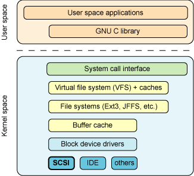


## 20200306  Hisi GUI can't login

Encounter question for GUI can not login when change the ip address  for bridge , such like *192.168.1.1*  to *192.168.200.1* .  Then change the values to set  *ucStatus = 0* and  *ucResult = 1* with-in *REMOTEMGT_LOID_REG_ATTR_TAB* and *REMOTEMGT_PASSWORD_REG_ATTR_TAB* can fix this issue. 

(Note : this question only find out when config by JiangSu province.)

*solution/patch/openwrt/vendors/config/cmcc_smart_jt_4_0_1_8_1.xml*

```xml
<Dir Name="REMOTEMGT_LOID_REG_ATTR_TAB"> <!--index=0-->
 <Value Name="ucStatus" Value="99"/>
 <Value Name="ucResult" Value="99"/>
 ...
</Dir>
<Dir Name="REMOTEMGT_PASSWORD_REG_ATTR_TAB"> <!--index=0-->
 <Value Name="ucStatus" Value="99"/>
 <Value Name="ucResult" Value="99"/>
 ...
</Dir>
```


## 20200309  Hisi mstc8.bin

chief process to make HSAN mstc8.bin , script at *Tools/hitools/hi_makeimage/mkp*

```shell
### 1. update env
update_env $partition_list $env_bin $partition_table
dos2unix $partition_table

### 2. generate pad file make FF padding file, size 128MB 
make_padding_file $pad_file

### 3. concact files with env binary handled
concact_file_and_env $env_bin $factory_bin $images_dir $pad_file $partition_table

### 4. call addecc proc
./addecc -i $factory_bin -p 2048 -b 8 -s 64 -o $factory_ecc_64oob_bin

### 5. reverse 32byte in block0 page0 and page1 to fit the special FMC request 
./page_reverse -e $nand_ecc_mode -s 64 -b 64 -p 2048 -f $factory_ecc_64oob_reverse_bin
./gen_partition $factory_ecc_64oob_reverse_bin $factory_part_bin
./convert $factory_part_bin $factory_ecc_64oob_reverse_bin $mstc8_bin  2
```

HSAN partition info based on H2-3

```text
                    |--------------------|-----------------------------------
                    |       Java B       |  java.bin,zize=0xE00000
            0x6000000 -------------------|
                    |       Java A       |
            0x4200000 -------------------|-----------------------------------
                    |                    |
                    |       rootfs B     |  root.squshfs,size=0x1900000
            0x2900000 -------------------|
                    |                    |
                    |        rootfs A    |  root.squshfs,size=0x1900000
            0x1000000 -------------------|-----------------------------------
                    |                    |
                    |       kernel B     |  kernel.images size=0x50000
             0xB00000 -------------------|
                    |                    |
                    |       kernel A     |  
             0x600000 -------------------|-----------------------------------
                    |       ENV          |  env.bin, size=0xA0000
              0xc0000 -------------------|
                    |     	ENV          |  env.bin, size=0xA0000
              0x20000 -------------------|-----------------------------------
                    |       HI_Boot      |  hi_boot.bin,size=0x20000
              0x00000 -------------------|
```


## 20200312 Hisi nand read& write

to test nand flash write , **nand read** 8 byte from block 0 page 0 to memory address at 0x88000000, then write those 8 byte to block 8 page 0.

```shell
hi # nand read 0x88000000 0x0 0x8
OK
hi # md 0x88000000
88000000: ea00000e e59ff014 ffffffff ffffffff    ................
88000010: ffffffff ffffffff ffffffff ffffffff    ................
88000020: ffffffff ffffffff ffffffff ffffffff    ................
88000030: ffffffff ffffffff ffffffff ffffffff    ................
hi # nand write 0x88000000 0x100000 0x8
hi # nand dump 0
(to print whole page include ecc)
```


## 20200326 HSAN loopback issue

cfe & sal startup process:

source file at ``/hisilicon/gateway/service/sal/intf/source/hi_sal_diag.c``


## 20200329  Gogo shell download speed test

Gogo shell source at ``hisilicon/gateway/cms/cmcc_smart/osgi/com.chinamobile.smartgateway.implement/src/main/java/com/chinamobile/smartgateway/accessservices/impl/HttpDownloadDiagnosticsServiceImpl.java``

``hisilicon/gateway/cms/cmcc_smart/libs/jni/src/source/com_chinamobile_smartgateway_accessservices_impl_HttpDownloadDiagnosticsServiceImpl.c``

speed diagnose command by following.

```shell
root@OpenWrt:~# telnet 127.0.0.1 6666
g! startHttpDownloadDiagnosticsj 2 "http://120.196.167.30:9070/speed/2000000.data" "MeasurementOffset:0,TestDuration:30,NumberOfConnections:1"
g! getHttpDownloadDiagnosticsResult
```

(Note: when downloading  100M file with 100M/bps band net, the TestDuration as small as possible , and  loading ktcpdiag_unused.ko not ktcpdiag.ko while the last one used to accelerate to speed fast. )


Debug to hi_emu_speed for SAL 

```shell
root@OpenWrt:~# cli /home/cli/log_cmd/log/cfg_set -v module 0xF0004000 dbg 0xff print 0xff sys 1
succ.
```

(Note: above cmd should print sal debug info for emu modules ,  and display total bytes received and )

```c
typedef struct
{
    hi_uint32           ui_dir;
    hi_char8            ac_ifname[HI_EMU_IFNAME_LEN];
    hi_char8            ac_url[HI_EMU_URL_LEN];
    hi_uint32           ui_dscp;
    hi_uint32           ui_prioty;
    hi_uint32           ui_state;
    struct timeval      st_rom_time;
    struct timeval      st_bom_time;
    struct timeval      st_eom_time;
    hi_ulong64          ull_test_bytes;
    hi_ulong64          ull_total_bytes;
    struct timeval      st_tcp_req_time;
    struct timeval      st_tcp_rsp_time;
    hi_char8            ac_sample[HI_EMU_SPEED_SAMPLE_LEN];
    hi_char8            ac_totalsample[HI_EMU_SPEED_SAMPLE_LEN];
    hi_uint32           ui_max_time;
    hi_uint32           ui_sample_time;
} hi_emu_speed_cfg_s;
```


## 20200407  bob default configuration

``/usr/local/factory/bob_config.ini`` mount pointed at  */dev/mtdblock3* by JFFS2.  (block device for ``/dev/mtdblock3`` , char device for ``/dev/mtd3`` ) , and created by kernel cmd parser (key word by **mtdparts**),   config by following within *hsan* platform. 

(Note: those mtd devices contained within *kernel.images*)

```Makefile
config MTD_CMDLINE_PARTS
	tristate "Command line partition table parsing"
	depends on MTD
	---help---
	  Allow generic configuration of the MTD partition tables via the kernel
	  command line. Multiple flash resources are supported for hardware where
	  different kinds of flash memory are available.

	  You will still need the parsing functions to be called by the driver
	  for your particular device. It won't happen automatically. The
	  SA1100 map driver (CONFIG_MTD_SA1100) has an option for this, for
	  example.

	  The format for the command line is as follows:

	  mtdparts=<mtddef>[;<mtddef]
	  <mtddef>  := <mtd-id>:<partdef>[,<partdef>]
	  <partdef> := <size>[@offset][<name>][ro]
	  <mtd-id>  := unique id used in mapping driver/device
	  <size>    := standard linux memsize OR "-" to denote all
	  remaining space
	  <name>    := (NAME)

	  Due to the way Linux handles the command line, no spaces are
	  allowed in the partition definition, including mtd id's and partition
	  names.

	  Examples:

	  1 flash resource (mtd-id "sa1100"), with 1 single writable partition:
	  mtdparts=sa1100:-

	  Same flash, but 2 named partitions, the first one being read-only:
	  mtdparts=sa1100:256k(ARMboot)ro,-(root)

	  If unsure, say 'N'.
#
# MTD block device support is select'ed if needed
#
config MTD_BLKDEVS
	tristate

config MTD_BLOCK
	tristate "Caching block device access to MTD devices"
	depends on BLOCK
	select MTD_BLKDEVS
	---help---
	  Although most flash chips have an erase size too large to be useful
	  as block devices, it is possible to use MTD devices which are based
	  on RAM chips in this manner. This block device is a user of MTD
	  devices performing that function.

	  At the moment, it is also required for the Journalling Flash File
	  System(s) to obtain a handle on the MTD device when it's mounted
	  (although JFFS and JFFS2 don't actually use any of the functionality
	  of the mtdblock device).

	  Later, it may be extended to perform read/erase/modify/write cycles
	  on flash chips to emulate a smaller block size. Needless to say,
	  this is very unsafe, but could be useful for file systems which are
	  almost never written to.

	  You do not need this option for use with the DiskOnChip devices. For
	  those, enable NFTL support (CONFIG_NFTL) instead.

```


```shell
root@OpenWrt:~# cat /proc/cmdline 
console=ttyAMA1,115200 r quiet mtdparts=hi_nfc:256K(boot),1M(enva),1M(envb),2M(fac),2M(cfga),2M(cfgb),2816K(log),5M(kernela),5M(kernelb),25M(rootfsa),25M(rootfsb),35M(fwka),35M(fwkb),110M(app),-(other) root=/dev/mtdblock9 rootfstype=squashfs mem=248M console_off=0

```

*/usr/local/factory/bob_config.ini* created by following

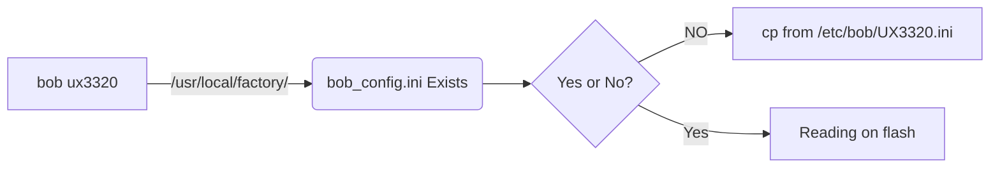


## 20200421  boa web server for hisi openwrt

Http boa  access ``config.js`` , ``language_cn.js`` and  ``menucustomize.js``  to layout the web page . ( define web page widget within ``config.js`` such as text  , checkbox ,radio etc,   display info and message  defined within  ``language_cn.js``  , the *menucustomize.js* used to layout the web page and menu.  

Web page post data to CMS access jason , each page has also defined a  ``*_action.js``  to react the widget  property and event for those page , web page send  ``*.cgi``  to the ``hisilicon/gateway/cms/web/src/cyg_cgi.c``  for each operation    , such like  ``Net_WLAN_action.js`` etc.

​	


To debug the GUI page, should by below

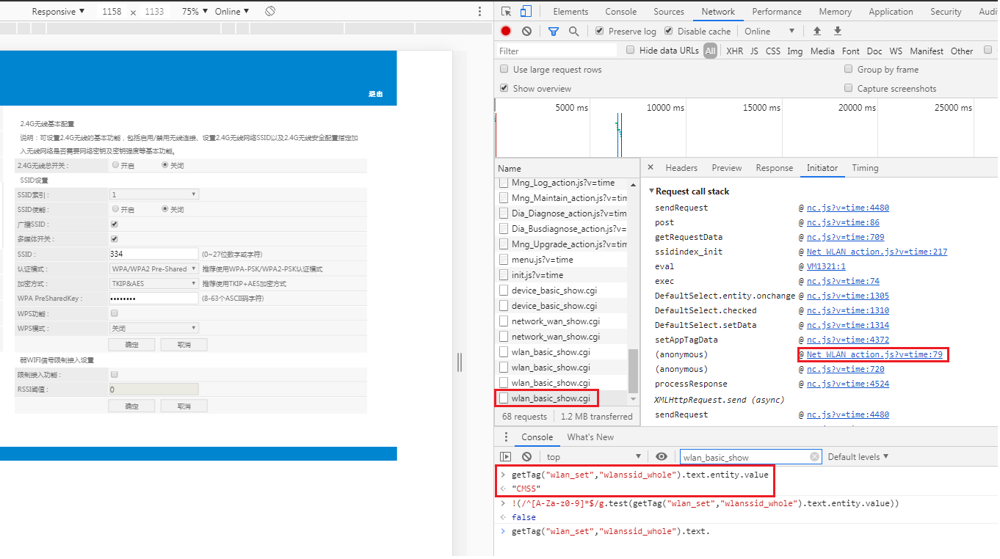


## 20200622  dpi HTTP 精细流插件

overall : cfe, qos,gogo-shell  

```shell
g! addHTTPTrafficProcessRuleJ "" 80 UP E4:E7:49:3B:12:42 "GET,POST" "" "User-Agent" com.chinamobile.smartgateway.cmccdpi
```

### 1. getHTTPTrafficProcessRuleInfo

select and start dpi  plugin , and then this plug-in should   ``addHTTPTrafficProcessRuleJ`` , get info as following:

```shell
# display the plug-in
g! lb
...
   26|Active     |   90|HguDpi (2.2.2)|2.2.2
# 
g! start 26
# to display the rule info
g! getHTTPTrafficProcessRuleInfo
{
        "Result":       0,
        "List": [{
                        "RemoteAddress":        "",
                        "RemotePort":   "80",
                        "Direction":    "UP",
                        "HostMAC":      "D0:BF:9C:57:FB:31",
                        "MethodList":   ["GET", "POST"],
                        "HeaderList":   ["User-Agent"],
                        "StatuscodeList":       [],
                        "BundleName":   "com.chinamobile.smartgateway.cmccdpi"
                }]
}
# add mirror
g! addMirrorRule "192.168.6.6" "8090" "UP" "TCP" "" "192.168.1.1" 10001
# get mirror 
g! getMirroRuleInfo
# add monitor addr
g! addTrafficMonitoringDestAddressJ "www.jd.com" "www.baidu.com" com.chinamobile.smartgateway.cmccdpi
# get val
g! getTrafficMonitoringDestAddressInfo
{
	"Result":	0,
	"List":	[{
			"BundleName":	"com.chinamobile.smartgateway.cmccdpi",
			"DestAddressList":	["www.jd.com", "www.baidu.com"]
		}]
}
```

### 2. iptables rules

``addHTTPTrafficProcessRuleJ``  command as following.

```shell
g! addHTTPTrafficProcessRuleJ "www.mirrors.163.com" 80 ALL D0:BF:9C:57:FB:31 "GET,POST" "" "User-Agent" com.chinamobile.smartgateway.cmccdpi 
```

using ``cli /home/cli/log_cmd/log/cfg_set -v module 0xF600d000 dbg 0xff print 0xff sys 1`` can get mote detail log for this, finally this commands should add two rule into ``iptables -t mangle`` 

```shell
root@OpenWrt:~# iptables -t mangle -nvL
Chain PREROUTING (policy ACCEPT 4281 packets, 319K bytes)
 1817  140K TRAFFIC    tcp  --  *      *       0.0.0.0/0            0.0.0.0/0            tcp dpt:80 TRAFFIC rule index :256 
 TRAFFIC rule imode :1 

   64  4676 TRAFFIC    tcp  --  *      *       0.0.0.0/0            0.0.0.0/0            MAC D0:BF:9C:57:FB:31 tcp dpt:80 TRAFFIC rule index :256 
 TRAFFIC rule imode :0 

   64  4676 MARK       tcp  --  *      *       0.0.0.0/0            0.0.0.0/0            MAC D0:BF:9C:57:FB:31 tcp dpt:80 MARK or 0x80000000

Chain POSTROUTING (policy ACCEPT 2873 packets, 1528K bytes)
 pkts bytes target     prot opt in     out     source               destination         
 1428 1469K MARK       tcp  --  *      *       0.0.0.0/0            0.0.0.0/0            tcp spt:80 MARK or 0x80000000
```

### 3. Hisilicon 硬件加速

```shell
root@OpenWrt:~# cli /home/cli/log_cmd/log/cfg_set -v module 0xF600d000 dbg 0xff print 0xff sys 1
root@OpenWrt:~# cli /home/cli/cfe/lrn/lrn_setcfg -v lrn 10
root@OpenWrt:~# cli /home/cli/cm/traffic_detail_process_srv_get_all
```


## 20200818 gPon LOID Authentication

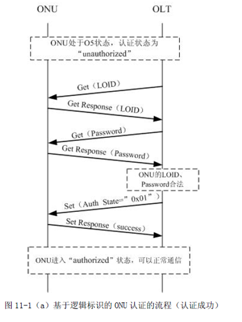

**Authentication status**，标识ONU 的认证的状态，ONU 缺省值为0x00。ONU 重启后该属性应恢复成0x00（W，R） （1bytes）(mandatory)

- 0x00： 初始状态

- 0x01： 认证成功
- 0x02： LOID 不存在
- 0x03： LOID 存在，但是password 错误
- 0x04： LOID 冲突，即已有该LOID 的ONU 认证成功。
- 0x05-0xff：Reserved


## 20200903  Hisi VxLan ping incorrect

### 1.  to building new SDK from Hisilicon

```shell
michael@michael-HP-Pro-3330-MT: unzip HSANV200R011C01SPC050TB014.zip && cd HSANV200R011C01SPC050TB014
michael@michael-HP-Pro-3330-MT: make V=s -j1
```

Note:  1. check open source zip files at  ``solution/package/openwrt``  ; 2. check the patch file at ``\solution\patch\openwrt\package\apps\gsoap\patches\001-gsoap-Makefile.patch`` ; 3. check the missing file for the SDK.


### 2. VxLan verify utility usage:

ip, ebtables, 

```shell
root@OpenWrt:~# ebtables -t filter -L
Bridge table: filter

Bridge chain: INPUT, entries: 5, policy: ACCEPT
-p IPv6 -j DEF_WAN_DHCPV6_IN
-p IPv4 -j DEF_WAN_DHCP_IN
-p IPv6 -i wan+ --ip6-proto udp --ip6-dport 546:547 -j DROP 
-p IPv4 -i wan+ --ip-proto udp --ip-dport 67:68 -j DROP 
-i ! wan+ -j BOUND_IN

Bridge chain: FORWARD, entries: 12, policy: ACCEPT
-i lan1 -j VXLAN1_FWD
-i vxlan1 -j VXLAN1_FWD
-i ! wan+ -o vap1 -j DROP 
-i vap1 -o ! wan+ -j DROP 
-p IPv6 -j DEF_WAN_DHCPV6_FWD
-p IPv4 -j DEF_WAN_DHCP_FWD
-p IPv6 -i ! wan+ --ip6-proto udp --ip6-dport 546:547 -j DROP 
-p IPv4 -i ! wan+ --ip-proto udp --ip-dport 67:68 -j DROP 
-i vap+ -o wan+ -j BOUND
-i wan+ -o vap+ -j BOUND
-i vap+ -o wan+ -j BOUND_DEF
-i wan+ -o vap+ -j BOUND_DEF

Bridge chain: OUTPUT, entries: 3, policy: ACCEPT
-p IPv6 -j DEF_WAN_ICMPV6_OUT
-p IPv4 -o wan+ --ip-proto udp --ip-dport 68 -j DROP 
-p IPv6 -o wan+ --ip6-proto ipv6-icmp --ip6-icmp-type router-advertisement -j DROP 

Bridge chain: BOUND_IN, entries: 12, policy: ACCEPT
-i lan1 -j mark --mark-or 0x10 --mark-target ACCEPT
-i lan2 -j mark --mark-or 0x20 --mark-target ACCEPT
-i lan3 -j mark --mark-or 0x30 --mark-target ACCEPT
-i lan4 -j mark --mark-or 0x40 --mark-target ACCEPT
-i vap0 -j mark --mark-or 0x50 --mark-target ACCEPT
-i vap1 -j mark --mark-or 0x60 --mark-target ACCEPT
-i vap2 -j mark --mark-or 0x70 --mark-target ACCEPT
-i vap3 -j mark --mark-or 0x80 --mark-target ACCEPT
-i vap4 -j mark --mark-or 0x90 --mark-target ACCEPT
-i vap5 -j mark --mark-or 0xa0 --mark-target ACCEPT
-i vap6 -j mark --mark-or 0xb0 --mark-target ACCEPT
-i vap7 -j mark --mark-or 0xc0 --mark-target ACCEPT

Bridge chain: BOUND, entries: 0, policy: RETURN

Bridge chain: BOUND_DEF, entries: 0, policy: DROP

Bridge chain: DEF_WAN_DHCP_IN, entries: 0, policy: RETURN

Bridge chain: DEF_WAN_DHCPV6_IN, entries: 0, policy: RETURN

Bridge chain: DEF_WAN_DHCP_FWD, entries: 0, policy: RETURN

Bridge chain: DEF_WAN_DHCPV6_FWD, entries: 0, policy: RETURN

Bridge chain: DEF_WAN_ICMPV6_OUT, entries: 0, policy: RETURN

Bridge chain: VXLAN1_FWD, entries: 2, policy: DROP
-o vxlan1 -j ACCEPT 
-o lan1 -j ACCEPT 
```


## 20200915 SemTech GPon BSP-Porting for hi-5682t

building new sdk for 'V100R012C02SPC001TB016'

```shell
chear@sw3-cbs-233:$ make V=s
(to building whole)
chear@sw3-cbs-233:$ make mod=hisilicon/gateway V=s
(to building sub-modules path file at 'hisilicon/gateway/Makefile.hsan')
chear@sw3-cbs-233:$ make source mod=opensrc/dnsmasq V=s
chear@sw3-cbs-233:$ make source mod=kernel V=s
```

spec defnation

```c
/*
	| 7| 6|     5      | 4| 3| 2| 1| 0|
	|  |  | APD_LUT_EN |  |  |  |  |  |
 */
#define APD_LUT_CTRL 0xB6
/*
	| 7               | 6| 5| 4| 3| 2| 1| 0|
	| APD_PWM_PIN_OEN |  |  |  |  |  |  |  |
 */
#define APD_CONTROLLER_1 0xD0
/*
	| 7| 6| 5| 4| 3| 2| 1| 0|
	|Reserved| APD_OFFSET   |
 */
#define APD_OFFSET 0xD5
/*
	| 15   -    6| 5| 4| 3| 2| 1| 0|
	|APD_RAMP_TGT|     Reserved    |
 */
#define APD_RAMP_TGT 0xE1
/*
	|15        0 |
	|ADC_RX_POWER|
 */
#define ADC_RX_POWER 0xE8
#define APD_DAC_LUT 0xC0
```

### Debug SemTech GN28L97 with i2c

Read & Write OFFSET:

```shell
( read APD_OFFSET 0xD5 )
$ cli /home/cli/hal/chip/i2c_cmd_write -v dev_addr 0x51 reg_addr 0x7f data 0x80 && cli /home/cli/hal/chip/i2c_cmd_read -v dev_addr 0x51 reg_addr 0xd5

( write APD_OFFSET 0xD5 ,value for 0x11 )
$ cli /home/cli/hal/chip/i2c_cmd_write -v dev_addr 0x51 reg_addr 0x7f data 0x80 && cli /home/cli/hal/chip/i2c_cmd_write -v dev_addr 0x51 reg_addr 0xd5 data 0x11
```

Read & Write  RAMP:

```shell
( read APD_RAMP_TGT 0xE1 )
$ cli /home/cli/hal/chip/i2c_cmd_write -v dev_addr 0x51 reg_addr 0x7f data 0x80 && cli /home/cli/hal/chip/i2c_data_burst_receive -v dev_addr 0x51 reg_addr 0xe1 wr_mode 1 length 2

( write APD_RAMP_TGT 0xE1 by burst mode, value for 0x24c0 )
$ cli /home/cli/hal/chip/i2c_cmd_write -v dev_addr 0x51 reg_addr 0x7f data 0x80 && cli /home/cli/hal/chip/i2c_data_burst_send -v dev_addr 0x51 reg_addr 0xe1 pucdata 0x24c0 wr_mode 1 length 2
```

Read RX_POWER:

```shell
$ cli /home/cli/hal/chip/i2c_cmd_write -v dev_addr 0x51 reg_addr 0x7f data 0x81 && cli /home/cli/hal/chip/i2c_data_burst_receive -v dev_addr 0x51 reg_addr 0xe8 wr_mode 1 length 2
```


## 20201210  MTD test

The various MTD tests into compilation. The tests should normally be compiled as kernel modules. The modules perform	  various checks and verifications when loaded. 

```Makefile
CONFIG_MTD=y
CONFIG_MTD_TESTS=m
```

command to running MTD test:

```shell
# insmod mtd_stresstest.ko dev=9 count=1000
( 'dev=9' specify the number for mtd block device to test)
```


(Tips:  xshell can not startup  , and notify update last version , *two* ways to solute this  , **1.** update system date to 2008 or early , and close update option by  "工具" >> "选项"  >> "实时更新" .  **2.** update ``nslicense.dll``   , change hex value from **``7F 0C 81 F9 80 33 E1 01 0F 86 81``**  to **``7F 0C 81 F9 80 33 E1 01 0F 83 81``**  *(0x86 change to 0x83)* , Note. Xshell 5.0 update  from **``7F 0C 81 F9 80 33 E1 01 0F 86 80``**  to **``7F 0C 81 F9 80 33 E1 01 0F 83 80``**) 


## 20201224 Manually release memory on Linux

``free``  displays  the total amount of free and used physical and swap memory in the system

- total：内存总数

- used：已经使用的内存数
- free：空闲的内存数
- shared：当前已经废弃不用
- buffers Buffer：缓存内存数
- cached Page：缓存内存数

``/proc/sys/vm/drop_caches`` 　

​	0：0是系统默认值，默认情况下表示不释放内存，由操作系统自动管理
　　1：释放页缓存
　　2：释放dentries和inodes
　　3：释放所有缓存

```shell
# freee -m
             total       used       free     shared    buffers     cached
Mem:          3930       1619       2311         22        332        717
-/+ buffers/cache:        569       3361
Swap:         3981         77       3904
# sync && echo 0 > /proc/sys/vm/drop_caches　
()
```


## 20201225 New Hisi SDK for V100R012C02SPC001TB001

### 1. start to open cwmp(TR069) logs for xgPon

```shell
# ps |grep cwmp | grep -v grep|awk '{print int($0)}'|xargs kill -12
```

### 2. start to open CM logs.

```shell
# cli /home/cli/log_cmd/log/cfg_set -v module 0xF2041B00 sys 1 dbg 0xff print 0xff flag 0
( module name '0xF2041B00' for wan debug info, modules name '0xF2041c00' for lan debug info.) 
```

module define at ``hi_sysdef.h``

```c
typedef enum
{
    HI_SYSBASE_APPS               = 0xF0000000,     /* Application System */
    HI_SYSBASE_BASIC              = 0xF1000000,     /* Basic System Library */
    HI_SYSBASE_CMS                = 0xF2000000,     /* Configuration Management System */
    HI_SYSBASE_DIAGNOSE           = 0xF3000000,     /* Diagnose System */
    HI_SYSBASE_DMS                = 0xF4000000,     /* Device Management System */
    HI_SYSBASE_DRIVER             = 0xF5000000,     /* Driver For Chip */
    HI_SYSBASE_FFS                = 0xF6000000,     /* Fast Forward System */
    HI_SYSBASE_HAL                = 0xF7000000,     /* Hardware Abstraction Layer */
    HI_SYSBASE_MMS                = 0xF8000000,     /* Maintainace Management System */
    HI_SYSBASE_PONLINK            = 0xF9000000,     /* Pon Link System */
    HI_SYSBASE_SML                = 0xFA000000,     /* Service Management Library */
    HI_SYSBASE_SSF                = 0xFB000000,     /* Support System Framework */
    HI_SYSBASE_VOICE              = 0xFC000000,     /* Voice */
    HI_SYSBASE_CFE                = 0xFD000000,     /* Fast Forward System */
    HI_SYSBASE_ADAPTER            = 0xFE000000,     /* Spring Adapter */
    HI_SYSBASE_GLB                = 0xFF000000,     /* Global Purpose */
} hi_sysbase_e;
```


## 20201229 GBK transfer to UTF-8

**gbk** code for 2 bytes , **utf-8** code for 3 bytes

```c
int __gbk_to_utf8(char * src, int s_len, char * dst, int d_len)
{
    char *encTo = "UTF-8//IGNORE";
    char *encFrom = "GBK";
    int i, j, srclen = 2, dstlen = 3;
    char gbk[2] = {0}, utf8[3] = {0};
    char *p_gbk = gbk, *p_utf8 = utf8;

    iconv_t cd = iconv_open (encTo, encFrom);
    if (cd != -1)
    {
        for(i = 0, j = 0; i<s_len && j<d_len; i++, j++)
        {
            if(!src[i]) break;
            if(src[i] < 0x80)
            {
                dst[j] = src[i];
                continue;
            }
            if(i>s_len-1 || j>d_len-2) break;
            gbk[0] = src[i++];
            gbk[1] = src[i];
            p_gbk = gbk;
            p_utf8 = utf8;
            srclen = 2;
            dstlen = 3;
            if (iconv (cd, &p_gbk, &srclen, &p_utf8, &dstlen) < 0)
            {
                iconv_close (cd);
                return -1;
            }
            HI_OS_MEMCPY_S(&dst[j], 3, utf8, 3);
            j+=2;
        }
        iconv_close (cd);
        return 0;
    }
    return -1;
}
```


## 20210104 MLD /usr/bin/btm memory leak

```shell
# cat /proc/`ps |grep btm | grep -v grep | awk '{print $1}'`/status | grep -E 'VmSize|VmRSS|VmData|VmStk|VmExe|VmLib'
```

- VmSize(KB) ：虚拟内存大小。整个进程使用虚拟内存大小，是VmLib, VmExe, VmData, 和 VmStk的总和。
- VmRSS(KB)：虚拟内存驻留集合大小。这是驻留在物理内存的一部分。它没有交换到硬盘。它包括代码，数据和栈。
- VmData(KB)： 程序数据段的大小（所占虚拟内存的大小）， 堆使用的虚拟内存。
- VmStk(KB)： 任务在用户态的栈的大小，栈使用的虚拟内存
- VmExe(KB)：程序所拥有的可执行虚拟内存的大小，代码段，不包括任务使用的库
- VmLib(KB) ：被映像到任务的虚拟内存空间的库的大小

[Valgrind](https://www.valgrind.org/) is an instrumentation framework for building dynamic analysis tools ,to dectect memory leak.

Building V for MIPS:

```shell
$ tar -jxvf valgrind-3.16.1.tar.bz2 -C valgrind/
$ ./configure --host=mipsel-linux-gnu --prefix=<path_to_install_directory>
$ make
$ make install
```

code of memory leak 

```c
while(mainSSIDobjList != NULL)
	{
		mainSSIDobj = cccRdmGetObjectByOID(rdmCB, mainSSIDobjList->OID, mainSSIDobjList->IA, NULL_IF_NOT_EXISTED);
		if(mainSSIDobj && strcmp(mainSSIDobj->X_5067F0_FrequencyBand, "5GHz") == 0 && mainSSIDobj->X_5067F0_MainSSID)
		{
			break;
		}
		mainSSIDobj = NULL;
		mainSSIDobjList = mainSSIDobjList->next;
	}

	if(mainSSIDobj)
	{
		enable = (mainSSIDobj->RadioEnabled & mainSSIDobj->Enable);
        /* 'cccRdmFreeObjList' is missing code in original,         
         *   and this issue caused memory leak.
         */
		cccRdmFreeObjList(&tmpListHead); 
		RDMDEINIT(rdmCB);
	}
```


## 20210112  transer decimal to hex when building multi-province to mrd.txt in tcboot.bin

convert decimal value to hex by shell , and replace word "[ZyClip_ProvinceName]" .	

```Makefile
province:
	cp ${MRD_PATH}/mrd_template.txt mrd_tmp.txt
 	PNAME_HEX=`echo $(PROVINCE_NUMBER)|awk '{printf("%x\n",$$0)}'` && sed -i "s/\[ZyClip_ProvinceName\]/$${PNAME_HEX}/g" mrd_tmp.txt;

```


## 20210121 Hisilicon string copy function

``HI_OS_STRCPY_S(char *dst, int Max ,char * src)`` its thread security and safty copy  content from  *src* to *dst*  , include string  or any struct.

```c
char tmp[LAN_HOSTS_NAME_LEN]={0};
HI_OS_STRCPY_S(tmp, LAN_HOSTS_NAME_LEN ,(unsigned char *)pstPara->aucHostName);
```
 defines at ``hisilicon/gateway/drivers/basic/security/include/hi_os_securec.h``

 ```c
#define HI_OS_STRCPY_S(d,max,s)           \
do{  \       
    int nRet = 0;  \
    nRet =  strcpy_s((d),(max),(s));  \
    if(EOK != nRet ) \
    { \      
        printf("%s,%d :strcpy_s return[%d] failed \r\n",__func__,__LINE__,nRet); \
    } \
}while(0) 
 ```
defines at ``hisilicon/gateway/drivers/basic/security/src/strcpy_s.c``

```c
errno_t strcpy_s(char *strDest, size_t destMax, const char *strSrc)
{
    if ((destMax > 0 && destMax <= SECUREC_STRING_MAX_LEN && strDest != NULL && strSrc != NULL && strDest != strSrc)) {
        const char *endPos = strSrc;
        size_t srcStrLen = destMax;  /* use it to store the maxi length limit */ 166         while (*(endPos++) && srcStrLen-- > 0);   /* use srcStrLen as boundary checker */

        srcStrLen = endPos - strSrc ; /*with ending terminator*/
        if (srcStrLen <= destMax) {
            if (strDest < strSrc) {
                if (strDest + srcStrLen <= strSrc) { 172                     if (srcStrLen > SECURE_STRCOPY_SIZE) {
                        (void)memcpy(strDest, strSrc, srcStrLen);
                    } else {
                        SMALL_STR_COPY
                    }
                    return EOK;
                } else {
                    strDest[0] = '\0';
                    SECUREC_ERROR_BUFFER_OVERLAP("strcpy_s");
                    return EOVERLAP_AND_RESET;
                }
            } else {
                if (strSrc + srcStrLen <= strDest) {
                    if (srcStrLen > SECURE_STRCOPY_SIZE) {
                        (void)memcpy(strDest, strSrc, srcStrLen);
                    } else {
                        SMALL_STR_COPY
                    }
                    return EOK;
                } else {
                    strDest[0] = '\0';
                    SECUREC_ERROR_BUFFER_OVERLAP("strcpy_s");
                    return EOVERLAP_AND_RESET;
                }
            }
        }
    }
    return strcpy_error(strDest, destMax, strSrc);
}
```


## 20210203  ccc test

shell script to get value from CCC run time.

```shell
# echo "RDMNAME config;
REQUEST;
SEL InternetGatewayDevice.DeviceInfo;
GET ModelName;
GET Manufacturer;
GET ProductClass;
GET HardwareVersion;
GET ModemFirmwareVersion;
GET SoftwareVersion;
SEND;" >/tmp/test.ccc
# ccctest -f /tmp/test.ccc
```


## 20210221 source code for ``strlen`` from ``stdio.h``

```c++
size_t
strlen (str)
     const char *str;
{
  const char *char_ptr;
  const unsigned long int *longword_ptr;
  unsigned long int longword, himagic, lomagic;
 
  /* Handle the first few characters by reading one character at a time.
     Do this until CHAR_PTR is aligned on a longword boundary.  */
  for (char_ptr = str; ((unsigned long int) char_ptr
            & (sizeof (longword) - 1)) != 0;
       ++char_ptr)
    if (*char_ptr == '\0')
      return char_ptr - str;
 
  /* All these elucidatory comments refer to 4-byte longwords,
     but the theory applies equally well to 8-byte longwords.  */
 
  longword_ptr = (unsigned long int *) char_ptr;
 
  /* Bits 31, 24, 16, and 8 of this number are zero.  Call these bits
     the "holes."  Note that there is a hole just to the left of
     each byte, with an extra at the end:
 
     bits:  01111110 11111110 11111110 11111111
     bytes: AAAAAAAA BBBBBBBB CCCCCCCC DDDDDDDD
 
     The 1-bits make sure that carries propagate to the next 0-bit.
     The 0-bits provide holes for carries to fall into.  */
  himagic = 0x80808080L;
  lomagic = 0x01010101L;
  if (sizeof (longword) > 4)
    {   
      /* 64-bit version of the magic.  */
      /* Do the shift in two steps to avoid a warning if long has 32 bits.  */
      himagic = ((himagic << 16) << 16) | himagic;
      lomagic = ((lomagic << 16) << 16) | lomagic;
    }   
  if (sizeof (longword) > 8)
    abort ();
 
  /* Instead of the traditional loop which tests each character,
     we will test a longword at a time.  The tricky part is testing
     if *any of the four* bytes in the longword in question are zero.  */
  for (;;)
    {
      longword = *longword_ptr++;
 
      if (((longword - lomagic) & ~longword & himagic) != 0)
    {
      /* Which of the bytes was the zero?  If none of them were, it was
         a misfire; continue the search.  */
 
      const char *cp = (const char *) (longword_ptr - 1);
 
      if (cp[0] == 0)
        return cp - str;
      if (cp[1] == 0)
        return cp - str + 1;
      if (cp[2] == 0)
        return cp - str + 2;
      if (cp[3] == 0)
        return cp - str + 3;
      if (sizeof (longword) > 4)
        {
          if (cp[4] == 0)
        return cp - str + 4;
          if (cp[5] == 0)
        return cp - str + 5;
          if (cp[6] == 0)
        return cp - str + 6;
          if (cp[7] == 0)
        return cp - str + 7;
        }
    }
    }
}
```


## 20210303  HGW-500TX2X2-E to suit new flash  XT26G01C for XTX

### Spec for this chip

main source at ``platform/kernel/drivers/mtd/chips/spi_nand_flash_table.c``  , header at ``makecode/sysapps/private/third-party/MTK/include/modules/modules/spi/spi_nand_flash.h``

```c
    /* spi nand flash chip for XT26G01C  */
	{
		mfr_id: 					_SPI_NAND_MANUFACTURER_ID_XTX,
		dev_id: 					_SPI_NAND_DEVICE_ID_XT26G01C,
		ptr_name:					"_SPI_NAND_DEVICE_ID_XT26G01C",
		device_size:				_SPI_NAND_CHIP_SIZE_1GBIT,
		page_size:					_SPI_NAND_PAGE_SIZE_2KBYTE,
		oob_size:					_SPI_NAND_OOB_SIZE_128BYTE,
		erase_size: 				_SPI_NAND_BLOCK_SIZE_128KBYTE,
		dummy_mode: 				SPI_NAND_FLASH_READ_DUMMY_BYTE_APPEND,
		read_mode:					SPI_NAND_FLASH_READ_SPEED_MODE_DUAL,
		write_mode:					SPI_NAND_FLASH_WRITE_SPEED_MODE_SINGLE,
		oob_free_layout :			&ooblayout_xt26g01c, 	
		feature:					SPI_NAND_FLASH_FEATURE_NONE,
        die_num:					1,
		ecc_fail_check_info:		{0xF0, 0xF0},
		write_en_type:				SPI_NAND_FLASH_WRITE_LOAD_FIRST,
		unlock_block_info:			{0x38, 0x0},
		quad_en:					{0x01, 0x01},
		ecc_en:						{_SPI_NAND_ADDR_FEATURE, 0x10, 0x10},
#ifdef TCSUPPORT_NAND_FLASH_OTP
		otp_page_num:				-1,
#endif		
	},

struct spi_nand_flash_ooblayout ooblayout_xt26g01c = {
    .oobsize = 128,
    .oobfree = {{0,16}, {16,16}, {32,16}, {48,16}, {64,52}, {116,12}}
};
```

### ECC Status

``ecc_fail_check_info:{0xF0, 0xF0}``  to setting  **ECC Status (EES)** concerned for status register **C0H**  as following *Table5* , this register specify which bit errors were detected and corrected as *Table8*

**Table5**

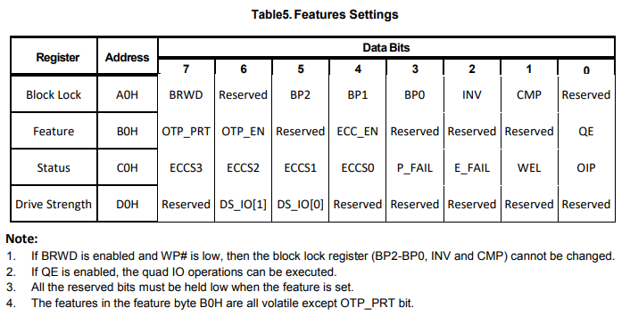

**Table8**

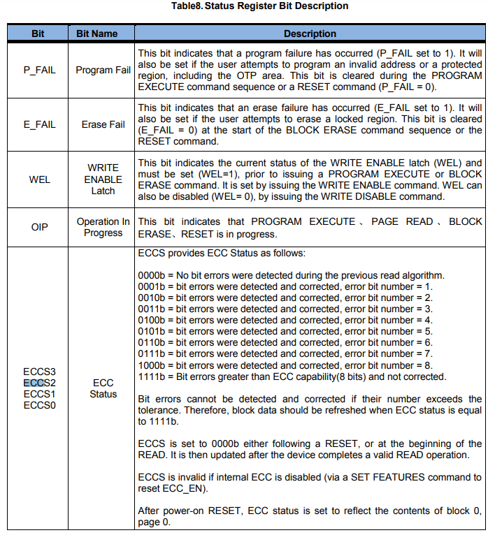

SPI Nand driver do operating this field as following , source at  ``platform/kernel/drivers/mtd/chips/spi_nand_flash.c``

```c
static SPI_NAND_FLASH_RTN_T ecc_fail_check( u32 page_number ){
    u8                              status;
    struct SPI_NAND_FLASH_INFO_T    *ptr_dev_info_t;
    SPI_NAND_FLASH_RTN_T            rtn_status = SPI_NAND_FLASH_RTN_NO_ERROR;
    ptr_dev_info_t  = _SPI_NAND_GET_DEVICE_INFO_PTR;
    spi_nand_protocol_get_feature(_SPI_NAND_ADDR_STATUS, &status);
    _SPI_NAND_DEBUG_PRINTF(SPI_NAND_FLASH_DEBUG_LEVEL_1, "[spinand_ecc_fail_check]: status=0x%x\n", status);
    
    if((ptr_dev_info_t->feature & SPI_NAND_FLASH_NO_ECC_STATUS_HAVE) == 0) {
        if((status & ptr_dev_info_t->ecc_fail_check_info.ecc_check_mask) == ptr_dev_info_t->ecc_fail_check_info.ecc_uncorrected_value) {
            rtn_status = SPI_NAND_FLASH_RTN_DETECTED_BAD_BLOCK;
            _SPI_NAND_PRINTF("[spinand_ecc_fail_check] : ECC cannot recover detected !, page=0x%x\n", page_number);
        }
    }
    return (rtn_status);
}
```

### Block (write ) Protect 

``unlock_block_info:{0x38, 0x0}`` is block lock register for **A0H** within *Table5* , 

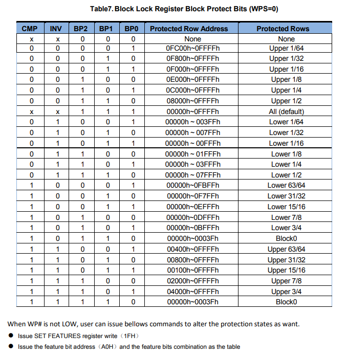

driver do operating this field as following:

```c
static void spi_nand_manufacute_init(struct SPI_NAND_FLASH_INFO_T *ptr_device_t){
    unsigned char   feature;
    unsigned char   die;

    _SPI_NAND_DEBUG_PRINTF(SPI_NAND_FLASH_DEBUG_LEVEL_1,"spi_nand_manufacute_init: Unlock all block and Enable Quad Mode\n");

    for(die = 0; die < ptr_device_t->die_num; die++) {
        spi_nand_direct_select_die(die);

        /* 1. Unlock All block */
        if(ptr_device_t->unlock_block_info.unlock_block_mask != 0x00) {
            spi_nand_protocol_get_feature(_SPI_NAND_ADDR_PROTECTION, &feature);
            _SPI_NAND_DEBUG_PRINTF(SPI_NAND_FLASH_DEBUG_LEVEL_1, "Before Unlock all block setup, the status register1 = 0x%x\n", feature);

            feature = (feature & ~(ptr_device_t->unlock_block_info.unlock_block_mask));
            feature |= (ptr_device_t->unlock_block_info.unlock_block_value & ptr_device_t->unlock_block_info.unlock_block_mask);
            spi_nand_protocol_set_feature(_SPI_NAND_ADDR_PROTECTION, feature);
            _SPI_NAND_DEBUG_PRINTF(SPI_NAND_FLASH_DEBUG_LEVEL_1, "Unlock all block setup, the feature = 0x%x\n", feature);

            spi_nand_protocol_get_feature(_SPI_NAND_ADDR_PROTECTION, &feature);
            _SPI_NAND_DEBUG_PRINTF(SPI_NAND_FLASH_DEBUG_LEVEL_1, "After Unlock all block setup, the status register1 = 0x%x\n", feature);
        } else {
            _SPI_NAND_DEBUG_PRINTF(SPI_NAND_FLASH_DEBUG_LEVEL_1, "No need Unlock all block setup.\n");
        }
    }
}
```

### Quad Mode Enable

``quad_en:{0x01, 0x01}`` is feature register for **B0H** within *Table5* , 

```c
void enable_quad(void){
    unsigned char                   feature;
    unsigned char                   die;
    struct SPI_NAND_FLASH_INFO_T    *ptr_dev_info_t;

    ptr_dev_info_t  = _SPI_NAND_GET_DEVICE_INFO_PTR;

    _SPI_NAND_DEBUG_PRINTF(SPI_NAND_FLASH_DEBUG_LEVEL_1,"SPI NAND Chip Init : Enable Quad Mode\n");

    for(die = 0; die < ptr_dev_info_t->die_num; die++) {
        spi_nand_direct_select_die(die);

        /* Enable Qual mode */
        if(ptr_dev_info_t->quad_en.quad_en_mask != 0x00) {
            spi_nand_protocol_get_feature(_SPI_NAND_ADDR_FEATURE, &feature);
            _SPI_NAND_DEBUG_PRINTF(SPI_NAND_FLASH_DEBUG_LEVEL_1, "Before enable qual mode setup, the status register2 =0x%x\n", feature);

            feature = (feature & ~(ptr_dev_info_t->quad_en.quad_en_mask));
            feature |= ptr_dev_info_t->quad_en.quad_en_value;
            spi_nand_protocol_set_feature(_SPI_NAND_ADDR_FEATURE, feature);
            _SPI_NAND_DEBUG_PRINTF(SPI_NAND_FLASH_DEBUG_LEVEL_1, "enable qual mode setup, the feature = 0x%x\n", feature);

            spi_nand_protocol_get_feature(_SPI_NAND_ADDR_FEATURE, &feature);
            _SPI_NAND_DEBUG_PRINTF(SPI_NAND_FLASH_DEBUG_LEVEL_1, "After enable qual mode setup, the status register2 =0x%x\n", feature);
        } else {
            _SPI_NAND_DEBUG_PRINTF(SPI_NAND_FLASH_DEBUG_LEVEL_1, "No need enable qual mode setup.\n");
        }
    }

    /* modify share pin for quad mode */
    set_spi_quad_mode_shared_pin();
    
    _SPI_NAND_PRINTF("enable SPI Quad mode\n");
}
```

### ECC Enable

``ecc_en:{_SPI_NAND_ADDR_FEATURE, 0x10, 0x10}`` is feature register for **B0H** within *Table5*

### ECC layout

``ecc_layout`` setting the range for ecc free address , file system such jfffs2 should be use this area , the ecc layout spec and  corresponding code as below

```shell
struct spi_nand_flash_ooblayout ooblayout_xt26g01c = {
      .oobsize = 64,
      .oobfree = {{0,64},{116,12}}
};

```

in this case 800h ~ 830h and 874h - 87fh its free area,  840h-873h used to store internal ECC data.

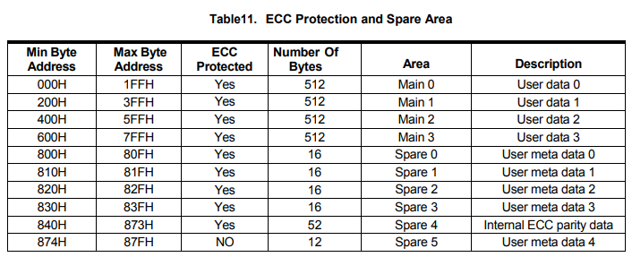


## 20200319  create 'crontab'

**crontab**  used to schedules commands execution at Specified time or time interval.  configuration at ``/etc/crontab/root`` , script [usage](<https://www.runoob.com/w3cnote/linux-crontab-tasks.html>) as following.

- The asterisk (*) operator specifies all possible values for a field. e.g. every hour or every day.
- The comma (,) operator specifies a list of values, for example: "1,3,4,7,8".
- The dash (-) operator specifies a range of values, for example: "1-6", which is equivalent to "1,2,3,4,5,6".
- The slash (/) operator, can be used to skip a given number of values. For example, "*/3" in the hour time field is equivalent to "0,3,6,9,12,15,18,21"; "*" specifies 'every hour' but the "/3" means that only the first, fourth, seventh...and such values given by "*" are used.

```text
*    *    *   *    *  Command_to_execute
|    |    |    |   |       
|    |    |    |    Day of the Week ( 0 - 6 ) ( Sunday = 0 )
|    |    |    |
|    |    |    Month ( 1 - 12 )
|    |    |
|    |    Day of Month ( 1 - 31 )
|    |
|    Hour ( 0 - 23 )
|
Min ( 0 - 59 )
```


## 20210401 GitLab CI/CD

[GitLab CI/CD](<https://docs.gitlab.com/ee/ci/yaml/README.html>) is a powerful tool built into GitLab that allows you to apply all the continuous methods (Continuous Integration, Delivery, and Deployment) to your software with no third-party application or integration needed.

```yml
  except:
    - schedules
  variables:
    GIT_STRATEGY: none
    GIT_CHECKOUT: "false"
    CI_DEBUG_TRACE: "false"

  before_script:
    - pwd
    - cd ..
    - cp -f /builds/checkout.sh .
    - ./checkout.sh ${CI_PROJECT_NAME} git@btc-git.zyxel.com:opal/${CI_PROJECT_NAME}.git
    - ./checkout.sh opal_auto git@btc-git.zyxel.com:opal/opal_auto.git
    - cd  ${CI_PROJECT_NAME}
```


## 20210406  MXIC Nand Flash

to make ZTE platform:

```shell
# make pon=1GPON BRUN=1 SOFTVID=10280
```

nand flash spect:

```c
/* Mxic chip size 256M, id {0xc2,0xda,0x90,0x91,0x07,0x03},128 & 8-bit ecc. */
/**
 * struct nand_flash_dev - NAND Flash Device ID Structure
 * @name:   Identify the device type
 * @id:     device ID code
 * @pagesize:   Pagesize in bytes. Either 256 or 512 or 0
 *      If the pagesize is 0, then the real pagesize
 *      and the eraseize are determined from the
 *      extended id bytes in the chip
 * @erasesize:  Size of an erase block in the flash device.
 * @chipsize:   Total chipsize in Mega Bytes
 * @options:    Bitfield to store chip relevant options
 */
struct nand_flash_dev {
    char *name;
    int id;
    unsigned long pagesize;
    unsigned long chipsize;
    unsigned long erasesize;
    unsigned long options;
    uint16_t oobsize;
};

/*
 *   Chip ID list
 *
 *   Name. ID code, pagesize, chipsize in MegaByte, eraseblock size,
 *   options
 *
 *   Pagesize; 0, 256, 512
 *   0   get this information from the extended chip ID
 +   256 256 Byte page size
 *   512 512 Byte page size
 */
const struct nand_flash_dev nand_flash_ids[] = {
	{"NAND 256MiB 3,3V 8-bit",  0xDA, 0, 128, 0, LP_OPTIONS}
};
```


## 20210406  Bootloader porting from Econet for OPAL

Building ECONET SDK in 172.25.24.94 ,  named ``OSBNB00124527_ECNT_General_7561D_7592+7613_Phase1_7_3_251_900_v033_presdk_CT_20210312.tgz``

```shell
$ tar -xzvf OSBNB00124527_ECNT_presdk_.tgz -C ./new_sdk	
$ make PROFILE=CMCC_AP_WIFI6_MESH_MULTIWAN_demo CUSTOM=CT bootbase_clean bootbase
$ export PATH=/opt/trendchip/mipsel-linux-uclibc-4.6.3-kernel3.18/usr/bin/:$PATH
```

Building **PMG5617-T20B2** for OPAL

```shell
$ git checkout -b bootloader_test origin/AMBU_EN7516_EN7528_10282020_97b8a29f
$ make P=PMG5617-T20B2 V=99 		#(make P=HGW500TX2X2E_T0 V=99)
$ make target/linux/install V=99
```

Building **HGW500TX2X2E_T0**  to support *CONFIG_ZYXEL_SET_SUPERVISOR_KEY* 

```shell
ZHAL> atck wifi_02,admin,root
ZHAL> atck
supervisor password: root
admin password     : admin
WiFi PSK key       : wifi_02
ZHAL> atcr
```


## 20210406  c note

[difference "->" and "." in c language](<https://www.zhihu.com/question/49164544>) , 


## 20210617  'git rebase' or 'git merge'

[Git rebase & merge](<https://zhuanlan.zhihu.com/p/260331030>)

(note : rebase better than merge.)


## 20210825  ZyXEL MGS-3712F  switch

```shell
MGS-3712F(config)# ethernet cfm md 1 format string name MD2 level 2
MGS-3712F(config)# ethernet cfm ma 1 format string name MA2 md 1 primary-vlan 200
MGS-3712F(config-ma)# mep 22 interface port-channel 9 zcfg_dbg_bediagnostic direction down priority 0 
```

802.1ag

```shell
# ls -la /var/tmsctl_lbm_result
# tmsctl.sh
```


## 20210922 OPAL Bootup & Parallel NAND Flash

header for `tcboot.bin`

```c

typedef struct tcboot_header{
	unsigned int resv1[2];					//0x00 ~ 0x04, this 8bytes must not use becaust of jump instruction in start.s
	unsigned int tcboot_len;				//0x08
	unsigned int tcboot_magic_num;			//0x0c
	unsigned int lzma_flash_start_addr;	//0x10
	unsigned int lzma_flash_end_addr;		//0x14
	unsigned int bootram_flash_start_addr;	//0x18
	unsigned int bootram_flash_end_addr;	//0x1c
#if defined(TCSUPPORT_SECURE_BOOT_7526)	
	unsigned int i2c_param;					//0x20 for TCSUPPORT_SECURE_BOOT_7526
#else
	unsigned int resv2;					//0x20
#endif
	unsigned int chip_flash_info;			//0x24
	union {
		unsigned int ecc_info;				//0x28
		unsigned int en7522_page_size;		//0x28
	};
	unsigned int bypass;					//0x2c
	unsigned int spram_exe_addr;			//0x30
	unsigned int lzma_exe_addr;			//0x34
	unsigned int verify_start_addr;		//0x38
	unsigned int verify_end_addr;			//0x3C
	unsigned int resv3[2];					//0x40 ~ 0x44
	unsigned int move_data_int_flash_start_addr;	//0x48
	unsigned int move_data_int_flash_end_addr;		//0x4C
	unsigned int boot2_flash_start_addr;	//0x50
	unsigned int boot2_flash_end_addr;		//0x54
	unsigned int spram_flash_start_addr;	//0x58
	unsigned int spram_flash_end_addr;		//0x5c
} TCBOOT_HEADER;
```

