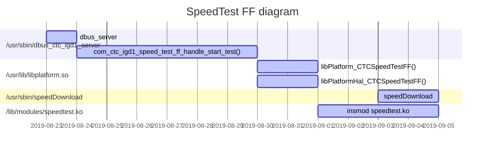

## Mitrastar Info:

make menuconfig
General setup  --->  

- Configure standard kernel features (for small systems)  --->
- Load all symbols for debugging/ksymoops
- Include all symbols in kallsyms
- Do an extra kallsyms pass  

 

注: 配置CONFIG_KALLSYMS_ALL之后，就不需要修改all_symbol静态变量为1了 

``` shell
                    |--------------------|
                    |                    |
                    |                    |
                    ~                    ~
                    |                    |
                    |                    |
            0xc05d 1dc0                  |
                     --------------------| _end
                    |                    |
                    |                    |
                    |    BSS             |
                    |                    |
                    |                    |
            0xc05a 4500                  |
                     --------------------| __bss_start
                    |                    |
            0xc05a 44e8      			 |
                    ---------------------| _edata
                    |                    |
                    |                    |
                    |    DATA            |
                    |                    |
                    |                    |
            0xc058 2000                  |
                     --------------------| __data_start  init_thread_union
                    |                    | 
                      0xc058 1000 _etext |
                     --------------------|
                    |                    |
                    | rodata             |
                    |                    |
           0xc056 d000                  |
		             --------------------| __start_rodata
                    |                    |
                    |                    |
                    | Real text          |
                    |                    |
                    |                    |
                      0xc02a 6000   TEXT |
                     --------------------| _text        __init_end    
                    |                    |
                    | Exit code and data | DISCARD 这个section在内核完成初始化后
                    |                    |         会被释放掉
                      0xc002 30d4        |
                     --------------------| _einittext
                    |                    |
                    | Init code and data |
                    |                    |
                0xc000 8000 _stext       |
                     --------------------|<------------ __init_begin
                    |                    |
 0xc000 0000        |--------------------|

 

arch/arm/kernel/vmlinux.lds.S
```


## 20190514

### [different between device_driver and platform_driver](<https://stackoverflow.com/questions/15610570/what-is-the-difference-between-a-linux-platform-driver-and-normal-device-driver>).

1. Platform devices are **inherently not discoverable**, i.e. the hardware cannot say *"Hey! I'm present!"* to the software. Typical examples are i2c devices, `kernel/Documentation/i2c/instantiating-devices` states:

   > Unlike PCI or USB devices, I2C devices are not enumerated at the hardware level (at run time). Instead, the software must know (at compile time) which devices are connected on each I2C bus segment. So USB and PCI are *not* platform devices.

2. Platform devices are bound to drivers **by matching names**,

3. Platform devices should be **registered very early** during system boot. Because they are often critical to the rest of the system (platform) and its drivers.

So basically, the question "*is it a platform device or a standard device?*" is **more a question of which bus it uses**. To work with a particular platform device, you have to:

1. **register a platform driver** that will manage this device. It should define a *unique* name,
2. **register your platform device**, defining the same name as the driver.

> Platform driver is for those devices that are on chip.

Not true (in theory, but true in practice). i2c devices are not onChip, but are platform devices because they are not discoverable. Also we can think of onChip devices which are *normal* devices. Example: an integrated PCI GPU chip on a modern x86 processor. It is discoverable, thus not a platform device.

> Normal device driver are for those that are interfaced to the processor chip. before coming across one i2c driver.

Not true. Many *normal* devices are interfaced to the processor, but not through an i2c bus. Example: a USB mouse.

**[EDIT]** In your case, have a look to `drivers/usb/host/ohci-pnx4008.c`, which is a USB host controller platform device (Here the USB host controller is not discoverable, whereas USB devices, which will connect to it, are). It is a platform device registered by the *board file* (`arch/arm/mach-pnx4008/core.c:pnx4008_init`). And within its probe function, it registers its i2c device to the bus with `i2c_register_driver`. We can infer that the USB Host controller chipset *talks to* the CPU through an i2c bus.

Why that architecture? Because on one hand, this device can be considered a bare i2c device providing some functionalities to the system. On the other hand, it is a USB Host capable device. It needs to register to the USB stack (`usb_create_hcd`). So probing only i2c will be insufficient. Have a look to `Documentation/i2c/instantiating-devices`.


### ioremap_nocache()

```c
void __iomem * ioremap_nocache (unsigned long offset, unsigned long size);
/*
 * ioremap     -   map bus memory into CPU space
 * @offset:    bus address of the memory
 * @size:      size of the resource to map
 *
 * ioremap performs a platform specific sequence of operations to
 * make bus memory CPU accessible via the readb/readw/readl/writeb/
 * writew/writel functions and the other mmio helpers. The returned
 * address is not guaranteed to be usable directly as a virtual
 * address.
 */
```

调用ioremap_nocache()函数之后，返回一个线性地址,此时CPU 可以访问设备的内存(已经将其映射到了线性地址空间中了)，此时CPU可以使用访问内存的指令访问设备的内存空间，此时我们就可以像访问内存一样来访问设备的内存(寄存器)。

ioremap是为一段高端的物理内存建立映射（即增加相关的页表内容），驱动常用mmap为可能不连续的一系列逻辑上相关的（如整体是一个文件）物理内存段建立映射，并呈现一个连续的虚拟地址空间。

应用程序常用mmap是系统调用，只能应用程序用。 ioremap是kernel提供的函数，只能在kernel里用。
usage:

```c
// 全局定义两个变量
static void __iomem *vaddr_base;
volatile u32 rw32;

// 从物理地址 0x9C016000 开始映射 0x200 大小给虚拟地址 vaddr_base
// 只执行一次
vaddr_base = ioremap_nocache(0x9C016000, 0x200);

// 读写0x9C016000+0x100寄存器bit24~bit27为0001
rw32 = *(volatile u32*)(vaddr_base + 0x100); // 读
printk("Reg0x%x = 0x%x\n", 0x9C016000 + 0x100, rw32);
rw32 &= 0xf0ffffff;
rw32 |= 0x01000000;
*(volatile u32*)(vaddr_base + 0x100) = rw32; // 写

iounmap(vaddr_base);
```


## 20190703

### Hisilicon 移动下载仿真测试 (httping)


ITMS Setting

```s
InternetGatewayDevice   
  └──  DownloadDiagnostics
     ├── DiagnosticsState
         ├── Interface 						    (InternetGatewayDevice.WANDevice.1.WANConnectionDevice.1.WANPPPConnection.1)
     ├── DownloadURL	(http://192.168.8.3:51473/170 or http://192.168.8.3:51473/1.4G)
```

Test Report
| Province | ROMTime       | EOMTime       | TotalBytesReceived | Result     |
| -------- | ------------- | ------------- | ------------------ | ---------- |
| Sichuan  | 1562138596102 | 1562138598246 | 62331827           | *abnormal* |
| Shanxi   | 1562146461085 | 1562146463390 | 65966221           | *abnormal* |
| QingHai  | 1562149484828 | 1562149497017 | 187274868          | *normal*   |

(Note: ‘unsigned int‘ with same stored format as 'int' , only different while for display format . 'double'  stored)

```shell
$cli /home/cli/log_cmd/log/cfg_set -v module 0xF0004000 dbg 0xff print 0xff sys 1
(to print debug info)
$cli /home/cli/cm/cm_ctrl -v value 0x2000000d
(disable ACS control)
$cli /home/cli/cm/cm_ctrl -v value 0x2000000e
(enable ACS control)
$cli /home/cli/cm/cm_ctrl -v value 0x2000000f
(disable Tr069 wan control)
$cli /home/cli/cm/cm_ctrl -v value 0x20000010
(enable Tr069 wan control)
```

Httping Test command

```shell
$httping http://192.168.8.3:51473/170 -d pppoe-wan_3002 -c 1 -G -b --priority 0 --tos 0 -y 0.0.0.0/54326 
```

- -d : for device name
- -c :  means how many times to connect
- -G:  do a GET request instead of HEAD
- -b : show transfer speed in KB/s
- --tos  : Type - Of - Service
- -y : bind to ip-address (and thus interface)

windows 下生成大小为500 M的文件

```shell
fsutil file createnew null.txt 5278350000
```


## 20190719

###  MTK En_7528 speed test :

1. Http Download:

```shell
# gdbus call -y -d com.ctc.igd1 -o /com/ctc/igd1/Diagnostics/HttpDownload -m com.ctc.igd1.Properties.Set com.ctc.igd1.HttpDownloadTest URL "<\"http://1.204.169.133:16906/MDAuMDAuMDN1NE56OTdISHhYN0trNkxmL0pNWGlxZTN0b1c4V0hjYjBpMnFueUR0Q1pCUHZaYXVzOEdBZEhYWjRxLzREaHV2cUhjUXhHNXJiWEFhTVVnaTN6YjhzUT09.dat\">"    

# gdbus call -y -d com.ctc.igd1 -o /com/ctc/igd1/Diagnostics/HttpDownload -m com.ctc.igd1.HttpDownloadTest.StartTest 10

# gdbus call -y -d com.ctc.igd1 -o /com/ctc/igd1/Diagnostics/HttpDownload -m com.ctc.igd1.Properties.Get com.ctc.igd1.HttpDownloadTest Result

```


2. SpeedtestFF :




```shell
# gdbus call -y -d com.ctc.igd1 -o /com/ctc/igd1/Diagnostics/HttpDownload -m com.ctc.igd1.Properties.Set com.ctc.igd1.SpeedTestFF URL "<\"http://202.107.217.212:16039 \">"
(or http://61.175.31.158:16039, http://61.154.53.106:16039)

# gdbus call -y -d com.ctc.igd1 -o /com/ctc/igd1/Diagnostics/HttpDownload -m com.ctc.igd1.Properties.Set com.ctc.igd1.SpeedTestFF Ticket "<\"0000022222\">"

# gdbus call -y -d com.ctc.igd1 -o /com/ctc/igd1/Diagnostics/HttpDownload -m com.ctc.igd1.Properties.Set com.ctc.igd1.SpeedTestFF SpeedType "<byte 0x01>"

# gdbus call -y -d com.ctc.igd1 -o /com/ctc/igd1/Diagnostics/HttpDownload -m com.ctc.igd1.SpeedTestFF.StartTest 10

# gdbus call -y -d com.ctc.igd1 -o /com/ctc/igd1/Diagnostics/HttpDownload -m com.ctc.igd1.Properties.Get com.ctc.igd1.SpeedTestFF Result

# gdbus call -y -d com.ctc.igd1 -o /com/ctc/igd1/Diagnostics/HttpDownload -m com.ctc.igd1.Properties.GetAll com.ctc.igd1.SpeedTestFF
```


## 20190812

### MfgMode

```shell
# zysh
ZySH> configure terminal
config$ btt off
config$ testled on
config$ ethctl
```

### ePon & gPon Register

```shell
# atbp show
Number of MAC Addresses (1-32)    :  10  
Base MAC Address                  :  00:19:cb:0a:05:87  
Serial Number                     :  649A0649A0896B944  
Password for Useradmin            :  12345  
SSID for first wireless (10-31)   :  ChinaNet-b944  
Password for first wireless (8-31):  12345678  
WAN working mode [0|1|2|3|4|5|6|7]:  0  (0,4 for ePon, 1 for gPon) 
GPON Serial Number                :  MSTC0A000058  
GPON Password                     :  2334567834  
Semi-manufactured SN              :  0Y0000000000  

```

to register ePon should setting **Base MAC Address ** by  "00:19:CB:0A:05:87" ( **0590-3**)  and running  *"onuoamd"* app , to register gPon should setting **GON Serial Number** by  "MSTC0A000058" and running 	"*mosapp*". ( **serial number must be capital case.**)


#### Capture frame by ePon

1.  open package mirror :

```shell
/usr/sbin/sys wan2lan on 15
```

2. open *Wireshark* ( install slow_new plugin) , and choise *slow_new* as following.


#### Capture by gPon

develop with gPon can not use *wireshark* to capture frame directly , to capture frame by following:

```shell
# moscli ploamtrace on
# Debug Level: 10
Debug Level: 14
[42949464360ms]PLOAM: Send REI message.(3A080000 00000400 00000000)
[42949474380ms]PLOAM: Send REI message.(3A080000 00000500 00000000)
AsicSetSyncModeAndEnable(): NotSupportedFunc for this arch(HIF_MT)!
[DfsCacEndUpdate] CAC end. Enable MAC TX.
[42949477900ms]GPON IRQ: A PLOAM message received interrupt.DBG_GRP_0[1f0006], DBG_GRP_1[40000]
[42949477900ms]PLOAM: Receive Assign_ONU_ID message.(FF033643 4D4440B2 00004800)
[42949477900ms]The serial number of PLOAM message is incorrect
[42949477900ms]Receive the PLOAM message same:FF033643
[42949477900ms]Receive the PLOAM message same:FF033643
[42949477930ms]GPON IRQ: A PLOAM message received interrupt.DBG_GRP_0[1f0006], DBG_GRP_1[40000]
[42949484400ms]PLOAM: Send REI message.(3A080000 00000600 00000000)
[42949494420ms]PLOAM: Send REI message.(3A080000 00000700 00000000)
[42949504440ms]PLOAM: Send REI message.(3A080000 00000800 00000000)
[42949506780ms]GPON IRQ: A PLOAM message received interrupt.DBG_GRP_0[1f0006], DBG_GRP_1[40000]
[42949506780ms]PLOAM: Receive Assign_ONU_ID message.(FF033643 4D4440B2 00004800)
[42949506780ms]The serial number of PLOAM message is incorrect
[42949506780ms]Receive the PLOAM message same:FF033643
[42949506780ms]Receive the PLOAM message same:FF033643
[42949506810ms]GPON IRQ: A PLOAM message received interrupt.DBG_GRP_0[1f0006], DBG_GRP_1[40000]
[42949514460ms]PLOAM: Send REI message.(3A080000 00000900 00000000)
```

(more detail at [gPonKownledge](pdf_resource/GPON_Knowledge_Introduce.pptx)  , the following sequence of events to register on OLT  by  **1) serial number  ; 2) password ; 3) LOID** )


## 20190816

### econet 7526 crash info

1. epc info shows without offset address

```shell
User Mode page fault at process 1052 (zysh)
CPU: 1 PID: 1052 Comm: zysh Tainted: P           O   3.18.21 #96
task: 99ed8b30 ti: 9ac6c000 task.ti: 9ac6c000
$ 0   : 00000000 77b69415 00000000 77e7d8e0
$ 4   : 00000004 00000000 776693e4 00000000
$ 8   : 77ae42f4 77ade924 00000000 ffffffff
$12   : 77e62000 f0000000 00000001 77656ad0
$16   : 00000000 00000000 00000006 00000000
$20   : 00000001 004370b8 00898990 00000001
$24   : 000000bd 77b47de0                  
$28   : 77671330 7f9e6ef8 00892260 776582b8
Hi    : 00000249
Lo    : 0001cbed
epc   : 776582c8 0x776582c8
 Tainted: P           O  
ra    : 776582b8 0x776582b8
Status: 01000013	USER EXL IE 
Cause : 0080d008
BadVA : 00000000
PrId  : 0001992f (MIPS 1004Kc)
ort Status Speed Duplex TX_FC RX_FC
Segmentation fault
```

2. 提前打印出将要crash 的地址信息

```shell
# cat /proc/1052/maps 
00400000-00430000 r-xp 00000000 1f:00 1106       /usr/bin/zysh
00430000-00431000 rw-p 00030000 1f:00 1106       /usr/bin/zysh
...
77654000-7765a000 r-xp 00000000 1f:00 1175       /usr/lib/libmtkswitch.so.1.
...
```


3. 算偏移量  **776582c8 - 77654000 = 42c8** ， 通过 *mips-linux-objdump* 以及偏移量, 查找 **libmtkswitch.so** 文件的偏移地址

```shell
# /opt/trendchip/mips-linux-uclibc-4.9.3/usr/bin/mips-linux-objdump -d  libmtkswitch.so |
00004270 <macMT7530GetPortLinkState>:
...
42c8:	304300ff 	andi	v1,v0,0xff
...
```


4. 计算偏移量  **42c8 - 4270 = 58**  ,  继续通过 *mips-linux-objdump* 查找对应的 **libmtkswitch.o** 文件的对应地址，之后加上偏移量 **58** ，得到相对应的偏移地址 **1838**

```shell
# /opt/trendchip/mips-linux-uclibc-4.9.3/usr/bin/mips-linux-objdump -d ./libmtkswitch.o |grep  "macMT7530GetPortLinkState"
000017e0 <macMT7530GetPortLinkState>: 
```


5. 查找与地址相对应的代码为 : *sysapps/ethcmd/mtkswitch_api.c*  中的 1307 行。

```shell
# /opt/trendchip/mips-linux-uclibc-4.9.3/usr/bin/mips-linux-addr2line -e ./libmtkswitch.o 1838
/home/chear/EN7528_CTC_NEW/dev/build/sysapps/ethcmd/mtkswitch_api.c:1307
```


## 20190826
### system crash (without any response) when plug-in usb-flash disc

sample script to running *dd*  command within 11 times to testing the USB hung issue.

```shell
# for i in $(seq 1 11); do echo ${i}; dd if=/dev/mtd2 of=/mnt/usb1_1/test.bin;  done

("for i in {1..10}; do echo ${i}; dd if=/dev/mtd2 of=/mnt/usb1_1/test.bin;done", for /bin/bash in x86 or x64)
```

"*for i in 1 2 3 4 5 6 7 8 9 10 ; do echo ${i}; dd if=/dev/mtd2 of=/mnt/usb1_1/test.bin; done*" can both running in **busybox sh**  and **bash**


 *umount* usb-flash with following issue, should remove *minidlna* first.	

```shell
# umount /mnt/usb1_1/
umount: can't umount /mnt/usb1_1/: Device or resource busy
# ps |grep "minidlna"
7264 root     10880 S    /usr/sbin/minidlna -R -f /etc/minidlna/minidlna.conf
# kill -9 7264
# umount /mnt/usb1_1/
# usb 1-1: USB disconnect, device number 4
```


## 20190828

### econet original image login

original econet FW use  *boa* to be web server, local file at */boaroot/cgi-bin/*
```shell
# prolinecmd xponmode set epon 	(or gpon, to switch ePon or gPon) 
# sys wan2lan on 15
# prolinecmd restore defualt
```

z

## 20190917

### Switch FW image between Ecnet and Mitrashar within En_7528

Econet for *tcboot.bin & tclinux.bin* ,and  Mitrashar for *loader.img & ras.bin* , the more important its both boot-loader with same size for 256k.

**switch loader.img to tcboot.bin**

1. login to u-boot, and download *tcboot.bin* to memory  , then write to flash. 

```shell
u-boot # loadx 0x80000000 			(upload tcboot.bin with x-modem by serial port)
u-boot # nander 0 40000				(earse nand flash from 0x0 to 0x40000 for 256k)
u-boot # nandwr 0 80000000 40000	(write nand flash from 0x0 to 0x40000,sync from 										memory at 0x80000000 )  
```

2. reboot and upgrade *tclinux.bin* ( Econet boot-loader login password by telecomadmin / nE7jA%5m)


**switch tcboot.bin to loader.img**

1. Rename loader.img to tcboot.bin  (not working) 


```shell

```


## 20190919

### kernel hook for net filter.

```c
struct nf_sockopt_ops
{
    struct list_head list;
    
    int pf;
    
    /* Non-inclusive ranges: use 0/0/NULL to never get called. */
    int set_optmin;
    int set_optmax;
    int (*set)(struct sock *sk, int optval, void *user, unsigned int len);

    int get_optmin;
    int get_optmax;
    int (*get)(struct sock *sk, int optval, void *user, int *len);
        
    /* Number of users inside set() or get(). */
    unsigned int use;
    struct task_struct *cleanup_task;
};  

// usage:
static struct nf_hook_ops httpd_hooks = {   
    .hook = httpd_syn_flood_hook_fun,
    .pf = NFPROTO_IPV6,
    .owner = THIS_MODULE,
    .hooknum =  NF_BR_LOCAL_IN, 
    .priority = NF_IP_PRI_FIRST, // NF_IP_PRI_FIRST, //NF_IP_PRI_LAST ;NF_IP_PRI_MANGLE;
};  
```


## 20190925

### count child-process for mini_httpd

re-move the child-process when "mini_httpd" crate by *fork()*.

```shell
# ps |grep mini_httpd|grep -v grep|awk '{print int($0)}'|xargs kill -9
```

to count the child-process when accept by "mini_httpd" , the *1190*  means the parent-process.

```shell
# ps |grep mini_httpd|grep -v grep|grep -v 1190|awk '{print NR}'|tail -n1
or
# pgrep mini_httpd|wc -l
```

to count the TCP connection while "mini_httped" listened , hex '1F90' convert decimal with '8080'. 

```shell
# cat /proc/net/tcp6 |grep "1F90" |awk 'END{print NR}'
```


## 20190927

### different between *system()* and *popen()*

both *[system()](<http://man7.org/linux/man-pages/man3/system.3.html>)* and *[popen()](<http://man7.org/linux/man-pages/man3/popen.3.html>)* are source in glibc for  POSIX library , 


```c
#include <stdio.h>
FILE *popen(const char *command, const char *type);
int pclose(FILE *stream);

#include <stdlib.h>
int system(const char *command);
```
ref: [Linux Man Page List ](<http://man7.org/linux/man-pages/dir_all_by_section.html>)

