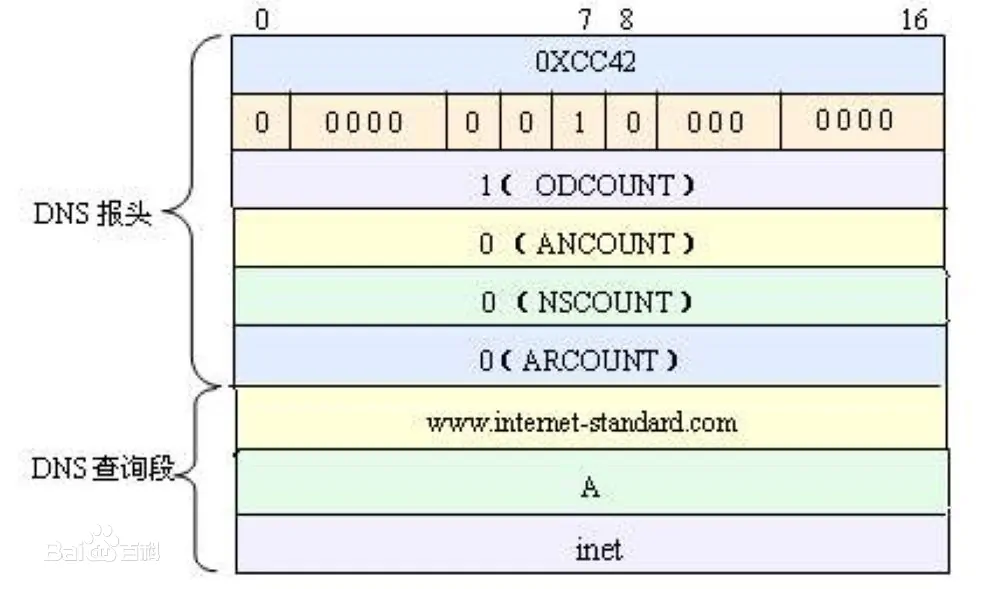
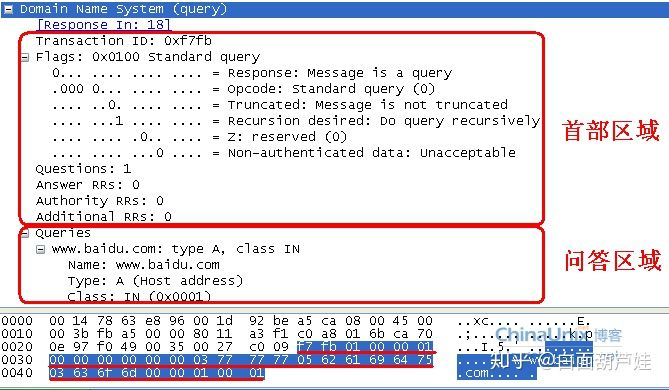
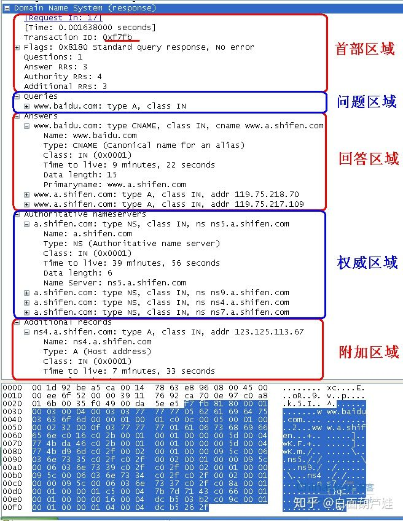

[TOC]

## 2022.01.06  VS Code & MinGW

**VS Code** IDE for [free download](https://code.visualstudio.com/Download), while support  c&c++ after install plug-in . **MinGW**  means *Minimalist GNU for Windows*  [downloading](https://sourceforge.net/projects/mingw/files/) , is open source GCC compiler on Windows .  [to integrate VS Code & MinGW](https://zhuanlan.zhihu.com/p/77074009) .

Access to config ``c_cpp_properties.json`` and ``tasks.json``  , then you can compile and run c files ,main configuration as follow:

``c_cpp_properties.json``

```json
{
    "configurations": [
        {
            "name": "Win32",
            "includePath": [
                "${workspaceFolder}/**"
            ],
            "defines": [
                "_DEBUG",
                "UNICODE",
                "_UNICODE"
            ],
            "compilerPath": "D:\\chear\\mingw-w64\\i686-8.1.0-posix-dwarf-rt_v6-rev0\\mingw32\\bin\\gcc.exe",
            "cStandard": "c99",
            "cppStandard": "gnu++14",
            "intelliSenseMode": "gcc-x86"
        }
    ],
    "version": 4
}
```

``tasks.json``

```json
{
	"version": "2.0.0",
	"tasks": [
		{
			"type": "cppbuild",
			"label": "C/C++: gcc.exe genKeyTools",
			"command": "D:\\chear\\mingw-w64\\i686-8.1.0-posix-dwarf-rt_v6-rev0\\mingw32\\bin\\gcc.exe",
			"args": [
				"-fdiagnostics-color=always",
				"-g",
				"${fileDirname}\\*.c",
				"-o",
				"${fileDirname}\\EX3220-T0_TM_GenKeyTool_V2.3_64_v7_2.exe"
			],
			"options": {
				"cwd": "${fileDirname}"
			},
			"problemMatcher": [
				"$gcc"
			],
			"group": "build",
			"detail": "编译器: D:\\chear\\mingw-w64\\i686-8.1.0-posix-dwarf-rt_v6-rev0\\mingw32\\bin\\gcc.exe"
		}
	]
}
```

(Use "c&c++" plug-in  within VS Code ,its easy to conflict with "clangd" ,  when change settings for plug-in should restart VS Code. )

### VS Code & Linux

want to view the source for linux on server in **VS Code**  must install  *"remote ssh"* & *"clangd"* plug-in on VS Code , also need use ``bear`` command to generate ``compile_commands.json`` for  source index. 

For example generate source index for en75xx-loader 

```shell
# bear make package/private/econet/en75xx-loader/{clean,install} V=99
# ln -s /home/chear/cicd/opal/compile_commands.json /home/chear/cicd/opal/build_dir/target-mipsel-buildroot-linux-uclibc/linux-en75xx_hgw500tx2x2e/en75xx-loader-7.3.251.900/compile_commands.json
```

(to use "clangd" should keep confirm "compile_commands.json" with-in workspace folder.)


## 2022.03.01  Merge code into 'develop' branch

to get my log by 

```shell
$ zyrepo foreach -c  "git log CTB_7528HU_7561DU_HGW500TX2X2E_20210801 --after="2021-8-1" --format=\"%ae: %h --%ce\" --author=\"Chear Huang\""
( %h: short commit hash, %ae: author email, %ce: commit email.)

$ git reset --hard "HEAD^"
(to delete last commit.)
```


## 2022.03.09  Hisi XGPon kernel

building xgPon 

```shell
## to building kernel 
make source mod=kernel V=99;
## to building sub dir and contains Makefile.hsan
make source mod=hisilicon V=99
## to building hisilicon/gateway/service
make source mod=service V=99
```


[DNS](http://c.biancheng.net/view/6457.html) based on UDP  and default for *53* port , DNS packet as following:








## 2022.04.11 Create gitlab-runner for CI/CD

prepare create new user and generate public key by  ``ssh-keygen`` , then add this user to 'docker' group

```shell
# sudo useradd -m sw3_pub
# sudo passwd sw3_pub
# sudo usermod -aG docker sw3_pub
# ssh-keygen -t ed25519
```

get docker image and register *gitlab-runner*

```shell
$ docker run -d -p 5000:5000 --restart=always --name registry -v /srv/registry:/var/lib/registry registry:2

$ docker run -d --name gitlab-runner --restart always -v /srv/gitlab-runner/config:/etc/gitlab-runner -v /var/run/docker.sock:/var/run/docker.sock -v /home/gitlab-runner_volumes:/home/gitlab-runner_volumes --dns 172.21.5.1 gitlab/gitlab-runner:ubuntu-v12.8.0

$ docker run --rm -it cpe-docker-registry.zyxel.com:5000/my-build-server3:v1.01 bash
```

login to gitlab container and make certification for url *btc-git.zyxel.com*

```shell
$ docker exec -it gitlab-runner bash
root@:/# openssl s_client -connect btc-git.zyxel.com:443 -showcerts < /dev/null | openssl x509 -outform PEM > /etc/ssl/certs/btc-git.zyxel.com.crt

root@:/# gitlab-runner --debug register -n --tls-ca-file="/etc/ssl/certs/btc-git.zyxel.com.crt" --name ctb_build-it --url https://btc-git.zyxel.com/ -r 6wunkyzuVyTPXxN_6y8N --executor docker --docker-image cpe-docker-registry.zyxel.com:5000/my-build-server3:v1.01 --docker-dns 172.21.5.1 --docker-volumes /mnt/gitlab-runner_volumes_1/build:/mnt/build/:rw --docker-volumes /mnt/gitlab-runner_volumes_1/builds:/builds:rw --docker-volumes /mnt/gitlab-runner_volumes_1/script:/script:rw  --docker-volumes /mnt/gitlab-runner_volumes_1/gitlab-daily-build-image:/gitlab-daily-build-image:rw --docker-volumes /opt/tools/zyrepo:/opt/tools/zyrepo:rw --docker-volumes /home/sw3_pub/.ssh:/root/.ssh:rw --tag-list "tagsBuildCTBOPAL2-it"  --docker-tlsverify false

root@:/# gitlab-runner list

root@:/# gitlab-runner unregister --tls-ca-file="/etc/ssl/certs/btc-git.zyxel.com.crt" --url https://btc-git.zyxel.com/ --token tkCsX-fJygTdtgjvNqvQ

root@:/# gitlab-runner restart
```


## 202.04.25  install 'tldr' within docker container

```shell
$ mkdir -p ~/.tldr/tldr
$ sudo git clone https://codechina.csdn.net/mirrors/tldr-pages/tldr.git ~/.tldr/tldr
$ sudo apt-get update
$ sudo apt-get install tldr
```


## 2022.04.26 MTK  SDK porting

generate *u-boot* config and building *u-boot* by:

```shell
$ tar -xf uboot-2022.04_0421_formal.tar.xz
$ cd uboot-mtk-20220412-sb
## make mt7981_spim_nand_rfb_defconfig
$ make 
$ make CROSS_COMPILE=/usr/bin/aarch64-linux-gnu-
```

 to generate configuration by  ``./script/kconfig/Makefile``

```Makefile
%config: scripts_basic outputmakefile FORCE
	$(Q)$(MAKE) $(build)=scripts/kconfig $@
## Express commands:
## make -f ./scripts/Makefile.build obj=scripts/kconfig mt7981_spim_nand_rfb_defconfig


%_defconfig: $(obj)/conf
	$(Q)$< $(silent) --defconfig=arch/$(SRCARCH)/configs/$@ $(Kconfig)
## Express commands: 
## scripts/kconfig/conf  --defconfig=arch/../configs/mt7981_spim_nand_rfb_defconfig Kconfig
```

to generate *u-boot.bin*

```shell
./tools/mkimage -T mtk_image -a 0x41e00000 -e 0x41e00000 -n "media=snand;nandinfo=2k+64" -d u-boot.bin u-boot-mtk.bin >/dev/null ;
```

generate bootloader

```shell
$ cp u-boot.bin  ../atf-20220421-d0152f6db/
$ make menuconfig && make
## Express:
## make -f /work/cpe-opal/mtk_porting/atf-20220421-d0152f6db/Makefile PLAT="mt7981" CROSS_COMPILE="/usr/bin/aarch64-linux-gnu-" BOOT_DEVICE="spim-nand" NMBM=1 NAND_TYPE="spim:2k+64" DRAM_USE_DDR4=0 DDR3_FREQ_2133=1 BOARD_BGA=1 LOG_LEVEL=20 BL33="./u-boot.bin" clean
## make -f /work/cpe-opal/mtk_porting/atf-20220421-d0152f6db/Makefile PLAT="mt7981" CROSS_COMPILE="/usr/bin/aarch64-linux-gnu-" BOOT_DEVICE="spim-nand" NMBM=1 NAND_TYPE="spim:2k+64" DRAM_USE_DDR4=0 DDR3_FREQ_2133=1 BOARD_BGA=1 LOG_LEVEL=20 BL33="./u-boot.bin"  all fip

```

to upgrade by bootloader by *MTK* sdk

```shell
MT7981> mtkupgrade bl2
## bl2.img
MT7981> mtkupgrade fip
## fip.bin
MT7981> mtkupgrade simg
## bootloader-factory.bin
```


## 2022.05.16  Push code to remote repo

```shell
## git fetch origin [remote_branch]:[local_branch]
$ git fetch origin develop:develop
## '--allow-unrelated-histories' means merge different repo code.
$ git merge local_develop --allow-unrelated-histories
```


## 2022.05.20  ``find -exec``

```shell
 $ find ./ -name "*.tgz" -exec mv {} ../../mt7981_cicd/opal20/opal/dl/ \;
```

