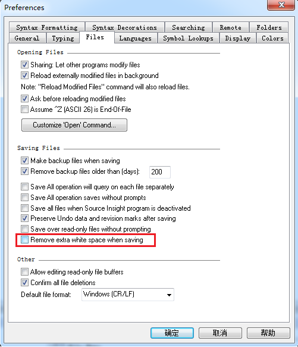
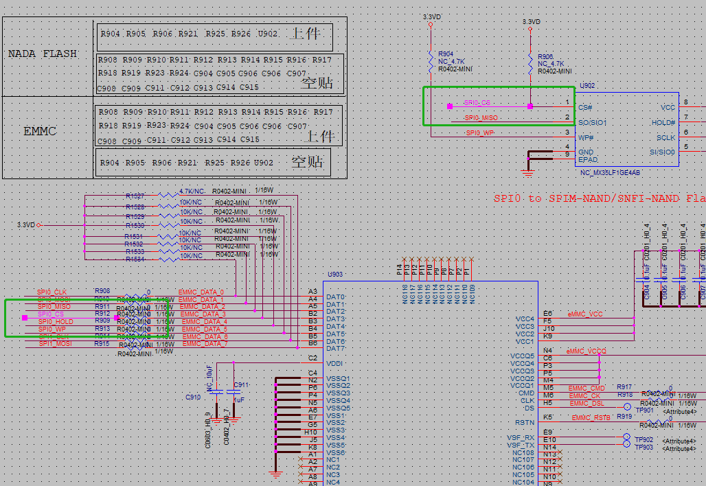
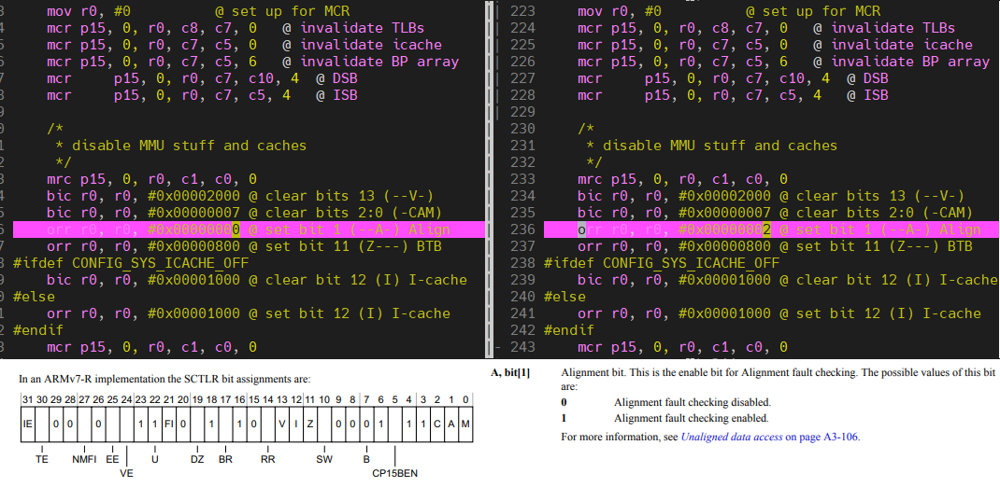
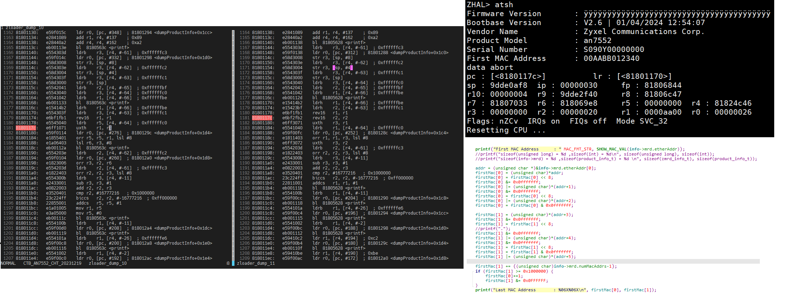

[TOC]

## 2023.1.5 Removing white space when saving in SI




## 2023.1.11  eMMC flash setting for OPAL



eMMC below

```shell

```


## 2023.1.31 Linux coredump modules

分析 [core dump](<https://cloud.tencent.com/developer/article/1860631>) 是Linux应用程序调试的一种有效方式，core dump又称为“核心转储”，是该进程实际使用的物理内存的“快照”。分析core dump文件可以获取应用程序崩溃时的现场信息，如程序运行时的CPU寄存器值、堆栈指针、栈数据、函数调用栈等信息。

以下情况会出现应用程序崩溃导致产生core dump：

1. 内存访问越界 （数组越界、字符串无\n结束符、字符串读写越界）
2. 多线程程序中使用了线程不安全的函数，如不可重入函数
3. 多线程读写的数据未加锁保护（临界区资源需要互斥访问）
4. 非法指针（如空指针异常或者非法地址访问）
5. 堆栈溢出

打开 coredump 设置 ``ulimit -c unlimited`` ， 通过写入 ``/proc/sys/kernel/core_pattern`` 来设置 coredump 文件保存路径,  而在 zyxel 的项目中可以在  ``/misc/coredump_rule.txt`` 中设置 , 默认保存路径 ``/misc/coredump/*``

```shell
root@EX3320-T0:/misc# cat /misc/coredump_rule.txt 
Folder_Path=/data/coredump
Pre_Threshold=150000
Post_Threshold=8000000
```


### Building coredump for Zyxel

```c
CONFIG_COREDUMP=y
CONFIG_BINFMT_ELF=y
CONFIG_ZYXEL_RECORD_CALL_TRACE=y
COFNIG_ZYXEL_DEC_AND_GZIP_CORE=y
```

主要文件,  OPAL 补丁位于 ``target/linux/mediatek/zyxel-patches-5.4/0030-ZYXEL_ENHANCE_save_koops_and_gzip_coredump.patch``

```shell
└── linux-5.4.194
    ├── arch/arm64/kernel/traps.c
    ├── fs/coredump.c
    └── fs/binfmt_elf.c
```


### 查看 coredump

创建测试文件 test.c ， 编译后产生 test , tftp 上传后运行，产生  core.test.29873.EX3320-T0.1675315063.gz 

```·
int main(int argc, char **argv) {
    printf("chear_debug: coredump  \n");
    char *addr = (char *)0; // 设置 addr 变量为内存地址 "0"
    printf("chear_debug: %d  \n", __LINE__);
    *addr = '\0';           // 向内存地址 "0" 写入数据
    printf("chear_debug: %d  \n", __LINE__);
    return 0;
}
```

编译 test.c ， ``-ggdb3`` 产生 gdb可以使用的 debug 信息 .（普通调试可以使用 ``-g`` ), ``-Wall -Wextra`` 用以显示所有警告。

```shell
./staging_dir/toolchain-aarch64_cortex-a53_gcc-8.4.0_musl/bin/aarch64-openwrt-linux-musl-gcc -ggdb3 -std=c99 -Wall -Wextra test.c -o test
```

使用 ``gdb`` 查看崩溃信息

```shell
# ./build_dir/toolchain-aarch64_cortex-a53_gcc-8.4.0_musl/gdb-10.1/gdb/gdb test core.test.25165.EX3320-T1.1675124079
```


### 查看 coredump 内核信息

创建 test_module.c 用于手动制造 OOPS。

```c
#include <linux/module.h>
static int __init test_module_init(void)
{
	int *a;
	a = (int*) 0x00001234;
	*a = 2;
	printk("chear_kernel: test module oops");
	return 0;
}

static void __exit test_module_exit(void) {}

module_init(test_module_init);
module_exit(test_module_exit);

MODULE_AUTHOR("chear");
MODULE_LICENSE("GPL");
MODULE_DESCRIPTION("TEST");
```

编译 *test_module.ko* 

```shell
export PATH=/work/cpe-opal/EXTDISK/merge_cicd/opal/staging_dir/toolchain-aarch64_cortex-a53_gcc-8.4.0_musl/bin/:$PATH
make -C ../build_dir/target-aarch64_cortex-a53_musl/linux-mediatek_ex3320t0/linux-5.4.194/ V=1 CROSS_COMPILE="aarch64-openwrt-linux-musl-" ARCH="arm64" M=`pwd` modules
```

运行后 设备重启

```shell
 Unable to handle kernel paging request at virtual address 0000000000001234
 Mem abort info:
   ESR = 0x96000046
   EC = 0x25: DABT (current EL), IL = 32 bits
   SET = 0, FnV = 0
   EA = 0, S1PTW = 0
 Data abort info:
   ISV = 0, ISS = 0x00000046
   CM = 0, WnR = 1
 user pgtable: 4k pages, 39-bit VAs, pgdp=00000000430bf000
 [0000000000001234] pgd=0000000041887003, pud=0000000041887003, pmd=0000000000000000
 Internal error: Oops: 96000046 [#1] SMP
 [arch/arm64/kernel/traps.c,__die,309]: oops_name: /misc/koops/2023-02-03_08-12-48_oops.txt
 Modules linked in: test_module(+) nf_nat_rtsp nf_conntrack_rtsp nf_nat_ftp nf_conntrack_ftp nciTMSkmod(P) exLinuxETH(P) Lservices(P) xt_connlimit pppoe ppp_async nf_conncount l2tp_ppp iptable_nat xt_state xt_nat xt_helper xt_connzextmark xt_conntrack xt_connmark xt_connbytes xt_REDIRECT xt_MASQUERADE xt_FLOWOFFLOAD xt_CT pptp pppox ppp_mppe ppp_generic nf_nat_tftp nf_nat_snmp_basic nf_nat_sip nf_nat_pptp nf_nat_irc nf_nat_h323 nf_nat_amanda nf_nat nf_flow_table_hw nf_flow_table nf_conntrack_tftp nf_conntrack_snmp nf_conntrack_sip nf_conntrack_pptp nf_conntrack_netlink nf_conntrack_irc nf_conntrack_h323 nf_conntrack_broadcast nf_conntrack_amanda nf_conntrack ipt_REJECT ebtable_nat ebtable_filter ebtable_broute zy_nfhook xt_zextmark xt_time xt_tcpmss xt_statistic xt_recent xt_quota xt_policer xt_pkttype xt_owner xt_multiport xt_mark xt_mac xt_limit xt_length xt_iprange xt_hl xt_ecn xt_dscp xt_comment xt_addrtype xt_TCPMSS xt_NFQUEUE xt_LOG xt_HL xt_DSCP xt_CLASSIFY xt_AUTOMAP
[2023/2/3 16:12:49] [ 2741.996445]  ts_kmp ts_fsm ts_bm slhc nfnetlink_queue nfnetlink nf_reject_ipv4 nf_log_ipv4 nf_defrag_ipv6 nf_defrag_ipv4 mtk_warp_proxy(P) mtfwd mt_wifi(P) libcrc32c iptable_raw iptable_mangle iptable_filter ipt_ECN ip_tables ebtables ebt_zextmark_m ebt_zextmark ebt_vlan ebt_stp ebt_redirect ebt_policer ebt_pkttype ebt_mark_m ebt_mark ebt_limit ebt_ip6 ebt_ip ebt_ftos ebt_arp ebt_among ebt_AUTOMAP ebt_802_3 crc_ccitt asn1_decoder fuse sch_tbf sch_ingress sch_htb sch_hfsc em_u32 cls_u32 cls_tcindex cls_route cls_matchall cls_fw cls_flow cls_basic act_skbedit act_mirred act_gact ip6t_rt ip6t_mh ip6t_ipv6header ip6t_hbh ip6t_frag ip6t_eui64 ip6t_ah nf_log_ipv6 nf_log_common ip6table_mangle ip6table_filter ip6_tables ip6t_REJECT nf_reject_ipv6 nfsd ip_gre gre sit l2tp_netlink l2tp_core udp_tunnel ip6_udp_tunnel tunnel4 ip_tunnel rpcsec_gss_krb5 auth_rpcgss oid_registry vfat fat lockd sunrpc grace autofs4 nls_utf8 nls_iso8859_1 nls_cp437 sha512_generic sha1_generic seqiv md5 md4 ghash_generic
  gf128mul gcm des_generic libdes cts ctr ccm cbc arc4 mtk_warp mtkhnat leds_gpio gpio_button_hotplug conninfra crc32c_generic [last unloaded: mapfilter]
 CPU: 1 PID: 4612 Comm: insmod Tainted: P                  5.4.194 #0
 Hardware name: MediaTek MT7981 RFB (DT)
 pstate: 40000005 (nZcv daif -PAN -UAO)
 pc : test_module_init+0x10/0x1000 [test_module]
 lr : do_one_initcall+0x74/0x1c8
 sp : ffffffc015603ba0
 x29: ffffffc015603ba0 x28: 0000000000000003 
 x27: ffffffc0109a8250 x26: ffffffc008b29000 
 x25: ffffffc015603d60 x24: ffffffc0108d1618 
 x23: 0000000000000000 x22: ffffffc008b2c000 
 x21: ffffff80033e0000 x20: ffffffc0108d1618 
 x19: ffffffc010a03000 x18: 0000000000000000 
 x17: 0000000000000000 x16: 0000000000000000 
 x15: 5416010b13001b1f x14: ff00000000000000 
 x13: 0000000000000000 x12: 0000000000000018 
 x11: 0101010101010101 x10: ffffffff7f7f7f7f 
 x9 : ffffff800ff5d510 x8 : ffffffff0010bc48 
 x7 : ffffffbfff5d6000 x6 : 0000000000000000 
 x5 : 0000000000000000 x4 : 0000000000141f87 
 x3 : ffffff800bcc0380 x2 : 0000000000000002 
 x1 : 0000000000001234 x0 : 0000000000000000 
 Call trace:
  test_module_init+0x10/0x1000 [test_module]
  do_one_initcall+0x74/0x1c8
  do_init_module+0x40/0x1e0
  load_module+0x1ac0/0x1d08
  __do_sys_init_module+0x140/0x1d0
  __arm64_sys_init_module+0x18/0x20
  el0_svc_common.constprop.2+0x7c/0x110
  el0_svc_handler+0x20/0x80
  el0_svc+0x8/0x680
 __die,321,oops=/misc/koops/2023-02-03_08-12-48_oops.txt
 Code: a9bf7bfd d2824681 52800042 910003fd (b9000022) 
 __die,334, close oops_file
 ---[ end trace fe801b31e67ffb17 ]---
 Kernel panic - not syncing: Fatal exception
 SMP: stopping secondary CPUs
 Kernel Offset: disabled
 CPU features: 0x00002,20002008
 Memory Limit: none
 Rebooting in 3 seconds..
```

使用内核自带的脚本分析汇编代码：

```shell
chear@Build_Opal_Docker6604:/work/cpe-opal/EXTDISK/merge_cicd/opal/build_dir/target-aarch64_cortex-a53_musl/linux-mediatek_ex3320t0/linux-5.4.194$ ./scripts/decodecode < ./decode.txt
Code: a9bf7bfd d2824681 52800042 910003fd (b9000022)
All code
========
   0:   fd                      std
   1:   7b bf                   jnp    0xffffffffffffffc2
   3:   a9 81 46 82 d2          test   $0xd2824681,%eax
   8:   42 00 80 52 fd 03 00    rex.X add %al,0x3fd52(%rax)
   f:   91                      xchg   %eax,%ecx
  10:*  22 00                   and    (%rax),%al               <-- trapping instruction
  12:   00                      .byte 0x0
  13:   b9                      .byte 0xb9

Code starting with the faulting instruction
===========================================
   0:   22 00                   and    (%rax),%al
   2:   00                      .byte 0x0
   3:   b9                      .byte 0xb9
```

用 objdump 分析对应代码 ,对比  decodecode 解析出的代码，可以找到对应的偏移量为 10。

```shell
$ ./staging_dir/toolchain-aarch64_cortex-a53_gcc-8.4.0_musl/bin/aarch64-openwrt-linux-objdump -d module_test/test_module.o

module_test/test_module.o:     file format elf64-littleaarch64


Disassembly of section .init.text:

0000000000000000 <init_module>:
   0:   a9bf7bfd        stp     x29, x30, [sp, #-16]!
   4:   d2824681        mov     x1, #0x1234                     // #4660
   8:   52800042        mov     w2, #0x2                        // #2
   c:   910003fd        mov     x29, sp
  10:   b9000022        str     w2, [x1]
  14:   90000000        adrp    x0, 0 <init_module>
  18:   91000000        add     x0, x0, #0x0
  1c:   94000000        bl      0 <printk>
  20:   52800000        mov     w0, #0x0                        // #0
  24:   a8c17bfd        ldp     x29, x30, [sp], #16
  28:   d65f03c0        ret

Disassembly of section .exit.text:

0000000000000000 <cleanup_module>:
   0:   d65f03c0        ret
```

使用 addr2line  找到 test_module.c 对应的代码。

```shell
$ ./staging_dir/toolchain-aarch64_cortex-a53_gcc-8.4.0_musl/bin/aarch64-openwrt-linux-addr2line -e ./module_test/test_module.o 10
/work/cpe-opal/EXTDISK/merge_cicd/opal/module_test/test_module.c:7
```


### Building gdb in Hisilicon platform

```c
CONFIG_PACKAGE_libreadline=y
CONFIG_PACKAGE_gdb=y
CONFIG_PACKAGE_zlib=y
CONFIG_PACKAGE_libncurses=y
```

```shell
# make package/devel/gdb/{clean,install} V=s
```

设置环境变量

```shell
# export LIBRARY_PATH=$LIBRARY_PATH:/tmp/gdb_lib/
```


### crc error


## 2023.2.7 Linux LED structure


## 2023.2.13  Kernel & Rootfs checksum incorrect

*openwrt-mediatek-ex3320t0-ex3320-t0-squashfs-sysupgrade.bin*  layout

```text
|-----------|----------------------------------------
|  CONTROL  |  
|-----------|  tar -cvf ${file} sysupgrade/ 
|  kernel   |	('zyfwinfo' contain kernel_chksum , root_chksum s)
|-----------|  , zyfwinfw_chksum, )
|  root     |
|-----------| 
|  zyfwinfo |
|-----------|----------------------------------------
| meta_data | metadata_json && fwtool -I - ${sysuprade}.bin
|-----------|----------------------------------------
```

calculate checksum with in zyxel.

```c
uint16_t zyxelChecksum(uint8_t *start, uint32_t len)
{
    uint8_t *ptr;
    uint32_t i,checksum = 0;
    uint16_t result;
    ptr = start;
    for ( i=0 ; i<len ; i++) {
        checksum += *ptr;
        ptr++;
    }
    result = (checksum & 0xffff) + (checksum >>16 );
    return result;
}
```

*/dev/ubi0_0* its char device,  read data from this device should get data more than the real image size.


## 2023.3.21 coverity  for review code

### 1. start coverity GUI

```shell
$ cov-install-gui -d ${PREVENT_PATH}/dir --password 1234 --port 2391 --product EX33320-T0
$ cov-start-gui -d ${PREVENT_PATH}/dir
```

Note ( ``sh -n``  只读取shell脚本，检测语法错误，但不实际执行,   ``sh -x`` 进入跟踪方式，显示所执行的每一条命令, ``sh -c`` 从strings中读取命令)


### 2. create environment to scan code

*coverity*  is tools to scan static source code to analyse , and then report memory leak or not release point etc. 

*coverity*  local server , 172.25.24.45, user sw3/SW3root, system Ubuntu 18.04 32bit ,  daily building script at */home/sw3/coverity/coverity.sh* , *crontab* log file at */var/mail/sw3*.

```sh
$ cp do_cov.sh {SOURCE_PATH} && ./do_cov.sh all sw3 100 EX3320-T0_CAT MTK
```


### 4.  SMTP client to auto send mail

*/etc/s-nail.rc*

```shell
set from="sw3_coverity@163.com"
set smtp="smtps://smtp.163.com:465"
set smtp-auth-user="sw3_coverity@163.com"
set smtp-auth-password="IUIDFFFPSESEVCGR"
set smtp-auth=login
```

command:

```shell
$ echo -e "Summary of result \n" `grep -Pz '(?s)Total Results:.*</ul>'  -o ./DailyReport.html |sed -s 's/<\/ul>//g'` "\n scan code by coverity, url at http://172.25.24.45:2391 , admin/1	234 ."  | heirloom-mailx -vs "Coverity Prevent Daily Report" -a Dailybuild.html -c cc.mailed@mail.com send@mail.com
```


### 3.  create docker image and import to CICD

```shell
$ ropd_gitlab_runner
```


## 2023.04.14  Send mail automatic when daily build faile

### 1. create new docker image to run *gitlab-runner*

```shell
$ docker run --rm -it cpe-docker-registry.zyxel.com:5000/opal2_mt7981_image_ubuntu_18_04_64bit:v1.03 bash
```

### 2. install  *heirloom-mailx* by , use mailx to send mails should config *.mailrc*

```shell
$ apt install heirloom-mailx
```

### 3. script to send mail.

```shell
#!/bin/sh
MAILS_ENV=/root/.mailrc
if [ ! -e ${MAILS_ENV} ]; then
   echo "set from=\"172.23.75.66:25\"" > ${MAILS_ENV} && echo "set smtp=\"hudson.sw3@mitrastar.cn\"" >> ${MAILS_ENV}
fi

# Note: take care to operate emails format for '<a@a.com>' within mail-send context.
# CI_COMMIT_AUTHOR format such like:
# export CI_COMMIT_AUTHOR="R00549(赵连强) <steven.zhao@mitrastar.cn> "
# AUTH cut left string by '<'
# AUTH_MAIL cut right string by '>'
AUTH=${CI_COMMIT_AUTHOR#*<} 
AUTH_MAIL=${AUTH%>*}

echo "check\n commited by ${AUTH_MAIL} \n ${CI_COMMIT_DESCRIPTION} .\n " | heirloom-mailx -vs "${CI_COMMIT_BRANCH} building failed" -c chear.huang@mitrastar.cn chear.huang@mitrastar.cn
```


## 2023.05.15  GN28L97 from SamTech for Hisi 5682

- Look-Up Table (LUT)
- Automatic Power Control (APC)
- Avalanche Photodiode (APD 雪崩光电二极管)  

console user & pwd : *root/Hisilicon@521* , download  & building SDK

```shell
 $ svn co http://wx-svn.zyxel.cn/SW3-1/turnkey_trunk/hisi_trunk/HSAN_3.3.10.linux.076
 $ cd sdk && python3 ./build.py --chip=xiling --vtype=release
```

to debug sub-module

```shell
$ python3 ./build.py --chip=xiling --vtype=debug --module=hgw
```

command to set GN28L97 chip value

```shell
# hi_ipc /etc/cli/pon/set_apd_lut -v type 1 offset 4 Vbr_min 34 Vbr_max 44 slope_H 0.03 slope_L 0.03 R_kohm 200 tempr0 36

# hi_ipc /etc/cli/pon/read_i2c_len -v addr 0x51 reg 0x60 length 2
# hi_ipc /etc/cli/pon/read_i2c -v addr 0x51 reg 0x60.


# hi_ipc /etc/cli/pon/get_reg_data -v table 3 reg 0xC4
# hi_ipc /etc/cli/pon/read_i2c -v addr 0x51 reg 0x60 length 2

```


## 2023.05.31 update zyrepo cicd setting for AX1800 & AX3000

The main branch for ax1800 and ax3000

| AX1800                                          | AX3000                            |
| ----------------------------------------------- | --------------------------------- |
| CTB_7528HU_7561DU_HGW500TX2X2E_20210801         | CTB_MT7981_HGW500GX2X2M_20220607  |
| CTB_7528HU_7561DU_HGW500TX2X2E_20221205_Mesh_R2 | CTB_MT7981_EX3320_T0_CAT_20230226 |
| CTB_7528HU_7561DU_HGW500TX2X2E_MAXIS_20230303   | CTB_MT7981_EX3320_T0_TM_20221226  |
| HGW500TX2X2E_External_ZNET_shipment_20220223    |                                   |
| HGW500TX2X2E_External_TM_20211108               |                                   |


## 2023.06.01  hi_5682 upgrade SDK  from HSAN_3.3.10.linux.076 to HSAN_3.3.10.linux.080

*hisilicon/boot/bootloader/uboot/configs/xiling_defconfig*

```shell
# mtd erase enva
# mtd erase envb

# bootmenu upgarde hi_boot
# bootmenu upgrade kernel.image
# bootmenu upgrade rootfs.jffs2

# mtd erase log
# mtd erase fwka
# mtd erase fwkb
# mtd erase app
# mtd erase fac
```


## 2023.07.28  XTX flash chip for XT26G12D  conclution

开着 ECC 写，需要开着 ECC 读，关着ECC 写，就需要关着 ECC读


## 2023.08.10 Merge Hisi SDK HSAN_3.3.10.linux.097

```shell
mkdir turnkey
tar -xf HSAN_3.3.10.linux.0970.tar.gz --strip-components=1 -C turnkey
tar -xf HSAN_3.3.10.linux.0971.tar.gz --strip-components=1 -C turnkey
cd turnkey
svn add --no-ignore turnkey
./build.py --chip=emei --vtype=releas
```


## 2023.09.07  IPV6 certification

test env:

```text
                            wan1_3007 ffe:501:ffff:101:a10:74ff:fe00:2
  -------------       pon     -------------
  |    OLT    | <===========> |    ONU    |
  -------------               -------------
        ||            ||        eth0(em1)  
        ||em2         ||em1     br0  08:10:74:00:00:01
        -------------
        |     PC    |
        -------------
  em1(lan) 00:0c:29:99:90:b9
  em2(wan) 00:0c:29:99:90:c3
 
 Link0 br0 08:10:74:00:00:01 
                  fe80::a10:74ff:fe00:1  3ffe:501:ffff:100:a10:74ff:fe00:1
 Link1 wan1_3007 08:10:74:00:00:02 
                  fe80::a10:74ff:fe00:2  3ffe:501:ffff:101:a10:74ff:fe00:2
```

to make 


## 2023.10.10  RealTek H3-2r For Gansu

build sdk 

```shell
# make preconfig44_9607C_spi_nand_demo_cmcc_fc_8832b_8192xb_8812f_92f
# make user/boa_only;
# make romfs rcX modules modules_install image vmimg
```

Realtek Debug Command:

```shell
### start mirror 
### (lan口顺序要参考flash get PORT_REMAPPING,lan1口默认为4，lan2为3,5为cpu口，9为pon口)
# diag mirror set mirroring-port 0 mirrored-port 5 rx-mirror tx-mirror

### stop mirror
# diag mirror init

### debug cwmp for tr069
# flash set CWMP_FLAG 49

### stop & start plug-in
# flash set OSGI_DEBUG 1
# killall osgiManage
# /bin/osgiManage debugall &
# killall java

### set/get province name
# mib set RS_FACTORY_MODE 1
# mib get HW_PROVINCE_NAME
# mib set HW_PROVINCE_NAME CQ_1
# mib commit hs

### factory mode
# mib set RS_FACTORY_MODE 1
# mib get RS_FACTORY_MODE

### telnet open re-direct
# cat /proc/kmsg & 
# consoleset on 打开
# consoleset off 关闭

### open debug for OSGI
# mib set OSGI_DEBUG  4294967295
# mib commit cs now

### restore default
# flash default cs
# mib default cs
```

lose package

```shell
# echo rule 0 SA 60:12:3c:7f:f9:71 ETH 8863 TIMES 10 > /proc/fc/trace/trace_filter
# echo 0x4000809 > /proc/fc/trace/filter_level
# echo 0x4000809 > /proc/fc/trace/debug_level
```


## 2023.12.19  Building Airoha SDK for tcboot

start docker by ``ropd_an7552``

```shell
# unrar x OSBNB00175825_ARHT_OpenWRT_7552_NoWiFi_Phase2_7_3_283_1451_v021_openwrt-airoha-feeds-pre-sdk.tar.part1 
# cat OSBNB00175825_ARHT_OpenWRT_7552_NoWiFi_Phase2_7_3_283_1451_v021_openwrt-airoha-feeds-pre-sdk.tar/OSBNB00175825_ARHT_OpenWRT_7552_NoWiFi_Phase2_7_3_283_1451_v021_openwrt-airoha-feeds-pre-sdk.tar.gz | tar -zxf -
# rm -rfd OSBNB00175825_ARHT_OpenWRT_7552_NoWiFi_Phase2_7_3_283_1451_v021_openwrt-airoha-feeds-pre-sdk.tar*
# ./airoha_script/airoha-compile.sh -c 7552 -t " " -m Kite_logan -f
# cd openwrt-21.02/openwrt-21.02.1_dev/
# > ./feeds.conf.default
# make MSDK=1 V=s 
```


## 2023.12.29  Airoha SDK porting to OPAL u-boot "data abort" issue

This issue caused by memory align, checked by blog [u-boot data abort](<https://blog.csdn.net/agave7/article/details/102572974?utm_medium=distribute.pc_relevant.none-task-blog-2~default~BlogCommendFromMachineLearnPai2~default-3.control&depth_1-utm_source=distribute.pc_relevant.none-task-blog-2~default~BlogCommendFromMachineLearnPai2~default-3.control>) from MSDN.

Update file ``u-boot-2014.04-rc1/arch/arm/cpu/armv7/start.S`` like below  by setting  **SCTLR**  in [ARM Manual (by Alignment fault checking)](<file:///E:/Resource/DDI0406C_d_armv7ar_arm.pdf>),  [Reference ARM Architecture by](<Architecture>). 



for memory aligin [reference by](<https://blog.csdn.net/qq_39397165/article/details/119745975>)

(导致此问题的原因是在 armv7 在寄存器初始化时设置了内存对齐的检查，而zloader 的结构体 ``product_info_s`` 存在内存不对齐。)





## 2024.01.09  Zyxel Firmware Signature

Download from [openssl_1.1.1t](<https://github.com/openssl/openssl/releases/tag/OpenSSL_1_1_1t>) ,  make and install by *openssl-1.1.1t/INSTALL* ,  final to get link library by ``ldd /usr/local/bin/openssl``.

Generate digital signature by 

```shell
### generate private key and size for 2048 and name 'rsa_private.key'
$ openssl genrsa -out rsa_private.key 2048

### to generate public key from 'ras_private.key'
$ openssl rsa -in rsa_private.key -pubout > rsa_public.key
### set 'rsa_public.key' to der format
$ openssl rsa -in rsa_private.key -outform der -pubout > rsa_public.key.der

### to get digital signature file named 'sha256_tcboot.sign',
### and sign to file for 'tcboot.bin'
$ openssl dgst -sign rsa_private.key -sha256 -out sha256_tcboot.sign tcboot.bin

### verify signed 'tcboot.bin' by signature file 'sha256_tcboot.sign' 
### ,return succ or failed
$ openssl dgst -verify rsa_public.key -sha256 -signature sha256_tcboot.sign tcboot.bin

### 'xxd' get c code from public key
$ xxd -i rsa_public.key.der
```

copy files from path */home/chear/EXTDISK2/AN7552/SDK_V033/openwrt-21.02/dl/*  to local when not exists in *openwrt-/dl/* folder

```shell
$ diff -rq dl/ ~/EXTDISK2/AN7552/SDK_V033/openwrt-21.02/dl/ |grep "/home/chear/EXTDISK2/AN7552/SDK_V033/openwrt-21.02/dl/" |awk -F' ' '{print $3$4}' |sed 's/://g' |  xargs -I {} cp {} ./dl
```


### OPAL AN7552 to signature image and verify

#### 1. to generate private and public key .

```shell
### generate ras_private.key
# openssl genpkey -algorithm RSA -out rsa_private.key -pkeyopt rsa_keygen_bits:2048

### generate ras_public.pem by rsa_private.key
# openssl rsa -pubout -in rsa_private.key -out rsa_public.pem

### generate ras public key for der format while used to zloader decrypt
# openssl rsa -in rsa_private.key -outform der -pubout > rsa_public.der
# xxd -i rsa_public.der > rsa_public_der.h

### 根据 ras_private.key 生成自签名证书，保存成 dev.crt
# openssl req -batch -new -x509 -key rsa_private.key -out dev.crt

### verify rsa_private.key and ras_public.pem
# openssl dgst -verify rsa_public.pem -signature tcboot.sign tcboot.bin
### verify by rsa_public.der for public key for der format
# openssl dgst -verify rsa_public.der -sha256 -keyform der -signature rsa.sign ras.bin


### 查看未签名文件数字摘要（相同文件，相同加密规则，只有唯一数字摘要)
# openssl dgst -sha256 bin/targets/airoha/pmg4006_t20d/zyxel/tclinux.bin

### 查看公钥内容
# openssl rsa -pubin -inform PEM -in rsa_public.pem -text -noout
(openssl rsa -pubin -inform DER -in rsa_public.pem -text -noout)
```

#### 2. building ``zyimagesign``  host executable by 

```shell
## zyxel_private/zyxel/zyhosttool/zyhosttool-1.0/zyimagesign.c
# make package/private/zyxel/zyhosttool/{clean,compile} V=s
```

   import  private key for encrypt by  ``bin2h -i private.key -o privatekey.h -n ras_private`` within package *Makefile*  , and the *private.key* copy from  *defconfig/${profile}/openssl_rsa_keys/rsa_private.key*

#### 3.  encrypt command by 

```shell
# $(STAGING_DIR_HOST)/bin/zyimagesign -s rsa.sign -i $(IMAGE_FILENAME)
```

#### 4. encrypt & decrypt for upgrade FW

```shell
# openssl enc -aes-256-cbc -pbkdf2 -pass pass:4B00_@5pWdazR1TqL7vHx -in ras_signatured.bin -out ras_signatured_enc.bin

### '4B00_@5pWdazR1TqL7vHx' encrypt key, -d for decrypt
# openssl enc -aes-256-cbc -pbkdf2 -pass pass:4B00_@5pWdazR1TqL7vHx -d -in  ./ras_signatured_enc.bin -out ras_denc.bin
```

