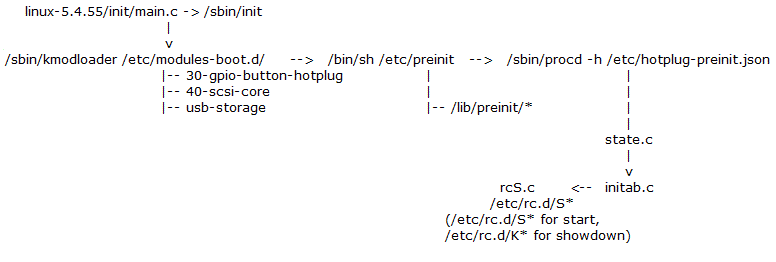

[TOC]

## 2024.2.18  Airoha AN7552 Gpon data flow

AN7552 + EN7571N bob , driver file *xpon.ko* path ``opal/feeds/airoha/package/airoha/drivers/xpon_1g/*``

Gpon debug command:

```shell
## debug PLOAM oam,int, omci for normal use
# echo msg oam 1 >/proc/gpon/debug  
# echo msg int 1 >/proc/gpon/debug 
# echo msg omci 1  >/proc/gpon/debug  

# echo msg act 1 >/proc/gpon/debug 
# echo msg trace 1 >/proc/gpon/debug 

## mirror omci
# /usr/bin/sys wan2lan on

## get passwd info
# /userfs/bin/ponmgr gpon get passwd info
# /userfs/bin/ponmgr liblevel 4
# /userfs/bin/ponmgr gpon set passwd ascii haisipwd01

```


##  2024.3.22  Nokia 7360 OLT Environment setting


```shell
# configure equipment ont interface 1/1/1/1/11 sw-ver-pland disabled sernum MSTC:00000011 voip-allowed enable subslocid sw00000011
# admin-state up
# configure equipment ont slot 1/1/1/1/11/3 planned-card-type veip plndnumdataports 1 plndnumvoiceports 0 admin-state up
# configure interface port uni:1/1/1/1/11/3/1 admin-up 
# configure bridge port 1/1/1/1/11/3/1  
# configure qos interface 1/1/1/1/11/3/1 upstream-queue 0 bandwidth-profile name:UPSTREAM_1G 
# configure bridge port 1/1/1/1/11/3/1 vlan-id 46
# configure bridge port 1/1/1/1/11/3/1 vlan-id 3001
# configure bridge port 1/1/1/1/11/3/1 vlan-id 3003
# configure bridge port 1/1/1/1/11/3/1 vlan-id 3007
# configure bridge port 1/1/1/1/11/3/1 max-unicast-mac 8 

###  以 1/1/1/1/11  为例，先删除预留的 vlan-id
# configure bridge port 1/1/1/1/11/3/1 no vlan-id 46 
# configure bridge port 1/1/1/1/11/3/1 no vlan-id 3003
 
# configure qos interface 1/1/1/1/11/3/1 upstream-queue 4 bandwidth-profile name:UPSTREAM_1G
# configure bridge port 1/1/1/1/11/3/1 vlan-id 4081 tag single-tagged network-vlan 46 vlan-scope local qos priority:4
# configure vlan port-protocol 1/1/1/1/11/3/1 protocol-group ipoe vlan-id 4081 priority 4

# configure qos interface 1/1/1/1/11/3/1 upstream-queue 0 bandwidth-profile name:UPSTREAM_1G
# configure bridge port 1/1/1/1/11/3/1 vlan-id 4082 tag single-tagged network-vlan 3003 vlan-scope local qos priority:0
# configure vlan port-protocol 1/1/1/1/11/3/1 protocol-group pppoe vlan-id 4082 priority 0
```


## 2024.4.17  Flash layout  Index

### EX3320 (AX3000):  

```text
                    |-------------|
                    |    zyubi    |  (rom-d,romfile,wwan,data,misc)
                    |-------------|
                    |    UBI2     |
    --------^-------|-------------|
            |       |   |  kernel |
            |       |   |---------|
           	|		|   |  rootfs |
         ras.bin    |   |---------|
            |       |   | zyfwinfo|
            |       |   └---------|
            |       |    UBI      |
    |-------v-------|-------------|  0x580000
    |               |  zloader    |  zloader.bin.gz.uImage   	
    |               |-------------|  0x540000
    |               |  fip.bin    |
    |     zld.bin   |-------------|  0x380000
    |               |  env        |   u-boot-env.bin
    |               |-------------|  0x100000
    |               |  bl2.img    |
    |---------------|-------------|  0x00
    |zld_img_hdr_t  |
    |---------------|
```

zmrd_info_s struct

```c
typedef struct zmrd_info_s {
    unsigned char vendorName[MRD_VENDOR_NAME_LEN];      /* ASCIIZ */
    unsigned char productName[MRD_PRODUCT_NAME_LEN];    /* ASCIIZ */
    unsigned char etherAddr[MRD_MAC_ADDR_LEN];          /* MAC address, HEX value */
    unsigned char CountryCode;                          /* HEX value */
    unsigned char serialNumber[MRD_SERIAL_NUM_LEN];     /* ASCIIZ */
#ifdef CONFIG_ZLOADER_SUPPORT_XPON
    unsigned char gponserialnumber[MRD_GPON_SERIAL_NUM_LEN];  /* GPON SN, HEX value */
#endif
    unsigned char numMacAddrs;
    unsigned char engDebugFlag;
    unsigned char mainFeatureBit;
    unsigned char featureBits[MRD_FEATUREBITS_LEN];
    unsigned char htpSwitch;
    unsigned char SN81[MRD_SN81_LEN];					/*String value for 81 Serial Number */
#ifdef CONFIG_ZLOADER_SUPPORT_ATCK
    unsigned char WpaPskKey[MRD_KEYPASSPHRASE_LEN];
    unsigned char admin[MRD_ADMIN_PWD_LEN];
#ifdef CONFIG_ZLOADER_SUPPORT_ATCK_SET_SUPERVISOR_PWD
    unsigned char supervisor[MRD_SUPER_PWD_LEN];
#endif
#if defined(CONFIG_ZLOADER_SUPPORT_ATTU)
	unsigned char tutk_uid[MRD_TUTK_UID_LEN];
#endif
#endif
} zmrd_info_t;
```

### EX3220 (AX1800):  

*CONFIG_EN7561SDK_TCSUPPORT_PARTITIONS_CMDLINE_STR="36M[tclinux],-[tclinux_slave],4M[data],1M[rom-d],32M[misc]"*

```text
            		| -------------------|
                    |    reservearea     |  bmt (TCSUPPORT_RESERVEAREA_BLOCK*blocksize)
            0x6dc0000 -------------------|  (bmt size = 0x240000)
					|	...              |	
       		0x6c80000 -------------------|
                    |     misc           |
            0x4D80000 -------------------|
                    |     rom-d          |
            0x4c80000 -------------------|
                    |     data           |
            0x4880000 -------------------|------------------------------------
                    |  	tclinux_slave    | size=0x1400000 (36M)
            0x2480000 -------------------|------------------------------------
                    |      |  rootfs A   |                      
           			|      |-------------|  tclinux.bin size=0x50000
                    |      |  kernel A   |  (36M)
                    |      |-------------|
                    |      |  trx_header |
              0x80000 -------------------|------------------------------------
                    |     romfile        |  romfile.gz, size=0x40000 (256k)
              0x40000 -------------------|------------------------------------
                    |     bootloader     |	tcboot.bin, size=0x40000 (256k)
                  0x0 -------------------|------------------------------------
```

### PMG4006 :

*TCSUPPORT_PARTITIONS_CMDLINE_STR="40m[tclinux],40m[tclinux_slave],4m[rootfs_data],2m[romfile],2m[rom-d],2m[wwan],7936k[data],4m[misc],4m[log]"*

```text
/*********************************************************************
* Flash is splited into 2 parts, system part is for normal system    *
* system usage, size is system_block_count, another is replace pool  *
*    +-------------------------------------------------+             *
*    |     system_block_count     |   bmt_block_count  |             *
*    +-------------------------------------------------+             *
*********************************************************************/

                    |--------------------|  (bmt size = 0x240000)
                    |     reservearea    |
                    |--------------------|
                    |     ...            |
                    |--------------------|
                    |     misc           |
                    |--------------------|
                    |     data           |
                    |--------------------|
                    |     wwan           |
                    |--------------------|
                    |     rom-d          |
                    |--------------------|
                    |     romfile        |
            		|--------------------|
                    |     rootfs_data    |
                    |--------------------|
                    |  	tclinux_slave    | size=0x2000000 (32 M)
                    |--------------------|
                    |   |  rsa.sign      | sign file(256 byte) with 1024 padding 
 -----^------       |	|----------------|
      |             |   | zydefault.bin  |
      |             |   |----------------|
      |             |   |    rootfs      |
  rsa.sign range    |   |----------------|
      |             |   |   vmlinux      |
      |             |   |----------------|
      |            	|   |   ecnt.dtb     | pmg4006_t20d.dts
 -----v-------      |   |----------------|
                    |   |  trx_header    | sizeof(trx_header) = 372 byte
                    |   |----------------|
                    |   |   padding      | fip padding offset size = 0x2000
 	          0x80000 -------------------|
                    | 	mi.conf          |  
              0x7c000 -------------------|
                    | 			         |  
              0x26000 -------------------|
                    |	zloader          |	zloader.bin.lzma.uimage, size 128k
 	          0x60000 -------------------|
                  	|   uboot.bin        |                   
 	          0x00000 -------------------|
```


## 6.13 ZTE OLT Setting

IP: 192.168.8.21  Login: keven/admin!@34 , root pwd: zxr10

```shell
ZXAN>enable
Password:
ZXAN#configure terminal
ZXAN(config)#show gpon onu by pw 0000000049
SearchResult
-------------
gpon_onu-1/1/1:42
ZXAN(config)#interface gpon_onu-1/1/1:42
ZXAN(config-if-gpon_onu-1/1/1:42)#sn-bind enable sn
ZXAN(config-if-gpon_onu-1/1/1:42)#sn-bind disable
```


## 6.14 Notes for HSAN C20 SDK

main files structure on hi5682 v200 *(xiling & xgpon) and v300 *(tiangong0 & cmcc_hgu)* board ,  based on c20 sdk.

```text
## The "/usr/local/factory/*" is current configuration file, 
## bob_config.ini, is a calibration file for boas, 
## and it serves as the default for /etc/bob/bob1.ini without calibration."
# /usr/local/factory/
	├── board.xml
	├── sysinfo.xml
	├── defaultconfig.xml
	├── bob_config.ini
	└── factory.txt
## Backup configuration files
# /config/conf/cfm/
	├── board_hsan_tiangong0_5.xml
	├── board_hsan_xiling_4.xml
	├── sysinfo.xml 
	└── config.tar 
([sysinfo.operator]_smart_[sysinfo.province]_[board.ge_num]_[board.fe_num]_[board.voice_num]_[board.wlan24 + board.wlan58]_[board.usb2_num +board.usb3_num].xml , on this project for"cmcc_smart_jt_4_0_1_0_2.xml")	
```

to build v200 and v300 by:

```shell
# ./cbuild.py -c xiling tiangong0 -t=release -p xgpon cmcc_hgu 
```

display usb 2.0 or usb 3.0 plug version by dmesg and awk ,based on *tiangong0 &cmcc_hgu*, no work for  *xiling & xgpon*

```shell
# dmesg -c| grep -E 'new high-speed|new SuperSpeed' | awk '{ if (tolower($2) == "1-1:") print usb 2.0 port" :" $4; else print usb 3.0 port " :"  $4 }' 
```


## 2024.8.18  Git stash command

userful git cmd

```shell
## show stash changes
$ git stash show -p stash@{0}
## to check stash files
$ git stash show -p stash@{0} | grep '^diff --git'
## checkout stash to new branch
$ git stash branch new-branch stash@{0}
```


## 2024.9.23 EX3501-T1 Flash Layout

EX3501-T1_Generic flash layout.

```text
   0x80000----------------|
        |  padding...     |
        |-----------------|
        |  env.bin        |
   0x7c000----------------|----------------
        |ecnt_trx   |     |
        |-----------|     |
        |                 |
        |                 |
        |-----------|     |
        |  *.its    |     |
        |-----------|     | zloader.bin.lzma.fitImage      
        |zloader.bin|     |
   0x60000----------------|----------------	
        |  u-boot.bin     |
        |-----------------|
        |  atf            |
      0x0-----------------|
              zld.bin
```

rsa.bin flash layout

```text
                    |------------------|
                    |   rsa.sign       | sign file(256 byte) with 1024 padding 
 -----^------       |------------------|
      |             |  | zydefault.bin |
      |             |  └---------------|
      |             |   rootfs         |
  rsa.sign range    |------------------|
      |             |   vmlinux        |
      |             |------------------|
      |            	|   ecnt.dtb       | pmg4006_t20d.dts
 -----v-------  0x2174 ----------------|
                    |   trx_header     | sizeof(struct trx_header) = 372 byte
                0x2000-----------------|
                    |   padding        | fip padding offset
                    |------------------|
                    	  ras.bin
```

zloader signature command.

```shell
# arm-openwrt-linux-muslgnueabi-objcopy --gap-fill=0xff zloader -O binary zloader.bin

# ./host/bin/lzma e zloader-2.0/zloader.bin zloader-2.0/zloader.bin.lzma -lc0 -lp2

# ./zloader-2.0/scripts/mkits.sh -A arm -a 0x81700000 -c "config-1" -C lzma -e 0x81700204 -k zloader-2.0/zloader.bin.lzma -o zloader-2.0/zloader.bin.lzma.its -n "zld-2.8 09/29/2024 06:14:42" -S zloader_key

# ./host/bin/mkimage -f zloader-2.0/zloader.bin.lzma.its -k defconfig/EX3501-T1_Generic/zloader_key -r zloader-2.0/zloader.bin.lzma.fitImage

# cp -fpR bin/targets/airoha/ex3501_t1/zyxel/zld.bin bin/targets/airoha/ex3501_t1

# dd if=bin/targets/airoha/ex3501_t1/zloader/zloader.bin.lzma.fitImage of=bin/targets/airoha/ex3501_t1/zld.bin bs=1 count=128k seek=384k conv=notrunc,sync

# TCBOOT_SIZE=0x80000 host/bin/ecnt_trx -t bin/targets/airoha/ex3501_t1/zld.bin  0x7c000
```


## 2024.12.16 Airoha AN7552 GPIO Register

get or set GPIO register

```shell
### Getting GPIO 0-15 directions.
# /usr/bin/sys memrl 0x1FBF0200
 <Address>	<Value>
 0x1fbf0200	0x15575554

### Seting GPIO 0-15 direction values.
# /usr/bin/sys memwl 0x1FBF0200 0x15555554
 
### Getting GPIO 16-31 directions.
# /usr/bin/sys memrl 0x1FBF0220
 <Address>	<Value>
 0x1fbf0220	0x10455000

### Seting GPIO 16-31 direction values.
# /usr/bin/sys memwl 0x1FBF0220  0x10455000

### Getting of GPIO 0-31 Input/Output values.
# /usr/bin/sys memrl 0x1FBF0204
 <Address>	<Value>
 0x1fbf0204	0x7fcabfff
 
### Setting of GPIO 0-31 Input/Output values.
# /usr/bin/sys memwl 0x1FBF0204 0x7fcabfff
 
```


```shell
root@(none):/tmp/var/home/root# cat /proc/cmdline 
sdram_conf=0x00108893 vendor_name=Zyxel Communications Corp. product_name=EX3501-T1 ethaddr=00:aa:bb:11:22:34 snmp_sysobjid=1.2.3.4.5 country_code=FF ether_gpio=0c power_gpio=1515 dsl_gpio=0b internet_gpio=02 multi_upgrade_gpio=0b020400000000000000000000000000 onu_type=12 qdma_init=33 root=/dev/mtdblock3 ro console=ttyS0,115200n8 earlycon bootflag=0 serdes_sel=0 serdes_sel=0 tclinux_info=0x22c83c7,0x4fa4,0x34dde4,0x352e80,0x1f77000,0x22c83c7,0x4fa4,0x34dde4,0x352e80,0x1f77000
```


## 2025.01.02 Airoha procd loading procedure

