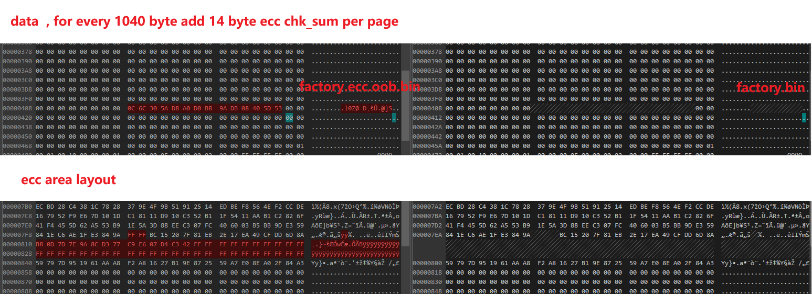
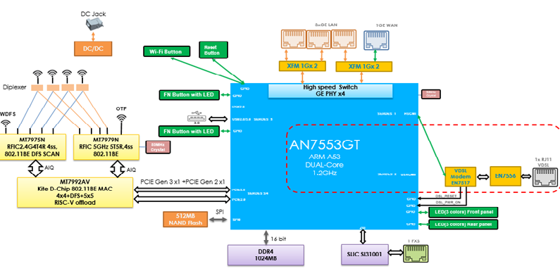

[TOC]

## 2025.01.09  查看当前 hsan DDR 频率

hsan v300 (tiangong0) 中查看当前 DDR 频率

|       | 0x11819040 | 0x11819044 |
| ----- | ---------- | ---------- |
| 333M  | 0x81032590 | 0x11000000 |
| 667M  | 0x81032580 | 0x11000000 |
| 800M  | 0x81046600 | 0x11000000 |
| 933M  | 0x81046500 | 0x11000000 |
| 1066M | 0x81042400 | 0x11A00000 |

对应上表查看v300的 DDR 频率，为最接近的是的数值可以确定当前 DDR为1066M

```shell
# devmem 0x11819040
0x81042405
# devmem 0x11819044
0x11A00000
```

对应代码 ``chip/tiangong0/common/cmake/parameter_info.cmake``

```Makefile
set(CONFIG_DDR_INIT ON)
set(CONFIG_DDR_FREQ_DEBUG ON)
# DDR3_333M  # 0xdfdf0333
# DDR3_667M  # 0xdfdf0667
# DDR3_800M  # 0xdfdf0800
# DDR3_933M  # 0xdfdf0933
set(CONFIG_DEFAULT_DDR3_FREQ_TURBO 0xdfdf0933)
set(CONFIG_DEFAULT_DDR3_FREQ_DEBUG 0xdfdf0933)
set(CONFIG_DEFAULT_DDR3_FREQ_RELEASE 0xdfdf0933)

# DDR4_333M  # 0xdfdf0333s
# DDR4_667M  # 0xdfdf0667
# DDR4_800M  # 0xdfdf0800
# DDR4_933M  # 0xdfdf0933
# DDR4_1066M # 0xdfdf1066
set(CONFIG_DEFAULT_DDR4_FREQ_TURBO 0xdfdf1066)
set(CONFIG_DEFAULT_DDR4_FREQ_DEBUG 0xdfdf1066)
set(CONFIG_DEFAULT_DDR4_FREQ_RELEASE 0xdfdf1066)
```


## 2025.02.14  Hisi BOSA cmd

hisi v300(tiangong0)  SYM GN28L97 初始值

```c
hi_int32 guc_tab_idx[HI_BOB_VEND_ID_MAX_E][HI_BOB_TAB_MAX] = {
    /* A2_LOW A2_HIGH CTRL BIAS MOD APD NA NA NA NA*/
    {0, 1, 3, 4, 5, 6, -1, -1, -1, -1}, /* bob0 */
    {0, 1, 0x80, 0x81, 0x82, 0x83, 0x84, 0x85, 0x86, -1}, /* bob1 */
    {0, 1, 2, 5, 4, 6, -1, -1, -1, -1}, /* bob2 */
    {0, 1, 2, 5, 4, 6, -1, -1, -1, -1}, /* bob3 */
    /* A2_LOW A2_HIGH CTRL0 CTRL1 BIAS_MOD APC_APD NA NA NA NA*/
    {0, 1, 0x80, 0x81, 0x82, 0x83, -1, -1, -1, -1}, /* bob4 */
    {0, 1, 0x80, 0x81, 0x82, 0x83, 0x84, 0x85, 0x86, -1}, /* bob5 */
};
```

bob 初始值  ``/etc/bob/bob4.ini`` ，``/usr/local/bob_config.ini``


hisi  v300 (tiangong0)  bob 批量读写指令 ``gateway/service/dms/bob/src/hi_bob.c`` , ``gateway/service/dms/bob/src/hi_bob_vendor1.c``

```shell
### val cal to  negative
# hi_ipc /home/cmd/pon/set_apd_lut -v type 1 offset 3 Vbr_min 10 Vbr_max 50 slope_H 0.02 slope_L 0.03 R_kohm 200 tempr0 35

### cal normal
# hi_ipc /home/cmd/pon/set_apd_lut -v type 1 offset 2.5 Vbr_min 35 Vbr_max 50 slope_H 0.03 slope_L 0.03 R_kohm 200 tempr0 0

### bob4.ini or bob4_misc.ini
# hi_ipc /home/cmd/pon/set_reg_data128 -v table 2 reg 0x80 len 0x10 data 086200ffff00004000022078c5008D96

### bob1.ini
# hi_ipc /home/cmd/pon/set_reg_data128 -v table 2 reg 0x80 len 0x10 data aa005990d0c820024c02a01600432a00
 
# hi_ipc /home/cmd/pon/get_reg_data128 -v table 2 reg 0x80 len 0x10
real table index:128
table : 0x2
reg   : 0x80
len   : 0x10
data  : aa005990d0c820024c02a01600432a000000000000000000000000000000000000
```


## 2025.02.17  Git 中删除文件,并且在日志中删除相关的修改记录

在 Git 中彻底删除文件及其历史记录需要 重写仓库历史，这会影响到所有协作者

```shell
# 使用 filter-branch 删除文件的所有历史记录
git filter-branch --force --index-filter \
  'git rm --cached --ignore-unmatch 要删除的文件名（或路径）' \
  --prune-empty --tag-name-filter cat -- --all
# 强制推送所有分支
git push origin --force --all

# 强制推送所有标签
git push origin --force --tags

# 删除 filter-branch 备份的引用
git for-each-ref --format='delete %(refname)' refs/original | git update-ref --stdin
git reflog expire --expire=now --all
git gc --prune=now
```


## 2025.02.17  MTK EX3320-T1 & EX3320-T0 flash layout

EX3320_T1 u-boot startup process

```text
board_f.c  --> board_r.c
	| 		init_sequence_r[]			[int board_nmbm_init(void)]
	|				|--initr_nmbm, -->	u-boot/board/.../mt7981_rfb.c 
	|				|							 └-> mtd_uboot.c
	|				└- run_main_loop --> main.c --> autoboot.c
	|															└-> loader zloader
	└-> parser zyxel_ex3320-t1.dts
	                   |
					   └-> spi_nand@0
```

256M flash layout

```text
     |-----------|
1024k|  bl2.img  |	
     |-----------|--0x100000
512k |  env      |  u-boot-env.bin
     |-----------|--0x180000
2048k|  factory  |  RootFS
     |-----------|--0x380000
1792k|  fip.bin  |                           |-----------|
     |-----------|--0x540000                 | kernel    |
256k |  zloader  |   zloader.bin.gz.uImage   | rootfs    |  (ubi volume ubi0_0 ubi0_3)
     |-----------|--0x580000                 | zyfwinfo  |  
64M  |  ubi      |   kernel && rootfs ------>| root_data |
     |-----------|--0x4580000                |-----------|
64M  |  ubi 2    |  
     |-----------|--0x8580000
104M |  zyubi    |             ------>|--------|
     |-----------|--0xDE80000         | romfile|  4M
     |    ...    |                    | rom-d  |  4M
     |-----------|                    | wwan   |  4M
     |  bmt&bbt  |                    | data   |  60M
     |-----------|--0x10000000        | misc   |  20M
                                      |--------| 
                                      (ubi volume ubi1_0 ~ ubi1_4)
```

128M Flash layout

```shell
     |-----------|
1024k|  bl2.img  |	
     |-----------|--0x100000
512k |  env      |  u-boot-env.bin
     |-----------|--0x180000
2048k|  factory  |  RootFS
     |-----------|--0x380000
1792k|  fip.bin  |                           |-----------|
     |-----------|--0x540000                 | kernel    |
256k |  zloader  |   zloader.bin.gz.uImage   | rootfs    |  (ubi volume ubi0_0 ubi0_3)
     |-----------|--0x580000                 | zyfwinfo  |  
40M  |  ubi      |   kernel && rootfs ------>| root_data |
     |-----------|--0x2D80000                |-----------|
40M  |  ubi 2    |  
     |-----------|--0x5580000
35M  |  zyubi    |             ------>|--------|
     |-----------|--0x7880000         | romfile|  2M
     |    ...    |                    | rom-d  |  2M
     |-----------|                    | wwan   |  2M
     |  bmt&bbt  |                    | data   |  20M
     |-----------|--0x8000000         | misc   |  9M
                                      |--------| 
                                      (ubi volume ubi1_0 ~ ubi1_4)
```


## 2025.02.18  useful regular express

``^(?!.*[a-z]).+$``   	匹配所有小写字符的字符串
``^(?!.*[#@!%]).+$``  	匹配没有特殊字符  '#', '@' , '!' , '%' 的字符串
``^.*[a-z].*$`` 		匹配都是小写字符的字符串


## 2025.03.20  update env.bin by Hisi SMT format image 

The mtd partition list for  tiangong0 v300, env.img  structure as below:

```c
struct env_image_redundant {
	uint32_t crc;		/* CRC32 over data bytes    */
	unsigned char flags;	/* active or obsolete */
	char data[];
};
```

generate env.img by 

```shell
## fw_env.config stored generate file name and size which should be writing for.
## env.config contains env data (format by '{name}={val}')
fw_setenv -c fw_env.config -s env.config
```

tiangong0 SMT image layout and  partition address

```shell
uboota		0x0080000 ,				SMT addr 	0x84000
ubootb 		0x0180000 , 			SMT addr 	0x18C000
enva		0x0280000	0x80000		SMT addr 	0x294000 
envb		0x0300000	0x80000		SMT addr  	0x318000
kenrela		0x0e00000,				SMT addr  	0xE70000
kernelb 	0x1500000,				SMT addr 	0x15A8000
rootfsa 	0x1c00000, 				SMT addr 	0x1CE0000
rootfsb		0x4900000,				SMT addr 	0x4B48000
fwka		0x7600000,				SMT addr 	0x7620000
fwkb		0x9900000,				SMT addr 	0x9DC8000
```

step to re-generate SMT Image for tiangong0

```shell
## step 1. decode reversed image
hi_page_reverse -e 8 -s 64 -b 64 -p 2048 -f factory.ecc.oob.reverse.bin
## step 2. get factory.bin and write env.bin to factory
     从输入文件中每次读取 2112 字节，按以下步骤处理：
    1. 取前 1040 个字节。
    2. 取第 1054 到 2048 个字节。
    3. 取第 2050 到 2064 个字节。
    并将这些字节写入输出文件。
## step 3. add ecc oob to factory.bin
hi_addecc -i factory.bin -p 2048 -b 4 -s 64 -o factory.ecc.oob.bin
## step 4. final generate SMT image
hi_page_reverse -e 8 -s 64 -b 64 -p 2048 -f factory.ecc.oob.bin
```




## 2025.03.20  DE3301-00 SMT Image layout



### **Linux 内核映像中的 ITS（Image Tree Source）**

在 Linux 内核构建和嵌入式系统开发中，**ITS（Image Tree Source）** 是一种用于描述 **FIT（Flattened Image Tree）** 镜像配置的文件，通常以 `.its` 为后缀。以下是其核心作用和相关背景：


```
bootcmd=ldkernel;init_iNIC;bargsenv;bootm 0x81800000#conf-0;
```


ras.bin  layout:

```text
     |-----------------|--- 0x0
     |  trx_header     |	
     |-----------------|
     |    | fip header |
     |    -------------|
     |                 |      
     |  fip image      |
     |-----------------|--- 0x4000
     |  dt.dtb         |
     |-----------------|--- 0x4000
     |                 |
     |-----------------|--- 0xB000
     | u-boot.bin      |     
     |-----------------|--- 0x9FFBD0
     |zyxel_version.bin|
     |-----------------|--- 0x9FFFD0
     |  version.bin    |
     |-----------------|--- 0x9FFFF0
     |  verify.bin     | (include fit_part_len,fit_part_crc, rootfs_len, rootfs_crc)
     |-----------------|     
     |                 |
     |-----------------|
     |                 |
     |-----------------|                       
```


fit_check_sign:

```c
U_BOOT_IMAGE_TYPE(
	fitimage,
	"FIT Image support",
	sizeof(image_header_t),
	(void *)&header,
	fit_check_params,
	fit_verify_header,
	fit_print_contents,
	NULL,
	fit_extract_contents,
	fit_check_image_types,
	fit_handle_file,
	NULL /* FIT images use DTB header */
);
```


## 2025.04.25 Hisi xgpon tiangong0  BOB chip check tool

include  exists  ``.h``  and dependence library in CMakeLists

```Makefile
cmake_minimum_required(VERSION 3.13)

project(VENDOR_BOB)
include(${CONFIG_CMAKE_DIR}/toolchains/${CONFIG_TOOLCHAIN_LINUX_APP}.cmake)

# 组件名称
set(USERAPP_NAME check_bob)

# 组件类型
set(USERAPP_TARGET_TYPE bin)

# 依赖的源文件
aux_source_directory(${CMAKE_CURRENT_SOURCE_DIR} SOURCE_DIR)
set(SERAPP_PRIVATE_SRC
    ${SOURCE_DIR}
)

# 依赖的头文件
set(USERAPP_PRIVATE_INC
    ${ROOT_DIR}/gateway/service
    ${ROOT_DIR}/gateway/basic/include 
)

# 依赖的库
set(USERAPP_PRIVATE_LIB
    xml2
    hi_basic    
)

# 自定义宏
set(USERAPP_PRIVATE_DEFINE)

# 自定义编译选项
set(USERAPP_PRIVATE_COMPILE
    ${HGW_COMMON_CFLAGS}
)

build_app_feature()
```


## 2025.08.01 ZyIMS 

VoIP FXS interface structure:

```text
[模拟电话] 
     │
     v
   (FXS 接口) ←提供拨号音、铃声
     │
     
[ADC] 模拟 → 数字（PCM, 64 kbps, G.711）
     │
     v
   (DSP) ← 进行语音处理（编码、回声消除等）
     │
     v
[网络] → 封装成 RTP 包，发送到 IP 网络（VoIP）
```


## 2025.08.29 U-Boot operate GPIO in board_f.c

Based on u-boot 2022 for hi5671y  SDK.  board_f.c 早于 board_r.c  ，此时 UCLASS_GPIO 尚未加载无法通过 uboot 上层的 API 如 gpio_request 来操作 GPIO， GPIO 控制器为 dwapb_gpio.c ，根据 dts 中dwapb 控制器的相关配置，绕过dm来控制GPIO.

dts:

```shell
gpio0@0x10106000 {
        compatible = "snps,dw-apb-gpio";
        reg = <0x10106000 0x00001000>;
        #address-cells = <0x00000001>;
        #size-cells = <0x00000000>;
        clocks = <0x0000003c>;
        resets = <0x0000000f 0x0000002c 0x00000014>;
        phandle = <0x00000069>;
        gpio-port@0 {
            compatible = "snps,dw-apb-gpio-port";
            bank-name = "porta";
            gpio-controller;
            #gpio-cells = <0x00000002>;
            snps,nr-gpios = <0x00000020>;
            gpio-base = <0x00000000>;
            reg = <0x00000000>;
            interrupt-controller;
            #interrupt-cells = <0x00000002>;
            interrupt-parent = <0x00000001>;
            interrupts = <0x00000000 0x00000031 0x00000004>;
            phandle = <0x0000006a>;
        };
    };
```

u-boot api

```c
setbits_le32(data_reg, GPIO_MASK);  // 输出高电平：置 1
clrbits_le32(data_reg, GPIO_MASK);  // 输出低电平：清 0	
```

设置 IO 复用端口为 GPIO模式

```c
	// enable gpio for GPIO_24: 0x14900100  val |= 1000000
    hi_reg_read(IO_MUX_ADDR, val); 
    debug("hsan : %s:%d io mux = %08x\n", __FUNCTION__, __LINE__, val );
    val |= (1<<GPIO_PIN );
    debug("hsan : %s:%d io mux = %08x\n", __FUNCTION__, __LINE__, val );
    hi_reg_write(IO_MUX_ADDR, val);
```

设置 GPIO Direction 和 Value

```c
#include <common.h>
#include <fdtdec.h>
#include <asm/io.h>

#define GPIO0_COMPATIBLE  "snps,dw-apb-gpio"
int board_early_init_f(void)
{
    const void *fdt = gd->fdt_blob;
    int node;
    fdt_addr_t addr;
    void __iomem *base;
    u32 *data_reg, *dir_reg;

    // 查找 compatible = "snps,dw-apb-gpio" 的节点
    node = fdt_node_offset_by_compatible(fdt, -1, "snps,dw-apb-gpio");
    if (node < 0) {
        printf("DWAPB GPIO not found in DT\n");
        return -1;
    }

    // 获取 reg = <0x10106000 ...>
    addr = fdtdec_get_addr(fdt, node, "reg");
    if (addr == FDT_ADDR_T_NONE) {
        printf("Failed to get GPIO0 reg\n");
        return -1;
    }

    base = (void __iomem *)addr;
    data_reg = (u32 *)(base + 0x00);
    dir_reg  = (u32 *)(base + 0x04);

    // 控制 GPIO0[5]
    const u32 mask = 1U << 5;
    setbits_le32(data_reg, mask);   // 输出高
    setbits_le32(dir_reg,  mask);   // 输出模式

    return 0;
}
```


## 2025.09.12 OPAL20 to enable CONFIG_FUNCTION_TRACER

 OpenWRT  采用模块化的方式来产生Kernel 中的 ``.config``，对于比较大的功能会在 OpenWRT 的profiles 和   ``config-5.4`` 双重确认以避免不必要的改动。在打开 CONFIG_FUNCTION_TRACER=y 后linux 中定义为 static 的函数会被优化，结果是 objdump -d vmlinux 和 System.map 无法找到对应的符号.

defconfig/DE3301-00_EnelX/DE3301-00_EnelX.defconfig

```shell
## opal/defconfig/DE3301-00_EnelX/DE3301-00_EnelX.defconfig
CONFIG_KERNEL_FTRACE=y
CONFIG_KERNEL_FUNCTION_TRACER=y
CONFIG_KERNEL_FUNCTION_GRAPH_TRACER=y
CONFIG_KERNEL_DYNAMIC_FTRACE=y
# CONFIG_KERNEL_IRQSOFF_TRACER=y
```

target/linux/airoha/de3301_00/config-5.4

```shell
CONFIG_STACKTRACE=y
CONFIG_STACK_TRACER=y
CONFIG_DEBUG_FS=y
CONFIG_FTRACE=y
CONFIG_HAVE_FUNCTION_TRACER=y
CONFIG_FUNCTION_GRAPH_TRACER=y
CONFIG_FUNCTION_TRACER=y
# CONFIG_HIST_TRIGGERS is not set
CONFIG_EVENT_TRACING=y
```

include/kernel-defaults.mk

```shell
       echo "CONFIG_KALLSYMS_ALL=y" >> $(LINUX_DIR)/.config.target
```

通过 ftrace 的 debugfs 接口

```shell
# 挂载 debugfs（如果还没挂载）
mount -t debugfs none /sys/kernel/debug

# 设置 tracer 为 function_graph
echo function_graph > /sys/kernel/debug/tracing/current_tracer

# 添加要跟踪的函数（例如 schedule）
echo schedule > /sys/kernel/debug/tracing/set_graph_function

# 开始跟踪
echo 1 > /sys/kernel/debug/tracing/tracing_on
echo 1 > /sys/kernel/debug/tracing/tracing_enabled

# 查看结果
cat /sys/kernel/debug/tracing/trace

# 停止
echo 0 > /sys/kernel/debug/tracing/tracing_on
```

DE3310-Enel SMT crash 

```shell
-----------------
|	AN7583		|
-----------------
    /etc/preinit
        |
        V
(insmod ae_wan.ko)
	/etc/initt.d/xponconfig
        |
        V					HeartBeat
(hsm,insmod client_info)  <==================>	-------------
        |		      host_service_manager		|	7517    |
        |		     	.event_recv()           -------------
        |    									    |
        V				ecnt_blapi	      			|
  	zcfg_be    		<====================>          V
```


## 2025.09.16 OPAL20 Hisilicon Port Mirror

port mirror for EX3320-00 url : [portmirror](http://192.168.1.1/portmirror)

```shell
$ insmod /lib/hisilicon/ko/hi_kport_mirror.ko
$ echo eth0 > /proc/hsan/net/mirror/igr 
$ echo eth0 > /proc/hsan/net/mirror/egr 
$ echo eth2 > /proc/hsan/net/mirror/dport 
$ echo hw > /proc/hsan/net/mirror/enable
```


## 2025.09.17  HiSmartHub_1.2.9 SDK Build

to building whole project

```shell
$ python3 ./cbuild.py -c xiling -p xgpon -t release

## to building SMT FW
$ cd tools/hosttool/hi_makeimage/
$ ./mkp /work/cpe-opal/HiSmartHub/ xiling xgpon release 64 2048 128 8
```


## 2025.09.17  HiSmartHub_1.2.9 BOB Layout

