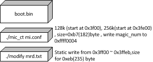
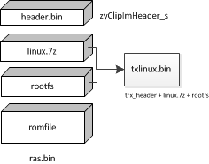
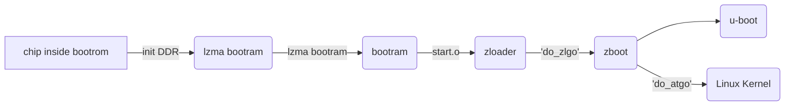

# 1. Introduction & Target

ZyClip means **ZyXEL CPE Common Linux Platfrom Architecture** , while include following components:

- ZyU-Boot: include uboot, zloader and zboot for bootloader 	

- MRD access module and utility: used to read and change MRD data in linux user space , for example: atbp/atsh (private\mitrastar\ZyCLiP_Utility_3.x.V1\ MRD_access_util)

- MRD_CERT partition manipulation utility: used to read/write/add/delete MRD_CERT partition, command is “mcputil” (private\mitrastar\ZyCLiP_Utility_3.x.V1\ MRD_CERT_util)

- Build RAS image utility and firmware upgrade utility : used to build ras image and firmware upgrade (private\mitrastar\ZyCLiP_Utility_3.x.V1\ fw_upgrade)


Note: MLD platform not include bootloader and device driver.

Toolchain:

- mips-linux-ld

- mips-linux-nm


ZyXEL bootloader ``Makefile``  process

```Makefile
OBJFILES = $(OUTDIR)/test.o

$(OUTDIR)/main.o: ./main.c
 	$(CC) -c $(CFLAGS_MIPS16) $(CFLAGS) -o $(OUTDIR)/main.o ./main.c

all: 
	make boot.out
	@echo  \#define BOOT_CODE_TIME \"`date `\" > ./banner/mk_time
	$(NM)   ./output/boot.out | sort > ./output/boot.nm
	$(OBJCOPY) -g -Obinary ./output/boot.out ./output/boot.img
	$(OBJDUMP) -h -S ./output/boot.out > ./output/boot.text

$(OUTDIR)/boot.out :     $(OBJFILES)
	$(LD) $(LDFLAGS) $(OBJFILES) $(LIBS) -o $(OUTDIR)/boot.out
```


## 1.1 ZyU-Boot

ZyU-Boot includes uboot, zloader and zboot. Uboot is related with platform, we need to use vendor’s uboot and porting ZyClip related code to uboot. Zloader and zboot are part of ZyCLiP3.0_ZLB from ZyXEL, mostly same in different platform, only need to change the APIs of flash erase, LED, uboot/zboot image upgrade etc.

ZyU-Boot will be built to two images, one is loader.img(xxx.bm) which includes uboot and zloader, the other is zboot which will be built to ras.bin(xxx.bin) together with kernel image.

The file loader.img compose by following :

```shell
./uboot/
├──	ddr_cal_en7512/output/boot.out
│	└── spram.img
├── unopen_img/en7528/
│	├── ddr_cal_en7512/output/boot.out
│	└── LE/start.o
│
├──	booram/output/
│	├── boot.img
│	└── boot.text
│
├── u-boot/
│	└── u-boot.img
│
├──	boot.img
│	(lzma compressed image from u-boot/u-boot.img)
├── bootload.o
│	(add-section .initrd=boot.img)
│
├──	zloader.img
│	(lzma compressed zloader.img )
├── zbootload.o
│	(add-section .zboot=zloader.img)
│
├── spram.bin
│	(copy from ddr_cal_en7512/output/boot.out and ddr_cal_en7512/spram.img )
│
├── lzma.img
│	(copy from ./bootram/output/boot.img)
├── boot_lzma.txt
│	(copy from ./bootram/output/boot.text)
├── lzmaload.o
│	(add-section .lzma=lzma.img , .spram=spram.bin)
├── start.o
│	(copy from unopen_img/en7528/LE/start.o)
│
├──	header.o
├── boot.elf
│	(link with start.o , bootload.o , zbootload.o , lzmaload.o)
├── boot.bin
│	(object copy from boot.elf)
├── tcboot_MRD.bin
│	(add MRD to boot.bin ,then sign to it ,and final generate tcboot_MRD.bin)
├── system.map
└── tcboot.bin
```

**(Note: above files based on EN_7528, not for EN_7580.)**

``tcboot.bin`` compose: 



``ras.bin`` compose of:



ZyClip Header defination at ``zyclipHeader.h``

```c
typedef struct zyClipImHeader_s {
    unsigned int magicNumber;               /* Provided by Makefile */
    unsigned char chipId[CHIP_ID_LEN];      /* Provided by Makefile */
    unsigned char boardId[BOARD_ID_LEN];        /* Provided by Makefile */
    unsigned int modelId;                   /* Provided by Makefile */
    unsigned int totalImageLen;
    unsigned int rootfsAddress;
    unsigned int rootfsLen;
    unsigned int kernelAddress;
    unsigned int kernelLen;
    unsigned int defcfgAddress;
    unsigned int defcfgLen;
    unsigned int imageSequence;
    unsigned char swVersionInt[SW_VERSION_LEN]; /* Provided by Makefile */
    unsigned char swVersionExt[SW_VERSION_LEN]; /* Provided by Makefile */
    unsigned int rootfsChksum;
    unsigned int kernelChksum;
    unsigned int defcfgChksum;
} zyClipImHeader_t, *pzyClipImHeader_t;
```

trx_header at ``trx.h``

```c
struct trx_header {
	unsigned int magic;			/* "HDR0" */
	unsigned int header_len;    /*Length of trx header*/
	unsigned int len;			/* Length of file including header */
	unsigned int crc32;			/* 32-bit CRC from flag_version to end of file */
	unsigned char version[32];  /*firmware version number*/
	unsigned char customerversion[32];  /*firmware version number*/
//	unsigned int flag_version;	/* 0:15 flags, 16:31 version */
	unsigned int kernel_len;	//kernel length
	unsigned int rootfs_len;	//rootfs length
    unsigned int romfile_len;	//romfile length
	unsigned char Model[32];
	unsigned int decompAddr;//kernel decompress address
	unsigned int saflag;
	unsigned int saflen;
	unsigned int reserved[30];  /* Reserved field of header */
	unsigned char chipId[CHIP_ID_LEN];		/* Provided by Makefile */
	unsigned char boardId[BOARD_ID_LEN];		/* Provided by Makefile */
	unsigned int modelId;					/* Provided by Makefile */
	unsigned int defcfg_len;	//default config length
	unsigned int imageSequence;
	unsigned char swVersionInt[SW_VERSION_LEN];	/* Provided by Makefile */
	unsigned char swVersionExt[SW_VERSION_LEN];	/* Provided by Makefile */
 	unsigned int rootfsChksum;
	unsigned int kernelChksum;
	unsigned int defcfgChksum;
    unsigned int headerChksum;
};
```


## 1.2 MRD

MRD data is used for saving product information, for example: VendorName, ProductName, EtherAddr, SerialNumber, wanmode etc. It is defined in 

*makecode\product-depconfig\bootloader\ZyCLiP3.0\uboot\product_mrd.txt*


## 1.3 MRD_CERT

MRD_CERT is a partition to store current configuration file, MRD_CERT utilities is used to manipulate this part, command is “mcputil” in linux user space.

You can use “*mcputil info*” command to check which partition is used for current configuration file, and use “mcputil del 60” to mark current configuration file invalid, then CPE will load default romfile when reboot.


## 1.4 ZyXEL Booting process to Kernel

overview for booting startup:



**zloader** through *ZyCLiP3.0_ZLB/zloader/zloader_main.c*  while using u-boot command "**go [ADDRESS]**" jump to **zboot**  image , finally handle  "***theKernel = (void (*)(int, char **, char **, int *))output_data;***"   jump to **linux kernel** , code as following:

```c

 /* boot up whole system */
 /* Penguin Lin */
 int do_atgo (int argc, char *argv[]) {
     mcpinfo_t mcpinfo;
     romdinfo_t romdinfo;
     int i, ret = 0, nMrdCert = 1;
     cmd_tbl_t bootm_cmd_table;
     char cmd_args[3][12], bootargs[512];
     char *cmd_argument[4];
     u_int32_t error_ret, baudrate = 115200; /* FIXME: use TLV to save, and getenv to get TLV addr */
     struct mpt_partition k;
     int withoob = 0, read_mode = 1;
     unsigned long free_mem_ptr;
     unsigned long free_mem_ptr_end;
     unsigned long output_data;
     void (*jumpAddr)();
     char    env_buf[12];
     char    *cp;
     void (*theKernel) (int, char **, char **, int *);
 
     /* simple check */
     if (argc != 0){
         error_msg(ERROR_MSG_ARG_NUM_ERR);
         return -1;
     }
 #ifdef START_ADDR
     output_data = START_ADDR;
 #else
     output_data = 0x80020000;
 #endif
     free_mem_ptr = 0x80e00000;
     free_mem_ptr_end = 0x80f00000;
     /* verify the image integrity */
     if (verify_system_image() < 0) {//[jason]occupied 9 seconds
         if (is_double_image() && !verify_neighbor_zboot() && !erase_self_partition()) {
             do_reboot();
         }
         printf("FW images are wrong!!!\n");
         return -1;
     }
 
     /* verify MRD_CERT */
     /* get 2 MRD_CERT partition MTD number and MTD size */
     get_mrdcert_info(g_which, &mcpinfo);
     if (is_double_mrdcert()) {
         nMrdCert = 2;
     }
 
     for (i = 0; i < nMrdCert; i++) {
         error_ret = verify_mrdcert((u_int32_t)mcpinfo.mcpAddr[i], mcpinfo.mcpSize[i]);
         printf("MRD_CERT_%d check=%x\n", i + 1, error_ret);
         if (error_ret == ERROR_MRD_CERT_BLOCK_IS_BAD){
             continue;
         }
         if (error_ret && !(error_ret & ERROR_TLVS)) {
             ret = restore_bootbase_version_tlv(mcpinfo.mcpAddr[i], mcpinfo.mcpSize[i], error_ret);
         }
         /* if restore failed or ERROR_TLVS, restore MRD_CERT */
         if ((error_ret & ERROR_TLVS) || (error_ret && (ret < 0))) {
             ret = restore_mrdcert(mcpinfo.mcpAddr[i], mcpinfo.mcpSize[i]);
         }
         if (ret < 0) {
             printf("cannot restore MRD_CERT partition: %d\n", ret);
             return -1;
         }
     }
 
     /* get kernel and rootfs info */
     if (get_kernel_info(g_which, &k) < 0) {
         printf("cannot get kernel info\n");
         return -1;
     }
 
     /* read kernel to ram to run , read RAM from 0x134d000 */
     printf("\n\n %s:%d:Read Kernel to RAM from %x\n",__func__, __LINE__, k.offset);
     if (nand_rw_skip_badblock((void*)TMP_ADDR_FOR_LOAD_KERNEL, k.offset, NAND_PAGE_ALIGN(k.size), withoob, read_mode)){
         return -1;
     }
 
     set_lzma_addr(TMP_ADDR_FOR_LOAD_KERNEL, TMP_ADDR_FOR_LOAD_KERNEL+k.size);
 
     /*such as "bootargs=root=/dev/mtdblock0 console=ttyS0,115200 "*/
     decompress_kernel(output_data, free_mem_ptr, free_mem_ptr_end);
     sprintf(bootargs, "root=/dev/mtdblock%d console=%s,%d %s panic=3",
     get_rootfs_mtd_num(g_which), CONSOLE_DEV, baudrate,formatMtdBootArg(g_which));
     //setenv("bootargs", bootargs);
     printf("bootargs=%s \n", bootargs);
     linux_params_init (gd->bd->bi_boot_params, bootargs);
 
 #ifdef CONFIG_MEMSIZE_IN_BYTES
     sprintf (env_buf, "%lu", (ulong)gd->ram_size);
     printf ("## Giving linux memsize in bytes, %lu\n", (ulong)gd->ram_size);
 #else
     sprintf (env_buf, "%lu", (ulong)(gd->ram_size >> 20));
     printf ("## Giving linux memsize in MB, %lu\n", (ulong)(gd->ram_size >> 20));
 #endif /* CONFIG_MEMSIZE_IN_BYTES */
     linux_env_set ("memsize", env_buf);
 
     sprintf (env_buf, "0x%08X", (uint) (gd->bd->bi_flashstart));
     linux_env_set ("flash_start", env_buf);
     printf ("## flash_start %lu\n", (uint) (gd->bd->bi_flashstart));
 
     sprintf (env_buf, "0x%X", (uint) (gd->bd->bi_flashsize));
     linux_env_set ("flash_size", env_buf);
     printf ("## bi_flashsize %lu\n", (uint) (gd->bd->bi_flashsize));
 
     flush_icache_range(output_data, output_data + k.size);
 
     //(*jumpAddr)();
     theKernel = (void (*)(int, char **, char **, int *))output_data;
     theKernel (linux_argc, linux_argv, linux_env, 0);
 }
 /* do_atgo */
```

Note:  **gd->bd** its u-boot global variable used to store board info.


# 2. Econet bootbase platform

nand flash partition list:

```shell
0x00000000-0x00040000 : "bootloader"
0x00040000-0x00080000 : "romfile"
0x00080000-0x000800ff : "kernel"
0x000800ff-0x000800ff : "rootfs"
0x00080000-0x01980000 : "tclinux"
0x01980000-0x019800ff : "kernel_slave"
0x019800ff-0x019800ff : "rootfs_slave"
0x01980000-0x03280000 : "tclinux_slave"
0x03280000-0x03a80000 : "opt0"
0x03a80000-0x04280000 : "opt1"
0x04280000-0x08280000 : "ubifs"
0x0ddc0000-0x0e000000 : "reservearea"

                   0x0--------------------|
                   	 |    bootloader      |	
            0x00040000 -------------------|
                   	 |      romfile       |	
            0x00080000 -------------------|-------------------		
                   	 |		kernel		  | 
 			0x000800ff -------------------|		tclinux
                     |	  	rootfs	 	  |
 	        0x01980000 -------------------|-------------------
                     |	    kernel_slave  |
            0x019800ff -------------------|		tclinux_slave
                     |     	rootfs_slave  | 	
            0x03280000 -------------------|-------------------
                     |		opt0          |
 	        0x03a80000 -------------------|
                   	 |     	opt1          |  
 	        0x04280000 -------------------|
                  	 |    	ubifs    	  |	
 	        0x08280000 -------------------|
 	        	 	 |    	....    	  |	
 	        0x0ddc0000 -------------------|
 	                 |    	reservearea   |	
		    0x0e000000 -------------------|
```


based on  *CT_EN7528_LE_7592_7613_JOYME3_demo.profile*


```shell
./bootrom/
├──	booram/output/
│	├── boot.out
│	├── boot.img
│	└── boot.text
│
├──	boot_main.txt
├──	boot.img
│	(lzma compressed image from bootram/output/boot.img)
├── bootload.o
│	(add-section .initrd=boot.img)
├──	bootram.img
│	(copy from boot.img)
├──	bb_check_bootext_ram.txt
│	(lzma compressed zloader.img )
├── bb_check_bootext.ram
│	(copy from bootram/output/boot.img)
│
├── spram.bin
│	(copy from ddr_cal_en7512/output/boot.out and ddr_cal_en7512/spram.img )
│
├── lzma.img
│	(copy from ./bootram/output/boot.img, rebuilding with LZMA_IMG=1)
├── boot_lzma.txt
│	(copy from ./bootram/output/boot.text, rebuilding with LZMA_IMG=1)
├── lzmaload.o
│	(add-section .lzma=lzma.img , .spram=spram.bin)
│
├──	verify.img
│	(copy from ./bootram/output/boot.img, rebuilding with VERIFY=1	)
├──	header.o
├── boot.elf
│	(link with start.o , bootload.o , zbootload.o , lzmaload.o)
├── boot.bin
│	(object copy from boot.elf)
├── tcboot_MRD.bin
│	(add MRD to boot.bin ,then sign to it ,and final generate tcboot_MRD.bin)
├── system.map
└── tcboot.bin
```


## 2.1 ZyClib Bootbase making


## 2.2 ZyClib mtd partition table

```c
/***           flash boot:128KB          ***/
/*  start.o        from 0x0                */
/*  move_data.img  less than 0x800         */
/*  boot2.img                              */
/*  lzma.img                               */
/*  spram.img      less than 0xFF00        */
/*  mi.conf        from 0xFF00 to 0xFFFF   */
/*  bootram.img    from 0x10000 to 0x1FFFB */
/*  CRC32          from 0x1FFFC to 0x1FFFF */
/*******************************************/

/***           flash boot:256KB          ***/
/*  start.o        from 0x0                */
/*  move_data.img  less than 0x800         */
/*  boot2.img                              */
/*  spram.img      less than 0xFF00        */
/*  constant data  from 0xFF00 to 0xFFFF   */
/*  lzma.img       from 0x10000 to 0x1FFFB */
/*  CRC32          from 0x1FFFC to 0x1FFFF */
/*  bootram.img    from 0x20000 to 0x3FDFB */
/*  mi.conf        from 0x3FDFC to 0x3FFFB */
/*  CRC32          from 0x3FFFC to 0x1FFFF */
/*******************************************/
```


```c
/*  -------------------------------------- 0x00000000
*  |        tcboot.bin(zld.bin)         |
*  |             (256KB)                |  (default using 2 blocks)
*  +------------------------------------+  0x00040000
*  |         romfile (256KB)            |  (default using 2 blocks)
*  +------------------------------------+  0x00080000
*  |                                    |
*  |       tclinux.bin(ras.bin)         |
*  |                                    |
*  @@@@@@@ECONET current design@@@@@@@@@@  0x00080000 + (nand_logic_size/2)
*  @@@@@@@ZyXEL plane to change@@@@@@@@@@  (nand_logic_size-
*  |                                    |  (0x80000+0x80000+romd_size+
*  |                                    |  data_size+wwanpackage_size))/2
*  |                                    |
*  |       tclinux.bin(ras.bin)         |
*  |         (for dual image)           |
*  +------------------------------------+  nand_logic_size -
*  |                                    | (0x80000+romd_size+data_size+
*  |                                    |  wwanpackage_size)
*  |         wwanpackage (1024KB)       |  (default using 8 blocks)
*  +------------------------------------+  nand_logic_size -
*  |                                    |  (0x80000+romd_size+data_size)
*  |           data(4096KB)             |  (default using 20 blocks)
*  +------------------------------------+  nand_logic_size -(0x80000+romd_size)
*  |          romd (1024KB)             |  (default using 8 blocks)
*  +------------------------------------+  nand_logic_size -0x80000
*  |         reserve area (512KB)       |  (default using 4 blocks)(TCSUPPORT_RESERVEAREA_BLOCK*block_size)                     
*  +------------------------------------+  nand_logic_size = (system_block_count -
*  |                                    |  init_bbt.badblock_count)*block_size
*  |       BMT replace pool (10MB)      |  (default using 81 blocks for 
*  |                                    |  128MB NAND flash)
*  |                                    |  (bmt_block_count =
*  |                                    |   total_block*POOL_GOOD_BLOCK_PERCENT(0.08))
*  +------------------------------------+  max.size 
*/       
```

