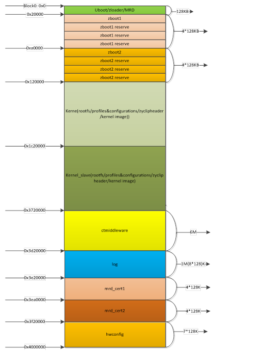
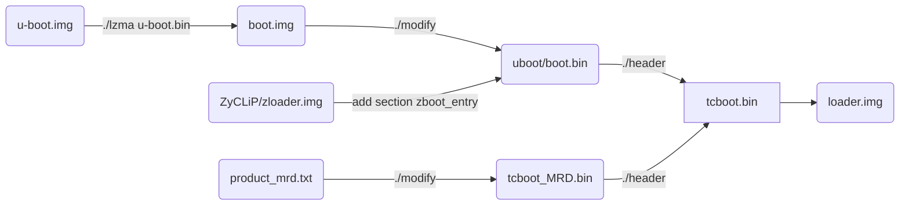
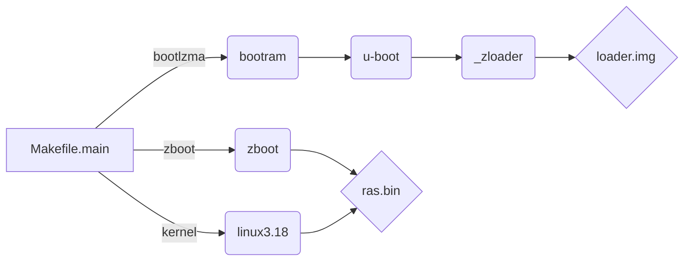
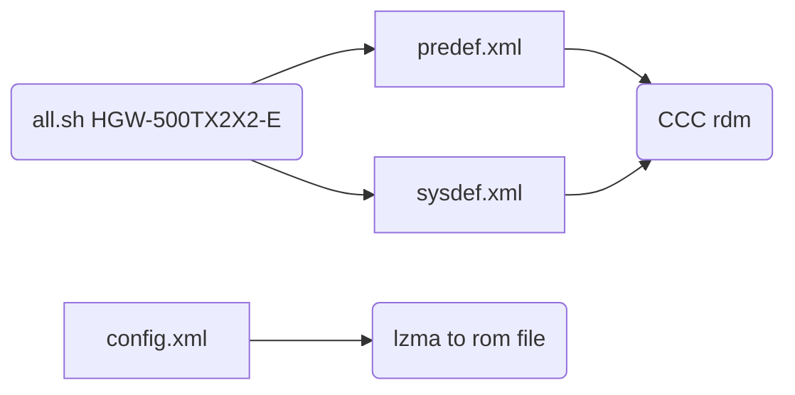
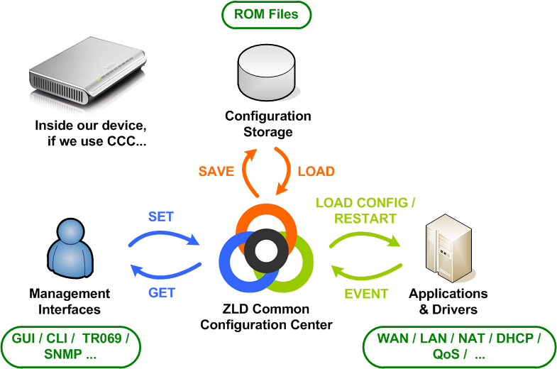
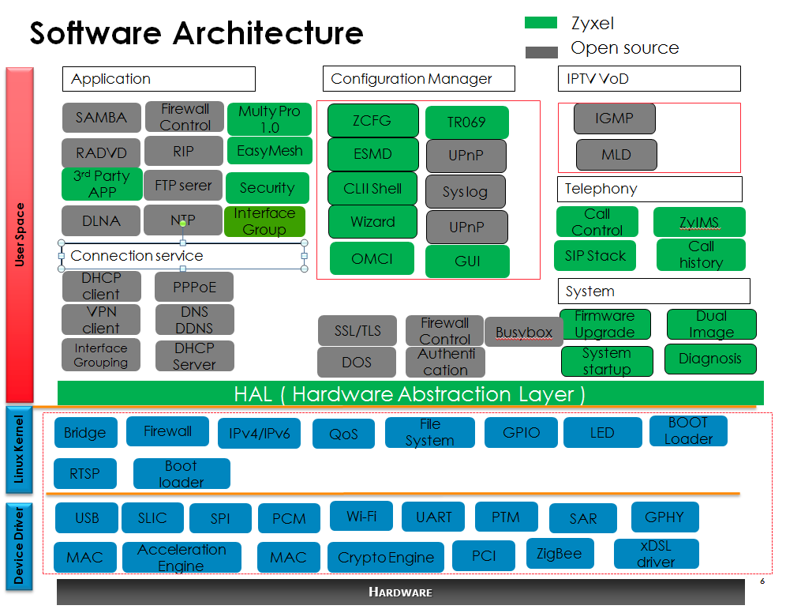

# 1. Hardware & Structure

## En_7528

- 32-bit Risc CPU with MMU and cache (write -back D-cache ), optimized to handle layer 2,3 and higher-layer protocols
- 900 MHz MIPS 1004Kc with dual-core 
- Per core 32KB 4-way I-cache  , 32KB 4-way D-cache
- 256KB L2 cache


## En_7526

- 32-bit Risc CPU with MMU and cache (write -back D-cache ), optimized to handle layer 2,3 and higher-layer protocols
- 900MHz MIPS32Kc with 2 VPEs
- 32 MMU TLB entries in each VPE
- 64KB 4-way I-cache , 32KB 4-way D-cache
- 64KB I-scratchpad

**Note: MMU (Memory Management Unit ) , [D-Cache or I-Cache](<https://blog.csdn.net/bytxl/article/details/50275377>) constitute the L1 cache. **


##  ZyXEL Flash Partition Table



```txt
		
        			|--------------------|
                    |                    |
                    |                    |
                    ~                    ~
                    |                    |
                    |                    |          
                    |--------------------|<------------ 
                    |                    |
                    | Init code and data |
                    |                    |                
                     --------------------|--------[BootLoader] 
                    |    			     |	ZLoader -|--> UBoot
                    |					 |  	 	 |--> ZBoot --> kernel
 0xc000 0000        |--------------------|
 
 
 
 
 
 @reserve area table 7 BLOCK@
|sector		name				cover area				note
|1			backupromfile			0~0x3ffff					256k
|2			defaultromfile			0x40000~0x7ffff			256k
|3			syslog				0x80000~0xBffff			256k
|4			proline      			0xc0000~0xfffff			256k
|5			temp				0x100000~0x13ffff			256k
|5.1			cerm1				0x100000~0x100fff		4k
|5.2			cerm2				0x101000~0x101fff		4k
|5.3			cerm3				0x102000~0x102fff		4k
|5.4			cerm4				0x103000~0x103fff		4k
|6			block6				0x140000~0x17ffff			256k
|6.1			eeprom				0x140000~0x1403ff		1k(reserve 1k,no use 256 bytes)
|6.2			bob.conf				0x140400~0x14049f		160bytes
|7			block7				0x180000~0x1bffff			256k
|7.1			imgbootflag			0x180000~0x18003f		64bytes
|7.2			11ac					0x180040~0x18023f		512bytes
|7.3			11ac	 reserved			0x180240~0x18043f		512bytes
-----------------------------------------------------------------------------


[boot-loader image]
/***           flash boot:128KB          ***/     
/*  start.o        from 0x0                */
/*  move_data.img  less than 0x800         */
/*  boot2.img                              */
/*  lzma.img                               */
/*  spram.img      less than 0xFF00        */
/*  mi.conf        from 0xFF00 to 0xFFFF   */
/*  bootram.img    from 0x10000 to 0x1FFFB */
/*  CRC32          from 0x1FFFC to 0x1FFFF */
/*******************************************/
 
```


# 2. Source File & Building 

## 2.1 Files Structure

**Bootloader Structure**

```shell
.
└── dev   
    ├── makecode
    │   ├── build-utils
    │   ├── defaultcfg 		(configration file for province)
    │   ├── sysapps			(applications folder)
    │   ├── platform-profile
    │   ├── product-depconfig
    │   │   (building configuration files include bootlaoder,kernel,Zboot,etc.)
    │   └── mitrastar_drivers
	│   │	(source of GPIO controller for Econet)
    ├── platform
    │   ├── bootloader
    │   │   ├── uboot
    │   │   │   ├── bootram
    │   │   │   ├── ddr_cal_en7512
    │   │   │   ├── en7512_boot
    │   │   │   ├── en7516_boot
    │   │   │   ├── hosttools
    │   │   │   ├── include
    │   │   │   ├── lzma
    │   │   │   ├── profile
    │   │   │   ├── ram_init
    │   │   │   ├── spram_ext
    │   │   │   ├── u-boot
    │   │   │   └── unopen_img
    │   │   └── ZyCLiP3.0_ZLB
    │   │       ├── zboot
    │   │       └── zloader
    │   ├── bsp
    │   │   ├── bootrom
    │   │	│	(do not used.)
    │   │   ├── global_inc
    │   │	│	(source header.)
    │   │   ├── kernel_ext
    │   │	│	(source driver for bootloader and kernel)
    │   │   ├── linux-3.18.21
    │   │   ├── modules
    │   │   ├── tools
    │   │   └── version
    │   └── rootfs
    └── trunk-utils
```


## 2.2 Bootloader building process

process to create loader.img 


**(Note:  the zbootload.c , lzmaload.c its not actual source code this mean this can not execute any code , its just used to store the section for lzma.img and zloader.img. )**


## 2.3 Makefile Builder arch

making process



. bootlzma
. bootram
. u-boot
. zboot
. kernel


To generate the bootloader and release NAND.bin

```shell
$make PROFILE=CCC3
$make boot
$make production
$make kernel
$make modules
```


**Note: make ccc3.0 error by macro not define within rdm, then do following commands**  

```shell
$cd dev/makecode
$make clean
$rm -Rf ../build
$find sysapps/private/mitrastar/ccc3.0 -name *.cprep |xargs rm -f
$find sysapps/private/mitrastar/ccc3.0 -name *.cprep2 |xargs rm -f
$make PROFILE=CCC3
```

**Note: to building ccc4.0 as project as following**

```shell
$svn checkout https://svn.mitrastar.com/svn/MLD_CPE/MLD-PI-1.0.0/product/2020/HGW-500TX2X2-E
$cd dev/trunk-utils/MLD_Scripts
$./all.sh HGW-500TX2X2-E
(This script should be sync the config settings.)
$cd ../../makecode/
$make clean;make all
```


ccc configuration files.




**[Beyond  Compare 4.19 Expire Usage](<https://blog.csdn.net/baidu_39340548/article/details/88257556>):** 

 1. remove or delete **BCUnrar.dll** in installed folder ; 
 2. delete item "**HKEY_CURRENT_USER\Software\Scooter Software\Beyond Compare 4\CacheId**" in windows regedit.

[more reference](<https://blog.csdn.net/weixin_42995876/article/details/85049233>)


# 3. MLD

**MLD (Mitrastar Linux Distribution)** contains:

- Mitrastar CDK - the cross development kit.
- Linux kernel 
- Assorted user-land software  (recompiled by Mitrastar CDK).
  - Hardened source code from MVista/Gentoo/…
  - Original source code from official Web/FTP site. 
- Home-grown programs/libraries. 
- System Boot Scripts.
- Build System.


``rdm_object.h`` error could be update by following:

```shell
# rm -Rf ../build/sysapps/ccc ../build/sysapps/libccc
# make sysapps/private/mitrastar/ccc
# make sysapps/public/other/libccc
```

``libccc/core/target/bin/x2r``  used to parsing  ``makecode/sysdef.xml`` and convert to ``rdm_object.h`` .


**CCC (Common Configration Center) Architecture Overview:**




# 4. PI Project

Project at ``\\172.25.24.94\chear\MTK_Test\tclinux_phoenix_ctc_20200308`` 

```shell
$ make
( profile "./Project/profile/CT/CT_EN7561D_LE_7592_7613_AP_demo/*")
```


# 5. OPAL

OPAL is a Linux-based, open and dynamic  platform .




```shell
# checkout repo
chear@sw3-cbs-30:~$ git clone https://btc-git.zyxel.com/MT03749/opal
chear@sw3-cbs-30:~$ git checkout -b local_branch origin/master
# start docker container
chear@sw3-cbs-30:~$ ropd
# building whole code
cpe-opal$ make P=DX3301-T0_Generic V=s 

# to building the bootloader, and generate zld.bin
cpe-opal$ make package/private/econet/en75xx-loader/{compile,install} V=s
```

to generate patch by quilt.

```shell
# quilt series
# quilt new 449-ZYXEL_BUGFIX_test_Hsiwei.patch
# quilt add test_file.c 
(file need to edit.)
# vim test_file.c
# quilt refresh 
( generate patch for '449-ZYXEL_BUGFIX_test_Hsiwei.patch')
```