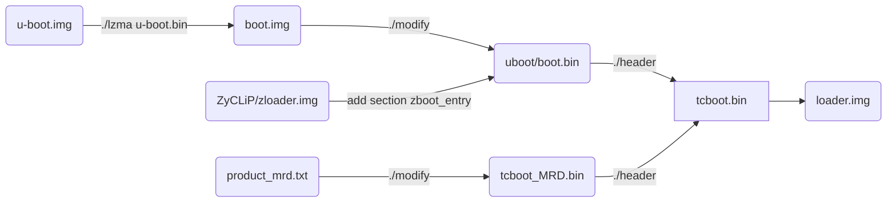
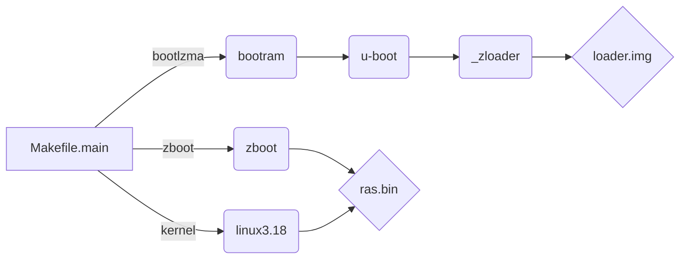
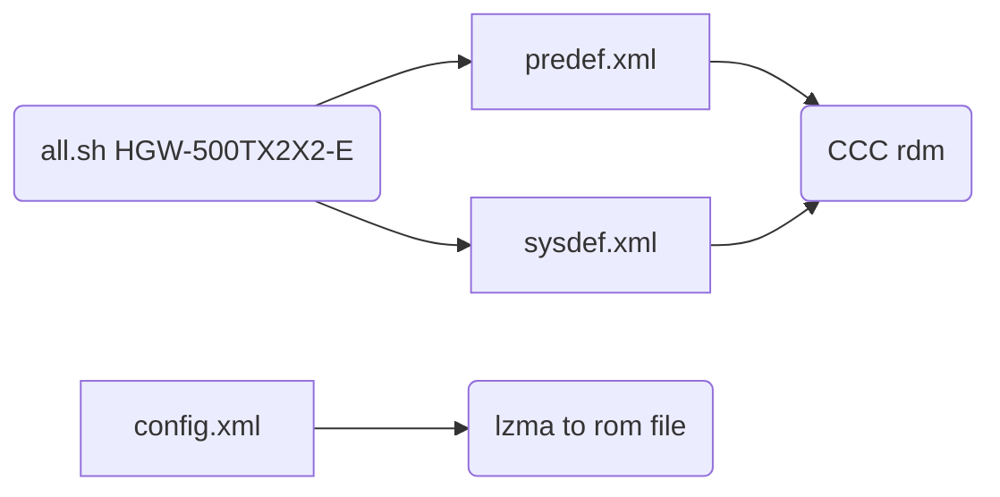
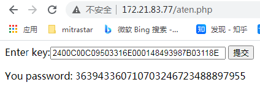

# 1. Hardware & Structure

## En_7528

- 32-bit Risc CPU with MMU and cache (write -back D-cache ), optimized to handle layer 2,3 and higher-layer protocols
- 900 MHz MIPS 1004Kc with dual-core 
- Per core 32KB 4-way I-cache  , 32KB 4-way D-cache
- 256KB L2 cache


## En_7526

- 32-bit Risc CPU with MMU and cache (write -back D-cache ), optimized to handle layer 2,3 and higher-layer protocols
- 900MHz MIPS32Kc with 2 VPEs
- 32 MMU TLB entries in each VPE
- 64KB 4-way I-cache , 32KB 4-way D-cache
- 64KB I-scratchpad

**Note: MMU (Memory Management Unit ) , [D-Cache or I-Cache](<https://blog.csdn.net/bytxl/article/details/50275377>) constitute the L1 cache. **


##  ZyXEL Flash Partition Table


```txt
		
        			|--------------------|
                    |                    |
                    |                    |
                    ~                    ~
                    |                    |
                    |                    |          
                    |--------------------|<------------ 
                    |                    |
                    | Init code and data |
                    |                    |                
                     --------------------|--------[BootLoader] 
                    |    			     |	ZLoader -|--> UBoot
                    |					 |  	 	 |--> ZBoot --> kernel
 0xc000 0000        |--------------------|
 
 
 
 
 
 @reserve area table 7 BLOCK@
|sector		name				cover area				note
|1			backupromfile			0~0x3ffff					256k
|2			defaultromfile			0x40000~0x7ffff			256k
|3			syslog				0x80000~0xBffff			256k
|4			proline      			0xc0000~0xfffff			256k
|5			temp				0x100000~0x13ffff			256k
|5.1			cerm1				0x100000~0x100fff		4k
|5.2			cerm2				0x101000~0x101fff		4k
|5.3			cerm3				0x102000~0x102fff		4k
|5.4			cerm4				0x103000~0x103fff		4k
|6			block6				0x140000~0x17ffff			256k
|6.1			eeprom				0x140000~0x1403ff		1k(reserve 1k,no use 256 bytes)
|6.2			bob.conf				0x140400~0x14049f		160bytes
|7			block7				0x180000~0x1bffff			256k
|7.1			imgbootflag			0x180000~0x18003f		64bytes
|7.2			11ac					0x180040~0x18023f		512bytes
|7.3			11ac	 reserved			0x180240~0x18043f		512bytes
-----------------------------------------------------------------------------


[boot-loader image]
/***           flash boot:128KB          ***/     
/*  start.o        from 0x0                */
/*  move_data.img  less than 0x800         */
/*  boot2.img                              */
/*  lzma.img                               */
/*  spram.img      less than 0xFF00        */
/*  mi.conf        from 0xFF00 to 0xFFFF   */
/*  bootram.img    from 0x10000 to 0x1FFFB */
/*  CRC32          from 0x1FFFC to 0x1FFFF */
/*******************************************/
 
```


# 2. Source File & Building

## 2.1 Files Structure

**Bootloader Structure**

```shell
.
└── dev   
    ├── makecode
    │   ├── build-utils
    │   ├── defaultcfg 		(configration file for province)
    │   ├── sysapps			(applications folder)
    │   ├── platform-profile
    │   ├── product-depconfig
    │   │   (building configuration files include bootlaoder,kernel,Zboot,etc.)
    │   └── mitrastar_drivers
	│   │	(source of GPIO controller for Econet)
    ├── platform
    │   ├── bootloader
    │   │   ├── uboot
    │   │   │   ├── bootram
    │   │   │   ├── ddr_cal_en7512
    │   │   │   ├── en7512_boot
    │   │   │   ├── en7516_boot
    │   │   │   ├── hosttools
    │   │   │   ├── include
    │   │   │   ├── lzma
    │   │   │   ├── profile
    │   │   │   ├── ram_init
    │   │   │   ├── spram_ext
    │   │   │   ├── u-boot
    │   │   │   └── unopen_img
    │   │   └── ZyCLiP3.0_ZLB
    │   │       ├── zboot
    │   │       └── zloader
    │   ├── bsp
    │   │   ├── bootrom
    │   │	│	(do not used.)
    │   │   ├── global_inc
    │   │	│	(source header.)
    │   │   ├── kernel_ext
    │   │	│	(source driver for bootloader and kernel)
    │   │   ├── linux-3.18.21
    │   │   ├── modules
    │   │   ├── tools
    │   │   └── version
    │   └── rootfs
    └── trunk-utils
```


## 2.2 Bootloader building process

process to create loader.img 


**(Note:  the zbootload.c , lzmaload.c its not actual source code this mean this can not execute any code , its just used to store the section for lzma.img and zloader.img. )**


## 2.3 Makefile Builder arch

making process



. bootlzma
. bootram
. u-boot
. zboot
. kernel


To generate the bootloader and release NAND.bin

```shell
$ make PROFILE=CCC3
$ make boot
$ make production
$ make kernel
$ make modules
```


**Note: make ccc3.0 error by macro not define within rdm, then do following commands**  

```shell
$cd dev/makecode
$make clean
$rm -Rf ../build
$find sysapps/private/mitrastar/ccc3.0 -name *.cprep |xargs rm -f
$find sysapps/private/mitrastar/ccc3.0 -name *.cprep2 |xargs rm -f
$make PROFILE=CCC3
```

**Note: to building ccc4.0 as project as following**

```shell
$svn checkout https://svn.mitrastar.com/svn/MLD_CPE/MLD-PI-1.0.0/product/2020/HGW-500TX2X2-E
$cd dev/trunk-utils/MLD_Scripts
$./all.sh HGW-500TX2X2-E
(This script should be sync the config settings.)
$cd ../../makecode/
$make clean;make all
```


ccc configuration files.




**[Beyond  Compare 4.19 Expire Usage](<https://blog.csdn.net/baidu_39340548/article/details/88257556>):** 

 1. remove or delete **BCUnrar.dll** in installed folder ; 
 2. delete item "**HKEY_CURRENT_USER\Software\Scooter Software\Beyond Compare 4\CacheId**" in windows regedit.

[more reference](<https://blog.csdn.net/weixin_42995876/article/details/85049233>)


# 3. MLD

**MLD (Mitrastar Linux Distribution)** contains:

- Mitrastar CDK - the cross development kit.
- Linux kernel 
- Assorted user-land software  (recompiled by Mitrastar CDK).
  - Hardened source code from MVista/Gentoo/…
  - Original source code from official Web/FTP site. 
- Home-grown programs/libraries. 
- System Boot Scripts.
- Build System.


``rdm_object.h`` error could be update by following:

```shell
# rm -Rf ../build/sysapps/ccc ../build/sysapps/libccc
# make sysapps/private/mitrastar/ccc
# make sysapps/public/other/libccc
```

``libccc/core/target/bin/x2r``  used to parsing  ``makecode/sysdef.xml`` and convert to ``rdm_object.h`` .


**CCC (Common Configration Center) Architecture Overview:**


# 4. PI Project

Project at ``\\172.25.24.94\chear\MTK_Test\tclinux_phoenix_ctc_20200308`` 

```shell
$ make
( profile "./Project/profile/CT/CT_EN7561D_LE_7592_7613_AP_demo/*")
```


# 5. WiFi 6 Router

## 5.1 Get User Info for devices

All OPAL device are locked bootloader upgreade by default , to debug bootloader need to unlock by command ``aten``

```shell
ZHAL> atse DX3301-T0
2400C00C09503316E000148493987B03118E
(Note: atse need SerialNumver and Product Model)

ZHAL> aten 1,363943360710703246723488897955
ZHAL> atck
supervisor password: g5jy7d7616
admin password     : A7FMM7NQ
WiFi PSK key       : YQC737CD78
```

(Note : command  ``atse [product_name]``  used to get seed of password , to get "produc_name" access file mi.conf , or running command ``atsh``  within zloader.  next get password by "http://172.21.83.77/aten.php"  such like following.)



to [save boot debug flag](<file://172.25.5.39/cpeswdoc/cpesw/Document/SW3%20Training%20Slides/OPAL/Manufacture/(Peter)%20SOP%20%E4%BA%A7%E7%BA%BF%E7%94%9F%E4%BA%A7%E6%8C%87%E4%BB%A4%20v1.10.pdf>) , boot to zloader and then following

```shell
ZHAL> atbt 1
( writeble for block 0)
ZHAL> atwz 4CC53E083738,0,1,0,10,1
( ATWZ x[,y,z,a,b,c] write MAC addr, Country code, 
EngDbgFlag, FeatureBit, MAC Number, boot flag)
```


## 5.2 Generate STM image

to make STM image:

```shell
$ make production
```

The **zld.bin (tcboot.bin)** size for 128k ,  and layout by following.

```Text
		 0x0000 --------------|
              |     ubifs     |
		 0x3f00 --------------|
	          |     mi.conf   |
		 0x3ff7 --------------|
			  |               |
		0x10000 --------------|  __boot_start
              |     boot.bin  |
			  |			      |
			  |---------------|  __boot_end
              |               |
	    0x20000 ----------XXXX|  last 4 bytes for crc,32 bytes for hash256.
```

The **ras.bin** compose by  **ZyXEL_Header + kernel  +rootfs **.

```Makefile
# source file at target/linux/en75xx/image/Makefile
define Image/Build/zy_trx_image
    cat $(KERNEL_IMG) $(ROOTFS_IMG) $(DEFCFG_IMG) > $(BIN_DIR)/tclinux
    $(STAGING_DIR_HOST)/bin/econet-trx \
        -T ZYXEL \
        -K $(KERNEL_IMG) \
        -R $(ROOTFS_IMG) \
        -C $(DEFCFG_IMG) \
        -P $(TCPLATFORM) \
        -I $(CONFIG_MRD_MODEL_ID) \
        -S $(CONFIG_ZYXEL_FIRMWARE_VERSION) \
        -s $(ZYXEL_CUST_FIRMWARE_VERSION) \
        $(TRX_IMG_OPT) \
        -f $(BIN_DIR)/tclinux -o $(BIN_DIR)/ras.bin \
        -c $(STAGING_DIR_HOST)/bin/econet-trx_config
    rm -f $(BIN_DIR)/tclinux
endef

ifneq ($(ZYXEL_SUPPORT_DEFCFG),)
    $(call Image/Build/zy_trx_image)
else
    $(call Image/Build/zy_trx_image_without_defcfg)
endif
```

ZyXEL header struct such like below , tools at ``build_dir/host/econet-trx-7.3.245.300/tools/trx``:

```C
truct trx_header {
    unsigned int magic;         /* "HDR0" */
    unsigned int header_len;    /*Length of trx header*/
    unsigned int len;           /* Length of file including header */
    unsigned int crc32;         /* 32-bit CRC from flag_version to end of file */
    unsigned char version[32];  /*firmware version number*/
    unsigned char customerversion[32];  /*firmware version number*/
//  unsigned int flag_version;  /* 0:15 flags, 16:31 version */
#if 0
    unsigned int reserved[44];  /* Reserved field of header */
#else
    unsigned int kernel_len;    //kernel length
    unsigned int rootfs_len;    //rootfs length
    unsigned int romfile_len;   //romfile length
    #if 0
    unsigned int reserved[42];  /* Reserved field of header */
    #else
    unsigned char Model[32];
    unsigned int decompAddr;//kernel decompress address
    unsigned int reserved[32];  /* Reserved field of header */
    #endif
#endif
#if 1//defined(ZYXEL)
    unsigned char chipId[CHIP_ID_LEN];      /* Provided by Makefile */
    unsigned char boardId[BOARD_ID_LEN];        /* Provided by Makefile */
    unsigned char modelId[MODEL_ID_LEN];            /* Provided by Makefile */
    unsigned int defcfg_len;    //default config length
    unsigned int imageSequence;
    unsigned char swVersionInt[SW_VERSION_LEN]; /* Provided by Makefile */
    unsigned char swVersionExt[SW_VERSION_LEN]; /* Provided by Makefile */
    unsigned int rootfsChksum;
    unsigned int kernelChksum;
    unsigned int defcfgChksum;
    unsigned int headerChksum;
#endif
};
```

flash partition layout for OPAL DX3301_Generic

```shell
#
# Configuration for SMT_Generator/genNANDimg.sh
#
################# offset #######################
# 0x000000000000-0x000000040000 : zld.bin + padding   bootloader"
# 0x000000040000-0x000000080000 : rom_hader + TE_config.rom + padding ROM
# 0x000000080000-0x000002880000 : ras.bin + padding	
# 0x000002880000-0x000004ea0000 : ras2.bin + padding	
# 0x000004ea0000-0x000004fa0000 : "wwan"
# 0x000004fa0000-0x0000053a0000 : "data"
# 0x0000053a0000-0x0000054a0000 : "rom-d"
# 0x0000054a0000-0x0000074a0000 : "misc"
# 0x000007520000-0x0000075e0000 : "reservearea"
################################################
```

layout for ROMFILE partition:

```txt
file at /bin/en75xx/zyxel/NAND/genNANDimg/PARTITION_2.img
0x00 -----------|-----------------
| 0x5a01        |  ROMFILE_TYPE
0x02 -----------|-----------------
|  size         |  ROMFILE_SIZE
0x06 -----------|-----------------
|   crc         |  ROMFILE_CRC
0x08 -----------|-----------------
|    *.json     |  romfile json
|               | 
|---------------|-----------------
```

layout for STM image

```c
/*
allinone_DX3301-T0_image_FLASH.SMT
|--------------------|-----------------
| common_header.img  |
|--------------------|   IMAGE　HEADER
| partition_1_head   |
|      .img          |
|--------------------|-----------------
|        	         |
| partition_1_image  |	PARTITION IMAGE
|      .img          |
|--------------------|-----------------
*/
typedef struct hdrNandInfo_s {
    unsigned long pageSize;
    unsigned short oobSize;
    unsigned short blockSize;
    unsigned long reserved;
} hdrNandInfo_t;

typedef struct hdrNandHeader_s {
    hdrNandInfo_t nand;
    char productVersion[32];
    unsigned char reserve[4];
    unsigned short CGBP0;
    unsigned char Bad_block0;
    unsigned char Reserve_Area[2];
    unsigned char on_die_ecc;
    unsigned char swap_flag;
    unsigned char partQTY;
}hdrNandHeader_t ;

typedef struct hdrPartInfo_s {
    unsigned long addr;
    unsigned long partSize;
    unsigned long imgSize;
    unsigned long imgVersion;
    unsigned char  reserve_p;
    unsigned char  error_bit;
    unsigned short Good_blocks;
} hdrPartInfo_t;
```

OPAL flash struct:


## 5.3 Manufacture Testing Commands

MFG configuration path  at  ``package/private/zyxel/zcfg/defcfg/$PROFILE_NAME/TE_config.rom`` ,  and login user for root/e78a2a88 .

### 5.3.1 LED Testing

```shell
# sys led on
```

### 5.3.2  Button Testing

```shell
$ telnet 192.192.192.4
# sys btntest 1
```

### 5.3.3 LAN Testing

Change MAC 

### 5.3.3 WLAN Calibration

```shell
# iwpriv ra0 e2p 78
ra0       e2p:
[0x0078]:0xFFFF
(use "sys Calibration_Verification_24g" to direct calibration 2.4G)

# iwpriv rai0 e2p 78
rai0      e2p:
[0x0078]:0xFFFF
(use "sys Calibration_Verification_5g" to direct calibration 5G)

# iwpriv ra0 set AuthMode=OPEN
(set wifi SSID and pwd)
```

display the wifi property by following:

```shell
#  zycli wlan show primary
Basic information
        FrequencyBand: 2.4GHz
        Channel: 5 (Auto)
        Bandwidth: 40MHz
        wlmode: 11bgnax
primary Settings
        Network Name (SSID): Zyxel_3739
        Active Wireless Lan: Enable
        Security Mode: WPA2-PSK
        Encryption: aes
        Pre-shared Key: 5d5448674c9c57fead78f77a43705d9abf4ec0a850820d3d3d7ee05dc1f9ef51
        Update Timer: 3600

# zycli wlan show5g primary
Basic information
        FrequencyBand: 5GHz
        Channel: 112 (Auto)
        Bandwidth: 80MHz
        wlmode: 11anacax
primary Settings
        Network Name (SSID): Zyxel_3739
        Active Wireless Lan: Enable
        Security Mode: WPA2-PSK
        Encryption: aes
        Pre-shared Key: 5d5448674c9c57fead78f77a43705d9abf4ec0a850820d3d3d7ee05dc1f9ef51
        Update Timer: 3600

# ifconfig ra0 up/down
# iwpriv ra0 set ATE=TXSTOP
# iwpriv rai0 set ATE=TXSTOP
```

### 5.3.4 Revert System

After finish HW production testing , need to set the boot module debug flag to 0 by using “atwz” or “sys
atwz” , and finally to reset to default by “atcr” or “sys atcr".

```shell
# sys atwz
# sys atcr
=== FR Entered ===
@@ w+ file value init: 1=== FR Entered ===
recv_str=atcrNoReboot
Froce unmount /misc
Erase customised misc partition(s) done.
@@ r+ file value add:2Reset to default and sync: Success!

("sys romreset [0/1]" corresponding "sys atcr" or "sys atcr reboots")
```

### 5.3.5 Upgrade ROM

```shell
ZHAL> atum TE_config.rom
```

to restore default ROM file.

```shell
# sys atcr
```

