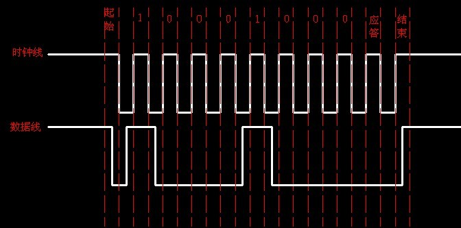
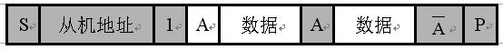

# Introduction

i2c ([Inter- Integrated Circuit](<https://www.i2c-bus.org/>)   , or iic):  总线是一种由PHILIPS公司在80年代开发的两线式串行总线，用于连接微控制器及其外围设备。i2c 总线最主要的优点是其简单性和有效性。由于接口直接在组件之上，因此 i2c 总线占用的空间非常小，减少了电路板的空间和芯片管脚的数量，降低了互联成本。总线的长度可高达25英尺，并且能够以10Kbps的最大传输速率支持40个组件。I2C总线的另一个优点是，它支持多主控(multi-mastering)，其中任何能够进行发送和接收的设备都可以成为主总线。一个主控能够控制信号的传输和时钟频率。当然，在任何时间点上只能有一个主控。

(**Note: 相较于串行总线， i2c 总线更简单，但是半双工的传输效率对比串行总线要低很多, i2c 与 spi 同属于并行总线，都拥有一根时钟线。**)

# i2c  Signal

I2C 总线是由数据线 SDA和时钟SCL构成的串行总线，可发送和接收数据。在 IC 与 IC 之间进行双向传送 ( *same circuit board* )，最高传送速率100kbps。对于并联在一条总线上的每个IC都有唯一的地址。**SDA**（数据线） ，**SCL**（时钟线），时钟信号是由主控器件产生。

i2c 总线在传送数据过程中共有三种类型信号，它们分别是：开始信号、结束信号和应答信号。

- **开始信号：**SCL为高电平时，SDA由高电平转变为低电平跳变，表示开始通信。

- **结束信号：**SCL为高电平时，SDA由低电平转变为高电平跳变，表示结束通信。

- **应答信号**：接收数据的IC在接收到一个字节数据后，向发送数据的IC发出特定的低电平脉冲，表示已收到数据。

　　开始和结束信号都是由主机发出的，应答信号是由从机发出的，开始和结束通信过程的时序如图1所示。

 

**( Note: 起始信号是必需的，结束信号和应答信号，都可以不要。)**

# i2c 总线操作时序

I2C总线必须由主机（通常为微控制器）控制，主机产生串行时钟（SCL）控制总线的传输方向，并产生起始和停止条件。SDA线上的数据状态仅在SCL为低电平的期间才能改变，SCL为高电平的期间，SDA状态的改变被用来表示起始和停止条件。

控制字节

　　在通信开始信号之后，发送的必须是器件的控制字节，其中高四位为器件类型识别符，接着三位为片选，最后一位为读写位，当为1时为读操作，为0时为写操作。该字节前七位表示器件的地址。

**（Note：SCL线上1~7位为7位接收器件地址，第8位为读写位，第9位为ACK应答位，紧接着的为第一个数据字节，然后是一位应答位，后面继续第2个数据字节。）**

# i2c 总线的数据传送

- A、主机向从机发送数据，数据传送方向在整个传送过程中不变。

有阴影部分表示数据由主机向从机传送，无阴影部分则表示数据由从机向主机传送。

A表示应答，/A表示非应答（高电平）。S表示起始信号，P表示终止信号。

- B、主机在第一个字节(寻址字节)后，立即由从机读数据。

在从机产生响应时，主机从发送变成接收，从机从接收变成发送。之后，数据由从机发送，主机接收，每个应答由主机产生，时钟信号仍由主机产生。若主机要终止本次传输，则发送一个非应答信号(A)，接着主机产生停止条件。

- C、在传送过程中，当需要改变传送方向时，起始信号和从机地址都被重复产生一次，但两次读/写方向位正好反相

**I2C总线仲裁与时钟发生**

在多主的通信系统中。总线上有多个节点，它们都有自己的寻址地址，可以作为从节点被别的节点访问，同时它们都可以作为主节点向其它的节点发送控制字节和传送数据。但是如果有两个或两个以上的节点都向总线上发送启动信号并开始传送数据，这样就形成了冲突。要解决这种冲突，就要进行仲裁的判决，这就是I2C总线上的仲裁。

I2C总线上的仲裁分两部分：SCL线的同步和SDA线的仲裁。

**A、SCL线的同步（时钟同步）**

SCL同步是由于总线具有线“与”的逻辑功能，即只要有一个节点发送低电平时，总线上就表现为低电平。当所有的节点都发送高电平时，总线才能表现为高电平。

由于线“与”逻辑功能的原理，当多个节点同时发送时钟信号时，在总线上表现的是统一的时钟信号。这就是SCL的同步原理。

**B、SDA仲裁**

SDA线的仲裁也是建立在总线具有线“与”逻辑功能的原理上的。

节点在发送1位数据后，比较总线上所呈现的数据与自己发送的是否一致。是，继续发送；否则，退出竞争。

SDA线的仲裁可以保证I2C总线系统在多个主节点同时企图控制总线时通信正常进行并且数据不丢失。总线系统通过仲裁只允许一个主节点可以继续占据总线。

**C、仲裁过程**

DATA1和DATA2分别是主节点向总线所发送的数据信号；

SDA为总线上所呈现的数据信号，SCL是总线上所呈现的时钟信号。

当主节点1、2同时发送起始信号时，两个主节点都发送了高电平信号。这时总线上呈现的信号为高电平，两个主节点都检测到总线上的信号与自己发送的信号相同，继续发送数据。

第2个时钟周期，2个主节点都发送低电平信号，在总线上呈现的信号为低电平，仍继续发送数据。

在第3个时钟周期，主节点1发送高电平信号，而主节点2发送低电平信号。根据总线的线“与”的逻辑功能，总线上的信号为低电平，这时主节点1检测到总线上的数据和自己所发送的数据不一样，就断开数据的输出级，转为从机接收状态。

这样主节点2就赢得了总线，而且数据没有丢失，即总线的数据与主节点2所发送的数据一样，而主节点1在转为从节点后继续接收数据，同样也没有丢掉SDA线上的数据。因此在仲裁过程中数据没有丢失。

**I2C总线注意点**

1.进行数据传送时，在SCL为高电平期间，SDA线上电平必须保持稳定，只有SCL为低时，才允许SDA线上电平改变状态。并且每个字节传送时都是高位在前。

2.对于应答信号，ACK=0时为有效应答位，说明从机已经成功接收到该字节，若为1则说明接受不成功。

3.如果从机需要延迟下一个数据字节开始传送的时间，可以通过把SCL电平拉低并保持来强制主机进入等待状态。

4.主机完成一次通信后还想继续占用总线在进行一次通信，而又不释放总线，就要利用重启动信号Sr。它既作为前一次数据传输的结束，又作为后一次传输的开始。

5.总线冲突时，按“低电平优先”的仲裁原则，把总线判给在数据线上先发送低电平的主器件。

6.在特殊情况下，若需禁止所有发生在I2C总线上的通信，可采用封锁或关闭总线，具体操作为在总线上的任一器件将SCL锁定在低电平即可。

7.SDA仲裁和SCL时钟同步处理过程没有先后关系，而是同时进行的。

**Conclusion:**

i2c is a serial protocol to connect bewteen two or more microcontrollers, both SCL and SDA are high when initiated, and next the master will issue a START condition. This acts as an ‘Attention’ signal to all of the connected devices. All ICs on the bus will listen to the bus for incoming data. Then the master sends the ADDRESS of the device it wants to access, along with an indication whether the access is a Read or Write operation (Write in our example). Having received the address, all IC’s will compare it with their own address. If it doesn’t match, they simply wait until the bus is released by the stop condition (see below). If the address matches, however, the chip will produce a response called the ACKNOWLEDGE signal. 

Once the master receives the acknowledge, it can start transmitting or receiving DATA .(like B1,B2,...Bn on below.) 

Ref:

<http://i2c.info/>

<http://www.byteparadigm.com/applications/introduction-to-i2c-and-spi-protocols/>

<http://blog.csdn.net/huzgd/article/details/6187056>

